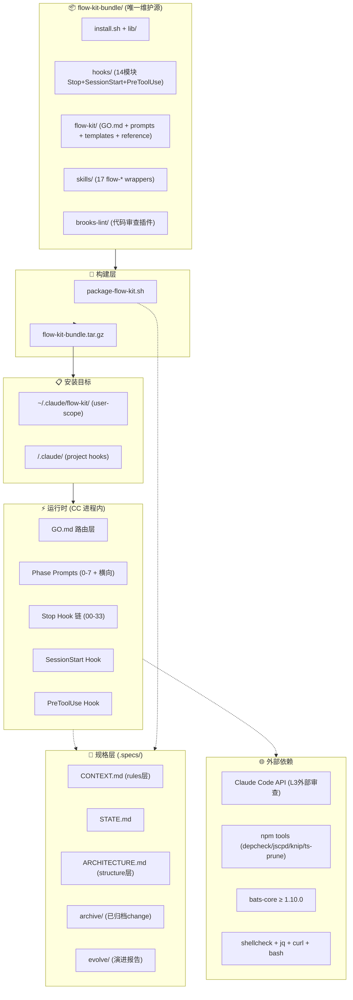

# ARCHITECTURE — 项目级系统架构（活文档）

- **维护者**：`prompts/A-architect.md`（首次 / 重构）+ `prompts/A-evolve.md`（增量同步 ADR）
- **首次创建**：2026-07-08
- **最近修订**：2026-07-08（A-architect 首跑）
- **当前 ADR 编号最大值**：ADR-009

> **本文件 vs CONTEXT.md vs DESIGN.md 的边界**：
> - `CONTEXT.md`（**rules 层**）：技术栈版本、域语言、既有抽象索引、禁动清单、默认偏好——AI 实施时**每个 change 都加载**，当前 430 行
> - `ARCHITECTURE.md`（**structure 层 · 本文件**）：模块图、跨模块契约、ADR 列表、扩展点、容量边界——**仅 2-design / A-evolve 阶段加载**，目标 200-400 行
> - `.specs/<change-id>/DESIGN.md`（**change 层**）：单次 change 的技术决策、接口契约、风险——change 归档后冻结

---

## 1. 系统概览

### 1.1 一句话定位

**Claude Code 开发工作流引擎的分发包仓库，管理 0-change→7-integration 全阶段生命周期。**

### 1.2 服务边界图



### 1.3 关键非功能性指标（NFR 基线）

| 维度 | 当前基线 | 来源 |
|---|---|---|
| Stop hook 链执行延迟 | < 5s（14 模块串行） | 设计目标 |
| L3 外部审查超时 | 30s（超时降级 verdict=timeout，不阻塞 pipeline） | pipeline-fallback-fix |
| 单次 install.sh 耗时 | < 60s | 设计目标 |
| 测试套件规模 | 213 tests / ~120s | bats 实测 2026-07-01 |
| CC 最低版本 | v2.1.139（原生 /goal 支持） | integrate-goal-command |
| CONTEXT.md 建议上限 | 300 行（当前 430 行，已超） | intel-scan 规范 |
| ARCHITECTURE.md 建议范围 | 200-400 行 | 模板规范 |

> 任何会影响这些指标的 change，2-design 阶段必须显式评估。

---

## 2. 模块清单 + 边界

### 2.1 模块表

| 模块 | 路径 | 职责 | 依赖 | 暴露给 |
|---|---|---|---|---|
| **install** | `install.sh` + `lib/` (6 文件) | 安装调度：core/skills/brooks/hooks 安装 + user-scope vs project 模式 + Node.js 检测 | 无内部依赖 | 终端用户 |
| **Hook 链** | `hooks/stop/` (00-33，14 模块) | Stop 事件链：gate→transcript→claude-md→memory→git→quality→session→project→workflow→interactive-ui→weak-model-compliance→independent-review→ai-analyze→auto-advance→fallback-guard→flow-active-integrity→report | `hooks/stop/lib/` (11 libs) | CC Stop hook 接线 |
| **Hook lib** | `hooks/stop/lib/` (11 文件) | 共享函数库：common / correction-file / done-validation / fix-compliance / flow-kit-artifacts / interactive-ui-check / l2-detect / l3-review / transcript-parser / weak-model-compliance / checkpoint-lib | 无（已修复 L-021 循环依赖） | 所有 hook 模块 |
| **SessionStart** | `hooks/session-start/` | 会话启动：resume + report-reminder + 矫正注入 + L3 结果展示 | `hooks/stop/lib/` (共用) | CC SessionStart hook 接线 |
| **PreToolUse** | `hooks/pre-tool-use/` | 工具调用前拦截：path-guard + gate 真实性校验 + auto-checkpoint 兜底 | `hooks/stop/lib/` (共用) | CC PreToolUse hook 接线 |
| **核心引擎** | `flow-kit/GO.md` + `prompts/` (14 文件) + `templates/` + `reference/` (9 文件) | 阶段路由 + prompt 驱动 + 共享文档片段 + 架构模板 | `reference/` ← prompts 通过 @see 引用 | Skills / AI agent |
| **RULES** | `flow-kit/RULES.md` + `SYSTEM.md` | 全局行为约束（R1-R7）+ 角色定义。弱模型加固子段嵌入 R3/R6/R7 | 无 | 所有 CC session |
| **Skills** | `skills/flow*/` (17 个) | CC slash command 入口包装器，委托到 GO.md 路由 | `flow-kit/GO.md` | 用户（通过 `/flow-*` 命令） |
| **brooks-lint** | `brooks-lint/plugin/` | 代码审查插件（review/audit/debt/test/health/sweep 六维度） | npm tools（depcheck/jscpd/knip/ts-prune） | CC skill 系统 |
| **测试** | `test/` (25+ .bats + fixtures + regression-demos) | bats-core 测试套件覆盖 hook libs / install / gate scripts / checkpoint / correction-file | 被测文件 | pre-push / `make check` |
| **构建** | `package-flow-kit.sh` (Part A-G) | 一站式打包为 `flow-kit-bundle.tar.gz`，含 `--validate` staging 校验 | `flow-kit-bundle/`（读取，不修改） | 开发者 |
| **规格** | `.specs/`（CONTEXT / STATE / ARCHITECTURE / archive / evolve / health） | 项目级文档层，独立于 bundle 代码。跨 change 共享 | 无 | 所有 change 阶段 + AI agent |

### 2.2 模块依赖规则（hard rules）

```
✅ 允许的依赖方向
- hook 模块 → hooks/stop/lib/（所有 hook 源码 lib）
- SessionStart / PreToolUse → hooks/stop/lib/（共用 lib 层）
- Skills → flow-kit/GO.md → flow-kit/prompts/（路由链）
- prompts/ → flow-kit/reference/（@see 引用共享片段）
- install.sh → lib/install_*.sh（安装调度）
- package-flow-kit.sh → flow-kit-bundle/（读取源码，不修改）

❌ 禁止的依赖方向
- hooks/stop/lib/ → hook 模块（lib 不能依赖消费者）
- flow-kit/reference/ → 任何代码（reference 是纯文档）
- lib/install_*.sh → hooks/（安装系统独立于运行时 hook）
- package-flow-kit.sh → hooks/（构建时不应感知运行时）
- 任何两个 lib 间双向引用（ADP 违反，L-021 已修复）
```

如果新 change 需要破例，必须在 DESIGN § 0.5 显式声明并升级 ADR。

---

## 3. ADR 列表（Architecture Decision Records · 不可逆决策清单）

### ADR-001 · 项目类型：meta/distribution 分发包仓库

- **状态**：accepted（2026-06-08）
- **取舍**：源码项目 vs 分发包仓库
- **决定**：`flow-kit-bundle/` 为唯一维护源，`package-flow-kit.sh` 打包为 `.tar.gz` 分发包
- **理由**：跨项目部署需求，单一源保证一致性；打包脚本将 bundle 源码 + 依赖组装为可迁移 tar.gz
- **代价**：`package-flow-kit.sh` 是额外维护负担（Part A-G 7 段）；bundle 源码修改后必须重打包才能生效
- **来源 change**：`init-git-repo` + `bundle-packaging`
- **推翻成本**：中（需改安装策略 + 打包流程 + 所有用户迁移）

### ADR-002 · 安装策略：user-scope symlink + project-priority fallback

- **状态**：accepted（2026-06-09）
- **取舍**：每项目独立复制 vs user-scope 共享 vs monorepo 单一源
- **决定**：`--user` 模式安装到 `~/.claude/flow-kit/`，项目级通过 symlink 引用；project-priority fallback（项目有实体目录用项目的，没有才查 user-scope）
- **理由**：跨项目共享核心引擎减少重复安装，同时允许项目通过实体 `flow-kit/` 目录锁定版本
- **代价**：symlink 引入一层间接，调试时需追溯真实路径；两种模式并存增加 `install.sh` 复杂度
- **来源 change**：`user-scope-install`
- **推翻成本**：低（改 `install.sh` + 通知用户重装即可）

### ADR-003 · Hook 系统架构：模块化 14-module Stop chain

- **状态**：accepted（2026-07-01）
- **取舍**：单体 hook vs 模块化 chain
- **决定**：numbered chain（00-33，14 个活跃模块），每个模块一个职责，通过 `lib/` 共享函数库；SessionStart + PreToolUse 共享同一 lib 层；`stop-hook.json` 独立开关每个模块
- **理由**：独立启停、独立测试、独立维护；新 hook 模块追加不影响已有模块；lib 层复用减少重复代码（L-016 拆分 artifacts / L-017 拆分 package）
- **代价**：14 模块的协调开销；lib 间交叉引用曾产生循环依赖（L-021 已修复）；新模块加入需同步更新 `HOOK_MODULE_NAMES` + `install_hooks.sh` + `package-flow-kit.sh`
- **来源 change**：`health-fix` + `sweep-fix-2026-07` + `robustness-hook-hardening` + `weak-model-interactive-ui` + `flow-active-integrity` + `user-guide-update`
- **推翻成本**：高（需重写整个 hook 系统 + 迁移所有模块逻辑）

### ADR-004 · Pipeline Goal 机制

- **状态**：accepted（2026-06-18，更新 2026-07-03）
- **取舍**：单阶段手动推进 vs pipeline 自动推进
- **决定**：pipeline goal（`scope/current_phase/phases_done/gates/gate_config/auto_advance/start_phase` 7 字段），支持 `--from 0-7`；toll-gate 暂停点保留人工确认；gate condition 硬门禁不可跳过；回退下界动态 = start_phase
- **理由**：减少用户在 4→5→6→7 间的手动切换；toll-gate 保留关键过渡点的人工确认；`--from 0` 扩展使全链 0→7 可用
- **代价**：pipeline 状态机增加 `.flow-active` 复杂度（7 字段）；死锁风险（F1-F5 已通过 pipeline-fallback-fix / phase-skip-fix / dual-review-merge-fix 修复）；PCSC + PCG 双层防护增加 prompt 长度
- **来源 change**：`pipeline-goal` + `goal-pipeline-phase0` + `phase-skip-fix` + `pipeline-rollback-phase0` + `pipeline-fallback-fix`
- **推翻成本**：中（pipeline 逻辑分散在 GO.md + 7 个 prompt + 2 个 skill + 3 个 hook 模块）

### ADR-005 · 独立审查体系：L2 + L3 双层

- **状态**：accepted（2026-07-01，更新 2026-07-07）
- **取舍**：单层审查 vs L2-only vs L3-only vs L2+L3 双层
- **决定**：L2（prompt 子 agent 盲审，同模型零延迟）+ L3（PreToolUse hook 同步为主路径 + Stop hook 兜底，外部模型 API，30s 超时降级 verdict=timeout 不阻塞 pipeline）；gate_config 值域 `L2`/`L3`/`both`（废弃 `independent`）；.done 文件 KVP 强制格式（6 键）+ `fk_validate_done_marker` 真实性校验 + D7 path-guard
- **理由**：L2 零延迟同模型盲审 + L3 跨模型独立视角，互补防遗漏；hook 层强制校验防止 agent 绕过（空 .done / 假内容 / 跳过子进程三种威胁全防）；双层合并写入策略修复 L2/L3 时序错位
- **代价**：双层审查使 pipeline 延迟 +30s（L3 API）；token 消耗增加（子 agent + 外部模型）；四层架构（PRESET_MAP→Prompt→Hook→L2-blind-review.md）需同步维护；实效性校验（fix-compliance.sh）增加 transition 拦截复杂度
- **来源 change**：`independent-review` + `gate-integrity` + `l2-l3-granular-gate` + `l3-feedback-visibility` + `dual-review-merge-fix` + `l2-l3-fix-compliance` + `independent-review-gap`
- **推翻成本**：中（需改 4+ hook 模块 + 7 个 prompt + 2 个 skill + PRESET_MAP）

### ADR-006 · 弱模型鲁棒性：protect the weakest

- **状态**：accepted（2026-06-25，更新 2026-06-29）
- **取舍**：按强模型写 vs protect the weakest
- **决定**：规则/prompt 默认按最弱模型能扛住写；仅加"结构刚性"护栏（自检 gate 填空模板、交互 UI 触发护栏、证据链 grep-before-cite），不加"重复唠叨"（会反噬强模型）；L1 规则护栏 + L2 prompt 结构化 + L3 证据链 + hook 层事后合规验证（四层防御）
- **理由**：风险不对称——弱模型缺约束崩溃 ≫ 强模型多约束啰嗦；否决运行时模型能力自动探测（弱模型会幻觉自己很强）
- **代价**：prompt 长度增加 ~15-20%；新规则/prompt 编写需额外考虑弱模型场景；regression-demos 维护成本；hook 合规检测增加 Stop 链延迟
- **来源 change**：`weak-model-robustness` + `weak-model-interactive-ui` + `robustness-hook-hardening`
- **推翻成本**：中（需重审 RULES.md R3/R6/R7 全部加固内容 + 移除 27/28 号 hook 合规模块）

### ADR-007 · 质量基础设施

- **状态**：accepted（2026-06-16，更新 2026-06-29）
- **取舍**：无测试 vs 仅 shellcheck vs bats + shellcheck + Makefile 全栈
- **决定**：bats-core ≥ 1.10.0（213 tests）+ shellcheck error 级别（-e SC1091）+ `make check` 一键门禁（test/lint/package-validate/diff）；所有生产 `.sh` 必须通过 `bash -n`；1.8 破坏性变更协议触发后自动跑 bats
- **理由**：Bash 项目缺乏编译期检查，shellcheck 覆盖静态分析 + bats 覆盖动态行为，组合互补；Makefile 统一入口降低遗忘风险
- **代价**：每次改 hook/lib 需要同步更新 .bats 测试；shellcheck SC1091 豁免掩盖了部分 source 路径问题
- **来源 change**：`health-fix` + `quality-baseline` + `lessons-cleanup` + `health-fix-2026-07`
- **推翻成本**：低（替换测试框架仅需重写 .bats 文件，shellcheck 是业界标准）

### ADR-008 · Correction File 系统 + 状态完整性

- **状态**：accepted（2026-06-29，更新 2026-07-04）
- **取舍**：prompt-only 矫正 vs 文件驱动矫正 vs 实时阻断
- **决定**：统一 JSON 矫正文件（`.flow-active.correction` + `correction-file.sh` 四函数 API `write/read/clear/exists`），SessionStart 注入消费；33 号模块做 `.flow-active` 交叉验证（字段完整性 + 时效性检测 + 产物对齐）；checkpoint 双层防护（prompt 指令 + PreToolUse hook 兜底，去重窗口 30s）
- **理由**：prompt 指令在弱模型下不可靠，hook 层事后检测 + 文件传递矫正指令更可靠；矫正文件不入库（.gitignore 排除），跨 session 传递
- **代价**：两个矫正文件并行 v1（`.interactive-ui-fix` + `.correction`），v2 待合并；SessionStart 需处理多种矫正类型；checkpoint 去重窗口 30s 可能漏高频操作
- **来源 change**：`robustness-hook-hardening` + `sweep-fix-2026-07` + `flow-active-integrity` + `user-guide-update`
- **推翻成本**：低（删除矫正注入逻辑 + 移除 27/28/33 号 hook 模块即可回退到纯 prompt 模式）

### ADR-009 · 提交规范

- **状态**：accepted（2026-06-08）
- **取舍**：自由格式 vs Conventional Commits
- **决定**：`feat:`/`fix:`/`docs:`/`chore:`/`refactor:`；默认分支 `main`；禁止 force push 到 main
- **理由**：changelog 自动生成 + 语义化版本管理；与 flow-kit 的 change 阶段流程一致
- **代价**：提交时需额外注意格式；历史 message 不追溯修改
- **来源 change**：`init-git-repo`
- **推翻成本**：低（Conventional Commits 是业界标准，推翻只需停用 changelog 生成工具）

> **新增 ADR 走 A-evolve**——单 change 的「DESIGN § 9.2 项目级技术决策」段经用户 review 后，由 A-evolve 转入此处。
> **改 ADR 状态走 A-architect**——deprecate / supersede 涉及全局影响，需要重新评估。

---

## 4. 跨模块契约

### 4.1 Hook 模块间契约

**.done 文件 KVP 格式**（`fk_validate_done_marker` 校验）：

```
phase=<N>
change_id=<id>
written_by=review-subagent
written_at=<ISO8601>
L2_verdict=pass|fail|skipped
L3_verdict=pass|fail|timeout|error|skipped
session_id=<uuid>
artifacts=<空格分隔路径列表>
```

**L3_RESULT 输出格式**（`_l3_format_result()` 生成）：

```
L3_RESULT: verdict=<PASS|FAIL|WAIVER|TIMEOUT|error> summary=<text> report=<相对路径>
```

**.flow-active.goal schema**（pipeline 状态机）：

```json
{
  "goal": {
    "condition": "<文本>",
    "status": "active|done|aborted",
    "mode": "pipeline|fallback",
    "scope": "pipeline|phase",
    "current_phase": "0-7",
    "start_phase": "0-7",
    "phases_done": ["0","1","2","3","4","5","6","7"],
    "gates": {"4→5": "passed|failed", "5→6": "passed|failed", "6→7": "passed|failed"},
    "gate_config": {"1-requirement": "both|L2|L3|off", "2-design": "...", "6-review": "..."},
    "auto_advance": true|false,
    "phase_sub_goals": {},
    "active_since": "<ISO8601>",
    "turns": <int>
  }
}
```

**.flow-active.correction schema**（矫正文件）：

```json
{
  "type": "compliance|interactive-ui|state-integrity",
  "layer": "L1|L2|L3",
  "violations": [{"rule": "<规则名>", "location": "<位置>", "fix": "<指令>"}],
  "written_at": "<ISO8601>"
}
```

### 4.2 GO.md 路由契约

GO.md 按 `.flow-active.phase` 字段将用户请求路由到对应阶段 prompt：

| phase 值 | 路由目标 | 触发条件 |
|---|---|---|
| `0` | `0-change.md` | 新需求 / 新 change |
| `1` | `1-requirement.md` | change 已创建 |
| `2` | `2-design.md` | 需求已确认 |
| `3` | `3-task.md` | 设计已完成 |
| `4` | `4-dev.md` | 任务清单已确认 |
| `5` | `5-test.md` | 开发完成 |
| `6` | `6-review.md` | 测试通过 |
| `7` | `7-integration.md` | 审查通过 |

横向命令（`A-architect` / `A-evolve` / `I-intel-scan` / `M-health` / `L-restyle`）不依赖 phase，GO.md 直接路由。

### 4.3 Hook 模块编号约定

| 编号 | 模块 | 职责 |
|---|---|---|
| 00 | gate | 入口 gate 检查（phase/change_id 一致性） |
| 01 | transcript-parse | 解析 transcript JSON |
| 20-26 | claude-md / memory / git / quality / session / project / workflow | 协调层（逻辑薄，读取状态 + dispatch） |
| 27 | interactive-ui-check | 交互 UI 跳过检测 + 矫正 |
| 28 | weak-model-compliance | L1/L2/L3 合规扫描 + 矫正 |
| 29 | independent-review | L3 外部审查触发（兜底路径） |
| 30 | ai-analyze | AI 分析报告 |
| 31 | auto-advance | auto_advance hook 兜底 |
| 32 | fallback-guard | fallback 模式 hook 兜底 |
| 33 | flow-active-integrity | .flow-active 完整性交叉验证 |
| 99 | report | 汇总报告生成 |

编号空间：00-19 保留给 gate/infra，20-89 给功能模块，90-99 给报告。

### 4.4 共享配置项

| 配置 | 类型 | 默认 | 影响模块 |
|---|---|---|---|
| `FLOW_ACTIVE_STALE_HOURS` | int | 24 | 33-flow-active-integrity.sh |
| `L3_FIX_SOURCE_EXTS` | string (colon-sep) | 见 fix-compliance.sh D3 | fix-compliance.sh |
| `ANTHROPIC_DEFAULT_HAIKU_MODEL` | string | session 配置值 | l3-review.sh / 30-ai-analyze.sh |
| `ANTHROPIC_BASE_URL` | string | — | l3-review.sh / 30-ai-analyze.sh |
| `ANTHROPIC_AUTH_TOKEN` | string | — | l3-review.sh / 30-ai-analyze.sh |

---

## 5. 扩展点（Where to plug in new things）

| 你想加 | 加在哪 | 关键 hook |
|---|---|---|
| 新 Hook 模块 | `hooks/stop/<NN>-<name>.sh`，注册到 `HOOK_MODULE_NAMES` + `install_hooks.sh` + `package-flow-kit.sh` | `stop-hook.json` 开关 |
| 新 Hook lib 函数 | `hooks/stop/lib/<name>.sh`，遵循 correction-file.sh 模式（4 函数 API） | 遵守禁止双向依赖规则 |
| 新 Phase prompt | `flow-kit/prompts/<N>-<name>.md`，GO.md 添加路由规则 | PCSC 自检段按模板复制 |
| 新横向命令 prompt | `flow-kit/prompts/<letter>-<name>.md`，GO.md 添加路由 | 独立于 phase 系统 |
| 新 Gate preset | `skills/flow/SKILL.md` 中 PRESET_MAP + 数字简写映射 | 遵守命名约定（单阶段=阶段名，组合=连字符） |
| 新 Skill wrapper | `skills/<name>/SKILL.md`，内容委托到 GO.md | 保持 ≤ 5 行委托逻辑 |
| 新 brooks-lint 维度 | `brooks-lint/plugin/` 下新增，注册到 skill 入口 | 遵循 brooks-lint 插件接口 |
| 新 Reference 共享片段 | `flow-kit/reference/<name>.md`，prompts 通过 `@see` 引用 | 纯文档，不能有运行时依赖 |
| 新 Correction type | `correction-file.sh` 保持 4 函数 API 不变，新增 `type` 值 | SessionStart 需同步更新消费逻辑 |

---

## 6. 容量 / 性能边界（Where things break）

| 边界 | 当前上限 | 预警阈值 | 触发什么 |
|---|---|---|---|
| CONTEXT.md 大小 | 建议 300 行 | 400 行 | 跑 A-architect 将决策迁到 ARCHITECTURE.md |
| ARCHITECTURE.md 大小 | 建议 400 行 | 600 行 | 拆分 ADR 细节到独立文件或重审陈旧 ADR |
| Stop hook 链执行时间 | < 5s | > 3s | 检查单个模块耗时，考虑并行化 or 裁剪 |
| L3 API 调用超时 | 30s | — | 降级 verdict=timeout，不阻塞 pipeline |
| Hook 模块数 | 14（当前） | 20 | 超过 20 个模块考虑分组并行执行 |
| .bats 测试数 | 213 | 300 | 测试套件 > 120s 考虑并行化（bats --jobs） |
| Prompt 文件大小 | ~33K（4-dev.md 最大） | 50K | 拆分共享段到 reference/，避免单文件过大 |
| gate_config 预设数 | 8（当前） | 15 | PRESET_MAP 过大考虑分类层级 |

---

## 7. 已知技术债 + 长期方向

| 债 | 影响 | 优先级 | 触发条件 |
|---|---|---|---|
| CONTEXT.md 430 行超限 | AI 上下文加载开销增大 | 🟡 中 | 下次 A-evolve 时同步清理 |
| Prompt 样板重复率 22%（TD-004） | toll-gate/独立 review/Pipeline 规则在 15+ 文件中逐字重复 | 🟡 中 | 下次 prompt 规则变更时一并重构 |
| jq goal 解析重复 68 行（TD-005） | 6-review + 7-integration 中逐字重复 | 🟡 中 | 下次 pipeline goal 解析变更时提取 |
| 矫正文件双轨（.interactive-ui-fix + .correction） | v1 不合并，SessionStart 同时处理两个文件 | 🟢 低 | 27 号模块 v2 迁移到统一格式 |
| lib 间历史循环依赖已修复（L-021） | 当前无活跃实例，回归风险低 | 🟢 低 | 新增 lib 时遵守依赖规则即可 |
| 多平台 brooks-tools 矩阵（v2） | 当前仅 linux-x64，macOS/Windows 不可用 | 🟢 低 | 有跨平台需求时触发 |

---

## 8. 修订历史

| 日期 | 修改人 | 概要 | 工作流 |
|---|---|---|---|
| 2026-07-08 | A-architect | 首次创建：9 ADR + 模块清单 + 跨模块契约 + 扩展点 + 容量边界 | A-architect 首跑 |

> 详细修订内容见 `.specs/evolve/<date>-EVOLVE.md` 或 `.specs/archive/<change-id>/`。
