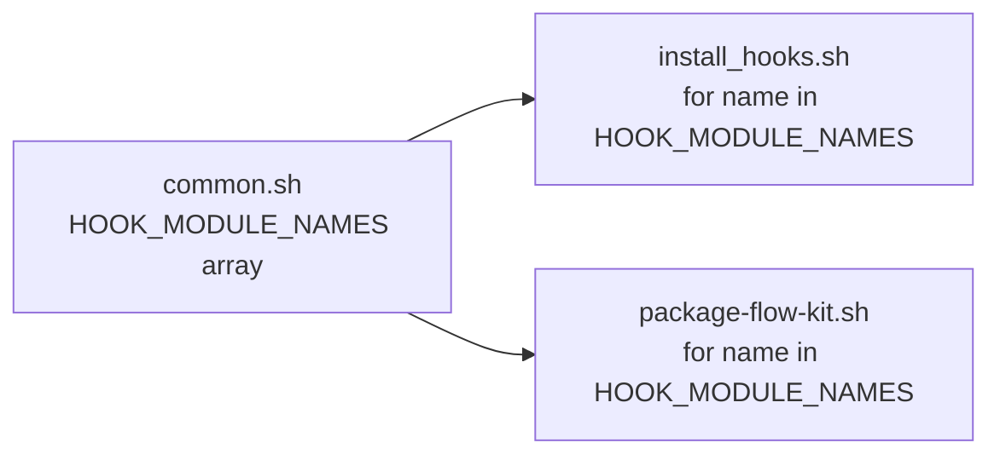
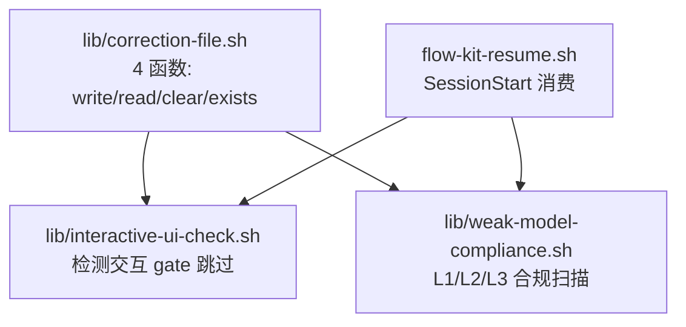

# DESIGN: 修复 2026-07-01 全量健康扫描发现的 6 项技术债

- **Change ID**: sweep-fix-2026-07
- **关联**: `@.specs/sweep-fix-2026-07/REQUIREMENT.md`、`@.specs/CONTEXT.md`
- **作者**: AI（Architect 角色）+ 人工 review

---

## 0. 技术栈选定

> 已锁定（CONTEXT.md § 技术栈）：Bash ≥ 4.0 + jq + bats-core ≥ 1.0。本 change 不变栈。

- **选定**：Bash Shell 脚本（项目锁定语言）
- **运行时**：Bash ≥ 4.0（`declare -A` 关联数组需求）
- **测试**：bats-core ≥ 1.0（新增安装 + SessionStart 测试）
- **外部依赖**：jq（已有，JSON 处理）
- **理由**：本 change 是对既有 shell 脚本的维护性重构，不变语言/运行时。Bash 4.0+ 是关联数组的最低版本，项目已锁定 Bash。
- **明确排除**：Python/Node.js 重写（性能无瓶颈，shell 实现刚好；CONTEXT.md § out 明确排除）

---

## 0.5 既有架构对齐（brownfield 必填）

### 0.5.1 本次 change 触碰的既有模块

```
触碰模块（grep/ls 确认）：
- flow-kit-bundle/hooks/stop/lib/common.sh（既有 · 添加 HOOK_MODULE_NAMES 数组）
- flow-kit-bundle/hooks/stop/lib/flow-kit-artifacts.sh（既有 · 改为查表驱动）
- flow-kit-bundle/hooks/stop/lib/interactive-ui-check.sh（既有 · correction 调用迁移到新 lib）
- flow-kit-bundle/hooks/stop/lib/weak-model-compliance.sh（既有 · correction 调用迁移到新 lib）
- flow-kit-bundle/lib/install_hooks.sh（既有 · 引用 HOOK_MODULE_NAMES）
- package-flow-kit.sh（既有 · 引用 HOOK_MODULE_NAMES）
- flow-kit-bundle/hooks/session-start/flow-kit-resume.sh（既有 · 消费者，行为不变）
- flow-kit-bundle/hooks/stop/27-interactive-ui-check.sh（既有 · 输出格式审计）
- flow-kit-bundle/hooks/stop/28-weak-model-compliance.sh（既有 · 输出格式审计）

新增模块：
- flow-kit-bundle/hooks/stop/lib/correction-file.sh（新 lib · 通用 correction file 管理）
- flow-kit-bundle/test/test_flow_kit_resume.bats（新测试）
- flow-kit-bundle/test/test_stop_report_reminder.bats（新测试）
- flow-kit-bundle/test/test_correction_file.bats（新测试 · 覆盖 write→read→clear→exists 全流程）

禁动清单（与本次无关，AI 不许"顺手"碰）：
- flow-kit-bundle/hooks/stop/[0-9][0-9]-*.sh（除 27/28 输出格式审计外不改功能逻辑）
- flow-kit-bundle/hooks/pre-tool-use/independent-review-gate.sh（不涉及）
- flow-kit-bundle/test/test_*.bats（已有测试，仅新增不修改断言）
```

### 0.5.2 既有抽象沿用对照表

| 本次需要 | 既有有没有？路径 | 决定 |
|---|---|---|
| jq 原子写入 | `common.sh::jq_atomic_write()`（已在本次 sweep Safe fix 中添加） | 沿用 |
| module 启用检测 | `common.sh::module_enabled()` | 沿用 |
| 产物检查 | `flow-kit-artifacts.sh::fk_artifact_check()` | 改造（查表驱动） |
| correction 文件管理 | `interactive-ui-check.sh` 和 `weak-model-compliance.sh` 各自实现 | **新建统一 lib**（correction-file.sh）替代两处重复 |
| 文件非空检测 | `common.sh::file_not_empty()` | 沿用 |
| hook 输出格式化 | `common.sh::module_output()` | 沿用，统一所有 hook 调用 |

### 0.5.3 沿用模式 vs 引入新模式

```
- Hook 库加载：**沿用** `source "${HOOK_BASE_DIR}/lib/<name>.sh"` 模式（correction-file.sh 同此模式）
- 函数命名：**沿用** `fk_` 前缀体系（correction_file_* 不带 fk_，因为它不是 flow-kit 特定逻辑，是通用 shell 工具）
- JSON 管理：**沿用** jq + 临时文件 + mv 原子写入（correction-file.sh 内部用 jq_atomic_write 或同样的 .tmp mv 模式）
- 配置管理：**沿用** config_get() 从 stop-hook.json 读配置
- Hook 模块名来源：**引入新模式** → 从硬编码列表改为 `common.sh` 中 `declare -a HOOK_MODULE_NAMES` 数组。理由：多消费者需要单一来源
- 产物规则定义：**引入新模式** → 从 if/elif 分支改为 `declare -A PHASE_ARTIFACTS` 关联数组。理由：新增 phase = 新增一行数据而非修改控制流
```

---

## 1. 决策清单

| # | 决策 | 备选 | 选择理由 | 取舍代价 |
|---|---|---|---|---|
| D1 | Hook 模块名在 `common.sh` 中以 `declare -a HOOK_MODULE_NAMES` 数组定义 | 独立 JSON 配置文件（`hooks/config/module-names.json`） | 数组天然在 shell 中可迭代，无需 jq 解析；`common.sh` 已被所有消费者 source，零额外依赖 | 非 shell 工具无法直接读取列表（但本项目 100% shell） |
| D2 | `fk_artifact_check()` 改为 `declare -A PHASE_ARTIFACTS` 关联数组查表驱动 | 外部 YAML/JSON 配置 + 通用解析器 | 关联数组在 shell 内零依赖、可被 grep 直观读取；新增 phase 只需在数组上加一行 `["N"]="file1 file2 ..."` | 数组较长时可能跨多行（当前仅 7 个 phase，可接受） |
| D3 | Correction file 统一为 `lib/correction-file.sh`，提供 4 个通用函数：`correction_file_write(path, violations_json, dedup_key)` / `correction_file_read(path)` / `correction_file_clear(path)` / `correction_file_exists(path)`。`dedup_key` 参数由调用方传入（如 `"rule,location"` / `"gate_type,required_tool"`），控制 merge 时的去重字段 | 合并两个 lib（interactive-ui-check 和 weak-model-compliance 融合为一个文件） | 提取通用层保留两个 lib 的独立职责（交互检测 vs 合规检测），避免过度耦合；4 函数接口最小化；`dedup_key` 参数让 merge-write 对两种 JSON schema 通用 | 新增一个 lib 文件，依赖链多一层 source。首次写入时用 `jq -n` 创建文件（而非 `jq_atomic_write` 要求文件已存在），覆写时用临时文件 + mv |
| D4 | bats 安装优先 `sudo dnf install bats`，失败回退 `npm install -g bats` | 仅依赖 dnf 或仅依赖 npm | dnf 是系统包管理、零运行时依赖；npm 作为 fallback 覆盖 dnf 不可用的环境（如 macOS / 容器） | 两条安装路径需在文档中说明 |
| D5 | 输出格式审计：grep 裸 `echo "warning\|"` / `echo "error\|"` 并替换为 `module_output` 调用 | 写新 lint 规则强制检查 | 一次性 grep 审计简单直接；当前仅少量 hook 存在裸 echo，人工审计成本低 | 无法防止未来新增 hook 再次裸 echo（可在 v2 加 shellcheck 规则） |
| D6 | `MIN_MEANINGFUL_LINES=3` 添加行注释：`# 阈值: <3 行的文件视为空壳（常见于只有 shebang + 空行的空模板），3 行以上才开始内容检验` | 内嵌在函数逻辑里说明 | 注释直接放在常量定义处，最容易被读到 | 无 |

---

## 2. 数据流 / 架构图

### 2.1 Hook 模块名去重（D1）



**变更前**：`install_hooks.sh` 和 `package-flow-kit.sh` 各维护一份硬编码的 14 个模块名列表。
**变更后**：两处均通过 `source common.sh` 后引用 `${HOOK_MODULE_NAMES[@]}`。

### 2.2 Correction file 统一（D3）



**变更前**：`interactive-ui-check.sh` 和 `weak-model-compliance.sh` 各自实现 JSON correction file 的 merge-write/read/clear 逻辑。
**变更后**：两处均调用 `correction-file.sh` 通用函数。

### 2.3 查表驱动产物检验（D2）

**真实变更前**（`flow-kit-artifacts.sh:44-130`，累积检查语义）：
```bash
case "$phase" in
  1)  check CHANGE.md ;;
  2|2a) check CHANGE.md + REQUIREMENT.md ;;
  3)  check REQUIREMENT.md + DESIGN.md ;;
  4)  check REQUIREMENT.md + DESIGN.md + TASK.md
      + optional: if task_id set, check <task_id>-SUMMARY.md ;;
  5)  check REQUIREMENT.md + DESIGN.md + TASK.md
      + find *-SUMMARY.md | wc -l ≥ 1 ;;
  6)  check TEST.md ;;
  7)  check REVIEW.md ;;
esac
```
注：每个后续 phase 会**累积重检**前序产物的存在性（如 phase 3 同时要求 REQUIREMENT.md 和 DESIGN.md，前者是 phase 1 的产物），这是设计意图——确保 pipeline 中无阶段缺失上游工件。

**变更后（查表驱动 + 条件逻辑分离）**：
```bash
# 数据：每个 phase 的必须产物列表（累积语义已在表中体现）
declare -A PHASE_ARTIFACTS=(
  ["1"]="CHANGE.md"
  ["2"]="CHANGE.md REQUIREMENT.md"
  ["2a"]="CHANGE.md REQUIREMENT.md"
  ["3"]="REQUIREMENT.md DESIGN.md"
  ["4"]="REQUIREMENT.md DESIGN.md TASK.md"
  ["5"]="REQUIREMENT.md DESIGN.md TASK.md"
  ["6"]="TEST.md"
  ["7"]="REVIEW.md"
)

# 特殊条件（查表无法表达的，保留在分支中）
# Phase 2/2a 共用同一映射（case "2"|"2a" 已在表中体现）
# Phase 4: task_id 存在时额外检查 <task_id>-SUMMARY.md
# Phase 5: find *-SUMMARY.md | wc -l ≥ 1

fk_artifact_check() {
  local change_id="$1" phase="$2"
  local spec_dir="${PROJECT_ROOT}/.specs/${change_id}"
  local missing=0

  # 通用：遍历表中定义的必须产物
  local files="${PHASE_ARTIFACTS[$phase]}"
  for f in $files; do
    if ! fk_file_nonempty "${spec_dir}/${f}"; then
      echo "warning|G1|Phase ${phase} 但 ${f} 缺失或为空"
      missing=1
    fi
  done
  unset IFS

  # 条件：Phase 4 的当前 task SUMMARY（保留既有 task_id 查找逻辑）
  if [[ "$phase" == "4" ]]; then
    local task_id
    task_id=$(fk_flow_field "task_id" "")
    if [[ -n "$task_id" && "$task_id" != "none" ]]; then
      local summary_file="${spec_dir}/${task_id}-SUMMARY.md"
      if [[ ! -f "$summary_file" ]]; then
        echo "info|G1|当前 task ${task_id} 尚无 SUMMARY.md — 开发进行中"
      fi
    fi
  fi

  # 条件：Phase 5 的 SUMMARY 计数
  if [[ "$phase" == "5" ]]; then
    local summary_count
    summary_count=$(find "$spec_dir" -name "*-SUMMARY.md" -type f 2>/dev/null | wc -l)
    if [[ "$summary_count" -eq 0 ]]; then
      echo "warning|G1|Phase ${phase} 但没有任何 SUMMARY.md — 回 4-dev 补齐"
      missing=1
    fi
  fi

  return $missing
}
```

**收益**：新增/修改一个 phase 的通用产物规则 → 只改 `PHASE_ARTIFACTS` 表一行。特殊条件（task_id 查找、find 计数）保留在条件分支中，查表不掩盖其复杂度。

---

## 3. 关键状态机

本 change 不引入新状态机。Correction file 本身已是 JSON 状态（status: "pending"/"corrected"），仅改变管理代码的位置（从两个 lib 搬到统一的 correction-file.sh），不改变状态机的语义。

---

## 4. ADR 索引

本 change 无可逆性低到需要单独 ADR 的决策。D1-D3 为局部实现模式选择，D4 为环境配置选择。关键的架构假设（Bash ≥ 4.0、jq 依赖、hook 模块化管道）已在 CONTEXT.md 和既有架构中锁定。

---

## 5. 风险

| # | 风险 | 影响 | 概率 | 缓解 |
|---|---|---|---|---|
| R1（实现） | D3 correction-file.sh API 与两个消费者预期的行为差异——如 `correction_file_write()` 的 merge-write 逻辑与原来不同，导致 `flow-kit-resume.sh` SessionStart 读取到异常格式 | SessionStart correction injection 失效（弱模型跳过 gate 后不会被矫正） | 中 | 函数签名保留 path 参数（两个消费者的文件路径不同）；write 内部完全复制原逻辑再抽象；新增 `test_correction_file.bats` 覆盖 write→read→clear→exists 全流程 |
| R2（实现） | `declare -A PHASE_ARTIFACTS` 关联数组语法与项目当前的 Bash 版本不兼容（部分系统仍有 Bash 3.x） | `fk_artifact_check()` 执行时报语法错误 | 低 | `flow-kit-artifacts.sh` 顶部已检查脚本依赖；可在数组定义前加 `[[ ${BASH_VERSINFO[0]} -lt 4 ]] && return 1` 兜底 |
| R3（上线） | bats 安装失败（系统无 dnf 也无 npm） | AC-4 无法验证，新增 SessionStart 测试无法运行 | 低 | AC-4 给出两条安装路径；第三条手动安装 curl 下载 bats 二进制 |
| R4（长期债务） | 输出格式审计（D5）是一次性 grep 修正，未来新增 hook 可能再次裸 echo | 格式漂移重现 | 低 | v2 阶段计划加 `shellcheck` 自定义规则或 pre-commit hook 检测裸 echo 模式 |
| R5（实现） | `HOOK_MODULE_NAMES` 数组内容手工维护，拼写错误（如 `01-transcript-parse` 误写为 `01-transcript_parse`）在编译期无法捕获 | `for name in "${HOOK_MODULE_NAMES[@]}"` 会尝试安装/打包一个不存在的脚本，install 或 package 阶段才暴露 | 低 | 在 `package-flow-kit.sh --validate` 模式中校验数组内每个名字对应的源文件存在；在 `test_smoke_syntax.bats` 中新增一用例 grep 数组定义并逐一 `test -f` |

---

## 6. 不在范围

- `package-flow-kit.sh` 完整模块化拆分（589 行→多文件）— 本 change 仅去重 hook 列表
- `lib/weak-model-compliance.sh` L2 状态机重写 — 保持现有 state-machine 实现不变
- 引入 shellcheck 自定义规则或 pre-commit hook — v2 阶段
- 将 `.flow-active.interactive-ui-fix` 迁移到统一 `.flow-active.correction` 格式 — v2（CONTEXT.md 已标注）

---

## 9. 架构沉淀建议

### 9.1 新增的可复用抽象

| 路径 | 能力 | 触发场景 | 复用建议 |
|---|---|---|---|
| `hooks/stop/lib/correction-file.sh` | 通用 JSON correction file 管理（write/read/clear/exists） | 任何需要事后矫正文件记录的场景（hook 检测到问题 → 写矫正文件 → SessionStart 消费） | 未来如有新 hook 模块需要写"检测到问题待矫正"类文件，优先使用此 lib |
| `hooks/stop/lib/common.sh::HOOK_MODULE_NAMES` | hook 模块名单一来源数组 | 任何需要遍历全部 hook 模块名的脚本（安装/打包/验证） | 引用 `"${HOOK_MODULE_NAMES[@]}"` 而非硬编码 |

### 9.2 新增 / 改变的项目级技术决策

| 决策 | 取值 | 影响范围 | 推翻代价 |
|---|---|---|---|
| Correction file 管理统一 | `lib/correction-file.sh` 作为唯一 correction file 读写入口 | `interactive-ui-check.sh` + `weak-model-compliance.sh` + 未来新合规模块 | 低——API 仅 4 个函数，推翻只需换一个 lib 的 source 路径 |
| 产物规则查表驱动 | `declare -A PHASE_ARTIFACTS` 关联数组 | `flow-kit-artifacts.sh::fk_artifact_check()` | 低——数据与逻辑分离，换回 if/elif 或换 YAML/JSON 均可原地替换 |

### 9.3 新增 / 修改的跨模块契约

```
- correction_file_write(path, violations_json, dedup_key) → 原子写入 JSON，merge 已有 violations（去重按 dedup_key 指定的逗号分隔字段，如 `"rule,location"` 用于合规、`"gate_type,required_tool"` 用于交互 UI）。首次写入（文件不存在）时用 `jq -n` 创建；覆写时通过临时文件 + mv 保证原子性
- correction_file_read(path) → stdout 输出 JSON，文件不存在时输出 "{}"
- correction_file_clear(path) → 删除文件
- correction_file_exists(path) → 返回 0（文件存在且有效 JSON）/ 1（不存在或无效）
- HOOK_MODULE_NAMES=(00-gate 01-transcript-parse 20-claude-md 21-memory 22-git 23-quality 24-session 25-project 26-workflow 27-interactive-ui-check 28-weak-model-compliance 29-independent-review 30-ai-analyze 99-report)
```

### 9.4 新增 / 升级的依赖

| 包 | 版本 | 用途 | 是否替换既有 |
|---|---|---|---|
| bats-core | ≥ 1.0 | SessionStart hook 测试执行 | 否（首次安装，项目已有测试文件但测试 runner 未装） |

### 9.5 禁动清单变化

```
- 新增禁动：flow-kit-bundle/hooks/stop/lib/correction-file.sh 的 4 个函数签名 — 修改签名需同时更新 interactive-ui-check.sh 和 weak-model-compliance.sh
- 新增禁动：flow-kit-bundle/hooks/stop/lib/common.sh::HOOK_MODULE_NAMES — 修改数组内容时务必同步确认 install_hooks.sh 和 package-flow-kit.sh 的消费者逻辑
```
