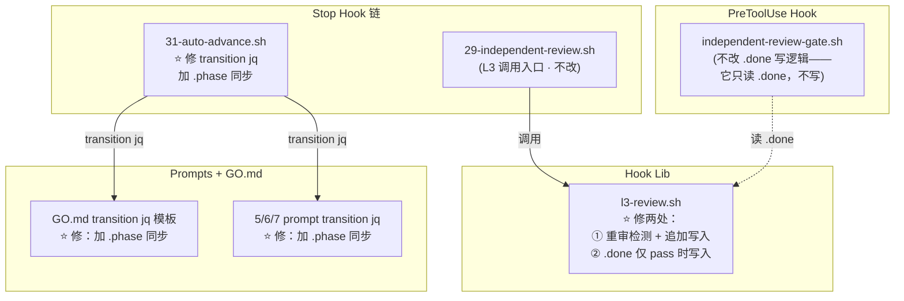

# DESIGN: 修 L3 gate 机制三连异常（L-030）

- **Change ID**: fix-l3-gate
- **关联**: `@.specs/fix-l3-gate/REQUIREMENT.md`、`@.specs/CONTEXT.md`、`@.specs/ARCHITECTURE.md`
- **作者**: AI（Architect 角色）+ 人工 review

---

## 0. 技术栈选定

> 纯 Bash 脚本项目（CONTEXT.md 已锁定），跳过技术栈选型。

- **语言/运行时**: Bash 4.0+（`set -euo pipefail`）
- **依赖**: `jq` ≥ 1.6、`curl`、`stat`（coreutils）
- **测试**: bats-core 1.13.0（npx）
- **静态分析**: shellcheck（error 级别，-e SC1091）
- **理由**: 与既有项目栈完全一致，无新增依赖

---

## 0.5 既有架构对齐（brownfield · 来自 2-design 步骤 0.5）

### 0.5.1 本次 change 触碰的既有模块

```
触碰模块（grep/ls 验证的实际清单）：
- flow-kit-bundle/hooks/stop/lib/l3-review.sh（既有 · 574 行 · 6 函数）
- flow-kit-bundle/hooks/pre-tool-use/independent-review-gate.sh（既有 · 391 行 · 6 函数）
- flow-kit-bundle/hooks/stop/31-auto-advance.sh（既有 · 98 行）
- flow-kit-bundle/hooks/stop/29-independent-review.sh（既有 · 168 行 · L3 调用入口）

新增模块：无（纯修改，不新建文件）

禁动清单（与本次无关，AI 不许"顺手"碰）：
- flow-kit-bundle/hooks/stop/lib/l2-detect.sh（L2 机制，不改）
- flow-kit-bundle/hooks/stop/lib/done-validation.sh（.done 校验逻辑，不改——本次不改校验规则，只改写入条件）
- flow-kit-bundle/hooks/stop/lib/fix-compliance.sh（实效性校验，不改）
- flow-kit-bundle/hooks/stop/28-weak-model-compliance.sh（合规检测，不改）
- flow-kit-bundle/hooks/stop/33-flow-active-integrity.sh（状态完整性，不改）
- package-flow-kit.sh（打包脚本，不改——禁动清单明确标注）
```

### 0.5.2 既有抽象沿用对照表

| 本次需要 | 既有有没有？路径 | 决定 |
|---|---|---|
| L3 API 调用封装 | `l3_review_run()` in `l3-review.sh:160` | **沿用**，在其内部扩展重审逻辑 |
| .done 文件写入 | `l3_review_run()` L381-408 + `l3_write_timeout_done()` L453-499 | **修改**——改写入条件（仅 pass 时写） |
| L3 段写入 review 文件 | `l3_review_run()` L298-323 | **修改**——改覆写为追加（重审场景） |
| phase 方向检测 | `_fk_phase_direction()` in `independent-review-gate.sh:89` | **沿用**，不改 |
| gate 真实性校验 | `fk_validate_done_marker()` in `done-validation.sh` | **沿用**，不改 |
| transition jq 执行 | `31-auto-advance.sh` L92-95 + GO.md/prompts 中的 transition jq 模板 | **修改**——加 `.phase` 同步 |
| L3 派发提示 | `l3_dispatch_prompt()` in `l3-review.sh:505` | **沿用**，不改 |

### 0.5.3 沿用模式 vs 引入新模式

```
- Hook lib 函数封装：**沿用** 既有 `l3_review_run()` 签名（4 参数 + gate_config），扩展内部逻辑
- .done KVP 格式：**沿用** 6 键 KVP（phase/change_id/written_by/L2_verdict/L3_verdict/L3_summary/artifacts），不增新键
- L3 段写入：**修改**——从"覆写"改为"追加"（重审场景保留历史）
- .done 写入策略：**修改**——从"无论 verdict 都写"改为"仅 pass 时写"
- transition 同步：**修改**——从"仅更新 goal.* 字段"改为"goal.* + 顶层 phase 同步更新"
- 时间戳存储：**沿用** 文件系统 mtime（`stat -c %Y`），不引入新元数据文件
```

---

## 1. 决策清单

| # | 决策 | 备选 | 选择理由 | 取舍代价 |
|---|---|---|---|---|
| D1 | **L3 重审触发**: 用 `stat -c %Y INDEPENDENT-REVIEW-N.md` 的 mtime 作为"上次审查时间"，比较阶段产物文件 mtime | 新增 `.l3-timestamp-N` 元数据文件存时间戳 | review 文件自身 mtime 随每次追加自然更新，无需额外文件；O(1) stat 调用无延迟 | 若 review 文件被非 L3 进程 touch，会误判为"已审查"跳过重审；概率极低（只有 L3 写该文件） |
| D2 | **L3 段写入**: 重审时**追加**新 `## L3 重审` 段（不覆写旧段），首次审查仍写 `## L3 盲审` | 继续覆写旧段（当前行为）| AC-1 要求保留审查历史；追加模式天然防重入（mtime 更新后同状态不重复触发） | 文件随重审次数线性增长；v2 可加归档清理 |
| D3 | **Verdict 解析**: gate 读取 INDEPENDENT-REVIEW-N.md 中**最后出现的 verdict** 作为当前有效 verdict | 只读第一个 `## L3 盲审` 段的 verdict | 最后一次审查反映最新工件状态；实现简单（grep verdict 取最后匹配） | 若某次重审 JSON 格式错误致 verdict 解析失败，需降级到前一次 verdict |
| D4 | **.done 写入条件**: 仅 `l3_verdict=pass` 时写 .done；fail/timeout/error 均不写 | 保持当前"无论 verdict 都写 .done" | AC-2 要求 L3 fail 不写 .done 防止绕过；AC-3 要求 pass 时写 .done 放行 | timeout 场景从"写 timeout .done 放行"变为"不写 .done 暂停 pipeline"——用户需手动处理 L3 API 不可达 |
| D5 | **transition 同步**: transition jq 同步更新 `.phase`（顶层字段）+ `.goal.current_phase` + `.goal.phases_done` + `.goal.gates` | 仅更新 `.goal.*` 字段（当前行为）| AC-4 要求四字段一致；Stop hook `29-independent-review.sh` 读 `.phase` 判断是否需要 L3，不同步会导致 pipeline 模式下 L3 误触发/漏触发 | 需同步修改多处 transition jq（GO.md + 3 个 prompt + 31-auto-advance.sh）；改动面广但每条都是单行 jq 加法 |

---

## 2. 数据流 / 架构图

### 2.1 L3 重审完整流程

```
  主 agent 修改阶段产物（REQUIREMENT.md / DESIGN.md / ...）
      │
      ▼
  Stop hook 或 PreToolUse hook 触发 L3
      │
      ▼
  l3-review.sh: l3_review_run()
      │
      ├─ INDEPENDENT-REVIEW-N.md 已存在？
      │   │
      │   ├─ 否 → 首次审查：调 L3 API → 写入 ## L3 盲审 段 → 判断 verdict
      │   │
      │   └─ 是 → stat -c %Y INDEPENDENT-REVIEW-N.md → REVIEW_MTIME
      │           │
      │           ├─ 产物 mtime > REVIEW_MTIME？→ 重审：调 L3 API → 追加 ## L3 重审 段
      │           │
      │           └─ 产物 mtime ≤ REVIEW_MTIME？→ 跳过（已审，工件未变）
      │
      ▼
  判断 l3_verdict
      │
      ├─ pass  → 写入 .independent-review-N.done（6 键 KVP）→ gate 放行
      │
      └─ fail / timeout / error → 不写 .done → gate 拦截（exit 2）
```

### 2.2 Transition 四字段同步

```
  transition jq（phase N → N+1）
      │
      ▼
  jq '.goal.current_phase = "N+1"           ← 已有
      | .goal.phases_done += ["N"]          ← 已有
      | .goal.gates["N→N+1"] = "passed"     ← 已有
      | .phase = (N+1 | tostring)           ← 新增（修复不同步）
      | .updated_at = now'                  ← 已有
      .flow-active > .flow-active.tmp && mv .flow-active.tmp .flow-active
```

### 2.3 模块交互（修改范围标注）



---

## 3. 修改点详设

### 3.1 `l3-review.sh` · 修改 1: 重审检测 + 追加写入

**位置**: `l3_review_run()` L298-323（当前 L3 段写入段）

**当前行为**:
```bash
# L298-304: 先剥离已有 L3 段（覆写模式）
if [ -f "$review_md" ]; then
  awk '/^## L3 盲审/{stop=1} !stop{print}' "$review_md" > "$tmp_review"
  mv "$tmp_review" "$review_md"
fi
# L310-323: 写入新的 L3 段（总是 ## L3 盲审 标题）
```

**修改为**:
```bash
local review_md="${artifacts_dir}/INDEPENDENT-REVIEW-${phase}.md"
local is_review=false

if [ -f "$review_md" ]; then
  # ── 重审检测：比较产物 mtime vs review 文件 mtime ──
  local review_mtime
  review_mtime=$(stat -c %Y "$review_md" 2>/dev/null || echo "0")
  local artifact_mtime=0
  # 取阶段主产物文件的 mtime（取最大值，任一文件变更即触发重审）
  case "$phase" in
    1) artifact_mtime=$(stat -c %Y "${artifacts_dir}/REQUIREMENT.md" 2>/dev/null || echo "0") ;;
    2) artifact_mtime=$(stat -c %Y "${artifacts_dir}/DESIGN.md" 2>/dev/null || echo "0") ;;
    3) artifact_mtime=$(stat -c %Y "${artifacts_dir}/TASK.md" 2>/dev/null || echo "0") ;;
    5) artifact_mtime=$(stat -c %Y "${artifacts_dir}/TEST.md" 2>/dev/null || echo "0") ;;
    6|7) artifact_mtime=$(stat -c %Y "${artifacts_dir}/REVIEW.md" 2>/dev/null || echo "0") ;;
  esac
  
  if [ "$artifact_mtime" -gt "$review_mtime" ] 2>/dev/null; then
    is_review=true
    echo "[l3-review] re-review triggered for phase ${phase} (artifact mtime=${artifact_mtime} > review mtime=${review_mtime})" >&2
  else
    echo "[l3-review] skipping L3 for phase ${phase} (artifact unchanged since last review)" >&2
    return 0
  fi
fi

# ... (L3 API 调用不变) ...

# ── 写入 L3 段（追加模式）──
mkdir -p "$artifacts_dir"
local section_title
if [ "$is_review" = true ]; then
  section_title="## L3 重审（${model} 外部模型 · ${ts}）"
else
  section_title="## L3 盲审（${model} 外部模型 · ${ts}）"
fi

{
  echo ""
  echo "---"
  echo ""
  echo "$section_title"
  echo ""
  echo "> 自动生成于 ${ts}。由 l3-review.sh 写入。"
  # ... (其余不变)
} >> "$review_md"  # 注意：改为 >> 追加
```

### 3.2 `l3-review.sh` · 修改 2: .done 仅 pass 时写入

**位置**: `l3_review_run()` L381-418（.done 写入段）

**当前行为**: 无论 verdict 是什么都写 .done

**修改为**:
```bash
# ── 仅 pass 时写入 .done ──
if [ "$l3_verdict" = "pass" ]; then
  # ... (现有 .done 写入逻辑不变) ...
  echo "[l3-review] L3 pass — .done written (phase ${phase})" >&2
else
  # fail / timeout / error → 不写 .done
  echo "[l3-review] L3 verdict=${l3_verdict} — .done NOT written (phase ${phase})" >&2
fi
```

**同步修改**: `l3_write_timeout_done()` L453-499 同样改为不写 .done（或直接移除该函数调用，让 timeout 走 fail 路径）。

### 3.3 `31-auto-advance.sh` · 修改: transition jq 加 .phase 同步

**位置**: L92-95

**当前**:
```bash
jq --arg next "$next_phase" --arg gk "$gate_key" \
  '.goal.current_phase = $next | .goal.phases_done += [($next|tonumber - 1|tostring)] | .goal.gates[$gk] = "passed" | .updated_at = now' \
  "$flow_file" > "$tmp_flow"
```

**修改为**:
```bash
jq --arg next "$next_phase" --arg gk "$gate_key" \
  '.goal.current_phase = $next | .phase = $next | .goal.phases_done += [($next|tonumber - 1|tostring)] | .goal.gates[$gk] = "passed" | .updated_at = now' \
  "$flow_file" > "$tmp_flow"
```

> **类型一致性**（🔴 R1 修复）：`.phase` 当前在单阶段模式（`26-workflow.sh:88`）中写为 JSON string（`jq ".phase = \"$next_phase\""`），在 pipeline 模式（`31-auto-advance.sh:93`）中从未更新（即 pipeline 模式下 `.phase` 停留在初始值）。本次修改统一为 string：`--arg next` 天然产生 string，`.phase = $next` 与 `.goal.current_phase = $next` 同类型。`fk_resolve_phase()`（`common.sh` 中唯一的 phase 读取点）内部使用 `jq -r` 输出原始字符串后 bash `==` 比较——bash 字符串比较不区分 JSON 类型的引号差异，故类型统一后兼容。

### 3.4 GO.md + prompts 中的 transition jq 模板同步

以下文件中的 transition jq 模板均需加 `.phase` 同步（统一用字符串，与 §3.3 保持一致）：

| 文件 | 修改 |
|---|---|
| `flow-kit/prompts/1-requirement.md` Toll-Gate 段 | transition jq 加 `.phase = "2"` |
| `flow-kit/prompts/2-design.md` Toll-Gate 段 | transition jq 加 `.phase = "3"` |
| `flow-kit/prompts/3-task.md` Toll-Gate 段 | transition jq 加 `.phase = "4"` |
| `flow-kit/prompts/5-test.md` Toll-Gate 段 | transition jq 加 `.phase = "6"` |
| `flow-kit/prompts/6-review.md` Toll-Gate 段 | transition jq 加 `.phase = "7"` |
| `GO.md` Phase 0→1 Toll-Gate | transition jq 加 `.phase = "1"` |

---

## 4. ADR 索引

本 change 不引入新的不可逆架构决策（纯 bug 修复，在既有 gate 机制内修补）。若有以下隐含决策需记录：

- **ADR-005 补充**: L3 .done 写入策略从"无条件写"改为"仅 pass 时写"，属于 ADR-005（独立审查体系）的实施细节修正，不改变 ADR 本身的方向。

---

## 5. 风险

| # | 风险 | 影响 | 概率 | 缓解 |
|---|---|---|---|---|
| R1 | **实现风险**: `stat -c %Y` 在 macOS 上语法不同（需 `stat -f %m`） | L3 重审检测在 macOS 上失效（mtime 比较失败，跳过所有重审） | 中 | 用 `stat` 兼容写法：先测 `stat -c %Y` 是否可用，不可用则 fallback 到 `stat -f %m`；或直接用 `date -r <file> +%s` 跨平台 |
| R2 | **上线风险**: .done 写入条件改为"仅 pass"后，L3 timeout 不再写 .done → pipeline 暂停，用户体验变化 | L3 API 抖动时 pipeline 频繁暂停，用户需手动介入 | 中 | hook log 清晰记录拒绝原因；用户可临时将 `gate_config` 切换为 L2-only（`/flow gate-config L2 <phase>`）绕过 L3；或手动 `touch .done` 放行（需理解风险）。注：`FLOW_KIT_SKIP_L3` 环境变量当前**不存在**（grep 确认），不引用。 |
| R3 | **长期债务**: INDEPENDENT-REVIEW-N.md 随重审次数线性增长 | 多次重审后文件过大，L3 prompt 截断可能漏掉最近 verdict | 低 | v2 加历史归档；v1 在追加前检查文件大小 > 50KB 时 warn log |
| R4 | **兼容性风险**: transition jq 加 `.phase` 同步涉及多处改动，遗漏任一处导致部分路径仍不同步 | 部分 transition 路径 phase 仍不同步 | 低 | 实施前 `grep -rn 'current_phase\|\.phases_done\|\.gates\[' flow-kit-bundle/skills/ flow-kit-bundle/hooks/ flow-kit/prompts/` 全仓扫描所有 transition jq 写入点，逐项标注"需同步"或"不适用" |

---

## 6. 不在范围

- L3 审查结果历史归档（v2）
- 重审次数上限配置（v2）
- L3 重试超时后可配置次数（v2）
- gate_config 默认值改动
- L2 审查机制改动
- `fk_validate_done_marker()` 校验规则改动（不改——本次只改写入条件，不改读取/校验逻辑）

---

## 7. 测试策略（ADR-007 合规）

### 7.1 测试文件

新增 `test/test_fix_l3_gate.bats`，覆盖本 change 的 5 项行为变更。

### 7.2 AC → 测试用例映射

| AC | 测试用例 | 测试类型 | 需 mock？ |
|---|---|---|---|
| AC-1 重审触发 | `mtime 检测：产物更新后触发重审` | 单元（文件系统） | Mock L3 API（用 fixture 响应文件） |
| AC-1 防重入 | `mtime 检测：产物未变时跳过重审` | 单元（文件系统） | 无（不调 API） |
| AC-2 fail 不写 .done | `L3 verdict=fail → .done 不存在 + exit 2` | 集成（调用 l3_review_run） | Mock L3 API（返回 fail JSON） |
| AC-3 pass 写 .done | `L3 verdict=pass → .done 存在 + L3_verdict=pass` | 集成（调用 l3_review_run） | Mock L3 API（返回 pass JSON） |
| AC-4 四字段同步 | `transition jq 后 .phase / .goal.current_phase / .phases_done / .gates 一致` | 单元（jq + tempfile） | 无 |
| AC-5 回退放行 | `回退方向 transition 不要求 .done` | 单元（gate 脚本） | 无 |

### 7.3 Mock 策略

- L3 API 调用通过注入 fixture 文件模拟：设置 `L3_FIXTURE_RESPONSE` 环境变量指向预置 JSON 文件，`l3_review_run()` 检测该变量后跳过 curl 直接读取 fixture
- 或使用 bats `mock` 机制：在测试 setup 中 `function curl() { cat "$L3_FIXTURE_RESPONSE"; }`

### 7.4 回归保护

- 运行全量 `npx bats test/` 确保 0 fail（当前基线 407 tests，exit 0）
- 若修改触及 `fk_validate_done_marker` 或 `fk_resolve_phase`，扩大回归范围到对应测试文件

---

## 9. 架构沉淀建议

本 change 无架构层面沉淀建议。纯 bug 修复，在既有 gate/hook 机制内修补，不引入新的可复用抽象、项目级技术决策、跨模块契约或依赖变动。

> 唯一值得记录的是 L-030 的经验教训——L3 fail 后不重审 + .done 无条件写入 + phase 不同步的三连异常根因——已记入 LESSONS.md L-030（td-test-infra 发现），本 change 修复后标记 resolved。

---

> 本文件不包含完整代码实现。函数签名、伪代码、接口定义可以；函数体不行。
