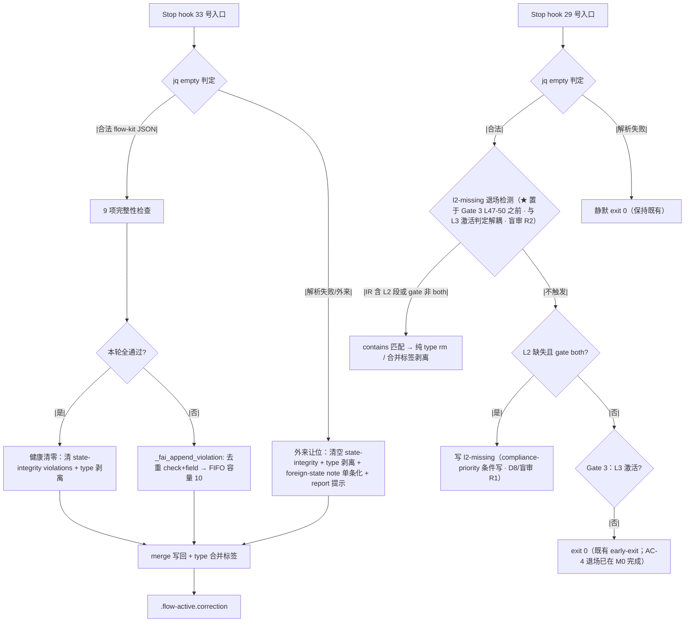

# DESIGN · correction-hygiene-state-guard

> change-id: correction-hygiene-state-guard · 阶段 2（DESIGN）· 2026-09-01

## 0. 技术栈选定

- **语言/运行时**：Bash（`set -euo pipefail`）——沿用 flow-kit hooks 既有栈，无新依赖（不引 yq/pyyaml，AC-7）
- **测试**：bats-core 1.13.0（二进制路径 `~/.npm/_npx/cd2c4d46c11457b7/node_modules/bats/bin/bats`，npx 包装卡网络）
- **数据处理**：jq（既有依赖，全部 correction 操作走 jq，保持 JSON 语义唯一）
- 纯 CLI/lib 项目，跳过技术栈卡片流程（GO.md 例外条款）

## 0.5 既有架构对齐

### 0.5.1 触碰模块（grep 核实）

```
本次 change 会触碰：
- flow-kit-bundle/hooks/stop/33-flow-active-integrity.sh（既有 · _fai_append_violation L249-288 + 入口 L25 jq empty + 9 处 check 调用）
- flow-kit-bundle/hooks/stop/29-independent-review.sh（既有 · _write_l2_missing_correction L24-30 + L38 jq empty || exit 0）
- flow-kit-bundle/hooks/stop/lib/correction-file.sh（既有 · 4 函数 exists/read/write/clear + write_model_missing_clear L132）

会新增：
- test/test_correction_hygiene.bats + flow-kit-bundle/test/ 双源（AC-1~AC-10 覆盖）

会触碰（phase 3 盲审 N1 范围扩展 · 2026-09-01）：
- Makefile（check-validate target 补权威直判行，对齐 test target L10+L11 双行模式——TD-012 假绿复发修复；AC-8 四门验收依赖此门可信）

不应该触碰（禁动）：
- independent-review-gate.sh / fk_validate_done_marker / 00-gate.sh（gate 核心链，CHANGE 例外登记已界定边界）
- 31-auto-advance.sh / 32-fallback-guard.sh / 34-archive-commit-check.sh（静默跳过行为保持）
- chisel_env 仓库任何文件（AC-7）
```

### 0.5.2 对齐既有抽象

| 本次需要 | 既有有没有？ | 决定 |
|---|---|---|
| correction 文件读写 | correction-file.sh 4 函数（correction_file_write/read/clear/exists） | 沿用；**新增 2 个 helper**（去重/裁剪），不改 4 签名（禁动条款） |
| model-missing 退场范式 | write_model_missing_clear（correction-file.sh:132，type 精确匹配 + 文件级 rm） | **沿用其精神**，但匹配改为 `contains()`（R7：合并标签破坏精确匹配） |
| compliance 混写保护 | 28-weak-model-compliance.sh 的 write_compliance_correction（:74）+ clear_compliance_correction（:119）（盲审 R3 行号勘正） | 沿用；本 change 操作仅限 state-integrity 类作用域 |
| type 合并标签 | 33 号 merge 逻辑（L271-273：existing_type+state-integrity） | **沿用并扩展**：剥离语义（l2-missing 退场/外来清空时） |
| 外来判定 | jq empty（33 L25 / 29 L38 既有模式） | 沿用为唯一判据（AC-5） |

### 0.5.3 沿用 vs 引入

- 去重/容量/清空逻辑：**引入**（33 号 `_fai_append_violation` 内部新逻辑，无既有抽象）→ 理由：correction 只增不清是本次缺陷本体
- 共享 helper：**引入新函数**（correction-file.sh 追加，不改 4 签名）→ 理由：去重/剥离逻辑 33/29 两处复用，符合 correction-file.sh 的 lib 定位

## 1. 技术决策（每条带备选/理由/代价）

- **D1 · 去重作用域 = 9 check 名白名单** → 备选：按 type 字段分段 / 全局去重。理由：violations[] 由 33 号（state-integrity）与 28 号（compliance）混写，全局去重会跨类型误删（R5/AC-10）；type 分段需改文件结构（v2 分段存储）。白名单界定简单且与 AC-3 枚举一致。代价：未来新增 check 名需同步白名单（用常量数组 + 注释提示）。
- **D2 · 容量上限 = 防御性 backstop（10 条 FIFO，先去重后淘汰）** → 备选：删除（YAGNI）/ 阈值 >9。理由：9 check 常量 field 使去重后 ≤9 条，第 11 条当前不可达（R3）；保留为防未来动态 field 的无界增长安全网，测试用合成 fixture。代价：一段当前不可达代码（明示注释）。
- **D3 · 健康清零触发条件 = 合法 JSON + 本轮全部检查通过** → 备选：仅合法 JSON。理由：中途检查有违规时清空会让用户看不到刚发生的违规。代价：需维护「本轮是否有违规」标志（入口初始化 + 9 处 check 失败置位）。
- **D4 · l2-missing 退场双态清除**（纯 type → 文件级 rm；合并标签 → 剥离段保留 state-integrity）→ 备选：仅精确匹配（照抄 write_model_missing_clear）。理由：33 号 merge 产出 `l2-missing+state-integrity` 合并标签（L271-273），精确匹配永不命中（R7）。代价：清除逻辑多一个剥离分支（stderr 审计记录清除前 type）。
- **D5 · 外来让位动作归 33 号单一 actor**（29 号保持静默）→ 备选：29/33 都写 note。理由：AC-9「恰 1 条 note」需唯一写 note 方；29 号静默是本 change 显式化既有 exit 0 行为（R1）。代价：外来时 29 号不提供任何 correction 痕迹（与现状一致，无回归）。
- **D6 · foreign-state note 去重键 = check 名** → 备选：check+field。理由：外来场景固定 check=foreign_state、field 无意义，check 名去重即单条化（AC-5/AC-9）。代价：多平台/多字段外来 note 合并为一条（note 内可含 message 拼接）。
- **D7 · M-3 必查：YAML 写入源核实**（2-design 本阶段执行）→ 备选：跳过。理由：写入源决定外来判定边界（若未来 flow-kit 自己写 YAML 会自伤）；核实后记录到 DESIGN 风险段。代价：一次现场调查（低成本）。**已核实（2026-09-01）**：见风险段第 6 条。
- **D8 · 29 号 l2-missing 写入改 compliance-priority 条件写**（L2 盲审 R1）→ 备选：保持 `>` 覆写 / 移入 v2。理由：`_write_l2_missing_correction`（29 号 L27-29）现用 `jq -n > file` 整文件覆写，28 号已写入 compliance 条目时会被摧毁——与 ADR-024「compliance 永不被 correction 卫生逻辑误删」契约直接冲突，且本 change 正在 29 号改造 l2-missing 生命周期（退场 + 写入），是修复窗口。复用 `write_model_missing_correction`（correction-file.sh:116-123）的既有模式：单步 jq `if .type=="compliance" and ((.violations // []) | length > 0) then . else $new end` + mktemp 原子写。代价：29 号写入路径多一层条件判断（与 L3 model-missing 写入行为对齐，无新范式）。

## 2. 数据流 / 架构图

### 2.1 correction 生命周期（本 change 后）



### 2.2 type 标签状态机（剥离语义）

```
state-integrity ──merge 遇 l2-missing──> l2-missing+state-integrity
l2-missing+state-integrity ──29 号退场──> state-integrity（violations 保留）
l2-missing+state-integrity ──33 号外来清空──> l2-missing（state-integrity 类 violation 清空 + 追加 1 条去重 foreign-state note，盲审 R4）
state-integrity ──33 号健康清零/外来清空──> （violations 清空，type 保留）
compliance（28 号）──任何路径──> 不受影响（AC-10）
```

### 2.3 边界

- 不触碰外来状态文件本体（AC-7：mtime/内容不变）
- 28 号 compliance 写入路径零改动（write_compliance_correction/clear 保持）
- 31/32/34 号零改动

## 3. ADR

### ADR-024 · correction violations 分层作用域（新决策）

- **路径**：`.specs/adr/024-correction-violations-scope.md`
- **Context**：`.flow-active.correction` violations[] 由 33 号（state-integrity）与 28 号（compliance）混写同一数组；ADR-013 只定义了文件级 type 覆盖优先级（compliance > model-missing），无数组级条目保留条款（R5 核实）。本 change 引入数组级操作（去重/容量/清空），需界定作用域。
- **Decision**：数组级操作（去重、FIFO 容量、健康清零、外来清空）以 33 号写入的 9 种 check 名白名单为作用域边界；compliance 类条目（28 号写入）不参与任何数组级操作（沿 ADR-013 compliance 优先精神，升格为显式契约）。
- **Consequences**：正——compliance 安全数据（弱模型合规矫正）永不被 correction 卫生逻辑误删；负——白名单需随新增 check 名维护（常量数组 + L-031 注释提示）；type 合并标签需剥离语义配套（D4/D5）。

（其余决策为模块内实现细节，可逆性低风险，不单独 ADR。）

## 4. 风险

1. **健康清零误清**（D3 判定条件缺陷）→ 缓解：清零仅限白名单 check 名 + 需「全通过」标志；清除动作 stderr 审计行；bats 覆盖（AC-3）。
2. **外来误判自伤**（flow-kit 自己 JSON 被写坏被当外来）→ 缓解：jq empty 唯一判据（语法错误即外来，note 文案区分「非 flow-kit 格式或已损坏」）；flow-kit 写入路径全走 jq，损坏概率极低（CHANGE 风险段延续）。
3. **合并标签组合爆炸**（type 剥离遗漏某组合）→ 缓解：剥离实现用 `contains()` + 显式三态测试（纯 state-integrity / l2-missing+state-integrity / compliance 共存）；bats 覆盖（AC-4/AC-6）。
4. **28 号并发写竞争**（同文件 merge 竞争：33 号读-合并-写 vs 28 号同刻写）→ 缓解：两模块均走 correction-file.sh 原子写（tmp+mv），最后一次写者胜；本 change 不改变此既有语义，风险登记不新增机制。
5. **双平台部署漂移** → 缓解：integration 阶段 md5 双侧校验（延续 l2l3-cross-platform 流程）。
6. **M-3 YAML 写入源（D7 已核实 · 2026-09-01）**：① flow-kit 全链路 jq 写入（恒 JSON，无 yaml 写入者）→ 外来自伤风险为零；② chisel-skill/scripts/auto-checkpoint.sh 为 jq/JSON 路径（.flow-active 缺失即退出）；③ chisel-skill prompts（7-integration.md:49「更新 .flow-active」）为模糊指令且无格式规范、无 YAML 样例 → **最可能根因：AI 在 traceweave 会话按模糊指令手写 .flow-active 时自行选择 YAML**。结论：外来判定边界固定为「jq 不可解析 = 外来/损坏」，无需追加任务；chisel-skill 侧格式规范属其自身改进（out of scope，v2 候选转介）。

## 5. 不在范围内

- 多模块 foreign-state note 跨模块去重（v2）
- correction 按 type 分段存储（v2，彻底消除白名单维护成本）
- chisel-skill 生态的格式协商（v2，需对方配合）
- 30-ai-analyze.sh 凭证链（v2 候选维持）
- 33 号 check 名从常量到动态参数的演进（触发 AC-2 可达性，未来单独决策）

## 9. 架构沉淀建议

### 9.1 判定

- **新增可复用抽象**：correction-file.sh 新增去重/剥离 helper——后续任何 correction 卫生类 change 可复用（≥2 使用场景：33 号去重 + 29 号剥离）→ 入选
- **项目级技术决策**：ADR-024 数组级分层作用域（compliance 永不被卫生逻辑触碰）→ 入选
- **禁动清单变动**：29 号例外登记（correction-hygiene-state-guard）→ 登记在 CHANGE.md 例外段 + CONTEXT.md 禁动清单同步（7-integration 或 A-evolve 时）

### 9.2 子段

- **抽象**：`correction_file_dedupe(correction_file)` / `correction_file_trim(correction_file, max)` / `correction_file_strip_type(correction_file, segment)`——语义见 ADR-024；白名单以模块级 readonly 常量 `CORRECTION_STATE_INTEGRITY_CHECKS` 单一源内嵌于 correction-file.sh（**不作为函数参数**——ADR-024 契约固定白名单，参数化会允许调用方传入削弱白名单；盲审 R4 勘定签名，phase 3 fix loop 对齐 TASK）
- **决策**：数组级操作以 9 check 名白名单为界（ADR-024）
- **契约**：`.flow-active.correction` violations[] 操作契约升级——数组级卫生操作不得触碰 compliance 类条目（ADR-024 定义）
- **依赖**：无新增依赖
- **禁动清单**：29 号例外（本 change 一次性）；correction-file.sh 4 签名不变（新增 helper 不触碰）

### 9.3 严禁事项

- 不凑数：本 change 无新库/无依赖变动/无 schema 变更，上述 3 条为真实可复用项
- 不重复 0.5.3 段内容
