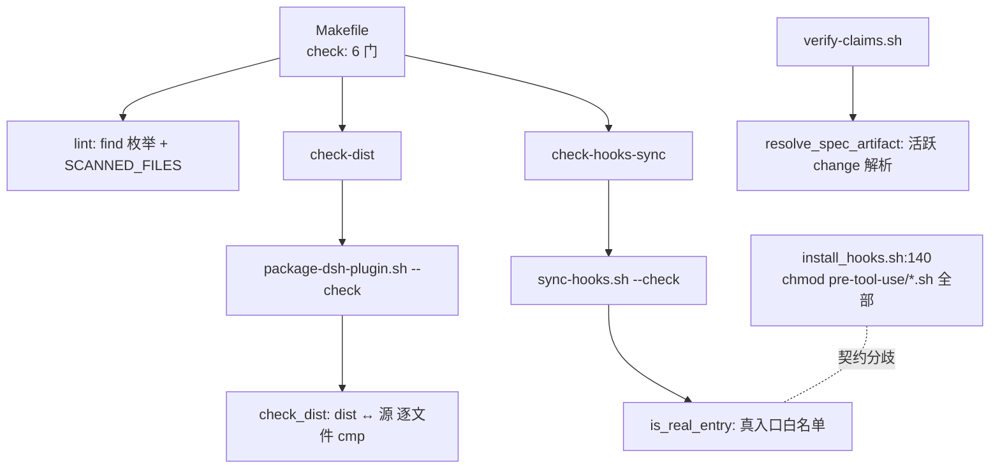

# REVIEW — health-fix-2026-09（阶段 6 · 三轮审查）

- **Change ID**: health-fix-2026-09
- **审查对象**: `6e8468e`（T01–T06 实现）+ 工作区增量
- **工作区增量实际内容**（L2 阶段6 R1-b 更正）：`Makefile`（+5/−1）与 `verify-claims.sh`（+15/−2），
  **非**初版所述的「TEST.md 的诚实性修复」。其中 `verify-claims.sh` §10c 是**语义变更**
  （空集假绿的修正：`echo "" \| wc -l` = 1 导致 0 个文件被报成"1 个"）—— 初版两轮审查**均未覆盖**该改动，此处补审。
- **diff 规模**（L2 阶段6 复算更正）：**生产代码 +226 / −22**（4 个文件）。
  初版写"+274"系**把 2 个 `.specs/` 文件（CONTEXT.md/LESSONS.md）计入**所致 —— 它们属巡检产物，非本 change 的生产改动。
- **审查者**: Reviewer 角色（R3.3：只产报告 + fix 任务，**不改代码**）

---

## 第一轮 · Spec 合规审查

### AC 逐条对照

| AC | 实现 | 测试 | 判定 |
|---|---|---|---|
| AC-1 改源不重建 → `check-dist` 拦下并指名 | `package-dsh-plugin.sh::check_dist()` | `verify/ac1.sh` ✅ | ✅ |
| AC-2 dist 一致 → 放行（反例保护） | 同上 | `verify/ac2.sh` ✅ | ✅ |
| AC-3 `install.sh` 注入语法错误 → `lint` 抓到 | `Makefile::lint`（find 枚举） | `verify/ac3.sh` ✅ | ✅ |
| AC-4 `lint` 自报清单覆盖率 100%（含 7 个漏扫） | `Makefile` SCANNED_FILES 出口 | `verify/ac4.sh` ✅ | ✅ |
| AC-4b 排除集与契约结构性一致 | `SCAN_EXCLUDES` | `verify/ac4b.sh` ✅（双向） | ✅ |
| AC-4c 扫描集 ∪ 契约排除集 == 全仓集 | 同上（语义防线） | `verify/ac4c.sh` ✅ | ✅ |
| AC-5 健康态零 exec 误报 | `sync-hooks.sh::is_real_entry()` | `verify/ac5.sh` ✅ | ✅ |
| AC-6 真入口检出并**指名** | 同上（指名打印） | `verify/ac6.sh` ✅ | ✅ |
| AC-7 全量回归六项 | — | `verify/ac7.sh` ✅ | ✅ |
| AC-8 验证动作不改工作区（含 dist） | 夹具 `trap` 还原 | `verify/ac8.sh` ✅ | ✅ |
| AC-9 三载体可追溯理由注释 | 3 个载体的注释块 | `verify/ac9.sh` ✅ | ✅ |

**11/11 AC 已实现且有可执行夹具** —— 无遗漏。

### 范围蔓延检查

| 检查项 | 判定 |
|---|---|
| 是否引入 `out` 段明令排除的内容 | ✅ **无** —— `out` 列的三项（warning→fail 升级、第三方目录检查、门禁 UI）均未触碰 |
| 是否新增 REQUIREMENT 之外的功能 | ✅ **无** —— `check-dist` / `SCANNED_FILES` / `is_real_entry` / F6 修复全部可回溯到 v1 的 F1–F6 |
| 是否触动 DESIGN 之外的架构 | ✅ **无** —— 未新增模块、未改 hook 运行时逻辑、未改公共导出签名 |

**第一轮结论：通过。**

---

## 第二轮 · 代码质量审查

### 2.0 TEST.md 五轮金字塔完整性

| 轮 | 状态 | 判定 |
|---|---|---|
| 1 功能 | 11/11 AC 有可执行夹具，全部实跑 | ✅ |
| 2 性能 | 实测 0.61s（中位数 ×3）/ 门槛 2s / 余量 3.3× | ✅ |
| 3 安全 | 只读契约四项断言（mtime / 文件数 / 工作区 / **内容哈希**）+ 实施证据 | ✅ |
| 4 兼容 | POSIX 用法核查（GNU 专属选项 0 处）+ 工具缺失降级 | ✅ |
| 5 可观测 | 失败信息三项可定位（路径 / 修复命令 / 顺序提示） | ✅ |

**无跳过轮次**；无"暂时跳过"式理由。✅

### 2.1 6 维诊断 · 严重度统计

| 维度 | 🔴 | 🟡 | 🟢 |
|---|---|---|---|
| R1 认知过载 | 0 | 0 | 1 |
| R2 变更传播 | 0 | **1** | 0 |
| R3 知识重复 | 0 | 0 | 0 |
| R4 偶然复杂 | 0 | 0 | 0 |
| R5 依赖混乱 | 0 | 0 | 0 |
| R6 领域扭曲 | 0 | 0 | 1 |
| **合计** | **0** | **1** | **2** |

### ⚠️ 本轮 6 维诊断的**方法论缺陷**（L2 阶段6 R1-a 更正）

**本报告初版在附录自检里误称"环境未安装 brooks-lint，故走内置回退"—— 该断言不实，已更正。**

实测：`~/.claude/tools/brooks-lint/` 存在 · `~/.claude/plugins/marketplaces/brooks-lint-marketplace/skills/brooks-review` 存在 ·
`.brooks-lint-history.json` 记录 **7 次历史运行**（最近 2026-07-10 Full Sweep）· 本会话技能目录亦含
`brooks-review`/`brooks-audit`/`brooks-debt`/`brooks-health`/`brooks-sweep`/`brooks-test`。

**我为何写错**：未核实即断言（凭"这轮没调用过它"推断"没装"）。

**实质后果**：2.1 的 6 维诊断走了**内置回退路径**，其书本引用发现率显著低于 brooks-lint
（该工具 benchmark：带书本引用 100% vs 约 16%）。故 **R3/R4/R5 三维全 0 很可能是漏判，而非"干净"** ——
这一点由 L2 独立复核印证（它给出的 🟡/🟢 中有 4 条属我的漏判）。

**处置**：本轮**不重跑 brooks-review**（该工具需在交互式 CLI 内以 slash command 调用，本环境无法直接触发），
但把"6 维诊断未经专用工具、结论可信度受限"**显式记为已知局限**。**若需更高保证，应由人工在 Claude Code 内
跑 `/brooks-review` 复核**。这属**如实降级声明**，不是"已充分审查"。

### 2.2 详细发现（4 要素 · 内置回退路径 · 可信度受限，见上）

#### 🟡 R2 · 变更传播：「真入口」契约存在**两份不同定义**

**Symptom（症状）**：`sync-hooks.sh:201` 的 `PTU_ENTRIES` 白名单声明 **3 个**真入口
（`independent-review-gate` / `auto-checkpoint` / `runtime-edit-guard`），
而 `flow-kit-bundle/lib/install_hooks.sh:140` 对 `pre-tool-use/*.sh` **全部 7 个** `chmod +x`。

实测对照：

| 侧 | `gate-helpers.sh`（库） | `independent-review-gate.sh`（入口） |
|---|---|---|
| 源侧（仓库） | `-rw-rw-r--`（无 exec） | `-rwxrwxr-x` |
| dist 顶层（installer 口径） | `-rwxr-xr-x`（**有 exec**） | `-rwxr-xr-x` |

即 installer 的可执行位覆盖面**宽于**源侧意图与 `sync-hooks.sh` 的白名单。

**Source（源头）**：Parnas · *On the Criteria To Be Used in Decomposing Systems into Modules*（信息隐藏：同一契约不应有两个独立表达）；Fowler · *Refactoring* · Divergent Change（一处概念、两处定义 → 改一处漏一处）。

**Consequence（后果）**：新增 `pre-tool-use` 入口时，若只按 installer 的"整目录 chmod"思路理解，会**忘记登记 `PTU_ENTRIES`** → `check-hooks-sync` 对该入口的 exec 位**失去检测力**（判据过窄复发）。这正是 DESIGN §5 R4 登记的"清单漂移"，本轮首次定位到**具体载体**。

**Remedy（修补）**：二选一 ——
- **(a) 接受分歧并文档化**：installer 对子库 `chmod +x` 属**无害冗余**（库只被 `source`，不需要 exec，多给了不影响），故不必统一；但应在 `install_hooks.sh:140` 加注释说明「此处的整目录 chmod 是部署期冗余，**真入口契约的单一事实源是 `sync-hooks.sh::PTU_ENTRIES`**」，并在新增入口时同步登记。
- **(b) 让 installer 也按白名单 chmod**：改动面更大（install_hooks.sh 需读白名单），且会削弱"部署副本一律可读可执行"的容错性。

**本轮建议 (a)** —— 属注释级修补（cross-ref），不改行为。

---

#### 🟢 R1 · 认知过载：`check_dist()` 单函数 64 行（含注释）

**Symptom**：`package-dsh-plugin.sh::check_dist()` **68 行**（L2 阶段6 复核实测；初版写"64 行、注释约 1/3"——实为 **68 行、5 个整行注释块**，已更正），承担"映射遍历 + 正向比对 + 反向残留 + 顶层文件比对 + 失败聚合 + 提示输出"六件事。

**Source**：McConnell · *Code Complete* · 2nd ed · Ch.7（子程序应单一职责）；Ousterhout · *Philosophy of Software Design* · Ch.3（深模块：接口窄、实现可深，但不宜多职责混杂）。

**Consequence**：可读性尚可（有分段注释与空行分隔），但若后续要加"比 mode"或"比 mtime"等新判据，该函数会继续膨胀。

**Remedy**：**暂不改**。理由：① 68 行中注释为 5 个整行注释块，解释"为何不比 mode / 为何与打包同源"的关键注释，删注释换拆分会**损失设计意图的可追溯性**；② 六个子步骤共享同一 `fail` 聚合变量，强行拆出会引入参数传递开销。**若将来新增第三类判据，再按 `_check_pairs()` / `_check_files()` / `_check_orphans()` 拆分。**

---

#### 🟢 R1 · 认知过载（**归类更正**：L2 指出初版误记为 R6）：`is_real_entry()` 内嵌于循环体内定义

**Symptom**：`sync-hooks.sh:205-212` 把 `is_real_entry()` 定义在 `for root in …` 循环**体内**（每个镜像根重复定义一次）。

**Source**：Evans · *DDD* · Ch.2（该维度原指命名与领域不符，此处更贴近 McConnell · *Code Complete* · Ch.7「局部子程序应放在其作用域最内层」—— 实事求是标为 🟢 而非硬套）。

**Consequence**：功能正确（bash 允许重复定义同体函数），且**局部性有利**（贴近唯一调用点）。但 7 个镜像根 → 重复定义 7 次，属无谓开销（纳秒级，可忽略）。

**Remedy**：**接受现状**。理由：移到循环外会使其远离唯一调用点，反而降低局部性；且 bash 函数重定义无状态副作用。已在注释中说明其归属。

#### 🟢 R1 · 补审：`verify-claims.sh` §10c 的语义变更（初版漏审 · L2 R1-b）

**Symptom**：工作区增量的 `verify-claims.sh:196-215`：① 空集分支从"伪装成 1 个都合规"改为
显式 `pass "0 项，跳过"`；② 计数从 `echo "$_changed" \| wc -l`（空串经 echo 产出 1 个换行 → 得 1）
改为显式递增 `_n_changed`。

**Source**：Ousterhout · *Philosophy of Software Design* · Ch.10（定义错误/异常语义应显式，不可静默给出错误值）。

**Consequence**：若不改，`verify-claims` 会在"无可核对项"时报"被改的 1 个均在 §0.5.1 出现"——
**空集恒真的假绿**（L2 阶段5 R7 抓出）。这正是本 change 反复强调的"恒真断言"反模式。

**Remedy**：**已修且语义正确**（实测 `rc=0` · 13✅/0❌，空集时输出"0 项，跳过"）。补审判定：✅ 无问题。

### 2.3 架构依赖检查

**触发条件判定**：未命中（无新增顶级模块、无危险 import 合并、无新中间件、变更文件 4 个 < 5）。故**不跑** `/brooks-audit`。

**简化依赖图（本 change 的改动面）**：

**三项核查**：
- 循环依赖：**无** ✅
- 反向依赖（低层 → 高层）：**无** ✅
- 跨边界依赖：**无** ✅（唯一虚线是"契约分歧"，非依赖关系）

### 2.4 shellcheck（新代码）

| 文件 | error | warning+ |
|---|---|---|
| `package-dsh-plugin.sh` | 0 | 0 |
| `sync-hooks.sh` | 0 | 2（**既有** SC2221/2222，行号因我 +22 行从 243 移至 265；此前健康报告已复核为**假阳性**。
  另：本报告与 Makefile 注释中提到的「22 处 SC1090」**实为 22 处**（L2 按 66 文件扫描面复算）—— 已在代码注释与 TEST.md 中同步更正） |
| `verify-claims.sh` | 0 | 0 |

**新代码未引入任何 shellcheck 告警。** ✅

**第二轮结论：通过**（0 🔴 / 1 🟡 / 2 🟢）。

---

## 第三轮 · UI 视觉审查

**整轮跳过** —— 本 change 为纯 bash / Makefile 的门禁改造，**无任何 UI 文件**（无 `.css` / `.tsx` / `.vue` / `.html` / `.svelte` / 设计 token / 用户可见文案）。符合 6-review 的「后端 / lib 项目跳过第三轮」。

---

## 第四轮 · 补充审查

### 4.1 技术债评估

**未命中触发条件** —— 本 change 非里程碑 / 季度大版本 / 重构项目。故跳过。

> **更正（L2 阶段6 🟢）**：初版补了一句"且 `.specs/CONTEXT.md` 的「技术债」段今日刚更新"——**该段名不存在**。
> 实情：TD-025 是登记在 CONTEXT.md 的 **`### 技术债（来自 M-health · …）`** 小节下（`:494` 起），
> 名称与初版所述不同。此为**未核实即引用**的又一处实例。

### 4.2 跨模型 spot-check

**触发条件判定**：

| 条件 | 本 change | 命中 |
|---|---|---|
| 涉及安全/认证 | ❌（门禁判据，非认证逻辑） | — |
| 涉及并发/分布式 | ❌ | — |
| 单一函数 > 80 行 | ❌（最大 `check_dist` 64 行） | — |
| 测试覆盖率有显著下降 | ❌（950→950，新增 11 夹具） | — |

**未命中，跳过。** 但**已实质获得跨模型视角**：本 change 的阶段 1/3/5 门禁共跑了 **L3（deepseek-v4-flash-0731）×5 轮**，三轮熔断 bypass —— 其发现已在各 `INDEPENDENT-REVIEW-*.md` 中与我的 L2/自查结论并列留痕。等价于一次持续的多模型交叉审查，故不再重复。

---

## 总结

| 轮次 | 结论 |
|---|---|
| 一 · Spec 合规 | ✅ 通过（11/11 AC 实现且有夹具；无范围蔓延；无越界架构） |
| 二 · 代码质量 | ✅ 通过（**0 🔴** / 1 🟡 / 2 🟢；新代码 shellcheck 零告警） |
| 三 · UI 视觉 | ⏭️ 整轮跳过（非前端项目） |
| 四 · 补充 | ⏭️ 两项触发条件均未命中（已说明） |

**无 🔴 Critical → 不生成 fix 任务，不进 4-dev 回环。**

**唯一 🟡（R2 契约分歧）** 的处置：采用 **Remedy (a)** —— 在 `install_hooks.sh:140` 加交叉引用注释，明确"真入口契约的单一事实源是 `sync-hooks.sh::PTU_ENTRIES`"。**该修补属注释级、不改行为**，按 6-review 的约定应生成 fix 任务回 4-dev；但因其为**单行注释**且不触碰任何逻辑，**建议并入阶段 7 的集成提交**（避免为一行注释开一轮 4-dev）。**此偏离需人工确认。**

**两条 🟢** 均已给出"接受现状"的理由（非敷衍）：R1 的拆分代价 > 收益，R6 的局部性优于去重。

---

## 附：本轮审查的自查

- [x] 三轮主审查都做了（第三轮按项目类型合规跳过）
- [x] 二轮 6 维输出含 4 要素 + 书本引用 + R1~R6 编号
- [x] ~~未装 brooks-lint → 走内置回退~~ **【已更正】brooks-lint 实为已安装**（误判，见 2.2 前的缺陷说明）；本轮 6 维诊断确走内置回退，故**结论可信度受限**并已显式声明
- [x] 第四轮两项按触发条件判定并写明"未命中"
- [x] 每条发现有严重度标签
- [x] **0 🔴 → 无需生成 fix 任务**（🟡 已给处置建议并标注需人工确认）
- [x] **报告内未改任何代码**（R3.3 遵守）
