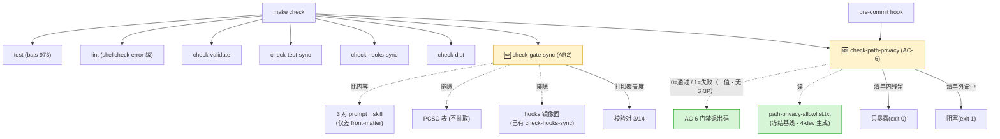

# DESIGN: 收口 4 个 🔴 + 隐私前向门禁 + 假绿测试

- **Change ID**: `health-fix-2026-09b`
- **关联**: `@.specs/health-fix-2026-09b/REQUIREMENT.md`、`.specs/health-fix-2026-09b/CHANGE.md`、`.specs/CONTEXT.md`、`.specs/ARCHITECTURE.md`
- **作者**: AI（Architect 角色）+ 人工 review

---

## 0. 技术栈选定

**N/A —— 本 change 不引入任何新技术栈。** 依据：`CONTEXT.md`「技术栈（团队级默认 / 已锁定）」已锁定
`detected_stack: Bash 脚本项目（flow-kit 分发包仓库）— 无框架/无 DB/无前端/无后端`
（该字段实在 **`.specs/STATE.md:43`**）；
按 2-design 步骤 0 的例外条款（"CONTEXT.md 里已有已锁技术决策 → 直接读用"）与
"纯库 / SDK / CLI 项目：跳过本步"两条同时命中，故不展示技术栈卡片。

本 change 的技术约束（而非选型）为：**Bash 3.2 兼容**（macOS `/bin/bash`）·
**GNU coreutils 不得新依赖**（`timeout` 须探测 `gtimeout`）· **sed/grep 须兼容 BSD**。

**引用约定（供审查者独立复现）**：本 DESIGN 对**仓内既有文件**的行号引用**一律与内容锚点成对**
（`Makefile:79` 的 `check-test-sync`、`Makefile:106` 的 `check:`、`install_hooks.sh:153` 的 `deploy_pre_commit` 调用之旁、
`independent-review-gate.sh:32-37` 的 `common.sh` fail-close 守卫）；对**本文件自身**禁用行号，一律内容定位。
被引的既有文件**不随本工件分发**（审查者只收到本 change 目录的工件）⇒ **按下列命令即可复现本文件的转述，无需信任转述**：

```bash
grep -n 'detected_stack' .specs/STATE.md                          # ⇒ :43
grep -n '^check-test-sync' Makefile                               # ⇒ :79
grep -n 'deploy_pre_commit' flow-kit-bundle/lib/install_hooks.sh  # ⇒ :153（调用点）/ :41（定义）
```

---

## 0.5 既有架构对齐（brownfield · 步骤 0.5）

### 0.5.1 本次 change 触碰的既有模块（grep/`wc -l` 实证）

```
触碰模块（既有 · 实测行数）：
- flow-kit-bundle/hooks/pre-tool-use/runtime-edit-guard.sh      103L  （PC1 · eval RCE）
- flow-kit-bundle/lib/install_hooks.sh                          303L  （PC2 · settings.json 截断 **＋ AC-3/⑧ · pre-push 部署触点**）
- .specs/adr/022-git-hook-deployment.md                                （D3 item 3：追加 `Superseded-by`（**部分**：新增 pre-push 注入）—— 实测现 **0 命中**，须在 4-dev 落地；TASK 须列对应 task）
- flow-kit-bundle/hooks/stop/lib/l3-prompt.sh                          （**L3 重审解阻断 · 用户已裁决（2026-09-23）**：
  phase 2 的 ADR 纳入策略由 `find "$adr_dir" | head -3`（目录序前 3 份、与本 change 无关、每份 2000 B 句中截断）
  改为**按工件引用频次纳入 + 逐份/总量预算 + 截断与未纳入均落显式标记**。
  **自我指涉披露（必须登记）**：本 change 修改的是**正在审查它自己的门禁**（L3 提示词构造）——
  缓解：① 改动只**减少**提示词噪声、**不放宽任何判据**（无判据可被它绕过）；② 实测证据齐备（见下）；
  ③ 不隐藏：TD-043 由「缺陷登记」转为「本 change 已修」，并在 5-test 留一条 verify：
  `_l3_build_prompt 2 <本 change 目录>` 的输出**必须含** `.specs/adr/028-gate-baseline-allowlist.md`
  且**不含** `.specs/adr/011-*`（对照态：改动前实测含 011/015/019、不含 028））
- flow-kit-bundle/hooks/pre-tool-use/independent-review-gate.sh 130L  （仅作守卫范式引用（`:32-37`），本 change 不改其逻辑 —— PC3 属 v2，见 §6）
- flow-kit-bundle/hooks/pre-tool-use/gate-checks-review.sh       95L  （PC3 相邻 · **本文件不含 `common.sh` 守卫**；真守卫在 `independent-review-gate.sh:32-37`）
- flow-kit-bundle/flow-kit/reference/check-gate-sync.sh         159L  （AR2 · 判据错误 + 未接线）
- flow-kit-bundle/hooks/pre-commit/pre-commit.sh                 32L  （AC-6 · 接入 check-path-privacy）
- Makefile                                                      155L  （接入两道新门禁）
- sync-hooks.sh                                                 380L  （副本面枚举 / --check）
- test/test_check_gate_sync.bats                                 53L  （AR2 · 断言 -ne 2 → -eq 0）
- test/test_lessons_cleanup.bats                                267L  （AC-7 · 去 AC-4 过期 skip）
- test/test_combined_metric.bats                                 41L  （AC-7 · 恒真断言）
- test/test_auto_checkpoint.bats                                223L  （AC-7 · 断言错对象）
- test/test_independent_review_model.bats                       141L  （AC-7 · 反向断言 + $HOME 依赖）
- test/test_gate_config_presets.bats                            390L  （TC1 · 本 change 不改，留 v2）
- test/test_correction_hygiene.bats                              （AC-5 必改 · chisel ×5 · 有 bundle 镜像）
- test/test_l3_review_defects_2026_09.bats                       （AC-5 必改 · chisel ×1 · 有 bundle 镜像）
- flow-kit-bundle/test/{test_correction_hygiene,test_l3_review_defects_2026_09}.bats（AC-5 必改 · 双源镜像）
- `test/test_quality_baseline.bats` + 其 `flow-kit-bundle/test/` 镜像（⑪-3 补入 · AC-3/AC-8 依赖其
  `test -x .git/hooks/pre-push` 与 `grep -q "make check"` 两条断言；R3 另要求其源文件 `100755`）
- **全部 7 对待改 bats 均为双源**（实测 `test/` 与 `flow-kit-bundle/test/` 逐字相同）——
  共 7 对 / 14 个文件：`test_check_gate_sync.bats`（AR2 断言收紧）、`test_lessons_cleanup.bats`（AC-7 去 skip）、
  `test_combined_metric` / `test_auto_checkpoint` / `test_independent_review_model`（AC-7）、
  `test_correction_hygiene` / `test_l3_review_defects_2026_09`（AC-5）
  （`Makefile:79` 的 `check-test-sync` 在 `check:` 内 ⇒ **漏改任一份即漂移**）

新增产物：
- .specs/health-fix-2026-09b/path-privacy-allowlist.txt  （AC-6 的冻结基线 · 4-dev 生成入库；**权威副本 = 常设路径**
  `flow-kit-bundle/flow-kit/reference/path-privacy-allowlist.txt`；判据读序 = 常设路径 > change 副本 >
  **两者皆缺 ⇒ `exit 1` 并指名缺失路径**（fail-closed，不得当空清单））
- Makefile 目标 check-path-privacy                        （AC-6 的新门禁）
- flow-kit-bundle/flow-kit/reference/check-path-privacy.sh （门禁实现 · **D8 已定稿选项③**，不再是"待定"）
- flow-kit-bundle/hooks/pre-push/pre-push.sh              （AC-3 的推送拦截器）
- .specs/health-fix-2026-09b/.change-base                  （4-dev 变更起点 SHA；内容 = 4-dev **首步** `git rev-parse HEAD`，**须入库**。NFR 兼容性判据的锚点优先读它）

禁动清单（与本次无关，AI 不许"顺手"碰）：
- flow-kit-bundle/hooks/stop/**                    （Stop 链 18 模块 · 本次只碰 pre-tool-use 与 lib）
- flow-kit-bundle/brooks-lint/**                   （第三方 vendored · out 段已永久锁定不改）
- flow-kit-bundle/flow-kit/reference/pipeline-gates.md（**只读引用**，不改内容 —— 见 D2 的 PCSC 排除）
- .specs/health-fix-2026-09b/INDEPENDENT-REVIEW-1.md （审查档 · 主 agent 只可写「主 agent 响应」段）
- flow-kit-bundle/skills/**（17 份 SKILL.md · 双载体同步属 v2/TD-025，本次不碰）
```

### 0.5.2 既有抽象沿用对照表

| 本次需要 | 既有有没有？ | 决定 |
|---|---|---|
| 副本面枚举 | `sync-hooks.sh --list` 的 ✅ 行（实测 6 条） | **沿用**（禁手列路径 —— 已实测手列会漏 2 个 DEST_ROOT） |
| 副本一致性校验 | `sync-hooks.sh --check`（实测 rc=0） | **沿用** |
| 门禁目标命名 | `Makefile` 既有 `check-*` 前缀（`check-validate`/`check-test-sync`/`check-hooks-sync`/`check-dist`） | **沿用** → 新目标命名 `check-path-privacy` |
| 门禁接入点 | `Makefile:106` 的 `check:` 先决条件列表 | **沿用**（追加先决条件，不新建聚合目标） |
| gate 守卫范式 | `independent-review-gate.sh:32-37` 对 `common.sh` 的显式 fail-close 守卫（全文档已无 `gate-checks-review.sh:34-37` 的错误引用） | **沿用**（PC3 就是把该范式套到 3 个子库） |
| 原子写 | 仓内**固定名 `.tmp` 写入点实测 18 处 / 12 个文件**（12 直接 + 5 经 `tmp_xxx=` 间接 + `flow-state.js:72`），另有 11 处已正确用 `mktemp` | **本次不统一**（属 v2/PC13，规模 = 12 处）；新写的判据脚本**必须** `mktemp` + `trap` 清理 |
| `~` 展开 | 无既有 helper；仓内唯一实现就是待修的 `eval` | **新建内联**（不建 helper —— 只此一处用，建 helper 属过度抽象） |
| SKIP 语义 | 无既有约定（既有门禁只有 0/1） | **引入新模式** → 理由见 **§3 的「门禁退出码模型」段与 ADR-028**（本 change 首个使用，须写 ADR-028） |
| 门禁阻塞面政策 | **`ADR-027 · gates-surface-not-threshold`**（已锁定） | **沿用**（见 D1 的对齐论证） |
| git hook 部署 | **`ADR-022 · git hook 部署策略（symlink to .git/hooks/）`**（已锁定） | **沿用**（见 D3 的更正） |

### 0.5.3 沿用模式 vs 引入新模式

```
- 门禁命名与接入：**沿用** 既有 `check-*` + `check:` 先决条件范式
- 副本面处理：**沿用** `sync-hooks.sh --list/--check`，禁手列路径
- gate 守卫：**沿用** `independent-review-gate.sh:32-37` 的显式 fail-close 守卫写法
- 新门禁的**对外可观测性**：**沿用** NFR「失败必须指名 file:line」的口径（既有 A-evolve 下游消费该格式）
- SKIP 用独立退出码（**仅 NFR 兼容性判据适用**）：**引入新模式**，理由：既有 0/1 二值无法表达"未验证"，
  不加区分就会出现"SKIP 当绿灯"。
  **`rc=3` 不得出现在挂进 `check:` 先决条件的门禁里**（make 对非零一律判失败 ⇒ 长期红）；
  **AC-6 门禁为二值（0/1），无 SKIP 态**；NFR 判据须以 `if` 包装接入（3 → 提示不阻塞，仅 1 才 fail）。
  **代价**：仅 NFR 判据的消费方（`make check` 包装层 / AC-8）须区分 3 与 0；**pre-commit 不涉及**（它只跑 AC-6 门禁的二值结果）。
  ADR-028 已固化语义与 make 层映射。
- 基线允许清单（ratchet）：**引入新模式** → 理由：**本机绝对路径前缀类**残留（**v1 只收第 1 类**，见 D10）**无法一次性清零**
  （实测残留含本 change 自身新写的 CONTEXT.md/STATE.md），若门禁直接红则长期红 → 按 ADR-027 ②「长期红会被绕过」必须给合规出口。ADR-028 固化。
```

---

## 1. 决策清单

| # | 决策 | 备选 | 选择理由 | 取舍代价 |
|---|---|---|---|---|
| **D1** | **AC-6 门禁 = 自证式输出 + 允许清单棘轮 + 二值退出码（0/1）**；阻塞面**仅限「非允许清单命中」** | ① 无清单直接红 ② 纯信息不阻塞 ③ 全量白名单硬编码 | 依 **ADR-027 ②③**：known-acceptable 残留（实测含本 change 自身新写的文件）**不得升级为 fail**，否则长期红被绕过；但隐私是**新不变量**（非既有判据扩面），故新命中的**必须拦** —— ①过严（必长期红）、②过松（隐私无强制力）、③是 out 段明禁形态 | 引入"允许清单"这个需人工复核的工件；清单腐化（只增不减）风险 → 见 R3 缓解。
  **退出码**：AC-6 门禁为**二值**（0/1），**不引入**三态 —— 三态只属 NFR 兼容性判据（见 §3 与 ADR-028） |
| **D2** | **AR2 比较对 = 3 对「仅差平台 front-matter」的 prompt↔skill**；判据**比内容**（非比行数）；**明确排除 PCSC 表与 hooks 镜像面**；输出**打印覆盖度 `校验对 3/14`** | ① 保留 PCSC 比较 ② 纳入 hooks 镜像面 ③ 14 对全量 | PCSC 表按 `phase-prompt-template.md:144` 属「结构性文档化（**不抽取**）」，逐 phase **本就不应相同**；hooks 面已有 `check-hooks-sync` 专职（重复覆盖）；14 对全量会让门禁**立刻红且无法收敛**；比行数会导致假红/假绿 | **取舍代价**：v1 **仅覆盖 3/14**，其余 11 对的漂移仍无门禁 → 必须在门禁输出显式打印覆盖度，防"✅ 全部一致"被误读；全量策略属 v2/TD-025。
  **实测分档**：**3 对逐字相同**（仅差 front-matter）· **2 对近似**（`2a-ui-design` 差 4 行、`A-architect` 差 6 行）· **9 对实质分叉**（含 `6-review` 仅 28 行交集）⇒ v1 只覆盖前 3 对，不覆盖后 11 对 |
| **D3** | **AC-3 的 `pre-push` 载体 = 延续 `ADR-022`**（symlink `.git/hooks/pre-push` → **已安装** hooks 目录，由 `install_hooks.sh` 部署、`sync-hooks.sh --check` 校验） | ① 改为"复制到 .git/hooks"（ADR-022 方案 2 已被否决） ② 要求"非 symlink 的仓内脚本" ③ `core.hooksPath`（ADR-022 方案 1 已否决） | **ADR-022 已锁定 symlink 方案**，其代价已被接受（"每项目单独部署"+ Windows fallback）。② 若照字面执行等于**未经声明地 supersede ADR-022** | **补全（两处致命遗漏必须显式裁决）**：<br>**(a) 既有 `.git/hooks/pre-push` 必须显式裁决** —— 实测该文件**已存在**（373 B 普通文件，内容即 `make check`），而 `install_hooks.sh` / `install.sh` / `package-dsh-plugin.sh` 对 `pre-push` **0 命中**（无任何部署逻辑）。若照 `ADR-022` 的"已存在则跳过"⇒ 旧 hook 保留 ⇒ **AC-3 拦截不存在，而 `test_quality_baseline.bats:77-85` 的两条无 skip 断言与 AC-8 全绿（假绿）**；若直接覆盖 ⇒ push 时 `make check` 静默消失且两条断言转红（AC-8 回归）。**本设计裁决（重设 · 使 AC-8 可达）**：
实测既有 `.git/hooks/pre-push` 的内容在第 4 行注释含 `flow-kit` 字样 ⇒ 内容 grep 判据**必然命中** ⇒ 落「覆盖」分支 ⇒ 而覆盖后 `make check` 从 hook 消失 ⇒ `test_quality_baseline.bats` 的两条**无 skip** 断言（`test -x` / `grep -q "make check"`）转红 ⇒ **AC-8 的「0 not ok」按设计不可达**。故重设为：

0. **两分支必须由「可执行判据」区分，且判据不得是内容 grep**（内容 grep 必然命中既有 hook 的 `:4` 注释 `flow-kit` 1 处 ⇒ 落「幂等跳过」⇒ **AC-3 静默不交付而全绿**；对既有 hook、悬空 symlink、源树、dist 均须按载体语义区分）。
   **定稿判据（按载体语义，非按内容）**：
   ```bash
   # 幂等条件：目标是「指向【已安装】hooks 目录」的 symlink
   #   ① 不用 `readlink -f` —— 它是 GNU-only（macOS 原生 readlink 仅支持 -n，
   #          报 illegal option 且 stdout 为空 ⇒ 判据恒假 ⇒ 幂等跳过成死代码 ⇒
   #          每次安装落「备份+覆盖」、ADR-022 幂等静默失效、.bak.<ts> 无界堆积）。
   #          裸 `readlink` 在 BSD/GNU 通用；`ln -sf` 存下的原始目标串即满足后缀匹配。
   #   ② 只认已安装位，显式排除 ① 源树（`flow-kit-bundle/hooks/…` —— ADR-022 明确否决过的
   #          形态：目标项目无该目录）② `dist/` 镜像（非安装位）—— 否则「错绑到源树」也会被判
   #          幂等跳过，而 bats 的两条断言对这种错绑全绿。
   # 【定稿 · 规定性伪代码】非最终实现：约束的是**变量名 / 判断顺序 / 退出语义**；
   #   函数体细节由 4-dev 按仓内风格落地（AST/行数可与本块不同，语义不得变）。
   is_flowkit_symlink() {
     [ -L "$1" ] || return 1
     # 悬空 symlink 必须 return 1 —— 裸 `readlink` 对悬空链接**同样**返回目标串 rc=0
     #   ⇒ 若不加此判，悬空态会命中 `*/hooks/pre-push/pre-push.sh) return 0` 被判「幂等跳过」，
     #   与本文件 D3 行内「否则（…悬空 symlink…）= 备份 + 覆盖」一句互斥，且使 ⑥ 的 --remove-destination 成死代码。
     #   `[ -e ]` 跟随 symlink，对悬空返回 1 —— 可移植（BSD/GNU 一致），不引入 `-f`。
     [ -e "$1" ] || return 1
     local t; t="$(readlink "$1")" || return 1
     case "$t" in
       */flow-kit-bundle/hooks/pre-push/pre-push.sh) return 1 ;;   # 源树 —— 否决
       */dist/*)                                    return 1 ;;   # dist 镜像 —— 非安装位
       */hooks/pre-push/pre-push.sh)                return 0 ;;   # 已安装位
       *)                                           return 1 ;;
     esac
   }
   ```
   ⇒ `is_flowkit_symlink` 命中 = **幂等跳过**；否则（普通文件 / 悬空 symlink / 指向他处 / 指向源树或 dist）= **备份 + 覆盖**。
   与 `ADR-022:27` 的幂等条件（「symlink 已存在」）**一致**。
1. **新 hook 内容必须保留 `make check` 语义** —— 其内容为「先跑 `make check`，再跑本 change 新增的
   `check-path-privacy` 泄漏拦截」，即**以 `exec make check` 结尾或显式调用**，
   使既有断言 `grep -q "make check"` **继续成立**（这是 AC-8 可达的前提）。
2. **删除「追加」分支** —— 对 **symlink 载体不可执行**（symlink 指向单一目标，无法"追加"）。
   情形收敛为两类：既有 hook 是 flow-kit 生成 → **幂等跳过**（ADR-022 语义）；
   非 flow-kit 生成 → **备份后覆盖**（`cp <hook> <hook>.bak.<ts>`，并在安装输出**告知备份路径** —
   **"告知"必须落在定稿代码块里**，块内有 `echo` 输出）。
3. **显式声明对 `ADR-022` 的部分 supersede** —— `ADR-022:25` 的优点是「最小侵入：只注入 `pre-commit`，
   **不碰 `.git/hooks/` 下用户既有 hook**」；本 change 需新增 `pre-push` ⇒ **必然触碰该目录**。
   故在 ADR-022 追加一条 `Superseded-by`（部分：**新增 pre-push 注入**），
   并说明理由（AC-3 要求推送拦截）与代价（备份 + 告知，用户可回滚）。
4. **新增产物与触碰模块须补列**：`flow-kit-bundle/hooks/pre-push/pre-push.sh` 列入 §0.5.1 新增产物；
   `test/test_quality_baseline.bats` **及其 `flow-kit-bundle/test/` 镜像**列入触碰模块。
5. **exec 位前提必须显式约束 + 补部署断言** —— `test_quality_baseline.bats` 的
   `test -x .git/hooks/pre-push` 依赖 **symlink 目标**的 exec 位（沙箱实测：目标 644 → FAIL / 755 → OK），
   而 `install_hooks.sh` 只对 `stop/` `session-start/` `pre-tool-use/` 做 `chmod +x`
   （`pre-commit`/`pre-push` 走纯 `cp`）、`sync-hooks.sh` 的 exec 检查**仅只读告警** ⇒ 源文件若为 `100644`，**AC-8 不可达**。
   **定稿**：`flow-kit-bundle/hooks/pre-push/pre-push.sh` 入仓时**必须为 `100755`**，
   且 `install_hooks.sh` 部署后**显式 `chmod +x`**；新增部署断言：
   ```bash
   [ -x .git/hooks/pre-push ] || { echo "🔴 pre-push 部署后不可执行"; exit 1; }
   ```
   （`test_quality_baseline.bats` 及其镜像**现已**补入 §0.5.1 触碰模块。）
6. **`install_hooks.sh` 的落地触点必须显式新增** —— 实测 `install_hooks.sh` / `install.sh` /
   `package-dsh-plugin.sh` 对 `pre-push` 命中 **0/0/0**（无任何部署逻辑）。本设计须**显式新增**：
   `install_hooks.sh` 内新增 `deploy_pre_push()`（部署 symlink → 已安装 hooks 目录 + 备份既有非 flow-kit 文件）；
   **接线点 = `install_hooks.sh:153` 的 `deploy_pre_commit` 调用之旁**（`install.sh` 层只有 `TARGET_PROJECT`/`HOOK_SCOPE`，
   `project`/`hook_dst` 是 `install_hooks()` 的 **local**，在 `install.sh` 层不可见 ⇒ **不碰 `install.sh`**）。
   **⚠️ 禁止照抄邻近前例 `deploy_pre_commit`（`install_hooks.sh:51-61`）** —— 其对 `[ -e ] && [ ! -L ]`
   的语义是 **skip / 交互确认**（即"有既有文件就不动"），与本设计的「**备份后覆盖**」**恰好相反**；
   照抄会让 AC-3 再次静默不交付。该函数仅可参考**结构**，语义必须重写。
   **§0.5.1 的 `install_hooks.sh` 行**须同时标注「PC2 + **AC-3/⑧**」。
7. **N4 补：`sync-hooks.sh` 的枚举点实为 4 处（非 3 处）** —— 除 `:82 is_real_entry` / `:95 --entry-class 白名单` /
   `:136 collect_rel_paths` 外，还有 **`:283` / `:289` 的 orphan 反向扫描**（检出「源已删而副本仍有」的残留；
   orphan 扫描的 `_d` 列表在 `:283` **硬编码 4 个目录**，`pre-push` 不在其中 ⇒ 它根本不会被扫到 ⇒ 是**漏检**）。
   漏登记它 ⇒ 后果是**「漏检」而非「误判为 orphan」**。**并补 verify 断言**：
   ```bash
   bash sync-hooks.sh --entry-class pre-push/pre-push.sh     # 期望 rc=0（当前 rc=2 即证据）
   bash sync-hooks.sh --check                                # 期望 rc=0 且无 orphan 报告
   ```
   **四处登记必须同改**：`sync-hooks.sh` 的 `:82 is_real_entry` / `:95 --entry-class 白名单` / `:136 collect_rel_paths`
   **以及 `:283` / `:289` 的 orphan 反向扫描**（检出「源已删而副本仍有」的残留）：漏登记 orphan 扫描的后果是**漏检**而非误判，
   但仍使「副本面已登记」的断言不成立。实测 `bash sync-hooks.sh --entry-class pre-push/pre-push.sh` → **rc=2「无法识别的相对路径」**
   （对照 `stop/00-gate.sh` → rc=0）⇒ 不登记则 6 副本面**永不携带**该 hook、symlink 悬空、git **静默跳过**，而
   `sync-hooks.sh --check` **仍 rc=0** ⇒ **门禁全绿、控制不存在**。<br>"干净 clone 复现"须重新定义为「**在干净 clone 上跑 `install.sh` 后**
   hook 存在且生效」（而非"clone 即有"）；该 verify 仍在 v2（见 MINOR-DEFERRED C7） |
| **D4** | **分发归档处置**：**重建两个 `.tgz`**；`0.2.0` 重建为修复版，**`0.1.0` 直接删除** | ① 都重建 ② 都保留只记残留 ③ 只重建 0.2.0 并保留 0.1.0 | 实测两档**各含 2 处** `$(eval echo …)` ⇒ 都是可注入件；`0.1.0` 是历史版本、**无兼容义务**（`dist/` 被 gitignore，非发布渠道），保留即等于留一个已知可注入的归档 | 删除 `0.1.0` 会让"历史版本对照"缺失；但该档从未发布（`dist/` 不入库），无实际损失 |
| **D5** | **TC1/TC2 显式留 v2**；严重度按巡检升级为 🔴 并入 TD-033/034；**声明边界：AC-4 只改 `check-gate-sync.sh` 的 PCSC 判据，不碰同文件的 `check_gate_config_sync()` 值比较** | ① 并入本 change ② 降级为 🟡 不升级 | TC1（390 行 mock 自证）+ TC2（值盲视）是**独立子系统**的缺陷，并入会让本 change 范围失控；但严重度冲突（巡检 🔴 vs TD 🟡）必须裁决 ⇒ 以 🔴 登记并显式说明为何不在 v1 | 本 change 结束后 TC1/TC2 仍是活缺陷；**边界必须写进 TASK/TEST**，否则 AC-4 改了同一文件易被误认为顺带修了 TC2 |
| **D6** | **PC1 修复方式**：消除 `eval`，改用**纯参数展开**做 `~` 展开；**判据必须驱动已安装副本**（非源树）。**处理形态**：`~` 与 `~/...` 正确展开，`~user` 形态**必须展开后校验** | ① 保留 eval 但加白名单校验 ② 改用 `realpath`/`readlink -f` ③ `sed` 替换 | ① 仍在求值路径上，白名单难以穷尽（PATH 注入/命令替换变体）；② `realpath` 在 macOS 默认不存在（须 `greadlink`），引入新平台依赖；③ 外部进程对每题 Write/Edit 调用有性能与转义风险 | **R16 实测**：`${v/#\~/$HOME}` 对 `~alice/x.sh` 产出 `/home/<acct>alice/x.sh` —— **会错误展开**（把 `~alice` 变成 `${HOME}alice`）⇒ 需在展开后校验。
  **处置（定稿 · 边界已实跑）**：该形态**必须在展开后校验**。**判据 = 「以 `/` 开头」（绝对值校验），而非「以 `$HOME/` 开头」**（后者会**误拒** `/tmp/x` 等合法绝对路径）。展开规则 = 纯参数展开两分支：`~` 整体 ⇒ `$HOME`；`~/` 前缀 ⇒ `$HOME/` + 余部；**其余一律不展开**。**7 态 fixture 实测**（`HOME=/home/test`）：`~` ⇒ `/home/test` 继续 ｜ `~/x.sh` ⇒ `/home/test/x.sh` 继续 ｜ **`~alice/x.sh` ⇒ 原样不展开、`exit 2`** ｜ `/abs/x.sh` ⇒ 原样继续 ｜ `rel/x.sh` ⇒ `exit 2` ｜ 空串 ⇒ `exit 2` ｜ `/a b/x.sh` ⇒ 原样继续（全程双引号包裹）—— 覆盖 L-122「实现/判据必须覆盖缺陷的精确形态」<br>**兼容性收缩（显式声明）**：既有 `eval` 会把 `~user` 展开成**该系统用户的家目录**；改后**一律拒绝**（`exit 2`）—— 这是**有意的行为变化**（安全优先：不引入 `getent`/passwd 查询，也不依赖 shell 的 `~user` 语义，二者都会把「用户名解析」带进守卫热路径）。受影响面 = 以 `~otheruser/...` 形态传入 `file_path` 的调用；**本 change 不为该形态保留兼容路径**（若日后确需，应显式改用 `getent passwd` 并声明新依赖） |
| **D7** | **PC2 修复方式**：入口加 `command -v jq` 硬校验 + 写盘改 `mktemp` + `mv`；并修正 `:211` 二值条件（"文件存在 + 无 jq"不得落入"新建"分支） | ① 仅加 jq 前置校验 ② 仅改原子写 ③ 两者都做 | 实测是**两个独立缺陷叠加**：二值条件把"工具缺失"误判为"文件不存在"（走错分支）**且** `>` 在 jq 执行前就截断。只修其一仍可复现破坏 | 原子写需要临时文件 + 清理；若无 `trap` 会在异常路径遗留 `.tmp`（**须同时加 trap**，见 R4） |
| **D10′** | **基线冻结的排序约束与排除表构成**：**① 工件脱敏必须先于基线冻结**（本 change 自己的工件曾含 **3 处真实账号路径**，已脱敏为 `/home/<acct>/`，脱敏后不匹配 pattern）；**② 排除表须显式覆盖两类自指路径**：`flow-kit/reference/check-path-privacy.sh` ＋ `.specs/<id>/*allowlist*.txt`（D8 已定）**以及审查档** —— 审查档**逐条精确路径枚举**（`INDEPENDENT-REVIEW-1.md` / `INDEPENDENT-REVIEW-2.md`，**不使用通配**），违反「自排除边界（强制）」③ 条「只允许逐条精确路径（强制）」的宽通配**禁用**（否则会吞掉 **31 处** `<acct>` 字样，含 10+ 处真实账号路径，且**永久无界**）。
现改为**两类按序处理**：① **主 agent 自己写的响应段** ⇒ **就地脱敏**（属我可写范围）；
② **审查员原文**（含证据引文）⇒ 契约上**无权改**，故 **逐条精确枚举**当前已知文件
（`INDEPENDENT-REVIEW-1.md` / `INDEPENDENT-REVIEW-2.md`，**不使用通配**），
并加**归档时脱敏**条款（阶段 7 移交 `archive/` 前，由用户确认后统一脱敏）——
杜绝"通配豁免 + 永久无界"这一形态。；**③ 冻结顺序固定为【四步 · 缺一不可】**：
   1. **工件脱敏**（本 change 四份工件 **＋ 同批入库的 `.specs/health/*.md`** —— 实测 `FULL-SWEEP.md`
      含 **3 处真实账号路径**且在 change 目录外，需覆盖到）；
   2. **`git add` 全部工件**（未 tracked 时扫描恒为 0 ⇒ **不 add 就冻结等于冻结了一个假基线**：
      实测未 commit = 0 命中、add 后 = 9 命中）；
   3. **复扫断言**：`非排除命中 = 0` —— **非 0 即中止、禁止冻结**（这是 R2 的核心，缺此步则
      "空基线"只是幻觉）；
   4. 冻结基线 → 入 `make check`。
**④ `file:line` 的漂移条款**：比较键若用 `file:line`，则**任何编辑都可能使冻结条目失效**
   （实测本文件 1 小时内使 D10 从 `:140` 移到 `:168`）⇒ 阶段 3~7 每轮编辑都会把条目打回"清单外命中"、
   门禁长期红由本 change 自造。故比较键改为 **`file` + 内容成分 token**（如路径片段哈希），
   或为 `file:line` 配【漂移即重冻】条款并在 TASK 中显式安排重冻步骤。
   排除表作用域必须按「被匹配的用户名成分」而非按行（沙箱实测同一行同时含占位符与真实路径时，**按行排除会漏报为 0**） | ① 排序颠倒 ⇒ 首跑即命中自身工件、门禁转红（ADR-027② 反模式由本 change 自造）；② 排除表漏掉审查档 ⇒ 24 处以上命中；③ 按行排除 ⇒ 漏报（假绿） | **高**（前三者均已实测发生或可复现） | ① 脱敏写进 TASK 的前置步骤；② 排除表**逐条精确路径**（禁宽通配）并**自带双态断言**（排除路径内探针不命中 / 路径外探针命中）；③ 作用域按成分实现 |
| **D10** | **AC-6 的检测 pattern 定义**：`PAT='/home/[a-z_][a-z0-9_-]*/'` **＋ 通用占位符排除表** `user` / `ubuntu` / `...`（v1 只收「本机绝对路径前缀」第 1 类） | ① 只写 `/home/` 不加用户名类（会把 `/home/<user>` 占位符也算命中） ② 用 `\(/home/\)` 宽松匹配 ③ 把第 2 类（组织线索 `~/unisoc/`）并入 v1 | **三态实测**：探针（拼接构造，字面脱形见 REQUIREMENT AC-6 ①）→ **命中 1**（须命中）；占位符 `/home/<user>/` → **0**（须不命中，`<` 不在字符类内）；真实 `/home/<acct>/` → **1**（须命中）。**但**实测还发现 `/home/user/` **会**被这条 pattern 命中 ⇒ 必须叠加通用占位符排除表，否则 9 个 tracked 文件的良性占位符全部变成噪声 | **排除通用占位符后，本仓 v1 的基线条目数 = 0**（实测：唯一 `/home/…` 命中就是 `/home/user/`）⇒ AC-6 的两条断言（`test -s` 非空、`≥1`）**本身不可满足**，须同步改为接受空清单 —— 见 REQUIREMENT AC-6 订正 |
| **D9** | **AC-5 chisel 源替换（零覆盖状态需收敛）**：替换**双源 4 文件**中的 `chisel-*` 为中性占位；占位命名须**与断言解耦**；替换后**重建 `0.2.0.tgz` 并复扫** | ① 只替换源树 ② 只改归档 ③ 保留 chisel 只记残留 | 实测 `chisel` 在 **4 文件**（`test/` 与 `flow-kit-bundle/test/` 各 2）—— `Makefile:79` 的 `check-test-sync` 在 `check:` 内，漏改一份即漂移；`dist/` 不入库但**归档已流出到用户**（实测两档各 2 处），只改源头不重建等于没修 | 中性占位可能与测试断言里的字面串耦合 ⇒ 替换前须 `grep` 全部消费方；且 `0.1.0` 直接删除（见 D4）后无历史对照 |
| **D8** | **判据实现载体**：AC-6 的门禁实现落 `flow-kit-bundle/flow-kit/reference/check-path-privacy.sh`（与 `check-gate-sync.sh` 同址），并**用固定排除表**把它与允许清单从扫描面排除（含**排除表自身的断言**）。<br>**NFR 兼容性判据的放置点（独立裁决）**：以 `Makefile` 目标内联 recipe 承载（`check-nfr-portability`）。理由：A 案的受检面是 `-- '*.sh'` 的**新增行 + 新 `.sh` 文件**，而该判据的文本**必然包含被禁原语的字面**（`mapfile`/`readlink`/`stat -c` 都在它的 grep 模式里）⇒ 若落成仓内 `.sh` 会**自命中、永久假红**；`Makefile` **不是 `*.sh`** ⇒ **天然在受检面之外**，无需豁免表 | ① 内联进 `Makefile` recipe ② 放 `tools/`（gitignored） ③ 放 `flow-kit-bundle/flow-kit/reference/` | ① recipe 内联长逻辑难测；② `tools/` 被 gitignore（**`.gitignore:37` 的 `tools/`**）⇒ 不可复现；③ 与既有 `check-*.sh` 同址，可被 bats 直测 | **取舍代价**：选定 ③ —— 实现落在常设 `flow-kit-bundle/flow-kit/reference/check-path-privacy.sh`（与 `check-gate-sync.sh` 同址，可被 bats 直测）。**自排除边界（强制）**：该脚本 + 允许清单**必然落在 AC-6 的扫描面内**，故判据实现须 ① 用**固定的相对路径排除表**排除这两类文件；② 该排除表**本身须有断言**（排除路径内注入探针须**不被**命中；路径外注入须**被**命中）—— 否则排除逻辑会成为新的假绿通道；③ 排除表**不得**用宽通配（如 `reference/*`），只允许逐条精确路径 |

---

## 2. 数据流 / 架构图

### 2.1 门禁拓扑（本 change 后的 `make check` 组成）



**ADR-027 对齐点**：`清单内残留 → 只暴露`（依 ②「known-acceptable 不升级为 fail」）+
`清单外命中 → 阻塞`（依边界条款「error 级门禁该拦的要拦死」）+ 失败时**指名 file:line**
（依 ③「优先扩大信息而非阻塞」）。

### 2.2 PC1 修复前后的求值路径

```
修复前（已复现任意代码执行）：
  hook stdin ──> jq 取 tool_input.file_path ──> eval echo "$file_path" ──> 命令替换被执行
                                                      ▲
                                               载荷可控，且此处位于所有 gate 判定之前

修复后：
  hook stdin ──> jq 取 tool_input.file_path ──> 纯参数展开 ${file_path/#\~/$HOME}
                                                      ▲
                                               无求值；~user 形态在展开后校验（以 / 开头，否则拒绝）
```

### 2.3 PC2 修复前后的分支路径

```
修复前：  [ -f settings.json ] && command -v jq
             │                    │
             │                    └─ false（jq 缺失）
             └─ true（文件存在）        │
                     │                 ▼
                     │        else 分支（注释写「# 新建」）← 误判
                     │                 │
                     │                 ▼
                     │        jq -n … > settings.json   ← 『>』先截断，再 127
                     ▼                 │
               merge 分支              ▼
                               实测 120B → 0B（数据全毁）

修复后：  入口  command -v jq || exit 1        ← 硬校验，fail-closed
          分支  文件存在 → merge；不存在 → 新建（判据改为只看文件）
          写盘  jq … > "$(mktemp)" && mv → 原子写 + trap 清理
```

---

## 3. 关键状态机

**门禁退出码模型（ADR-028 固化）** —— **分两类**：
① **AC-6 门禁 = 二值**（`0` 通过 / `1` 失败，**无 SKIP 态**）；
② **NFR 兼容性判据 = 三态**（`0`/`1`/`3`，含 SKIP）—— 它是本 change 唯一的「不适用态」判据。

| 状态 | 触发条件 | 退出码 | `make check` 行为 | 语义 |
|---|---|---|---|---|
| **PASS** | 非允许清单命中数 = 0 | `0` | 绿 | 已验证通过 |
| **FAIL** | 非允许清单命中数 > 0 | `1` | 红 | 存在**新的**泄漏，阻塞 |
| （AC-6 门禁**无** SKIP 态） | — | 仅 `0`/`1` | — | **AC-6 扫的是 tracked 文件内容**（**v1 只收「本机绝对路径前缀」第 1 类**；
「组织线索」属 v2（与 §6 的 v2 边界一致），**与 `.sh` 变更集无关** ⇒ 不存在"不适用"态。NFR 兼容性判据的 SKIP 行**不串写**到此处 |

**R1 关键约束（挂进 `check:` 的门禁不得以非零表达"未验证"）**：
`Makefile:106` 的 `check:` 是 **make 先决条件**，**任何非零即判失败** ⇒ 若把 `rc=3` 引入任一先决条件，
干净树/CI 常态下 `make check` 会**长期红**（撞 `ADR-027 ②`），且 pre-commit 会阻断纯文档提交（诱发 `--no-verify`）。
故：**`rc=3` 仅适用于「不适用态」判据，且该判据不得直接挂进 `check:` 先决条件** ——
NFR 兼容性判据须以**包装形式**接入（见 §9.3）。

**AC-2/AC-5 的判据生命周期**：`夹具建立 → 前提自检 → 运行 SUT → 判据断言 → 沙箱清理`。
前提自检失败（如影子 PATH 未遮蔽 jq）必须 `exit 1`，**不得**继续到断言阶段（否则判据在错误前提下空转）。

---

## 4. ADR 索引

| ADR | 关系 | 说明 |
|---|---|---|
| `ADR-022 · git hook 部署策略` | **延续** | `pre-push` 沿用 symlink → 已安装 hooks 目录；AC-3 的"可复现"重定义为"`install_hooks.sh` 部署 + `sync-hooks.sh --check` 校验"（D3） |
| `ADR-027 · 门禁只保证看不见的变可见` | **延续** | 新门禁的阻塞面**仅限非允许清单命中**；允许清单内残留只暴露不阻塞；失败须指名 file:line（D1） |
| **`ADR-028`（本次新增）** | **新增** | `@.specs/adr/028-gate-baseline-allowlist.md` —— 固化「基线允许清单（ratchet）+ 三态退出码 + SKIP≠PASS」语义，含推翻成本与防滥用边界 |
| `ADR-005 · gate-active source 依赖（done-validation.sh + PROJECT_ROOT）` | **不改** | 实文件 `.specs/adr/005-gate-active-source-dependency.md` |
| `ADR-008 · is-git-commit quoting-aware` | **不改** | 实文件 `.specs/adr/008-is-git-commit-quoting-aware.md` |

> ⚠️ **附带发现：本仓存在「双 ADR 索引」且编号互相冲突**（已登记 **TD-041**）。
> `ARCHITECTURE.md §3` 的 ADR-001~009 与 `.specs/adr/001~009` 是**两套完全不同的系列**
> （实测 ADR-005：前者＝`独立审查体系`、后者＝`gate-active source 依赖`）。
> ⇒ **任何"ADR-NNN"式引用在本仓都是歧义的**。本 DESIGN 的引用一律以 **`.specs/adr/` 实有文件**为准。

---

## 5. 风险

| # | 风险 | 影响 | 概率 | 缓解 |
|---|---|---|---|---|
| **R1** | **新门禁首跑即红，长期红被绕过**（ADR-027 ② 明列的反模式） | 门禁可信度归零，比没有门禁更糟 | **高**（实测残留含本 change 自身新写的 `CONTEXT.md`/`STATE.md`） | ① 允许清单**冻结首跑基线**（4-dev 生成 + 人工复核入库）；② 清单外命中才阻塞；③ AC-8 断言变更集非空，防"SKIP 当绿灯"；④ 落地顺序：**先生成清单、再接入 `make check`**；⑤ **与 D10「基线条目数 = 0」的关系**：二者**不矛盾且互为因果** —— R1 的「命中本 change 自身工件」发生在**脱敏前**（实测 3 处 `/home/<acct>/`），D10 的「0」是**脱敏 + 排除通用占位符后**的口径；正是 R1 要求的「脱敏先于基线冻结」把前者变成后者。**若顺序颠倒，D10 的 0 不成立 ⇒ 首跑即红** |
| **R2** | **判据再次"文本正确但语义不可用"** | 门禁看似在工作、实际对该缺陷恒绿或不可满足 | **高**（有强证据的复发模式） | ① 写判据**必须实测**（L-119）；② 必须 fixture **双态/多态对照**（L-120）；③ 每条断言**自带失败分支**（L-121）；④ 必须证明**夹具/路径能触达缺陷现场**（L-122，PC2 的 `--global --no-brooks --user` 即此教训）；⑤ 会落盘的一律沙箱 `HOME` |
| **R3** | **允许清单腐化**（只增不减，逐渐变成"什么都允许"） | 门禁退化为形式 | 中 | ① 清单**入库**并附每条的理由注释；② 清单变更须在 REVIEW 阶段显式说明"为何这条残留被接受"；③ `MINOR-DEFERRED` 记录"下次清理窗口"；④ 长期：棘轮应只降不升（**须在 ADR-028 写明该约束与其执行方式**） |
| **R4** | **原子写引入 `trap` 缺失**（PC2 改 `mktemp`+`mv` 后，异常路径遗留 `.tmp`） | 临时文件泄漏 / 半写状态 | 中 | 写盘路径**同时**加 `trap 'rm -f "$tmp"' EXIT`。**约束**：**本 change 新写的脚本必须 `mktemp` + `trap`**（`REQUIREMENT.md` 的 AC-6 内不承载该文本，此约束由本 DESIGN 承载；是否回写进 AC 由 TASK 阶段决定，若不回写则属已知缺口、无 AC 追溯） |
| **R5** | **`pre-push` 部署面扩大**（AC-3 新增拦截器，Windows 下 symlink 需权限） | 非 Linux 平台部署失败 | 中 | 沿用 ADR-022 已有的 `$OSTYPE` 含 msys → fallback 复制方案 + 文档标注；不新造机制 |
| **R6**（长期债务） | **本 change 只覆盖 3/14 载体对 + 不收 TC1/TC2 + 不统一原子写（18 个写入点，N11）** | 11 对漂移无门禁；测试子系统仍假绿；三种原子写并存 | **必现** | ① 在门禁输出**打印覆盖度**（防误读为全覆盖）；② TD-033/034 升级 🔴 并留给 v2；③ `MINOR-DEFERRED` 逐项登记并注明"下次清理窗口"；④ DESIGN § 9 把两处待统一写进沉淀建议 |
| **R8** | **允许清单的路径生命周期（N9 补列）**：AC-6 的允许清单写在 `.specs/<id>/path-privacy-allowlist.txt`，而 `check-path-privacy` 是**常设 `make check` 先决条件**；本仓惯例会把 change 目录移入 `.specs/archive/`（实测已 **91** 个）⇒ **归档后基线路径失效** ⇒ 门禁行为未定义（可能退化为"清单不存在"→ 若判据不 fail-closed，则**静默全量命中**） | 门禁在归档后行为不确定；最坏情形是大量假红或静默失效 | **高**（归档是常规动作） | **定级裁决（定稿，不外推 TASK）**：落地 = **① 固定路径 + ② fail-closed 组合** —— 权威副本落在**不受归档影响的常设路径** `flow-kit-bundle/flow-kit/reference/path-privacy-allowlist.txt`（入库），`.specs/<id>/` 只存**副本**；判据读序 = 常设路径 > change 副本 > **两者皆缺 ⇒ `exit 1` 并指名缺失路径**（fail-closed，**不得**静默当空清单）。**verify 判据（4-dev/5-test 双态）**：在删去两份清单的沙箱里跑门禁 ⇒ **必须 rc=1 且报文含缺失路径**；清单在位 ⇒ rc=0 |
| **R7** | **审查档膨胀**（`INDEPENDENT-REVIEW-1.md` 实测 **251,278 B ≈ 245 KiB**；`l3-api.sh:155` 的 51200 B 阈值是**仅告警不截断**（`WARNING: review file exceeds 50KB … consider manual cleanup`），且 `_l3_extra_deliverables`（`l3-prompt.sh:294`）**排除** `INDEPENDENT-REVIEW-*.md` ⇒ 审查档**不进入 L3 提示词**） | **人读成本 + 后续阶段审查成本**（**不是** L3 采样截断） | **已发生** | 阶段末归档时**拆分**。**约束**：「把原始档入 `archive/`」与 §0.5.1 禁动清单**冲突**（该清单把 `INDEPENDENT-REVIEW-1.md` 列为**主 agent 只可写响应段**）⇒ **只允许在 `archive/` 落地一个「指向原档的摘要 + 行号索引」，不移动/不复制原档正文**；真正拆分需在阶段 7 INTEGRATION 由用户确认后执行 |

---

## 6. 不在范围

- **TC1**（`test_gate_config_presets.bats` 的 390 行 mock 自证 + 断言废弃语义 `"independent"`）与
  **TC2**（`check_gate_config_sync()` 只比名字不比値）—— 留 v2；本 change 仅**升级其严重度登记**（TD-033/034 → 🔴）
- **`prompts ↔ skills` 14 对双载体的实质同步**（TD-025）—— 产品判断（镜像 or 允许差异的精简版），属 v2
- **本地 `main` 的清理**（使对象库 8 → 0）—— 用户决策"先只加防护"，属 v2
- **PC3**（pre-tool-use 子库 fail-open）—— 3 个子库当前均在，属"潜在"；本 change 只修 AR2 的判据，不扩守卫面
- **PC4~PC15 / G2~G5 / TD-035~038**（GNU `timeout`、bash4 `declare -A`、`skill-loader` block scalar、`--brooks-src` 死开关等）—— 已登记 TD，不并入
- **原子写统一（规模 = 18 个写入点 / 12 文件）**（如 `29:248` / `common.sh:195` / `flow-state.js:72` 等）—— 属 PC13，v2
- **`make lint` warning 棘轮**（G1）—— v2
- **`unisoc` 存量 88 行 / 34 文件** —— 需产品决策，本 change 不替用户决定
- **隐私安全网重建** —— **out 段永久锁定**（内容定位：`.specs/archive/2026-09-22-privacy-path-scrub-2026-09/HISTORY-REWRITE-FULL.md` 的「**强推确认无误后**该 bundle 与 `refs/backup/*` 应删除」句 + **L-110 ③**「安全网自己就是最大的泄露面」）

---

## 9. 架构沉淀建议（供 `A-evolve` 同步）

### 9.1 新增的可复用抽象

| 路径 | 能力 | 触发场景 | 复用建议 |
|---|---|---|---|
| `Makefile: check-path-privacy` + 其实现脚本 | 扫描 **tracked 文件内容**的**本机绝对路径前缀**（v1 **只收第 1 类**，与 AC-6 一致；`/Users` / 组织线索 / 私网 IP 属 v2），带**允许清单棘轮**、**二值退出码 0/1**（见 §3 裁决） | 任何"新增内容不得引入环境泄漏"的守护 | 后续加"隐私类不变量"时**先看它**，不要各写一份 grep；**扩类前须先处理 `unisoc` 88 行/34 文件**（否则首跑大面积命中） |
| `.specs/<id>/path-privacy-allowlist.txt` | **冻结基线**工件格式（`file:line` 每行一条 + 理由注释） | 任何需要"接受既有残留但拦新增"的门禁 | 复用该格式；**路径权威性依 R8 定级裁决**：清单的**权威副本**放常设路径（`flow-kit-bundle/flow-kit/reference/path-privacy-allowlist.txt`），change 目录只存**副本** —— 否则归档即失效；「不搞全局单文件」指**不把多个门禁的清单合并成一个文件**，与「权威副本常设化」不矛盾 |

### 9.2 新增 / 改变的项目级技术决策

| 决策 | 取值 | 影响范围 | 推翻代价 |
|---|---|---|---|
| 变更起点锚点（`FLOW_KIT_CHANGE_BASE`） | **4-dev 首步落档**：`git rev-parse HEAD > .specs/health-fix-2026-09b/.change-base` 并入库；判据读序 = 环境变量 > 落档文件 > **fail-closed（rc=1）** | NFR 兼容性判据（A 案受检面）；TASK **wave-1 必须含一条 `test -s .specs/health-fix-2026-09b/.change-base` 的 verify** | 低 —— 换 change 只需重写该文件 |
| 门禁退出码语义 | **AC-6 门禁 = 0/1 二值**；**NFR 兼容性判据 = 0/1/3**（三态仅限「不适用态」判据） | `check:` 聚合与 AC-8（NFR 判据须 `if` 包装）；**pre-commit 不受影响**（只消费 AC-6 的二值） | 中 —— 需同步改 NFR 判据的断言方；已写 ADR-028 |
| 允许清单（ratchet）机制 | 门禁可带**入库的冻结基线**，基线内残留只暴露不阻塞 | 所有"无法一次性清零"的门禁 | 中 —— 涉及 ADR-028 + 各门禁实现 |
| **ADR-022 部分 supersede** | 本 change 新增 pre-push 注入 ⇒ 在 `.specs/adr/022-git-hook-deployment.md` 追加 `Superseded-by`（**部分**：仅 pre-push 注入）+ 说明；**TASK 须列一条 task** | ADR 治理 / 后续做 hook 部署决策的读者 | 低 —— 只追加一段，不改 ADR-022 原有决策 |
| PCSC 表的载体关系 | **各 carrier 自行持有**（非单源）—— 依 `phase-prompt-template.md:144`「结构性文档化（不抽取）」 | `prompts/*.md` 与 `skills/*/SKILL.md` 的 PCSC 段 | 低 —— 仅文档口径 |

### 9.3 新增 / 修改的跨模块契约

```
- Makefile 新增先决条件：check: ... check-gate-sync check-path-privacy
  （契约：两者均须在健康仓上 **exit 0**；**`check-path-privacy` 只有 0/1 两态**（见 §3）；
   **NFR 兼容性判据的 `rc=3` 包装形式（定稿 · 不再外推 TASK）**：`check-nfr-portability`
   目标**内联 recipe** 做三态转译 —— `0` ⇒ 静默通过；`3` ⇒ 打印
   `SKIP: 变更起点锚点缺失（.change-base 不存在且 $FLOW_KIT_CHANGE_BASE 未设）` 到 stdout 并 `exit 0`
   （不阻塞，但**必须可见**：SKIP ≠ PASS）；`1` ⇒ 原样 `exit 1`（报文含 `file:line` 定位）。
   **AC-8 对该包装的断言**：**在显式布置 `.change-base` 的沙箱里** `make check` **rc=0 且输出不含 `SKIP:`**
   —— 把「锚点在位 ⇒ 判据真跑过」与「锚点缺失 ⇒ 只是 SKIP」两态分开。**不得**把「输出无 SKIP」写成对裸仓的断言：
   本 change 归档后 `.change-base` 随目录迁走，SKIP 即属**预期态**（这正是 R8 的同类陷阱，故在此显式排除））
- 门禁输出格式契约（失败时）：必须含 `file:line` 形态的定位
- 门禁覆盖度输出契约（check-gate-sync）：须打印 `校验对 N/14`
```

### 9.4 新增 / 升级的依赖

**无。** 本 change 不引入任何新依赖（这是刻意约束 —— 见 § 0 的技术约束段）。

### 9.5 禁动清单变化

```
- 新增禁动：flow-kit-bundle/hooks/pre-tool-use/runtime-edit-guard.sh 内**禁止出现 `eval`**
  （建议落为 CI/grep 断言；L-119 已记 `grep -rn '\beval\b' <被守护代码>` 应成常设检查）
- 新增禁动：任何写用户配置的路径**禁止** `cmd > <用户配置文件>`（须 mktemp + mv）
- 解禁：无
```

---

> 本文件不包含完整代码实现。函数签名、伪代码、接口定义可以；函数体不行。
> **例外（D3 的守卫块以**规定性伪代码**形式给出——变量名 / 判断顺序 / 退出码是约束的一部分，4-dev 落地时须保持语义、允许改写实现细节；其余段落仍适用本条。**）

---

## 附：修订史

> 本文档在阶段 1（DESIGN）与阶段 2/3 的审查轮次中经 L2 7 轮（round 1–7）与 L3 4 次复审（re-review #1–#4）迭代修正。
> 本附录按轮次归档所有**过程性修订**（初版表述、第 N 轮修正 / 订正 / 补 / 再订正，及各 R/N/L 标记），保留每条实测数字与判据的**原始证据**，
> 供追溯「每条最终口径是如何在历轮校正中收敛的」。**决策行只保留最终口径**，此处为历史记录，不再参与正文语义。

### L2 Round 1（初版 · D 决策的起点）

- **来源** D3 item 0 — 初版只写「flow-kit 生成 / 非生成」两分支，而全文档唯一命名过的判据是**内容 grep**；实测既有 hook 的 `:4` 注释含 `flow-kit` 1 处 ⇒ 内容 grep 必然命中 ⇒ 落「幂等跳过」⇒ **AC-3 静默不交付而全绿**。**处置**：推翻初版，改按「载体语义」的可执行判据（见 D3 item 0 定稿）。
- **来源** D1 — 初版在 §2.2 修后路径描述「~user 会被错误展开为 ${HOME}user（R16）」；该处最终口径见 D6（以 `/` 开头校验、`~user` 拒绝）。

### L2 Round 2（「按载体语义」判据成形）

- **来源** D3 item 0 — 裸 `readlink` 对**悬空 symlink** 同样返回目标串 rc=0 ⇒ 若不判 `[ -e ]`，悬空态会命中已安装位 return 0、被判「幂等跳过」，与「否则 = 备份 + 覆盖」互斥，且使 `--remove-destination` 成死代码。**处置**：加 `[ -e "$1" ] || return 1`（`[ -e ]` 跟随 symlink，BSD/GNU 一致，不引入 `-f`）。
- **来源** D3 item 2 — 初版「第 6 轮」声称「该告知（备份路径）只在本句承诺而块内无输出」⇒ 已在定稿代码块补 `echo`（第 6 轮兑现）。（本条系跨轮补记，处置见下。）

### L2 Round 3（校正：实测推翻初版多项声称；AC-8 可达性重设）

- **来源** D3 item 0 — **R1**：两分支必须由「可执行判据」区分、不得是内容 grep；判据不得用 `readlink -f`（GNU-only，macOS 报 illegal option 且 stdout 空 ⇒ 判据恒假 ⇒ 幂等跳过成死代码）。
- **来源** D3 item 0 — **R7 复验**：初版 `DESIGN:109` / `DESIGN:139` / `DESIGN:145` 均属同类**悬空自指**（行号非本句、亦不指假绿），一律不引行号。
- **来源** D3 item 5 — **R3**：exec 位前提必须显式约束 + 补部署断言；初版全文 0 处提 exec 位。
- **来源** D3 item 5 — 初版称已把 `test_quality_baseline.bats`「列入触碰模块」，但 §0.5.1 无该文件（N4/R3 双证）⇒ 现正式补入。
- **来源** D3 item 7 — **N4**：初始称 `sync-hooks.sh` 枚举点「三处」，实测为 **4 处**（漏 `:283`/`:289` orphan 反向扫描）。**L3 第三轮 major③ 订正**：原写「三处」与同段 N4 自证「实为 4 处」矛盾，以 4 处为准。
- **来源** D3 item 7 — **R7 订正**：orphan 扫描 `_d` 列表在 `:283` 硬编码 4 目录、`pre-push` 不在其中 ⇒ 是**漏检**而非「误判为 orphan」。
- **来源** D10′ — **R2** 引入：① 脱敏先于冻结、② 排除自指路径、③ 冻结四步、④ file:line 漂移条款（该轮要求四项缺一不可）。
- **来源** D1 / D8 — **R2 第 3 轮**细化基线冻结的排序约束（见 D10′ 定稿）。

### L2 Round 4（排序约束四步定型）

- **来源** D10′ — **四步冻结顺序**固定：① 工件脱敏 → ② `git add` 全部工件（实测未 commit = 0 命中、add 后 = 9 命中）→ ③ 复扫断言非排除命中 = 0（非 0 即中止）→ ④ 冻结基线入 `make check`。

### L2 Round 5（原子写规模校正 + PC2 夹具路径）

- **来源** 0.5.2 原子写 — **R14 校正 + N11 再校正**：仓内固定名 `.tmp` 写入点实测 **18 处 / 12 个文件**（12 直接 + 5 经 `tmp_xxx=` 间接 + `flow-state.js:72`），另有 11 处已正确用 `mktemp` —— 初版「三种不一致表达」与二版「12 处」均低估。**处置**：本次不统一（v2/PC13），新写判据脚本必须 `mktemp` + `trap`。
- **来源** §6 — **N11** 校正原子写规模为 **18 个写入点 / 12 文件**（原初版写「三处」）。
- **来源** R5 / R2 缓解 ④ — **L-122 教训**：PC2 的 `--global` 在中止前根本到不了截断行；唯一能触达的组合是 `--global --no-brooks --user`（fixture 必须触达缺陷现场）。

### L2 Round 6（交接闭合 + 落地触点 + 数值再校正）

- **来源** D8 — **R4 补**：备份必须在覆盖之前（初版把备份行排在 `cp --remove-destination` 之后、注释却写「先记录」⇒ 悬空态备份永不产生，`set -e` 下静默）；变量名改用既有约定 `$project`/`$target`/`$hook_dst`（初版 `$SRC`/`$DST` 全文档无定义）。
- **来源** D3 item 6 — **R5 订正**：接线点 = `install_hooks.sh:153` 的 `deploy_pre_commit` 调用之旁；初版误写「在 `install.sh` 调用链中接入」——实测 `project`/`hook_dst` 是 `install_hooks()` 的 local，`install.sh` 层不可见 ⇒ 不碰 `install.sh`。
- **来源** D3 item 5 — **③/R3**：`test_quality_baseline.bats` 的 `test -x .git/hooks/pre-push` 依赖 symlink 目标 exec 位（沙箱实测 644 → FAIL / 755 → OK）。
- **来源** D3 item 2 — **第 6 轮补**：备份路径「告知」必须落在定稿代码块里（块内补 `echo`；备份/覆盖失败不得静默，`|| { echo …; return 1; }`）。
- **来源** D8 — **F2 交接闭合**：NFR 兼容性判据放置点独立裁决为 `Makefile` 目标内联 recipe（`check-nfr-portability`）；`Makefile` 非 `*.sh` ⇒ 天然在受检面外，无需豁免表。该裁决替代初版「由 DESIGN 定此点」的悬置。
- **来源** D10′ ② — **⑩ 订正**：初版写作宽通配 `.specs/<id>/INDEPENDENT-REVIEW-*.md`，违反 D8「自排除边界（强制）」③「只允许逐条精确路径」；当前会吞掉 **31 处** `<acct>` 字样（含 10+ 处真实账号路径）且永久无界 ⇒ 改逐条精确枚举。
- **来源** §3 — **R1 终检订正**：初版该段标题写「AC-6 门禁的**三态**」，与同段表格「**无** SKIP 态」自相矛盾，现改为「两态（0/1，无 SKIP）」。
- **来源** §3 R1 表 — **R8 订正**：初版此处误写「路径/组织线索泄漏」，与 §6 v2 边界冲突 ⇒ 改为「组织线索属 v2，AC-6 扫的是 tracked 内容，与 `.sh` 变更集无关，无"不适用"态」。
- **来源** §5 R4 — **R15 订正**：初版称「已在 AC-6 要求 `mktemp`」不实（`REQUIREMENT.md` AC-6 内无该文本）⇒ 改为本 DESIGN 约束，是否回写 AC 由 TASK 决定。
- **来源** §5 R7 — **R17 订正**：审查档实测 **251,278 B ≈ 245 KiB**（初版写「244K」）；`l3-api.sh:155` 51200 B 阈值是仅告警不截断，且 `_l3_extra_deliverables`（`l3-prompt.sh:294`）排除 `INDEPENDENT-REVIEW-*.md` ⇒ 审查档不进入 L3 提示词（实测 phase 2 提示词 60,138 B 含完整 DESIGN.md）。初版动了「把原档入 `archive/`」与 §0.5.1 禁动冲突 ⇒ 改为只落摘要 + 行号索引。
- **来源** D10′ ④ — **R7 再订正**：初版引「本文件 :172③」属在用态悬空自指 ⇒ 改内容定位。
- **来源** D2 — 初版称「11 对已实质分叉」**高估**（R13 校正）：实测 3 对逐字相同 · 2 对近似 · 9 对实质分叉。

### L2 Round 7（定级裁决不再外推 TASK）

- **来源** §0.5.1 — **R8 定级裁决（第 7 轮 L2 🟡 R7 要求「定级而非仅 handoff」）**：允许清单权威副本落常设路径，change 目录只存副本；判据读序 fail-closed（见 R8 缓解定稿）。
- **来源** §9.2 ADR-022 部分 supersede — **🟡 R8（第 7 轮 L2）**：TASK 须列一条 task 做 ADR-022 `Superseded-by` 追加。
- **来源** 0.5.1 触碰模块 idx — **R8（第 7 轮）**：`.specs/adr/022-git-hook-deployment.md` 追加 `Superseded-by-context`（部分：仅 pre-push 注入）。

### L3 Re-review #1

- **来源** D6 — 参数展开只正确处理独立 `~`/`~/...`；`~user` 形态会被错误改写为 `${HOME}user`（`${v/#\~/$HOME}` 对 `~alice/x.sh` 产出 `/home/<acct>alice/x.sh`，**不是**初版所称的「不展开」）⇒ 必须在展开后校验。

### L3 Re-review #2

- **来源** 0.5.1 l3-prompt.sh — **L3 minor② 订正（实测）**：初版写「`l3-api.sh:155` 的 51200 B 阈值**必被触发**」**高估** —— 该处是仅告警不截断，且审查档不进入 L3 提示词（见 L2 Round 6 R17）。
- **来源** D10 — **L3 对 `file:line` 漂移的复核**：1 小时内 D10 从 `:140` 移到 `:168`（实测）⇒ 漂移条款必须落 TASK 重冻步骤。

### L3 Re-review #3

- **来源** §3 — **L3 第三轮 critical⑥ 后声明**：D3 守卫块以**规定性伪代码**呈现（变量名 / 判断顺序 / 退出码是约束的一部分），4-dev 落地须保持语义、可改实现细节；其余段落仍适用「本文件不含完整代码实现」边界。
- **来源** D10 min boundary — **L3 major② 订正**：D10「基线条目数 = 0」与 R1「命中国产工件」**不矛盾且互为因果**（脱敏前命中 vs 脱敏后 0），顺序颠倒则 R1 不成立。
- **来源** D8 — **L3 major⑤ 定稿**：NFR 兼容性判据的 `rc=3` 包装形式（`check-nfr-portability` 内联 recipe 三态转译）不再外推 TASK。
- **来源** D3 item 7 — **L3 major③ 订正**：`sync-hooks.sh` 登记点原写「三处」与 N4「实为 4 处」矛盾，以 4 处为准（见 L2 Round 3）。

### L3 Re-review #4

- **来源** §0.5.1 l3-prompt.sh — **用户已裁决（2026-09-23）**：phase 2 ADR 纳入策略由 `find "$adr_dir" | head -3` 改为按工件引用频次纳入 + 逐份/总量预算 + 截断与未纳入均落显式标记。自我指涉披露：本 change 修改审查它自己的门禁（L3 提示词构造），缓解三措施见 §0.5.1（不放松判据 / 实测证据齐备 / 不隐藏 TD-043）。

> **注**：所有实测数字（行数、字节数、命中数、rc 值、文件大小）与复现命令在上述各轮出处原样保留；决策行的最终口径不依赖本附录即可独立成立。