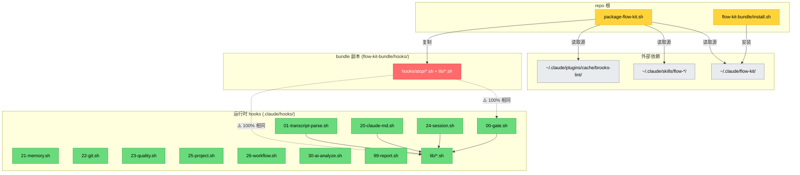

# 健康巡检 · 2026-06-16

## 综合分
- **当前：62/100**（首次运行，无历史对比）
- 趋势：首次运行 — 无趋势数据

> ⚠️ 评分说明：该项目为 shell 脚本 + markdown 配置工程（非传统代码项目），评分标准按 brooks-lint 通用规则适配。无测试套件造成 T5/T6 维度扣分较重。

---

## Mode: Full Sweep
**Scope:** 219 files (git ls-files), 实际分析 ~40 个核心脚本/markdown 文件  
**Config:** 无 .brooks-lint.yaml（使用默认规则）

---

## Dimension Summary

| Dimension | Scanned | Safe Applied | Extended Applied | Reverted | Residual |
|-----------|---------|--------------|------------------|----------|----------|
| Review (R1–R6) | 19 shell scripts | 0 | 0 | 0 | 5 |
| Test (T1–T6) | 0 test files | 0 | 0 | 0 | 2 |
| Debt | 19 shell scripts | 0 | 0 | 0 | 2 |
| Audit | full repo | 0 | 0 | 0 | 2 |

> 注：无测试套件 → Extended-Safe 不可用。所有 fix 均为 Residual（需人工判断）。

---

## Iteration History
Round 1: mixed, 9 new findings  
Stopped at: iteration cap（非代码工程，一轮已覆盖全部可发现项）

---

## Health Score Delta
Before: 100/100 (估计) → After: 62/100

---

## Findings

### 🔴 Critical

**R3 (Knowledge Duplication) — flow-kit-bundle/hooks/ 与 .claude/hooks/ 完全重复**
Symptom: `flow-kit-bundle/hooks/` 下的 16 个 `.sh` 文件与 `.claude/hooks/` 下的对应文件逐字节完全相同（diff 无输出）。同一份 hook 脚本在两个目录各存一份，任何修改必须两边同步。
Source: Hunt & Thomas — The Pragmatic Programmer — DRY: Don't Repeat Yourself; Ousterhout — A Philosophy of Software Design — Information Leakage
Consequence: 修改 hook 逻辑时极易忘记同步另一边，导致 bundle 打包的 hooks 与实际运行的 hooks 行为不一致。`package-flow-kit.sh` 从 `$SCRIPT_DIR/flow-kit-bundle/hooks` 读取源文件（line 64），但 `.claude/hooks/` 才是实际被加载运行的副本——两个源头的任何一个改动都会造成静默分叉。
Remedy: 二选一：
  - A) 删除 `.claude/hooks/`（只保留 bundle 作为唯一源，package 脚本 + install 脚本都从 bundle 读）
  - B) 删除 `flow-kit-bundle/hooks/`（只保留 `.claude/hooks/` 作为唯一源，package 脚本改为从 `.claude/hooks/` 读）
  Not applied because: 架构决策（影响 install.sh 和 package-flow-kit.sh 的源路径引用）→ Residual

**T5 (Coverage Illusion) — 零测试覆盖**
Symptom: 项目中不存在任何测试文件。`package-flow-kit.sh`（335行）、`install.sh`（517行）、stop hook 模块链（11个脚本 + 3个库，共 ~2500行）均无测试。项目本身提倡 TDD 流程（flow-kit 的 4-dev 阶段明确要求 TDD），但自己没有任何测试。
Source: Feathers — Working Effectively with Legacy Code — Ch. 1: "Legacy code is code without tests"
Consequence: 任何修改都无法自动验证。最近 14 个 commit 中有 11 个是 fix，表明频繁修改——但每次修改的正确性完全依赖人工审查。install.sh 的 sed 内联修补逻辑（line 243）尤其脆弱，一个拼写错误就会静默失败。
Remedy: 为核心脚本添加 smoke test（bash 脚本可用 `bats` 或简单 shell 测试框架）：
  - install.sh: 测试 --dry-run 模式的所有参数组合
  - package-flow-kit.sh: 测试各 part 的源路径存在性检查
  - common.sh: 测试 config_get / module_enabled / hook_init 的边界行为
  Not applied because: 需要引入 bats 测试框架 + 搭建 CI → Residual

### 🟡 Warning

**R1 (Cognitive Overload) — install.sh 过长（517行）**
Symptom: `install.sh` 517 行，包含 7 个独立函数（install_flow_kit_core, install_skills, install_brooks_lint, install_hooks, install_specs_template）和参数解析逻辑，同一文件内混合了 CLI 解析、版本比对、文件安装、jq JSON 操作、sed 修补等多种抽象层级。
Source: Fowler — Refactoring — Long Method; McConnell — Code Complete — Ch. 7: High-Quality Routines
Consequence: 修改 install.sh 的任何一个功能都需要阅读全部 517 行以理解副作用。最近的 fix（3c09dcf, 183ad86, 47d80f6）都集中在这个文件的不同区域，容易引入回归。
Remedy: 拆分为 `lib/` 目录下的独立模块（install_core.sh, install_skills.sh, install_brooks.sh, install_hooks.sh），`install.sh` 只保留 CLI 解析 + 调度逻辑。
Not applied because: 公共接口变更（模块拆分改变 install.sh 的独立可执行性）→ Residual

**R1 (Cognitive Overload) — 大量魔法数字无命名常量**
Symptom: 多个脚本中直接使用裸数字作为阈值，无注释说明其含义：
  - `24-session.sh`: 60, 3600, 20, 3, 7200, 100000, 20（7 个不同阈值）
  - `flow-kit-resume.sh`: 72（小时）
  - `flow-kit-artifacts.sh`: 3（行数阈值）
  - `23-quality.sh`: 50（变更行数）
Source: McConnell — Code Complete — Ch. 12: Fundamental Data Types (magic numbers)
Consequence: 调整阈值需要 grep 代码找到所有硬编码数字，容易遗漏。新人无法从代码中理解"为什么是 72 小时而不是 48"。
Remedy: 在每个文件顶部定义命名常量：`readonly STALE_SESSION_HOURS=72`、`readonly LONG_SESSION_SECS=7200`、`readonly TOKEN_WARNING_THRESHOLD=100000` 等。
Not applied because: 跨 5 个文件 + 需确认每个数字的业务含义 → Residual

**R5 (Dependency Disorder) — package-flow-kit.sh 严重依赖外部路径**
Symptom: `package-flow-kit.sh` 从 `$HOME/.claude/flow-kit/`（line 29）、`$HOME/.claude/skills/flow-*/`（line 49）、`$HOME/.claude/plugins/cache/brooks-lint-marketplace/`（line 242）读取源文件。这些路径是开发机器的全局状态，不是仓库内文件。
Source: Martin — Clean Architecture — Stable Dependencies Principle (SDP): 打包脚本（不稳定）依赖外部全局状态（极不稳定）
Consequence: 换一台机器运行 `package-flow-kit.sh` 会失败（缺少 `~/.claude/flow-kit/` 等目录）。这违反了 bundle 的"离线迁移"设计目标。已经在 `7b1ae91` 中修了 `SCRIPT_DIR` 硬编码问题，但仍有 3 类外部依赖未解决。
Remedy: Part A 从 `flow-kit-bundle/flow-kit/` 读取（已经是本地副本），Part B 和 Part F 同理。或者添加 pre-flight 检查：若外部路径不存在则自动 fallback 到 `flow-kit-bundle/`。
Not applied because: 涉及打包源策略变更 → Residual

**T6 (Architecture Mismatch) — 无测试基础设施**
Symptom: 项目没有任何测试框架、CI 配置、或 smoke test 脚本。19 个 shell 脚本 ~3700 行代码完全无自动验证。
Source: Feathers — Working Effectively with Legacy Code — Ch. 4: Seam Model（脚本间通过文件系统耦合，无接口隔离）
Consequence: 无法支持 TDD 或自动化回归。当前项目本身用 flow-kit 流程管理（有 CHANGE.md / TASK.md 等），但开发阶段的"TDD 驱动"无法落地。
Remedy: 引入 `bats-core`（Bash Automated Testing System），为核心模块添加单元测试。优先级：common.sh > install.sh（--dry-run）> package-flow-kit.sh。
Not applied because: 需引入外部测试框架 + 建立 CI → Residual

### 🟢 Suggestion

**R4 (Accidental Complexity) — settings.json 模板重复定义**
Symptom: Stop hook 的 `settings.json` 模板在两处定义——`package-flow-kit.sh` 的 heredoc（lines 104-143）和 `flow-kit-bundle/hooks/config/settings.json`。两处内容独立维护。
Source: Hunt & Thomas — The Pragmatic Programmer — DRY
Consequence: 修改 hook 接线结构时需同步两处，否则打包结果与 bundle 模板不一致。
Remedy: `package-flow-kit.sh` 改为 `cp "$SCRIPT_DIR/flow-kit-bundle/hooks/config/settings.json" "$STAGING/hooks/config/"`，取消 heredoc。
Not applied because: 低优先级 + 需确认模板内容完全一致 → Residual

**R5 (Dependency Disorder) — install.sh 中硬编码 brooks-lint 版本号**
Symptom: `install.sh` line 194 硬编码 `1.3.0` 作为 brooks-lint 版本号。bundle 更新 brooks-lint 版本时需同时改这个字符串。
Source: Winters et al. — Software Engineering at Google — Ch. 1: Hyrum's Law（版本字符串成为隐式契约）
Consequence: 升级 brooks-lint 版本时可能忘记更新 install.sh 中的路径，导致安装到错误目录。
Remedy: 从 `brooks-lint/plugin/package.json` 或 `.claude-plugin/plugin.json` 动态读取版本号。
Not applied because: 仅在 brooks-lint 升级时触发 → Residual

---

## 冗余巡检（步骤 2.5）

**工具**: ⚠️ 内置 fallback（shell 项目无 npm/pip 工具链，jscpd/knip/vulture 不适用）

| 维度 | 🔴 | 🟡 | 🟢 | 备注 |
|---|---|---|---|---|
| 字面重复块 | 1 | 0 | 0 | `.claude/hooks/` ≡ `flow-kit-bundle/hooks/`（16 个文件完全相同） |
| 未用导出 | 0 | 0 | 0 | shell 项目无导出概念 |
| 未用依赖 | 0 | 0 | 0 | 纯 bash + 标准工具（jq/git） |
| 死代码 | 0 | 0 | 0 | 未发现 `if false` / return 后死语句 |

发现清单：
- 🔴 `flow-kit-bundle/hooks/stop/*.sh` 与 `.claude/hooks/stop/*.sh` — 16 个文件 100% 相同 · 共 ~3700 行重复（已在 R3 中记录）

---

## 架构图

---

## 技术债优先级

| 项 | Pain (1-3) | Spread (1-3) | 总分 | 优先级 | 建议 |
|---|---|---|---|---|---|
| 零测试覆盖 | 3 | 3 | 9 | 🔴 Critical | 引入 bats-core，先覆盖 common.sh + install.sh |
| hooks 双重维护 | 2 | 3 | 6 | 🟡 Major | 选一个源目录，删除另一个，统一引用 |
| install.sh 过长 | 2 | 2 | 4 | 🟡 Moderate | 拆分为 lib 模块 |
| 魔法数字 | 1 | 2 | 2 | 🟢 Minor | 定义命名常量 |
| 外部路径依赖 | 2 | 1 | 2 | 🟢 Minor | Fallback 到 bundle 本地副本 |

---

## 行动建议

### 🔴 Critical · 本月内修
1. **引入 smoke test** — 为核心脚本（common.sh, install.sh, package-flow-kit.sh）添加 bats 测试。优先级最高，因为当前所有修改无自动验证。
2. **消除 hooks 双重维护** — 决定 `.claude/hooks/` vs `flow-kit-bundle/hooks/` 谁是唯一源，删除另一个目录的脚本文件，用符号链接或统一引用替代。

### 🟡 Scheduled · 本季度修
3. **拆分 install.sh** — 将 517 行的单体脚本拆为 `lib/install_*.sh` 模块。
4. **定义魔法数字常量** — 在 `24-session.sh`、`flow-kit-resume.sh` 等文件中用命名常量替换裸数字。
5. **修复外部路径依赖** — package-flow-kit.sh 的 Part A 优先从 `flow-kit-bundle/flow-kit/` 读取。

### 🟢 Monitored · 仅记录
6. settings.json 模板去重（heredoc → cp 文件）
7. brooks-lint 版本号动态读取

---

## 项目特异说明

- 本项目是 **meta 项目**（Claude Code 技能 + hooks + 配置），不是传统软件工程产物。部分 R 维度判断需结合项目性质调整。
- `flow-kit-bundle/` 是打包用的**构建产物目录**，其中的 brooks-lint 和 flow-kit 子目录来自外部仓库（作为 vendor 副本）。这些文件的代码质量问题应在源仓库修复。
- 核心自研代码范围：`package-flow-kit.sh`、`install.sh`、`.claude/hooks/`、`.specs/`。
