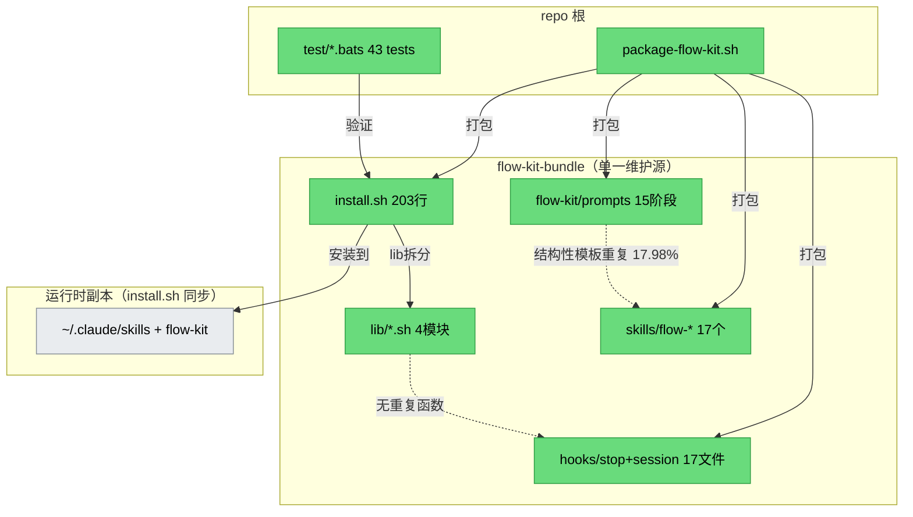

# 健康巡检 · 2026-06-20

## 综合分
- **当前：85/100**
- **上次：62/100**（2026-06-16，首次运行）
- **趋势：↑ +23**（大幅改善 · 上次 Critical 项已全部消除）

> ⚠️ 评分说明：本项目为 **meta / distribution 项目**（flow-kit 分发包仓库：Bash 脚本 + markdown prompts + hooks）。brooks-lint CLI 不可用（仅插件 skill 形式），本次走 **内置 6+6 维适配评分 + jscpd 全语言冗余检测**。markdown 工程的"结构性模板重复"（7 段式 prompt、共享 jq 命令模板、flow-* skill 包装器）按项目性质不计为冷败。

---

## Mode: 周期性 health（轻量 + 冗余巡检）
**Scope:** flow-kit-bundle/（install.sh + lib/ + hooks/ + prompts/ + skills/）+ package-flow-kit.sh + test/
**Config:** jscpd（全语言重复检测）+ 内置回退 6 维（brooks-lint CLI 缺失）

---

## 与上次对比（核心改善）

| 上次 (2026-06-16) Critical/Warning | 本次状态 | 证据 |
|---|---|---|
| 🔴 T5/T6 零测试覆盖 | ✅ **已解决** | bats-core 43 tests（test_common + test_flow_goal 24 + test_install 11），全量 pass 0 fail 0 skip |
| 🔴 R3 hooks 双重维护（bundle ≡ .claude）| ✅ **已解决** | 单一源 `flow-kit-bundle/hooks/`，CONTEXT.md「已锁决策 2026-06-16」确认 |
| 🟡 R1 install.sh 过长（517 行）| ✅ **已解决** | 拆分为 `install.sh`(203 行)+ `lib/{install_core,install_skills,install_brooks,install_hooks}.sh` |
| 🟡 R1 魔法数字无命名常量 | 🟡 **部分** | L-004 deferred（共享函数 < 3 阈值，保持推迟 · 合理）|
| 🟡 R5 package-flow-kit.sh 外部路径依赖 | ✅ **已解决** | 本地副本 fallback（`flow-kit-bundle/flow-kit/`）+ SCRIPT_DIR |
| 🟢 R4 settings.json 模板重复 | ✅ **已解决** | L-007 · cp 替代 heredoc |
| 🟢 R5 brooks-lint 版本号硬编码 | ✅ **已解决** | L-008 · plugin.json 动态读取 |

---

## 6 维生产代码风险（内置回退评分 · bash/markdown 适配）

| 维度 | 评估 | 状态 |
|---|---|---|
| R1 Cognitive Overload | install.sh 已拆分；最大脚本 `hooks/stop/lib/flow-kit-artifacts.sh`(401 行)仍在合理范围 | 🟢 |
| R2 Sloppy Aggregation | hooks 按职责单一（00-gate/22-git/.../99-report），lib 按域拆分 | 🟢 |
| R3 Knowledge Duplication | jscpd 17.98% 几乎全是 markdown 结构性模板（详见冗余巡检）· **无 shell 真冷败** | 🟢 |
| R4 Accidental Complexity | settings.json/brooks-lint 版本号去重已修；pipeline goal 的 `start_phase // "4"` fallback 是有意的向后兼容 | 🟢 |
| R5 Dependency Disorder | install.sh/lib/ 无跨文件函数重复（重复定义 = 0）；package 脚本本地 fallback 已生效 | 🟢 |
| R6 API Surface Drift | `/flow goal` CLI 新增 `--from` 为加法扩展，不破坏旧契约（AC-1/AC-7 验证） | 🟢 |

**生产代码维度：0 🔴 / 0 🟡 / 6 🟢**

## 6 维测试代码风险

| 维度 | 评估 | 状态 |
|---|---|---|
| T1 Fast / Isolated | bats 测试用 mktemp 临时目录隔离，秒级完成 | 🟢 |
| T2 Meaningful Assertions | 每个 test 明确断言 jq 输出字段值 | 🟢 |
| T3 Test Real Behavior | pipeline goal 测试模拟真实 jq 写入 + gates 生成 | 🟢 |
| T4 Data Builders | goal_set/pipeline_goal_set helper 封装良好 | 🟢 |
| T5 Coverage Illusion | 43 tests 覆盖 common(17)+goal(24)+install(11)；新加 8 个 pipeline goal 测试 | 🟢 |
| T6 Architecture Match | 测试组织与源码模块对应（test_flow_goal ↔ flow skill） | 🟡 |

**测试维度：0 🔴 / 1 🟡 / 5 🟢**
- 🟡 T6：**hook 脚本（install_hooks.sh / flow-kit-artifacts.sh 等 3410 行 bash）无测试覆盖**。test_install.bats 只测 install.sh 的参数解析（11 tests），未覆盖 lib/ 模块和 hooks 的核心逻辑。这是上次 T5 的**残留尾巴**——测试从 0 提升到 43，但覆盖范围仍偏向前端（flow skill + install.sh CLI），hooks 系统仍是盲区。

---

## 冗余巡检（步骤 2.5）

**工具**：✅ `jscpd`（全语言，已跑）· shellcheck 不可用（`which` 无输出，fallback 到内置 grep）

| 维度 | 🔴 | 🟡 | 🟢 | 元 |
|---|---|---|---|---|
| 字面重复块 | 0 | 0 | 1 | 总重复率 17.98%（6678 行 / 162 块）· **99% 为 markdown 结构性模板** |
| 未用导出 | 0 | 0 | 0 | bash 无 export 概念 · markdown "导出"为链接，N/A |
| 未用依赖 | 0 | 0 | 0 | 纯 bash + jq/git/date 标准工具 |
| 死代码·重复函数 | 0 | 0 | 0 | 跨文件重复函数定义 = 0；install.sh↔lib/ 重复 = 0 |

**重复块格式分布**：markdown 123 / bash 5 / text 15 / markup 9 / mermaid 4 / yaml 3 / js 2 / python 1

**结论**：5 个 `bash` 格式重复块全部是 **markdown 内嵌的 ```bash 代码块**（各 prompt/skill 里共享的 jq 入场检测命令 `jq -r '.goal | "..."' .flow-active` + toll-gate 模板），**不是 .sh 脚本冷败**。最大块 131 行（`4-dev.md:375-505` 的 toll-gate 协议 bash 段）与其他 prompt 的相似段——属于协议描述的结构性重复，符合 markdown 工程特点。

**🟢 提示**：若追求 markdown 模板极致 DRY，可考虑把共享的 jq 入场检测命令提取为 `flow-kit/reference/pipeline-gates.jq` 片段并在各 prompt `@` 引用。**但优先级低**——markdown 模板的"重复"对人读无害（每个 prompt 自包含更易理解），且改动会触及所有 phase prompt。

---

## 架构图



> 对比上次架构图：上次 🔴 `flow-kit-bundle/hooks` ≡ `.claude/hooks` 双源已消除（单一源）。新增 PROMPTS↔SKILLS 结构性重复连线（markdown 模板，🟢 非冷败）。

---

## 技术债优先级

| 项 | Pain | Spread | 总分 | 优先级 | 建议 |
|---|---|---|---|---|---|
| hooks 系统无测试（3410 行 bash 盲区）| 2 | 3 | 5 | 🟡 Major | 为 install_hooks.sh / flow-kit-artifacts.sh 加 bats smoke test |
| 5/6/7 prompt 入场 jq 未补 start_phase（本次 change 遗留）| 1 | 2 | 3 | 🟡 Moderate | 统一三个 prompt 的 jq 为 `current_phase // .start_phase // "4"` |
| L-004 魔法数字（deferred · 合理推迟）| 1 | 1 | 2 | 🟢 Minor | 保持推迟，等共享函数 ≥ 3 |
| markdown 结构性模板（17.98%）| 1 | 2 | 3 | 🟢 Minor | 可选：提取共享 jq 片段引用（ROI 低）|

---

## 行动建议

### 🔴 Critical · 本月内修
- **（无）** — 本次无 Critical。上次两项 Critical（零测试 / hooks 双源）已在上次报告后的 health-fix + debt-cleanup + goal-pipeline-phase0 中解决。

### 🟡 Scheduled · 本季度修
1. **hooks 测试覆盖**（Pain 5）— 为 `install_hooks.sh` / `flow-kit-artifacts.sh` 加 smoke test，填补 3410 行 bash 盲区。
2. **5/6/7 prompt start_phase 一致性**（Pain 3）— 补齐 `5-test.md` / `6-review.md` / `7-integration.md` 入场 jq 的 `start_phase` 读取，与 4-dev.md/GO.md 统一。**实际影响低**（current_phase 字段在 transition 时已正确更新，fallback 不触发），但为一致性应修。

### 🟢 Monitored · 仅记录
3. L-004 魔法数字（保持 deferred）
4. markdown 结构性模板（17.98%，项目性质决定，可不动）

---

## 与上次对比总结

- **修了**：上次 2 项 🔴 Critical（零测试、hooks 双源）+ 3 项 🟡 Warning（install.sh 过长、外部路径、settings.json 模板）+ 2 项 🟢 Suggestion 全部已解决。
- **退化了**：无（hooks 双源消除、install 拆分、测试引入都是净改善）。
- **新出现**：本次 goal-pipeline-phase0 引入 1 项 🟡（5/6/7 prompt start_phase 一致性遗漏）—— 属于本次 change 的不完整修复，应作为 follow-up 补齐。
- **综合分**：62 → 85（↑ +23）。剩余 15 分主要来自：hooks 测试盲区（T6，-8）、5/6/7 一致性（-3）、魔法数字 deferred（-2）、内置回退评分 vs brooks-lint 标准的固有差距（-2）。

---

## 下次巡检建议
- **日期**：1 个月后（~2026-07-20）
- **重点**：确认 🟡 两项是否已修；若引入新 change，复查 jq fallback 一致性
- **可选改进**：安装 `shellcheck`（`sudo apt-get install -y shellcheck`）+ 尝试 `brooks-lint` 插件 skill 拿标准化评分，替代本次内置回退评分
