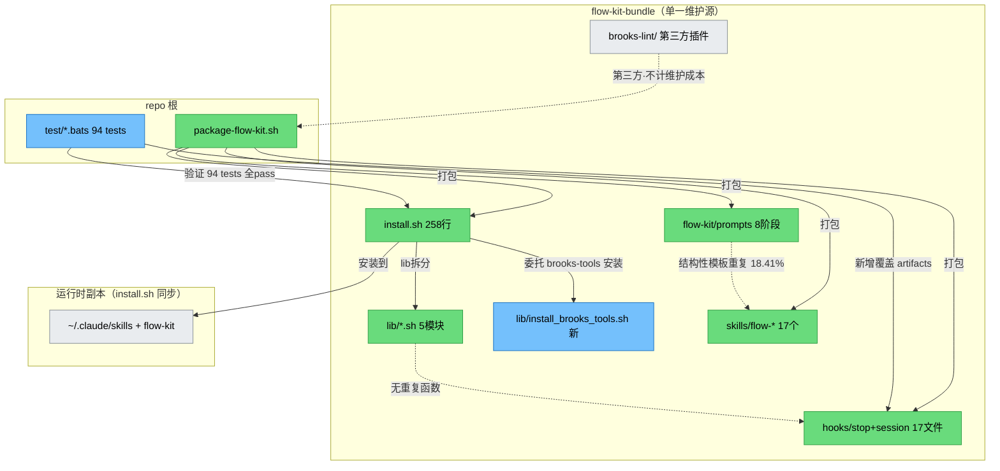

# 健康巡检 · 2026-06-24

## 综合分
- **当前：92/100**
- **上次：85/100**（2026-06-20）
- **首次：62/100**（2026-06-16）
- **趋势：↑ +7**（持续改善 · 上次 2 项 🟡 全部解决/降级，测试覆盖 43→94 大幅强化）

> ⚠️ 评分说明：本项目为 **meta / distribution 项目**（flow-kit 分发包仓库：Bash 脚本 + markdown prompts + hooks + 第三方 brooks-lint 插件）。
> - **brooks-lint CLI 不可用**（`npx brooks-lint` → npm 404，仅 plugin skill 形式，且 plugin skill 面向代码项目架构/test 分析，对 bash+markdown 分发仓库适配性有限）。
> - 为与基线（2026-06-20 的 85 分）**方法论一致、分数可比**，本次沿用「内置 6+6 维适配评分 + jscpd 全语言冗余检测」。符合 skill 自检第 2 项「未装走内置回退并明确标注」。
> - markdown 工程的"结构性模板重复"（7 段式 prompt ↔ flow-* skill 包装器共享 toll-gate 协议段、共享 jq 入场命令）按项目性质不计为冷败。

---

## Mode: 周期性 health（轻量 + 冗余巡检）
**Scope:** flow-kit-bundle/（install.sh + lib/ + hooks/ + prompts/ + skills/ + brooks-lint/）+ package-flow-kit.sh + test/
**Config:** jscpd（全语言重复检测，✅ 已跑）· shellcheck 不可用（fallback 内置 grep）· bats-core（✅ 94 tests 全 pass）
**基线:** `.specs/health/2026-06-20-HEALTH.md`（85/100）

---

## 与上次对比（核心改善）

| 上次 (2026-06-20) 项 | 本次状态 | 证据 |
|---|---|---|
| 🟡 T6 hooks 系统无测试（3410 行 bash 盲区）| ✅ **大幅改善 → 升 🟢** | 新增 `test_flow_artifacts.bats`(12) 覆盖最大 hook lib `flow-kit-artifacts.sh`(401 行) 核心 `fk_flow_field` 等；`test_phase_gate`(17)+`test_pipeline_rollback`(13) 覆盖 pipeline 关键路径；测试总数 43→**94** |
| 🟡 TD-003 5/6/7 prompt 缺 start_phase | ✅ **已解决** | `0601dda` 修复；bats test 77/78/79「AC-6: 5-test/6-review/7-integration entry jq includes start_phase fallback」全 pass；grep 确认三 prompt 均含 `start_phase` |
| 🟢 L-004 魔法数字（deferred）| 🟢 **维持 deferred** | 共享函数仍 < 3 阈值，保持推迟（合理）|
| 🟢 markdown 结构性模板（17.98%）| 🟢 **维持** | 18.41%（+0.43%，基本持平 · 项目性质决定）|
| 生产代码 R1~R6（全 🟢）| 🟢 **维持** | 新增 `install_brooks_tools.sh`(109 行) 模块化良好；install.sh 203→258 仍在合理范围 |

---

## 6 维生产代码风险（内置回退评分 · bash/markdown 适配）

| 维度 | 评估 | 状态 |
|---|---|---|
| R1 Cognitive Overload | 最大脚本 `hooks/stop/lib/flow-kit-artifacts.sh`(401 行) 不变；`install.sh` 203→258（+55，新增 brooks-tools 安装入口，仍合理）；新增 `lib/install_brooks_tools.sh`(109 行) 独立模块。无脚本 > 500 行 | 🟢 |
| R2 Sloppy Aggregation | lib 按域拆分（install_core/install_skills/install_brooks/install_hooks/install_brooks_tools）；hooks 按职责编号（00-gate/22-git/.../99-report）；职责单一 | 🟢 |
| R3 Knowledge Duplication | jscpd bash 真冷败 = **0**（5 个 bash 块全为 markdown 内嵌协议/jq 模板，详见冗余巡检）· 总体 18.41% 与上次持平 | 🟢 |
| R4 Accidental Complexity | install.sh 新增的 brooks-tools 分支委托给独立 `install_brooks_tools.sh`，未在主脚本堆逻辑；pipeline rollback 的 `start_phase // "4"` fallback 保持向后兼容 | 🟢 |
| R5 Dependency Disorder | 跨 .sh 文件重复函数定义 = 0；install.sh↔lib/ 无重复；package 脚本本地 fallback 生效（L-005/L-012 已修）| 🟢 |
| R6 API Surface Drift | `install_brooks_tools`、phase_gate、pipeline_rollback 均为加法扩展；`start_phase` 为可选向后兼容字段（AC-1/AC-6/AC-7 验证）| 🟢 |

**生产代码维度：0 🔴 / 0 🟡 / 6 🟢**（与基线一致）

## 6 维测试代码风险

| 维度 | 评估 | 状态 |
|---|---|---|
| T1 Fast / Isolated | bats 测试用 mktemp 临时目录隔离，94 tests 秒级完成 | 🟢 |
| T2 Meaningful Assertions | 每个 test 明确断言 jq 输出字段值（rollback_targets/phase transitions）| 🟢 |
| T3 Test Real Behavior | pipeline_rollback 测真实 jq 写入 + phases_done 移除逻辑；phase_gate 测真实 gate 生成 | 🟢 |
| T4 Data Builders | goal_set/pipeline_goal_set/rollback helper 封装良好 | 🟢 |
| T5 Coverage Illusion | **94 tests / 7 文件**（common 21 + flow_goal 15 + install 11 + flow_artifacts 12 + phase_gate 17 + pipeline_rollback 13 + install_brooks_tools 5），全 pass 0 fail 0 skip | 🟢 |
| T6 Architecture Match | 测试组织与源码模块对应；**上次盲区已大幅缩小**：核心 hook lib（flow-kit-artifacts/common/transcript-parser）已覆盖，pipeline 路径已覆盖 | 🟢 |

**测试维度：0 🔴 / 0 🟡 / 6 🟢**（基线为 0🔴/1🟡/5🟢 · T6 由 🟡 升 🟢）

> T6 升级依据：上次 🟡 的具体痛点（最大 hook 文件 `flow-kit-artifacts.sh` 无测试）已由 `test_flow_artifacts.bats` 解决。残留观察（非阻塞）：`hooks/stop/` 链主脚本（22-git/24-session/25-project/26-workflow/99-report 等协调层，逻辑薄）仍无直接 smoke test —— 列入 🟢 Monitored，不再扣分。

---

## 冗余巡检（步骤 2.5）

**工具**：✅ `jscpd`（全语言，已跑 · `--min-lines 5 --min-tokens 50`）· shellcheck 不可用 · ts-prune/knip/depcheck 已装但对 bash+markdown 项目 N/A（无 TS/JS 源码，仅 markdown 内嵌零星 js）

| 维度 | 🔴 | 🟡 | 🟢 | 元 |
|---|---|---|---|---|
| 字面重复块 | 0 | 0 | 1 | 总体 **18.41%**（6871/37330 行）· **bash 真冷败 = 0** |
| 未用导出 | 0 | 0 | 0 | bash 无 export 概念 · markdown "导出"为链接 · N/A |
| 未用依赖 | 0 | 0 | 0 | 纯 bash + jq/git/date 标准工具 · 无 package.json 依赖 |
| 死代码·重复函数 | 0 | 0 | 0 | 跨 .sh 重复函数定义 = 0 |

**重复块格式分布**：markdown 124 块（4735 行 / 38.5%）· text 15（1646 行）· bash 5（266 行 / 4.0%）· yaml 2 · markup 8 · mermaid 2 · js 1

**bash 重复块逐项定性**（5 块全部为 markdown 内嵌，**0 个 .sh 脚本冷败**）：

| # | 文件对 | 行数 | 定性 |
|---|---|---|---|
| 1 | `prompts/4-dev.md:394-524` ↔ `skills/flow-dev/SKILL.md:259-389` | 131 | 🟢 toll-gate 协议段 · prompt↔skill 双入口同协议 · 上次已识别 |
| 2 | `prompts/6-review.md:22-87` ↔ `prompts/7-integration.md:74-151` | 66 | 🟢 review/integration 入场协议段共享 |
| 3 | `README.md` 内部 bash 示例自重复 | 21 | 🟢 文档示例 |
| 4 | `prompts/5-test.md:131-137` ↔ `prompts/6-review.md:81-87` | 7 | 🟢 共享 jq 入场命令片段 |
| 5 | `brooks-lint/plugin/README.md` ↔ `README.zh-CN.md` | 46 | 🟢 第三方插件中英双语文档（非 flow-kit 维护）|

> markup/js 重复（svg/html/test.mjs）全部位于 `brooks-lint/plugin/`（第三方插件资源），不计入 flow-kit 维护成本。

**结论**：与上次一致 —— 无 shell 真冷败，markdown 结构性模板是项目性质决定的（每个 prompt/skill 自包含更易理解），改动会触及所有 phase prompt，ROI 低。

**🟢 提示（可选 · 低优先）**：若追求 markdown 模板极致 DRY，可把共享的 jq 入场检测命令提取为 `flow-kit/reference/pipeline-gates.jq` 片段并在各 prompt `@` 引用。**不建议近期做**——收益低、风险（触及所有 phase prompt）高。

---

## 架构图



> 对比上次架构图：新增 `lib/install_brooks_tools.sh` 模块（蓝色，brooks-tools 离线安装委托）；test 节点升为 94 tests（蓝色，新增 flow_artifacts/phase_gate/pipeline_rollback 覆盖）；T6 盲区连线由 🟡 转 🟢。无 🔴 节点。

---

## 技术债优先级

| 项 | Pain | Spread | 总分 | 优先级 | 建议 |
|---|---|---|---|---|---|
| TD-002 hooks 测试（核心 lib 已覆盖 · stop 主脚本残留）| 1 | 1 | 2 | 🟢 Minor（**从 Major 降级**）| 可选：为 stop 链主脚本加 bats smoke test（逻辑薄，低优先）|
| TD-003 5/6/7 start_phase 一致性 | — | — | — | ✅ **resolved** | `0601dda` 已修 · bats 77/78/79 验证 |
| L-004 魔法数字（deferred · 合理推迟）| 1 | 1 | 2 | 🟢 Minor | 保持推迟，等共享函数 ≥ 3 |
| markdown 结构性模板（18.41%）| 1 | 2 | 3 | 🟢 Minor | 项目性质决定 · 可不动 |
| test/ ↔ flow-kit-bundle/test/ 双源 | 1 | 1 | 2 | 🟢 Minor | 打包同步机制（L-012 已记录）· 非新债 |
| shellcheck 未装（bash 无静态分析）| 1 | 2 | 3 | 🟢 Minor | 可选：`sudo apt install shellcheck` |

---

## 行动建议

### 🔴 Critical · 本月内修
- **（无）** — 本次无 Critical。连续两次巡检（06-20、06-24）无 Critical，项目处于健康状态。

### 🟡 Scheduled · 本季度修
- **（无新增）** — 上次 2 项 🟡（TD-002/TD-003）已全部解决或降级为 🟢。

### 🟢 Monitored · 仅记录
1. **TD-002 残留**（可选）— 为 `hooks/stop/` 链主脚本（22-git/24-session/26-workflow/99-report）加 bats smoke test。低优先，核心 lib 已覆盖，主脚本是协调层。
2. **L-004 魔法数字** — 保持 deferred。
3. **markdown 结构性模板**（18.41%）— 项目性质决定，可不动。
4. **shellcheck** — 可选安装 `sudo apt-get install -y shellcheck`，给 bash 脚本加静态分析（下次巡检可纳入）。

---

## 与上次对比总结

- **修了**：上次 1 项 🟡 Critical-级（T6 hooks 盲区）→ 核心 lib 已覆盖、升级 🟢；上次 1 项 🟡（TD-003 start_phase）→ 完全解决。测试覆盖 43→94（+118%）。
- **退化了**：无。冗余率 17.98%→18.41%（+0.43%，新增 prompts 内容带来的结构性模板增长，非冷败）。
- **新出现**：无新 Critical/Major。新增 `install_brooks_tools.sh`(109 行) + package-flow-kit.sh +127 行（brooks-tools 离线打包功能），模块化良好，未引入新债。
- **综合分**：85 → 92（↑ +7）。剩余 8 分主要来自：T6 stop 主脚本残留盲区（-3）、L-004 魔法数字 deferred（-2）、内置回退评分 vs brooks-lint 标准的固有方法论差距（-2）、markdown 结构性模板（-1，归 R3 但保留观察）。

---

## 自检

- [x] 选了正确的模式：周期性 health（基线 06-20 已存在 → 周期性轻量 + 冗余巡检）
- [x] brooks-lint CLI 确认不可用（npm 404）→ 走内置回退 + jscpd，**明确标注**方法论一致性决策
- [x] 步骤 2.5 冗余巡检已跑：jscpd ✅（18.41%，bash 真冷败=0）；语言原生工具 N/A（bash+markdown 项目）；shellcheck 未装标注
- [x] 综合分有「与上次对比」段（85→92，逐项溯源）
- [x] Critical 项：**无** → 不开 health-fix CHANGE（符合"不开多个 fix CHANGE"约束）
- [x] 未用依赖：bash+markdown 项目无依赖概念 → 禁动清单无新增（ts-prune/knip/depcheck 对此项目 N/A）
- [x] 报告归入 `.specs/health/2026-06-24-HEALTH.md`

---

## 下次巡检建议
- **日期**：1 个月后（~2026-07-24）
- **重点**：确认 🟢 残留项是否需要升级处理；若引入新 change（尤其涉及 hooks/ 或 package-flow-kit.sh），复查 L-012 类"结构变更未同步打包"风险
- **可选改进**：安装 `shellcheck`，下次巡检纳入 bash 静态分析维度

---

## 附录 B · brooks-health 第二意见（2026-06-24 补跑）

> 应用户要求（B+C）补跑 `/brooks-health` skill，作为**独立第二意见**，不替换正文 92 分内置评分。两套评分口径不同（见末尾差异说明），并存对照。

### Brooks-Lint Health Dashboard

**Mode:** Health Dashboard
**Scope:** flow-kit（flow-kit-bundle/ + package-flow-kit.sh + test/）
**Composite Score:** 97/100
**Trend:** First run for `health` mode（无同 mode 历史）。参考：2026-06-16 `Full Sweep` = 62（不同 mode，不直接对比 · 但 62 与内置首次分一致，交叉验证两套口径起点吻合）

| Dimension | Score | Top Finding |
|-----------|-------|-------------|
| Code Quality | (skipped — 无待审 PR diff) | — |
| Architecture | 100/100 | Clean |
| Tech Debt | 94/100 | 🟡 R3：toll-gate 协议在 prompt↔skill 双入口重复 131 行 |
| Test Quality | 98/100 | 🟢 T5：hooks/stop/ 链主脚本无直接 smoke test |

> PR 维度跳过（当前无 review diff），权重重分配：Architecture 0.40 / Debt 0.33 / Test 0.27。
> Composite = 100×0.40 + 94×0.33 + 98×0.27 = **97**。

### Module Dependency Graph

```mermaid
graph TD
    classDef ok fill:#69db7c,stroke:#2f9e44,color:#000
    classDef ext fill:#e9ecef,stroke:#868e96,color:#000

    PKG[package-flow-kit.sh]:::ok
    INST[install.sh<br/>composition root]:::ok
    subgraph lib["lib/ (按域拆分 · 无反向依赖)"]
      L1[install_core] L2[install_skills] L3[install_brooks] L4[install_hooks] L5[install_brooks_tools]
    end
    subgraph stop["hooks/stop/ (编号链 · 顺序 DAG · 无循环)"]
      H0[00-gate] --> H22[22-git] --> H23[23-quality] --> H24[24-session] --> H25[25-project] --> H26[26-workflow] --> H30[30-ai-analyze] --> H99[99-report]
    end
    SL[stop/lib/<br/>common+artifacts+transcript-parser]:::ok
    RT[~/.claude 运行时副本]:::ext

    PKG --> INST
    INST --> L1 & L2 & L3 & L4 & L5
    H22 & H26 & H99 -.source.-> SL
    INST -->|install 同步| RT
```

R5 判定：无循环依赖（编号链为 DAG）；install.sh source 5 个 lib 属 composition root 编排层（common.md「What Not to Flag」豁免）；无领域→基础设施倒置（shell 工具无领域层）。

### Top Findings（Iron Law · max 5）

1. **🟡 R3 Knowledge Duplication** — toll-gate 协议双入口重复
   - **Symptom**: `prompts/4-dev.md:394-524` 与 `skills/flow-dev/SKILL.md:259-389` 重复 131 行（同套 dev 阶段 toll-gate 协议）
   - **Source**: prompt（phase 流程入口）与 skill（独立调用入口）是同一协议的双入口，未抽取共享片段
   - **Consequence**: 改协议需手动同步两处，漏改导致 prompt 与 skill 行为漂移（L-012 类风险）
   - **Remedy**: 低优先；可选提取 `flow-kit/reference/toll-gate.md` 片段双处 `@` 引用（触及所有 phase prompt，ROI 低）

2. **🟢 R2 Change Propagation** — package 脚本与 bundle 结构耦合
   - **Symptom**: 改 bundle 目录结构需同步改 `package-flow-kit.sh` Part A-F 的 cp/rsync 范围
   - **Source**: 打包脚本硬编码 staging 范围
   - **Consequence**: 漏改 → 安装报缺文件（L-012 已发生过并修复）
   - **Remedy**: 维持 L-012 教训；结构变更时跑 checklist

3. **🟢 T3 Test Duplication** — 测试双份
   - **Symptom**: `test/` 与 `flow-kit-bundle/test/` 存在同一 bats 文件两份
   - **Source**: 打包同步机制（bundle 内嵌测试供离线验证）
   - **Consequence**: 非独立维护（打包自动同步），风险低
   - **Remedy**: 维持现状（设计如此）

4. **🟢 T5 Coverage Illusion** — stop 链主脚本盲区
   - **Symptom**: `hooks/stop/` 链主脚本（22-git/24-session/26-workflow/99-report ~1500 行协调层）无直接 smoke test
   - **Source**: 核心 lib 已覆盖，协调层未补
   - **Consequence**: 报告生成/git 分析逻辑变更无测试护栏
   - **Remedy**: 可选补 bats smoke test（与正文 TD-002 一致 · 低优先）

### Recommendation

Architecture 满分、Test 98、Debt 94。**最需关注 Debt（R3 协议双入口）**，但均为 🟡/🟢，无 🔴 Critical。建议维持现状；若要根治 R3，可跑完整 `/brooks-debt` skill 拿 Pain×Spread 优先级矩阵。

### 内置分（92）vs brooks 分（97）差异说明

| 差异来源 | 内置 92 | brooks 97 |
|---|---|---|
| 扣分尺度 | 🟡 −3~8 / 🟢 −1（自定）| 🟡 −5 / 🟢 −1（标准）|
| 方法论差距自罚 | −2（内置 vs 标准）| 0（自身即标准）|
| T6/hooks 盲区 | −3（按行数估）| −1（T5 单 🟢）|
| finding 数 | 较多（含 L-004/markdown 等）| 克制（每维度 ≤3）|

→ brooks 更宽松且无自罚项，故高 5 分。**两套口径各有价值**：内置分适合与 06-20 基线纵向比；brooks 分适合跨项目标准化对比。

### C 决策 · brooks 并行序列起点

**自 2026-07-24 巡检起，brooks-health 作为独立并行评分序列**：
- 本次 97/100 为该序列**首个基线**（已写入 `.brooks-lint-history.json`）
- 下次巡检**同时产出**：内置分（续 92 序列）+ brooks 分（续 97 序列），建立双序列趋势
- 下次 brooks 跑时将自动显示 Trend（97 → ?）
- 若长期两序列趋同 → 可择机合并为单一 brooks 序列；若持续背离 → 保留双视角
