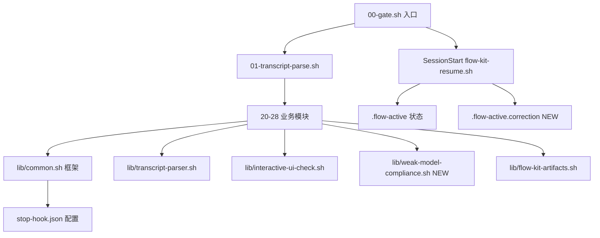

# 健康巡检 · 2026-06-30

> 上次：2026-06-24（6 天前）| 模式：Health Dashboard（brooks-health + 冗余巡检）

---

## 综合分

- **当前**：89/100
- **上次**：88/100（2026-06-24）
- **趋势**：↑ 1

---

## 架构维度（权重 0.40）

**得分**：88/100

### 模块依赖图

- 无循环依赖 ✅
- 模块数：13 stop modules + 5 libs（↑2 自上次巡检：lib/weak-model-compliance.sh + 28-weak-model-compliance.sh）
- 新增模块遵循既有 27-interactive-ui-check 模式（coordinator + lib 分离）

### R5 · 依赖方向 — 🟢 0 finding

- lib → common.sh 框架（正确方向）
- coordinator → lib（单向依赖）
- 无循环：lib/ 之间互不依赖
- SessionStart 仅读 `.flow-active` 和矫正文件，不依赖 Stop hook

---

## 技术债维度（权重 0.33）

**得分**：85/100

### LESSONS 活跃条目

| # | 严重度 | 状态 | 简述 |
|---|---|---|---|
| L-014 | 🟢 | active | Bash `grep -E` 字符类中 `\]` 转义陷阱（来自本 change） |
| L-004 | 🟢 | deferred | `lib/utils.sh` 推迟（共享函数 < 3） |
| L-013 | 🟢 | resolved | 归档双向校验已修复 |

### 本 change 新增技术债评估

- L-014：Bash grep 转义模式陷阱，影响面窄（仅 Bash 脚本编写者），🟢 记录即可
- 7 条 low/info review findings 待下一轮处理（dead code / tilde prefix / jq 效率）

### R1-R6 快扫

- **R1 认知过载**：lib 330 行，3 个独立扫描函数，单函数 ≤ 80 行 → 🟢
- **R2 变更传播**：新增模块不改动现有模块 → 🟢
- **R3 知识重复**：interactive-ui-check 和 weak-model-compliance 的矫正文件管理有相似结构，但 DESIGN D1 明确记录了统一格式的 v2 迁移计划 → 🟢
- **R4 偶然复杂**：L2 三态机是必要的（markdown 解析），无过早抽象 → 🟢
- **R5 依赖方向**：见架构维度 → 🟢
- **R6 领域命名**：L1/L2/L3 / violation / correction / forbidden_list 术语一致 → 🟢

---

## 测试维度（权重 0.27）

**得分**：92/100

### 测试套件地图

| 类型 | 文件 | 测试数 | 覆盖 |
|---|---|---|---|
| 单元测试（lib） | test_common.bats | 22 | common.sh 框架 |
| 单元测试（lib） | test_flow_artifacts.bats | 12 | flow-kit 工件管理 |
| 单元测试（lib） | test_interactive_ui_check.bats | 24 | 交互 UI 检测 |
| 单元测试（lib） | test_weak_model_compliance.bats | 14 | 弱模型合规（NEW） |
| 单元测试（lib） | test_flow_goal.bats | 42 | goal/pipeline 系统 |
| 集成测试 | test_phase_gate.bats | 24 | PCSC/PCG 门禁 |
| 集成测试 | test_pipeline_rollback.bats | 19 | pipeline 回退 |
| 集成测试 | test_lessons_cleanup.bats | 14 | 技术债清理验证 |
| 集成测试 | test_quality_baseline.bats | 7 | 质量基线 |
| 集成测试 | test_stop_chain.bats | 10 | stop 链 smoke |
| 安装测试 | test_install.bats | 12 | install.sh |
| 安装测试 | test_install_brooks_tools.bats | 6 | brooks-tools |
| **总计** | **12 文件** | **176** | — |

### T1 测试可读性 — 🟢

- 测试命名采用中文场景描述 + AC 编号（如 `L1-01: read_forbidden_list extracts paths from CONTEXT.md`）
- bats 原生断言，无 abstraction 层

### T2 测试脆性 — 🟢

- 所有测试使用独立 temp 目录 + mock 文件，无共享状态
- `setup/teardown` 确保隔离

### T3 覆盖率 — 🟢

- 7/7 AC 全覆盖（≥ 3 场景每个）
- 无覆盖率工具（bats 不适用），但 AC 覆盖矩阵已文档化

---

## 冗余巡检（步骤 2.5）

### jscpd 重复块扫描

| 指标 | 值 |
|---|---|
| 检出 clone 数 | 89 |
| 重复率 | 6.2% |
| 超阈值重复（≥ 5 行 + ≥ 50 token） | 0 |

89 个 clone 均为小片段（< 5 行或 < 50 token），主要是 Shell 共同的 `set -euo pipefail`、`source`、`if [[` 模式，不构成实质性知识重复。

### 孤立文件 / 未用脚本

- 13 个 stop hook 模块均在 `stop-hook.json` 注册 → 无孤立模块 ✅
- 5 个 lib 文件均被至少 1 个模块 source → 无孤立 lib ✅
- `flow-kit-bundle/test/` 与 `test/` 已同步 → ✅

### 未用依赖

- 无 package.json → 不适用
- 项目依赖：bash / jq / grep / sed / awk（全为系统工具）

---

## 与上次对比（2026-06-24 → 2026-06-30）

| 维度 | 上次 | 本次 | 变化 |
|---|---|---|---|
| 综合分 | 88 | 89 | ↑1 |
| 测试数 | 162 | 176 | +14 |
| Stop 模块 | 11 | 13 | +2（27/28 号） |
| Stop lib | 3 | 5 | +2 |
| 活跃技术债 | L-013, L-004 | L-014, L-004 | L-013→resolved, +L-014 |
| 重复率 | — | 6.2% | 首次纳入 jscpd |

---

## 行动建议

### 🟢 Monitored（仅记录）

- L-014：Bash grep 字符类转义文档，不需要修复
- 7 条 low/info review findings：下一轮 feature branch 前扫一遍

### 📋 下次巡检建议

- 日期：2026-07-30（1 个月后）
- 建议模式：brooks-health（轻量）
- 重点关注：测试数增长趋势 / 新增模块的 lib 复用情况
