# Brooks-Lint — Full Sweep Report

**Mode:** Full Sweep
**Scope:** flow-kit 全量代码库（34 个 shell 脚本 ~4100 行 + 17 个 bats 测试文件）
**Health Score:** 68/100
**Trend:** 62 (2026-06-16 Full Sweep) → 68 (+6) — 代码衰减改善

> 注：同日另有聚焦审查 `2026-07-01-HEALTH.md`（仅最近一周 diff），本报告为全量扫描。

**一句话结论**：flow-kit 作为 shell 项目整体结构良好——模块隔离清晰（00-99 hook 管道）、依赖方向正确（hooks → lib）、命名一致（`fk_`/`HOOK_`）。主要风险在于跨文件的维护性重复（hook 模块名列表、correction file 管理），以及大型单体文件（`flow-kit-artifacts.sh` 452 行、`package-flow-kit.sh` 589 行）。一次 Safe 修复已应用。

---

## Dimension Summary

| 维度 | 扫描 | Safe 修复 | Extended-Safe | Reverted | Residual |
|------|------|-----------|---------------|----------|----------|
| Review (R1–R6) | 34 脚本 + 5 lib | 1 | 0 | 0 | 4 |
| Test (T1–T6) | 17 bats 文件 | 0 | 0 | 0 | 1 |
| Debt | 全量 | 0 | 0 | 0 | 2 |
| Audit | 全量 | 0 | 0 | 0 | 1 |

---

## Iteration History

Round 1: mixed — 1 Critical, 3 Warning, 2 Suggestion
Stopped at: Round 1（无测试 runner 可验证，Extended-Safe 和迭代留作 Residual）

---

## Fix Log

| # | 文件 | 行 | 风险 | 结果 | 变更 |
|---|------|-----|------|------|------|
| 1 | hooks/stop/lib/common.sh | 157-160 | R3 | applied | 添加 `jq_atomic_write()` helper 消除重复的 jq .tmp mv 模式 |

---

## Health Score 计算

| 严重度 | 数量 | 扣分 |
|--------|------|------|
| 🔴 Critical | 1 | −15 |
| 🟡 Warning | 3 | −15 |
| 🟢 Suggestion | 2 | −2 |
| **合计** | **6** | **−32** |

Score: 100 − 32 = **68/100**

趋势：62 → 68 (+6)。上次 Full Sweep（2026-06-16）的 2 个 Critical（孤儿 fi + 安装竞态）已修复。

---

## Findings

### 🔴 Critical

**R3 Knowledge Duplication — Hook 模块名列表在 install 和 package 之间重复维护**

- Symptom: `install_hooks.sh` 和 `package-flow-kit.sh` 各维护一份完全相同的 14 个 hook 模块名硬编码列表（`00-gate 01-transcript-parse 20-claude-md ... 99-report`）。新增一个 hook 模块时必须同时修改两处。
- Source: Hunt & Thomas — The Pragmatic Programmer — DRY: Don't Repeat Yourself
- Consequence: 若开发者新增 hook 模块（如 `31-new-check.sh`）但只更新了一处列表，install 或 package 将**静默遗漏**该模块——不会报错，但安装/打包不完整，导致功能缺失。
- Remedy: 在 `common.sh` 中定义 `HOOK_MODULE_NAMES` 数组（或单独配置文件），`install_hooks.sh` 和 `package-flow-kit.sh` 均从此单一来源读取。
- Fix-Class: **Residual** — 跨文件结构变更，需人工确认影响范围。

### 🟡 Warning

**R1 Cognitive Overload — `flow-kit-artifacts.sh` 452 行、11 函数，`fk_artifact_check()` ~80 行混合多职责**

- Symptom: `fk_artifact_check()` 函数同时处理：phase-specific artifact 枚举、文件存在性检查、内容非空验证、错误消息格式化。修改一个 phase 的产物规则需要阅读整个 80 行函数。
- Source: Fowler — Refactoring — Long Method; McConnell — Code Complete — Ch. 7: High-Quality Routines
- Consequence: 为新 phase 添加 artifact check 逻辑时，开发者必须理解整个函数的控制流，容易引入 off-by-one 或在错误的分支中插入逻辑。
- Remedy: 将 phase-specific artifact 定义提取为关联数组 `declare -A PHASE_ARTIFACTS=(["1"]="REQUIREMENT.md" ...)`，`fk_artifact_check()` 改为查表驱动。
- Fix-Class: **Residual** — 大型重构，且无 bats runner 可验证。

**R3 Knowledge Duplication — Correction file 管理在 `interactive-ui-check.sh` 和 `weak-model-compliance.sh` 之间结构重复**

- Symptom: 两个 lib 文件各自实现了几乎相同的 JSON correction file 管理函数集：`init_*_correction_path()`、`write_*_correction()`、`read_*_correction()`、`clear_*_correction()`、`has_*_correction()`。结构相同（JSON 合并写入 + 时间戳），仅文件名和字段名不同。
- Source: Fowler — Refactoring — Duplicate Code; Hunt & Thomas — The Pragmatic Programmer — DRY
- Consequence: 如需修改 correction file 格式（如添加 retry_count 上限策略），必须同时修改两处，且两处可能漂移导致 SessionStart 的 `flow-kit-resume.sh` 对两种 correction 处理行为不一致。
- Remedy: 提取通用 `correction_file_write(label, violations)` / `correction_file_read()` / `correction_file_clear()` 函数到新的 `lib/correction-file.sh`，两个 lib 调用通用接口。
- Fix-Class: **Residual** — 跨模块 API 抽离，需仔细设计接口。

**T5 Coverage Illusion — bats 测试 runner 未安装，SessionStart hooks 无对应测试**

- Symptom: 17 个 bats 测试文件（176 断言）存在，但 `bats` 命令在环境中未安装，无法运行验证任何变更。此外 `flow-kit-resume.sh`（258 行）和 `stop-report-reminder.sh`（104 行）无对应 bats 测试文件。
- Source: Feathers — Working Effectively with Legacy Code — Ch. 1: "Legacy code is code without tests"; Google — How Google Tests Software — change coverage vs line coverage
- Consequence: 对 hook 系统的任何修改无法通过自动化测试验证回归。SessionStart 逻辑的 bug（如 resume banner 构建错误）只能在生产环境中发现。
- Remedy: (a) 安装 bats-core: `sudo dnf install bats` 或 `npm install -g bats`；(b) 为 SessionStart hooks 编写 `test_flow_kit_resume.bats` 和 `test_stop_report_reminder.bats`。
- Fix-Class: **Residual** — 环境配置 + 新测试文件。

### 🟢 Suggestion

**R6 Domain Model Distortion — hook 错误消息格式不一致**

- Symptom: 部分 hook 输出带模块前缀（如 `"workflow|warning|G1|message"`），另一部分输出裸消息。`module_output()` 在 `common.sh` 已提供统一格式，但少量 hook 直接 `echo` 而不调用 `module_output()`。
- Source: Evans — Domain-Driven Design — Ubiquitous Language（在 shell 脚本上下文：一致的输出约定即"语言"）
- Consequence: 下游消费者（`99-report.sh`）解析 hook 输出时需处理两种格式，轻微增加维护心智负担。
- Remedy: 审计所有 hook 脚本，确保全部通过 `module_output()` 输出 findings。
- Fix-Class: **Safe**（单文件修改，纯格式统一）。

**R1 Cognitive Overload — `MIN_MEANINGFUL_LINES=3` 缺少注释说明阈值依据**

- Symptom: `flow-kit-artifacts.sh:6` 定义了 `readonly MIN_MEANINGFUL_LINES=3`，用于判断文件是否有实质内容。但未说明为什么是 3（不是 1 或 5）。
- Source: McConnell — Code Complete — Ch. 12: Fundamental Data Types（magic numbers）
- Consequence: 未来维护者可能不理解阈值含义，错误地将其改为其他值导致误判空文件。
- Remedy: 添加单行注释：`# <3 行的文件视为空壳（仅 shebang + 空行），常见于空模板`
- Fix-Class: **Safe**（单行注释）。

---

## 架构依赖图

```mermaid
graph TD
    subgraph "SessionStart Hooks"
        SSR[stop-report-reminder.sh]
        FKR[flow-kit-resume.sh]
    end

    subgraph "Stop Hooks (pipeline order)"
        G00[00-gate.sh]
        G01[01-transcript-parse.sh]
        G20[20-claude-md.sh]
        G21[21-memory.sh]
        G22[22-git.sh]
        G23[23-quality.sh]
        G24[24-session.sh]
        G25[25-project.sh]
        G26[26-workflow.sh]
        G27[27-interactive-ui-check.sh]
        G28[28-weak-model-compliance.sh]
        G29[29-independent-review.sh]
        G30[30-ai-analyze.sh]
        G99[99-report.sh]
    end

    subgraph "PreToolUse"
        PTU[independent-review-gate.sh]
    end

    subgraph "Shared Libraries"
        CS[lib/common.sh]
        FA[lib/flow-kit-artifacts.sh]
        TP[lib/transcript-parser.sh]
        IUC[lib/interactive-ui-check.sh]
        WMC[lib/weak-model-compliance.sh]
    end

    G00 --> CS
    G01 --> CS
    G01 --> TP
    G20 --> CS
    G21 --> CS
    G22 --> CS
    G23 --> CS
    G24 --> CS
    G25 --> CS
    G26 --> CS
    G26 --> FA
    G26 --> TP
    G27 --> CS
    G27 --> IUC
    G28 --> CS
    G28 --> WMC
    G28 --> TP
    G29 --> CS
    G29 --> FA
    G30 --> CS
    G99 --> CS
    FKR --> CS
    FKR --> IUC
    FKR --> WMC
    SSR --> CS
    PTU --> FA
    PTU --> CS

    classDef lib fill:#4a9,stroke:#297,color:#fff
    classDef hook fill:#68b,stroke:#369,color:#fff
    classDef sessionstart fill:#b8b,stroke:#858,color:#fff
    class CS,FA,TP,IUC,WMC lib
    class G00,G01,G20,G21,G22,G23,G24,G25,G26,G27,G28,G29,G30,G99,PTU hook
    class FKR,SSR sessionstart
```



**依赖分析**：
- ✅ 方向正确：所有 hook → lib（高层依赖底层），无循环
- ✅ 依赖策略清晰：每个 hook 仅 source 所需 lib
- ✅ `common.sh` 是唯一基础设施依赖（所有 hook 共用）
- ⚠️ `flow-kit-resume.sh`（SessionStart）依赖 3 个 lib，是耦合度最高的入口

---

## 冗余巡检（步骤 2.5）

**语言**: Bash/Shell（主） + Markdown（prompts/docs）

| 维度 | 🔴 | 🟡 | 🟢 | 元 |
|------|-----|-----|-----|-----|
| 字面重复块* | 0 | 1 | 0 | hook 模块名列表 2 处 |
| 死代码 | 0 | 0 | 0 | — |
| 未用导出 | 0 | 0 | 0 | 所有 `fk_*` 函数均有调用方 |

\* ⚠️ jscpd 未安装，使用内置 fallback grep 检测。精度低，漏报率高。建议 `npm install -g jscpd` 获取标准重复率报告。

---

## 步骤 2.6 · bash -n 语法门禁

```
✅ 语法门禁：33 个 .sh 文件全过
```

（已有语法门禁自 2026-06-30 起落实，本次无回归）

---

## 与上次对比

| 维度 | 2026-06-16 Full Sweep | 本次 (2026-07-01) | 变化 |
|------|-----------------------|-------------------|------|
| Score | 62 | 68 | +6 ↑ |
| 🔴 Critical | 2（孤儿 fi + 安装竞态）| 1（hook 列表重复）| −1 |
| 🟡 Warning | 4 | 3 | −1 |
| 🟢 Suggestion | 2 | 2 | 0 |

**改善项**：
- ✅ 孤儿 `fi`（`package-flow-kit.sh:581-587`）— 已修复
- ✅ 安装竞态条件 — 已通过独立 review 机制修复

**新增**：
- 🟡 Correction file 管理重复（新增模块 27/28 引入的模式重复）

---

## 行动建议（按优先级）

### 🔴 Critical · 本月内修

- [ ] **Hook 模块名列表去重**：提取 `HOOK_MODULE_NAMES` 到 `common.sh` 或独立配置，`install_hooks.sh` 和 `package-flow-kit.sh` 共同引用 → 开 `health-fix-2026-07-02` change

### 🟡 Scheduled · 本季度修

- [ ] **安装 bats-core**：`sudo dnf install bats`，使 176 断言可回归验证
- [ ] **SessionStart 测试补齐**：为 `flow-kit-resume.sh` 和 `stop-report-reminder.sh` 编写 bats 测试
- [ ] **Correction file 管理统一**：提取 `lib/correction-file.sh`，消除 interactive-ui-check 和 weak-model-compliance 之间的结构重复
- [ ] **`flow-kit-artifacts.sh` 重构**：`fk_artifact_check()` 改为查表驱动，降低修改 phase 产物规则的心智负担

### 🟢 Monitored · 仅记录

- [ ] Hook 输出格式统一为 `module_output()` 调用
- [ ] `MIN_MEANINGFUL_LINES=3` 加注释说明阈值依据

---

## Summary

- Total findings detected: **6**（1 Critical / 3 Warning / 2 Suggestion）
- Fixed this sweep: **1**（`jq_atomic_write` helper 添加到 `common.sh`）
- Residual (needs human review): **5**（跨文件变更 / 环境配置 / bats 未安装）
- Unresolvable (3-retry exhausted): **0**

flow-kit 代码库自上次 Full Sweep 以来健康度改善（62→68），上次的 2 个 Critical 均已修复。当前最大的维护风险是 hook 模块名列表在两处重复维护——这是典型的"改一处忘另一处"陷阱。建议下次变更优先处理。
