# 健康巡检 · 2026-07-04

> **触发**：周期性巡检 `/flow-health`
> **基线**：2026-07-02 HEALTH (94/100 flow-health 评分)
> **方法**：brooks-health 仪表板 + jscpd 冗余巡检 + bash -n 语法门禁

## 综合分

| 指标 | 值 |
|---|---|
| **Brooks-Health 综合分** | **92/100** |
| Flow-Health 上次评分 | 94/100 (2026-07-02) |
| 趋势 | 不同评分体系，不可直接对比（见下方说明） |

> ⚠️ **评分体系差异**：本次使用 brooks-lint Health Dashboard 加权评分（架构 40% + 技术债 33% + 测试 27%，PR 维度跳过）。上次 flow-health 94/100 使用的是 flow-kit 自评体系（🔴 -10 / 🟡 -3 / 🟢 -1 从 100 扣）。两个体系方法论不同，分数不可直接做差对比。

---

## Brooks-Lint Health Dashboard

**Mode:** Health Dashboard
**Scope:** flow-kit 分发包仓库（全项目）

| Dimension | Score | Top Finding |
|-----------|-------|------------|
| Code Quality (PR) | N/A | 无活跃 PR，跳过 |
| Architecture | 85/100 | 🔴 循环依赖：correction-file ↔ interactive-ui-check |
| Tech Debt | 95/100 | 🟡 jq goal 解析逻辑在 6-review + 7-integration 间重复 |
| Test Quality | 100/100 | Clean — 命名清晰、隔离良好、无脆性 |

**Composite Score:** 92/100（加权：Arch 0.40 + Debt 0.33 + Test 0.27）

---

## Module Dependency Graph

```mermaid
graph TD
    %% Stop Hook Chain (loaded sequentially)
    GATE["00-gate.sh<br/>127 lines"] --> COMMON
    TRANSCRIPT["01-transcript-parse.sh<br/>21 lines"] --> COMMON
    TRANSCRIPT --> TPARSER["transcript-parser.sh<br/>134 lines"]
    CLAUDEMD["20-claude-md.sh<br/>119 lines"] --> COMMON
    MEMORY["21-memory.sh<br/>119 lines"] --> COMMON
    GIT["22-git.sh<br/>222 lines"] --> COMMON
    QUALITY["23-quality.sh<br/>182 lines"] --> COMMON
    SESSION["24-session.sh<br/>256 lines"] --> COMMON
    PROJECT["25-project.sh<br/>193 lines"] --> COMMON
    WORKFLOW["26-workflow.sh<br/>295 lines"] --> COMMON
    UI_CHECK["27-interactive-ui-check.sh<br/>80 lines"] --> COMMON
    UI_CHECK --> UI_LIB["interactive-ui-check.sh<br/>236 lines"]
    WEAK_MODEL["28-weak-model-compliance.sh<br/>92 lines"] --> COMMON
    WEAK_MODEL --> WM_LIB["weak-model-compliance.sh<br/>351 lines"]
    INDEP_REVIEW["29-independent-review.sh<br/>102 lines"] --> COMMON
    INDEP_REVIEW --> FK_LIB["flow-kit-artifacts.sh<br/>515 lines"]
    AI_ANALYZE["30-ai-analyze.sh<br/>171 lines"] --> COMMON
    AUTO_ADV["31-auto-advance.sh<br/>98 lines"] --> COMMON
    FALLBACK["32-fallback-guard.sh<br/>73 lines"] --> COMMON
    INTEGRITY["33-flow-active-integrity.sh<br/>291 lines"] --> COMMON
    REPORT["99-report.sh<br/>261 lines"] --> COMMON

    %% Lib layer
    COMMON["common.sh<br/>230 lines · 12 funcs"]
    TPARSER --> COMMON
    UI_LIB["interactive-ui-check.sh<br/>236 lines · 12 funcs"]
    WM_LIB["weak-model-compliance.sh<br/>351 lines · 8 funcs"]
    FK_LIB["flow-kit-artifacts.sh<br/>515 lines · 13 funcs"]
    L3_LIB["l3-review.sh<br/>332 lines · 3 funcs"]
    CORRECTION["correction-file.sh<br/>63 lines · 4 funcs"]

    %% 🔴 Circular dependency
    CORRECTION -->|1 ref| UI_LIB
    UI_LIB -->|6 refs| CORRECTION
    CORRECTION -->|1 ref| WM_LIB
    WM_LIB -->|2 refs| CORRECTION

    %% Styling
    classDef critical fill:#ff4444,color:#fff
    classDef hook fill:#4a90d9,color:#fff
    classDef lib fill:#50b86c,color:#fff
    class CORRECTION,UI_LIB critical
    class GATE,TRANSCRIPT,CLAUDEMD,MEMORY,GIT,QUALITY,SESSION,PROJECT,WORKFLOW,UI_CHECK,WEAK_MODEL,INDEP_REVIEW,AI_ANALYZE,AUTO_ADV,FALLBACK,INTEGRITY,REPORT hook
    class COMMON,TPARSER,WM_LIB,FK_LIB,L3_LIB lib
```



**关键观察：**
- `common.sh` 是共享基础设施层（17 个 stop hook 全部依赖），角色合理
- 🔴 `correction-file.sh` ↔ `interactive-ui-check.sh` 形成双向依赖环（1 vs 6 引用），且 `correction-file.sh` ↔ `weak-model-compliance.sh` 也存在双向耦合（1 vs 2 引用）
- 整体架构是平坦的"hooks → lib"两层结构，无分层违反

---

## Top Findings

### 🔴 Critical

**[R5 Dependency Disorder] — 循环依赖：correction-file ↔ interactive-ui-check + weak-model-compliance**
Symptom: `correction-file.sh` 引用 `interactive-ui-check.sh`（1 处）和 `weak-model-compliance.sh`（1 处），而 `interactive-ui-check.sh` 反向引用 `correction-file.sh`（6 处），`weak-model-compliance.sh` 也反向引用 `correction-file.sh`（2 处）。三个 lib 模块形成双向依赖网。
Source: Martin — Clean Architecture · Acyclic Dependencies Principle (ADP)
Consequence: 任一模块改动可能触发其他模块的级联破坏；单元测试隔离困难；新人理解成本高（必须先读懂三个模块才能改任一个）。
Remedy: 提取三方共享的最小接口到一个新的轻量 lib（如 `correction-types.sh`），让 UI check 和 weak-model-compliance 依赖接口而非具体实现，打破双向耦合。

### 🟡 Warning

**[R3 Knowledge Duplication] — jq goal 解析逻辑在 6-review + 7-integration prompt 间重复（68 行）**
Symptom: `flow-kit/prompts/6-review.md` 和 `flow-kit/prompts/7-integration.md` 包含相同的 68 行 jq pipeline goal 解析代码块（提取 `goal.scope | start_phase | current_phase | phases_done | gates`）。
Source: Hunt & Thomas — The Pragmatic Programmer · DRY: Don't Repeat Yourself
Consequence: pipeline goal 解析逻辑变更时需同步修改两份 prompt；若遗漏一份则两个阶段行为不一致。
Remedy: 将 jq goal 解析逻辑提取到 `flow-kit/reference/` 下的共享片段文件，两个 prompt 通过引用（如 `{{include pipeline-goal-parser}}`）加载。

---

## 语法门禁

```
bash -n: 34 个 .sh 脚本全过 ✅
```

全量通过，无语法错误。

---

## 冗余巡检（jscpd 步骤 2.5）

**工具**：已跑 `npx jscpd`（全语言，min-lines=5，min-tokens=50）

| 语言 | files | clones | dup lines | % | 判定 |
|---|---|---|---|---|---|
| **bash** | 91 | 17 | 497 | 3.96% | 🟢 健康 |
| markdown | 194 | 249 | 10,131 | 30.15% | 🟢 docs 正常 |
| markup | 38 | 21 | 329 | 4.63% | 🟢 |
| text | 145 | 38 | 3,117 | 12.92% | 🟢 |
| javascript | 12 | 1 | 6 | 0.40% | 🟢 |
| yaml | 10 | 2 | 110 | 8.55% | 🟢 |
| **合计（全格式）** | **526** | **333** | **14,294** | **16.61%** | — |

### Bash 重复块详情

| 行数 | 文件 A | 文件 B | 判定 |
|---|---|---|---|
| 68 | `prompts/6-review.md` (bash block) | `prompts/7-integration.md` (bash block) | 🟡 R3 — 已在 brooks-health 标记 |
| 46 | `brooks-lint/plugin/README.md` (bash block) | `README.zh-CN.md` (bash block) | 🟢 中英文 README，预期一致 |
| 45 | `test/regression-demos/tampered-done/check.sh` | `flow-kit-bundle/test/.../check.sh` | 🟢 bundle 同步副本，预期一致 |
| 44 | `test/regression-demos/forged-done/check.sh` | `flow-kit-bundle/test/.../check.sh` | 🟢 bundle 同步副本 |
| 40 | `test/regression-demos/hijack-done/check.sh` | `flow-kit-bundle/test/.../check.sh` | 🟢 bundle 同步副本 |
| 37 | `test/regression-demos/gate-config-tamper/check.sh` | `flow-kit-bundle/test/.../check.sh` | 🟢 bundle 同步副本 |
| 36 | `test/regression-demos/skipped-subprocess/check.sh` | `flow-kit-bundle/test/.../check.sh` | 🟢 bundle 同步副本 |
| 32 | `test/regression-demos/exotic-escape/check.sh` | `flow-kit-bundle/test/.../check.sh` | 🟢 bundle 同步副本 |
| 31 | `.specs/archive/.../INDEPENDENT-REVIEW-6.md` | `.specs/gate-integrity/...` | 🟢 archive ↔ 活跃 spec，历史留存 |

> **结论**：bash 生产代码重复率 3.96%，远低于 10% 警戒线。主要"重复"来源于 bundle 与 test 目录的同步副本（打包设计，非缺陷）和 docs 中英文一致性。**无新增 Critical 级字面重复块。**

### 未用导出 / 死代码（bash 项目特殊性）

> Bash 项目中函数即导出单元，通过 `source` 共享。lib 模块的 57 个函数均在 stop hook 链中被引用，**未发现明显死函数**。`package-flow-kit.sh` 仅定义 1 个函数（`validate_staging_coverage`），其余为线性打包流程——符合打包脚本的合理设计。

### 未用依赖

> 本仓库无传统包管理器依赖（无 `package.json` 生产依赖、无 `requirements.txt`）。Shell 工具链依赖（jq、bats、shellcheck）均为运行时可选，在 `Makefile` 中有明确的 fallback 处理。**无需检测的未用依赖。**

---

## 测试维度补充

| 指标 | 值 |
|---|---|
| 测试文件数 | 50 `.bats` 文件 |
| 测试总行数 | 3,746 行 |
| 测试命名规范 | `@test "AC-N: description"` — 清晰，遵循 Given/When/Then |
| 测试隔离 | `mktemp -d` + `teardown()` 清理 — 全量 hermetic |
| 测试执行 | `make test` / `npx bats test/`（TAP 格式） |
| 上次全量通过 | 68/68 ✅ (2026-07-02)，新增 29 tests (flow-active-integrity + l3-review) |

**Brooks-Health 测试评分：100/100** — 无 T1（Obscurity）或 T2（Brittleness）发现。

---

## 与上次对比

| 维度 | 上次 (2026-07-02, flow-health) | 本次 (2026-07-04) | 变化 |
|---|---|---|---|
| 综合分 | 94/100 (flow-health 自评) | 92/100 (brooks-health) | 体系不同，不直接比 |
| bash -n | 34 全过 ✅ | 34 全过 ✅ | → |
| bash 重复率 | 0.24% (jscpd, 31 files) | 3.96% (jscpd, 91 files) | ↑ 扫描范围扩大 |
| 待修 Critical | 0 | 1 (循环依赖) | ↑ 新发现 |
| 待修 Warning | 0 | 1 (jq 重复) | ↑ 新发现 |
| 测试评分 | 全过 | 100/100 (brooks) | → |
| 死代码 | 0 行 | 0 行 | → |

> **差异分析**：本次 jscpd 扫描了 91 个 bash 文件（含 docs/markdown 中的 bash 代码块），上次仅 31 个独立 `.sh` 文件，因此重复率数值变大属正常。上次标记的 Critical（C1-C3）均为代码审查驱动修复，本次为架构巡检驱动发现。

---

## 行动建议

| 优先级 | 项 | 建议 |
|---|---|---|
| 🔴 Critical | 循环依赖 correction ↔ interactive-ui-check | 本月内修复：提取共享接口打破双向耦合 |
| 🟡 Scheduled | jq goal 解析逻辑重复 (6-review / 7-integration) | 本季度：提取到共享 reference 片段 |
| 🟢 Monitored | `flow-kit-artifacts.sh` (515 行) | 长期关注，不建议立即拆分（函数边界清晰） |
| 🟢 Monitored | `package-flow-kit.sh` (610 行) | 线性打包流程，结构清晰（Part A~G），无需拆分 |

### 决策

- 🔴 **新 health-fix change 建议**：开 `health-fix-2026-07` 处理循环依赖（仅 1 项 Critical，合并处理）
- 🟡 jq 重复块：追加到 `.specs/CONTEXT.md`「技术债」段，下次修改 prompt 时顺手提取
- 上次 L-016（flow-kit-artifacts 拆分）、L-017（package-flow-kit 拆分）维持 🟢 Monitored，不升级

---

## 自检清单

- [x] 选了正确的模式：周期性 → brooks-health（brooks-lint 已装）
- [x] **步骤 2.5 冗余巡检已跑**：jscpd（已装 ✅）+ bash 项目无需 knip/vulture/staticcheck
- [x] **步骤 2.6 bash -n 语法门禁已跑**：34 个脚本全过 ✅
- [x] 综合分有「与上次对比」段
- [x] 1 Critical + 1 Warning → 可合并为一个 health-fix change
- [x] 报告归入 `.specs/health/` 目录
