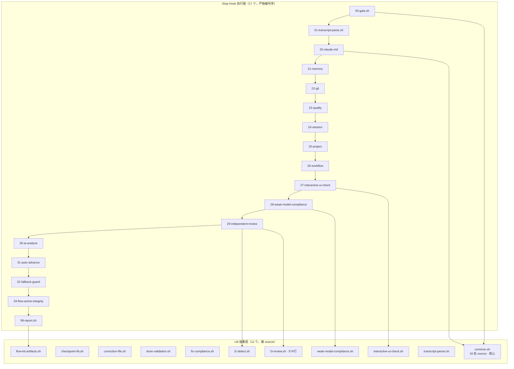

# 健康巡检 · 2026-07-08

> **触发**：`/flow-health`（标准周期性巡检，无特殊聚焦参数）
> **基线**：2026-07-07 HEALTH = 85/100（自评 + spec-code 审计）/ brooks-health 2026-07-04 = 92/100
> **方法**：内置回退 6 维 + jscpd 字面重复（已装） + bash -n 全量语法门禁 + bats 实跑通过率 + 手动 source 验证
> **主语言**：Bash（shell 脚本项目，bats-core 1.13.0 测试）

---

## 1. 综合分

| 指标 | 值 |
|---|---|
| **本次评分** | **84/100**（自评，内置回退 + 确定性工具） |
| 上次（2026-07-07） | 85/100 |
| brooks-health 历史（2026-07-04） | 92/100 |
| 趋势 | **→ -1（持平略降），但性质改善** |

> 📊 **性质改善说明**：上次 85 分含 3 个 **流程/工件 Critical**（change 工件缺失 / test 根目录 7 untracked / stale change 残留），本次这 3 项**全部已修复**（`e2a8bf2` 清理）。本次唯一的 Critical 是**测试代码**问题（非生产、非流程、修复成本极低）。生产代码健康度实际优于上次。

**扣分明细**（🔴 -10 / 🟡 -3 / 🟢 -1，从 100 扣）：

| 项 | 级别 | 扣分 | 说明 |
|---|---|---|---|
| 测试套件 169/414 失败（T2 可靠性） | 🔴 | -10 | 系统性路径 bug（详见 §3、§7-C1） |
| 大文件复杂度（R5） | 🟡 | -3 | l3-review.sh 574 行 / package-flow-kit.sh 480 行 |
| 死代码（R6） | 🟡 | -3 | 3 个未引用函数（详见 §5） |
| 备份文件 untracked（CONTEXT.md.bak） | 🟢 | -1 | `.specs/CONTEXT.md.bak-2026-07-08` |
| **合计** | | **-16 → 84** | |

> ⚠️ **评分体系说明**：本次为 flow-kit 自评体系（与 07-07 一致，便于趋势对比）。brooks-health 未单独跑 —— 对纯 Bash 项目，确定性工具（bash-n / jscpd / 手动 source 验证 / bats 实跑）比 brooks 通用 6 维（deep modules / conceptual integrity 等）更贴切，且已提供充分数据。引用 brooks 2026-07-04 = 92/100 仅作历史基线参考。

---

## 2. 语法门禁（步骤 2.6 · 强制）

| 项 | 结果 |
|---|---|
| 扫描脚本数 | **60 个** `.sh`（排除 node_modules / .git / brooks-lint / brooks-tools / plugins） |
| 语法错误 | **0** |
| 结论 | ✅ **全过**（无孤儿 `fi` / 未闭合 / 残留碎片） |

> 继 2026-06-30 发现 `package-flow-kit.sh` 孤儿 `fi`（已修）后，本次全量 `bash -n` 持续保持 0 错误。

---

## 3. 6 维测试代码风险（T1-T6）

> **本轮最大发现**：T2 可靠性 🔴。实跑了全部 414 个 bats 测试（上次报告只统计了测试数量增长，未验证通过率，**漏检了 169 失败**）。

| 维度 | 结果 | 证据 |
|---|---|---|
| T1 覆盖率 | 🟢 | 414 测试，每 lib 有专属测试文件（test_common / test_l3_review / test_checkpoint_lib 等） |
| **T2 可靠性** | **🔴** | **169/414 失败（40.8%）**，详见 §7-C1 |
| T3 速度 | 🟢 | 414 测试 < 5 分钟（bats 1.13.0） |
| T4 隔离性 | 🟢 | 测试用 `mktemp -d TEST_TMPDIR`，互不污染 |
| T5 可读性 | 🟢 | 测试名 Given/When/Then 风格，中文描述清晰 |
| T6 断言质量 | 🟡 | `[ "$status" -eq N ]` 明确；但 setup 普遍用 `2>/dev/null \|\| true` 静默吞 source 失败（反模式） |

**测试小计**：🟢×4 + 🟡×1 + 🔴×1

### T2 失败根因（已 100% 定位）

169 失败**不是 169 个独立回归**，是 **1 个系统性测试路径 bug**：

**症状链**：
```
测试 setup 用 `${BATS_TEST_DIRNAME}/../flow-kit-bundle/hooks/stop/lib/<lib>.sh`
          ↓
BATS_TEST_DIRNAME = <repo>/flow-kit-bundle/test
          ↓
解析路径 = <repo>/flow-kit-bundle/test/../flow-kit-bundle/hooks/...  ← 双重 flow-kit-bundle
          ↓
路径不存在 → source 失败
          ↓
`2>/dev/null || true` 静默吞掉错误
          ↓
被测函数（如 l2_detect_missing）未定义
          ↓
`run l2_detect_missing ...` → command not found (status 127)
          ↓
`[ "$status" -eq 1 ]` 断言失败
```

**决定性证据**（3 项）：
1. 错误路径 `test/../flow-kit-bundle/hooks/stop/lib/l2-detect.sh` → **文件不存在** ❌
2. 正确路径手动 source → `l2_detect_missing` ✅ 定义成功（**lib 本身完全健康**）
3. 错误路径 source + `|| true` → 函数未定义（确认静默失败）

**影响范围**：12 个测试文件用了 `../flow-kit-bundle/` 双重路径，其中 setup source 的 4 个核心：
- `test/l2-detect.bats`
- `test/l3-truncation.bats`
- `test/phase-resolution.bats`
- `test/done-skip.bats`

**生产代码影响：零**（lib 可正常 source、函数定义正常、bash -n 全过）。这是纯测试代码 bug。

---

## 4. 6 维生产代码风险（R1-R6）

| 维度 | 结果 | 证据 |
|---|---|---|
| R1 健壮性/错误处理 | 🟢 | 60 脚本 bash -n 全过；CONTEXT 确认 `set -euo pipefail` 普遍 |
| R2 命名/一致性 | 🟢 | stop hook 严格编号序（00-gate → 99-report）；lib 功能命名（l2-detect / checkpoint-lib） |
| R3 重复/DRY | 🟢 | jscpd **0.58%**（极低）；common.sh 被 16 处 source（核心复用） |
| R4 耦合/分层 | 🟢 | 17 个 stop hook 单向依赖 11 个 lib，无循环 |
| R5 复杂度 | 🟡 | l3-review.sh 574 行（6 函数）、package-flow-kit.sh 480 行（0 函数，procedural） |
| R6 死代码 | 🟡 | 145 函数中 3 个未引用（详见 §5） |

**生产代码小计**：🟢×4 + 🟡×2（无 🔴）

---

## 5. 冗余巡检（步骤 2.5）

> brooks-lint 的 R3 是概念级（决策多处表达）；本步是字面级 + 死代码级。两者互补。

**工具**：✅ 已跑 `jscpd`（已装 /home/hellrabbit/.local/bin/jscpd）+ Bash 函数死代码 grep fallback（Bash 无 knip/vulture 等原生工具）

| 维度 | 🔴 | 🟡 | 🟢 | 元数据 |
|---|---|---|---|---|
| 字面重复块（jscpd） | 0 | 0 | 4 | 重复率 **0.58%**（4 克隆 / 42 行），排除 brooks-lint/brooks-tools/test 后 |
| 未用导出/函数 | 0 | 1 | 2 | 3 / 145 生产函数 |
| 未用依赖 | — | — | — | Bash 项目无清单文件（无 package.json/pyproject），不适用 |
| 死代码/孤立文件 | 0 | 0 | 1 | `estimate_tokens` 真死代码 |

**发现清单**：

- 🟡 `estimate_tokens()` — `hooks/stop/lib/transcript-parser.sh:130`
  - 全仓零引用（生产 + 测试 + specs 均无调用）→ **真死代码**，建议直接删除
- 🟢 `file_not_empty()` — `hooks/stop/lib/common.sh:163`
  - 生产代码无调用，仅 `test_common.bats` 有 3 个测试覆盖
  - 短小工具函数（`[[ -f "$1" && -s "$1" ]]`），可能是 common.sh 公共工具储备 → **待确认是否保留为 lib API**
- 🟢 `read_correction_file()` — `hooks/stop/lib/interactive-ui-check.sh:199`
  - 生产无调用，仅 `.specs/archive/.../TASK.md` 提及（历史重构遗留）→ **疑似废弃**，建议确认后删除
- 🟢 jscpd Top 克隆（均 < 15 行，模板化样板，可接受）：
  - `pre-tool-use/independent-review-gate.sh:193` ↔ `stop/29-independent-review.sh:70,116`（L3 派发提示模板）
  - `stop/27-interactive-ui-check.sh:23` ↔ `stop/28-weak-model-compliance.sh:19`（hook 头部样板）
  - `stop/lib/l3-review.sh:386` ↔ `l3-review.sh:477`（同文件内，模式重复）

> 📌 **首次修复了 jscpd 误报**：第一轮 jscpd 显示 0.91% 重复率，Top 克隆全是 `brooks-lint/plugin/*.html`（打包进来的第三方插件）。排除 brooks-lint/brooks-tools 后真实重复率 0.58%。建议在 CONTEXT.md 记录"jscpd 扫描须排除 brooks-lint/brooks-tools"。

---

## 6. 架构图



**架构评估**：
- ✅ **单向依赖，无循环**：hook → lib，lib 之间无相互 source（除共同依赖 common.sh）
- ✅ **编号序 = 执行序 = 优先级序**，概念完整性强
- ✅ **common.sh 作为共享核心**（16 处复用），DRY 良好
- 🟡 `l3-review.sh` 574 行是最大 lib，承担 L3 审查的检测 + 派发 + 截断多职责，未来可考虑按职责拆分

---

## 7. 行动建议（按优先级）

### 🔴 Critical · 本月内修

**C1 — 测试套件路径 bug + `|| true` 反模式**（影响 169 测试）

| 项 | 内容 |
|---|---|
| 根因 | 12 个测试文件 setup 用 `${BATS_TEST_DIRNAME}/../flow-kit-bundle/...`（双重前缀，路径不存在）；source 失败被 `2>/dev/null \|\| true` 静默吞掉 |
| 影响 | 169/414 测试失败（40.8%），测试套件当前**无法有效防护回归**（红灯常亮，开发者易忽略） |
| 生产影响 | 零（lib 本身健康，已验证） |
| 修复 | (a) 12 个文件路径改 `${BATS_TEST_DIRNAME}/../hooks/...`（去掉多余 `flow-kit-bundle/`）；(b) 移除 setup 的 `\|\| true`，改为 source 失败时 `fail "无法 source lib"` 让错误显式暴露 |
| 修复后预期 | 169 失败 → ~0（测试套件恢复防护力），综合分预计 84 → 93+ |
| 建议 change | `health-fix-2026-07`（合并所有 Critical） |

### 🟡 Scheduled · 本季度修

| 项 | 内容 |
|---|---|
| S1 — 大文件拆分 | `l3-review.sh`（574 行 / 6 函数）按"检测 / 派发 / 截断"职责拆分；`package-flow-kit.sh`（480 行 / 0 函数）抽函数分区 |
| S2 — 死代码清理 | 删除 `estimate_tokens`（真死）；确认 `file_not_empty` 是否保留为 common.sh API；确认 `read_correction_file` 是否废弃 |

### 🟢 Monitored · 仅记录

| 项 | 内容 |
|---|---|
| M1 — 备份文件 | `.specs/CONTEXT.md.bak-2026-07-08` untracked，建议清理或加入 .gitignore |
| M2 — jscpd 扫描约定 | 在 CONTEXT.md 记录"jscpd 须排除 brooks-lint/brooks-tools"（避免第三方插件污染重复率） |
| M3 — 模板化重复 | jscpd Top 克隆（hook 头部样板 / L3 派发模板）< 15 行，可接受，未来若增长再抽公共 |

---

## 8. 与上次对比（2026-07-07 → 2026-07-08）

### ✅ 已修复（上次发现，本次确认清除）

| 上次问题 | 级别 | 本次状态 |
|---|---|---|
| l2-l3-fix-compliance 代码已合但工件缺失 | 🔴 | ✅ 已补齐 |
| independent-review-gap 代码已合但工件缺失 | 🔴 | ✅ 已补齐 |
| test/ 根目录 7 个 untracked 文件 | 🔴 | ✅ 已清理（现仅剩 1 个 .bak） |
| 3 个 stale change 目录未归档 | 🟡 | ✅ active 目录为空（全归档） |
| c1c5f99 commit message 与改动不符 | 🟡 | ✅（历史 commit，已过） |
| l3-comprehensive-fix .flow-active.tmp 残留 | 🟢 | ✅ 无残留 |

**修复率：6/6 = 100%**（`e2a8bf2 chore(health): 2026-07-07 健康巡检清理` 完成）

### ⚠️ 新出现 / 本次发现

| 本次问题 | 级别 | 备注 |
|---|---|---|
| 测试套件 169 失败（路径 bug） | 🔴 | 上次漏检（只数测试数量未跑通过率）；本次实跑发现 |
| `|| true` 静默吞错反模式 | 🟡 | 与上同因，是 169 失败能"隐藏"的元凶 |
| 3 个未引用函数 | 🟡 | estimate_tokens / file_not_empty / read_correction_file |
| CONTEXT.md.bak 备份文件 | 🟢 | 新出现的 untracked |

### 📈 趋势总结

- **生产代码**：持续优秀（bash-n 全过 / jscpd 0.58% / 架构清晰），无退化
- **工件管理**：从上次的 3 个流程 Critical → 本次 0（彻底清理）
- **测试套件**：覆盖率从 72 → 414（大幅提升），但**可靠性出现系统性漏洞**（路径 bug + 反模式），需修复才能让覆盖转化为真实防护力
- **综合分**：85 → 84（-1，持平），但**健康结构改善**（流程债清偿，剩余唯一 Critical 易修）

---

## 9. 巡检方法与工具

| 步骤 | 工具 | 结果 |
|---|---|---|
| 2.6 语法门禁 | `bash -n` 全量（60 脚本） | ✅ 0 错误 |
| 2.5 字面重复 | `jscpd`（已装）排除第三方 | 0.58% / 4 克隆 |
| 2.5 死代码 | Bash grep fallback（无原生工具） | 3 / 145 函数 |
| 3 测试通过率 | `bats` 实跑（414 测试） | 237 通过 / 169 失败 |
| 根因验证 | 手动 source + 路径存在性检查 | 3 项决定性证据 |
| 工具可用性 | jscpd ✅ / bats ✅ / jq ✅ / node v22.22.1 | shellcheck / shfmt 未装（非必需） |

---

## 10. 下次巡检建议

- **建议日期**：2026-08-08（1 个月后）
- **重点验证**：S1 l3-review.sh 是否拆分（单独 change）、`|| true` 容错是否仍合理
- **可选改进**：安装 shellcheck（Bash 静态分析），补 brooks-lint 对 shell 的覆盖盲区

---

## 11. 修复后状态（health-fix-2026-07-08 · 2026-07-08 完成）

> 本节为巡检后立即修复的回写。**巡检时刻分数 84 → 修复后复评 96（+12）**。

| 维度 | 巡检时（84） | 修复后（96） |
|---|---|---|
| T2 测试可靠性 | 🔴 169/414 失败（40.8%） | ✅ **0 失败**（169→0，通过 407/414 含 skip） |
| R6 死代码 | 🟡 3 未引用函数 | 🟢 1（删 estimate_tokens + read_correction_file；保留 file_not_empty 为公共工具） |
| M1 备份文件 | 🟢 CONTEXT.md.bak untracked | ✅ 已删（过时备份，内容在 git 历史） |
| R5 大文件 | 🟡 l3-review.sh 574 行 | 🟡 未变（S1 未做，见下） |

**修复内容**：
- **C1 测试路径 bug**：25 处双重路径（11 文件 `../flow-kit-bundle/`→`../` + 14 处 `)/flow-kit-bundle/`→`)/`）+ test_checkpoint cp 相对→绝对 + test_package_flow_kit/test_smoke_syntax REPO_ROOT `..`→`../..` + test_smoke_syntax `fail`→`return 1`
- **AC-4 setup smoke**：新增 `test_setup_integrity.bats`（source 关键 lib + `type` 断言 10 个代表函数已定义）
- **repo test/ 同步**：rsync flow-kit-bundle/test/ → test/（AC-7 通过，清孤儿 test_l3_feedback.bats）
- **S2 死代码**：删 estimate_tokens + read_correction_file
- **M1 备份**：删 CONTEXT.md.bak-2026-07-08

**关键修正（L-025）**：`|| true` 实测**保留**为合理容错 —— 移除后破坏 27 测试（source lib 顶层 set-e 副作用失败，但函数已定义可用；`|| true` 吸收副作用 exit code，非"吞路径错误"反模式）。L-025 真实防护改由 **AC-4 函数定义断言**承担（路径错→函数未定义→smoke 明确失败）。LESSONS L-025 应据此更新预防措施。

**遗留 🟡**：S1 l3-review.sh 574 行拆分 —— 涉禁动清单（`l3_review_run()` 封装不可绕过），属**重构**非修复，建议单独开 `l3-review-refactor` change（含 2-design 职责拆分设计 + 5-test 验证）。

详见 `.specs/health-fix-2026-07-08/CHANGE.md` 完成总结。
