# Brooks-Lint — Full Sweep Report · 2026-07-10

**Mode:** Full Sweep | **Scope:** flow-kit 全量（62 `.sh` + 82 `.bats` + 619 `.md`）
**基线:** 2026-07-08 HEALTH = 84/100（自评）| 2026-07-04 brooks-health = 92/100
**主语言:** Bash（bats-core 1.13.0 · 462 tests · 0 fail @ 2026-07-10）

---

## 综合分

| 指标 | 值 |
|---|---|
| **本次评分** | **65/100**（brooks Full Sweep 评分体系） |
| 上次 Full Sweep（2026-07-08） | 33/100（TD-012 测试断裂期，不可比） |
| 上次正常 Full Sweep（2026-07-01） | 68/100 |
| 上次 Health（2026-07-08） | 84/100（自评体系，不可直接对比） |
| 趋势 | ↓ **-3**（与 2026-07-01 正常 Full Sweep 对比；较 07-08 的 33 大幅回升 +32） |

> **评分说明**：Full Sweep 评分使用 brooks 严格标准（🔴 -10 / 🟡 -3 / 🟢 -1），与自评体系（-10/-3/-1 但阈值不同）不可直接对比。趋势对比基准为上次 Full Sweep（2026-07-01 = 68）。

**扣分明细**：

| # | 风险 | 级别 | 扣分 | 文件 |
|---|---|------|------|------|
| 1 | R1 · 超长函数（307 行） | 🔴 | -10 | `l3-review.sh::l3_review_run()` |
| 2 | R1 · 超长函数（290 行） | 🔴 | -10 | `independent-review-gate.sh::is_gh_pr_create()` |
| 3 | R3 · check_* 模式重复 ×6 模块 | 🟡 | -3 | 21/22/23/24/25/26-*.sh |
| 4 | R1 · 长函数（199 行） | 🟡 | -3 | `install_hooks.sh::install_hooks()` |
| 5 | R4 · 死代码 | 🟡 | -3 | `common.sh::write_failed_state()` |
| 6 | R6 · 命名约定不一致 | 🟡 | -3 | 全局（fk_/check_/_fk_/l2_/l3_）|
| 7 | R1 · 长函数簇（3 个 94-124 行）| 🟢 | -1 | banner/validate/fix-compliance |
| 8 | T5 · 安装函数 0 直接测试覆盖 | 🟢 | -1 | install_hooks / install_brooks_lint |
| 9 | R4 · `_grep` 兼容层增加间接性 | 🟢 | -1 | fix-compliance.sh |

---

## 语法门禁（步骤 2.6）

| 项 | 结果 |
|---|---|
| 扫描脚本数 | **62 个** `.sh` |
| 语法错误 | **0** ✅ |
| 判定 | 全部通过，无阻断性语法问题 |

---

## 维度概要

| Dimension | Scanned | Safe Applied | Extended Applied | Reverted | Residual |
|-----------|---------|--------------|------------------|----------|----------|
| Review (R1–R6) | 62 .sh | 0 | 0 | 0 | 8 |
| Test (T1–T6) | 82 .bats + 41 源文件 | 0 | 0 | 0 | 1 |
| Debt | 全量 | 0 | 0 | 0 | 2 |
| Audit | 全量 | 0 | 0 | 0 | 1 |

> **注**：本次 sweep 未应用自动修复。所有发现均为结构性/约定性问题，属于 Residual（需人工判断）。详见下方 Findings。

---

## 迭代历史

Round 1: **clean** — 所有发现均为 Residual 级别（无 Safe/Extended-Safe 可自动应用的修复）

**结论**：本项目代码质量基线较高（462 bats 0 fail + bash -n 全过 + jscpd 无源码重复块），发现的问题均为结构性改进建议，不适合自动修复。

---

## Fix Log

| # | File | Lines | Risk | Outcome | Change |
|---|------|-------|------|----------|--------|
| — | — | — | — | — | 无自动修复应用（全 Residual） |

---

## 6 维生产代码风险

### 🔴 Critical

#### [R1 · Cognitive Overload] l3_review_run() — 307 行超长函数

**Symptom**: `l3_review_run()` 在 `flow-kit-bundle/hooks/stop/lib/l3-review.sh` 中独占 307 行，承担了 5 项职责：（1）读取阶段产物构造 prompt；（2）调用外部模型 API；（3）解析 L3 审查结果；（4）追加写入 INDEPENDENT-REVIEW-<N>.md；（5）写入 6 键 `.done` 文件。函数内混合了 API 调用、JSON 解析、文件 I/O、错误降级等多个抽象层。

**Source**: Fowler — Refactoring (Long Method); McConnell — Code Complete Ch.7 (High-Quality Routines); Ousterhout — A Philosophy of Software Design Ch.4 (Deep Modules)

**Consequence**: 
- 修改任一步骤（如换 API endpoint / 改 .done 格式 / 改 prompt 模板）需要理解全部 307 行
- 单元测试困难（当前 bats 测试需 mock 整个外部 API 调用链）
- 新增审查维度时容易引入回归

**Remedy**: 拆分为 4-5 个独立函数：
1. `_l3_build_prompt()` — 构造审查 prompt（~40 行）
2. `_l3_call_api()` — API 调用 + 超时（~50 行）
3. `_l3_parse_result()` — 解析 API 返回（~30 行）
4. `_l3_write_done()` — 写入 .done 文件（~30 行）
5. `l3_review_run()` 保留为编排函数（~30 行）

**Not applied because**: Residual — 公共 API 重构，跨多个调用点（independent-review-gate.sh + 29-independent-review.sh），需完整回归测试

---

#### [R1 · Cognitive Overload] is_gh_pr_create() — 290 行超长函数

**Symptom**: `is_gh_pr_create()` 在 `flow-kit-bundle/hooks/pre-tool-use/independent-review-gate.sh` 中独占 290 行，包含 7 个以上的独立 gate 检查逻辑（变量化 regex、握手写检测、gate_config 篡改检测、phase 写检测、artifact 校验、L2 dispatch、L3 dispatch），每个分支内有独立的 `source` + `jq` + 条件判断链。

**Source**: Fowler — Refactoring (Long Method); Brooks — The Mythical Man-Month Ch.2 (communication overhead of understanding)

**Consequence**: 
- 290 行的 gate 函数是 PreToolUse hook 的性能关键路径（每次 tool call 都触发）
- 任一 gate 逻辑错误会导致整个 PreToolUse 链降级
- 函数名 `is_gh_pr_create` 已不能准确描述其职责（它做远超 PR create 检测的事）

**Remedy**: 
1. 将独立 gate 检查提取为命名函数（`_gate_handshake_write()`, `_gate_config_tamper()`, `_gate_phase_write()`, `_gate_l2_review()`, `_gate_l3_review()`）
2. 主函数改为 gate 编排器：按优先级依次调用各 gate，首次命中即返回
3. 函数重命名为 `_run_review_gates()` 以反映真实职责

**Not applied because**: Residual — 公共 API 重构，PreToolUse 关键路径，修复需完整回归测试（所有 gate 场景覆盖）

---

### 🟡 Warning

#### [R3 · Knowledge Duplication] check_* 函数模式重复 ×6 模块

**Symptom**: 6 个 stop hook 模块（21-memory.sh, 22-git.sh, 23-quality.sh, 24-session.sh, 25-project.sh, 26-workflow.sh）中的 `check_b1/b2`, `check_c1-c4`, `check_d1-d4`, `check_e1-e5`, `check_f1-f5`, `check_g1-g5` 函数遵循完全相同的模板：

```
check_XN() {
  check_enabled "<module>" "<check>" || return 0
  # 读取状态
  # 检查条件
  # module_output "TYPE|CHECK|MESSAGE"
}
```

每个 check 函数的差异仅在于：检查的条件表达式和输出的消息文本。这是"决策重复"（每个 check 都重复了"如何做检查"的知识），而非仅代码行重复。

**Source**: Hunt & Thomas — The Pragmatic Programmer (DRY: Don't Repeat Yourself); Ousterhout — A Philosophy of Software Design Ch.5 (Information Leakage)

**Consequence**: 
- 新增 check 需要复制完整的函数模板（~30-50 行）
- check 的执行模式变更（如改输出格式）需要修改所有 20+ 个 check 函数
- 当前已有 4 处 `check_enabled.*|| return 0` 出现 3-5 次/文件（21 patterns across 6 files）

**Remedy**: 引入声明式 check 注册模式：
```bash
# 每个 check 只需声明：模块、检查名、条件命令、消息
register_check "git" "C1" check_c1_condition "C1|large files detected"
```
或至少提取公共的 `check_enabled` + `module_output` 包装为 `run_check()` 辅助函数。

**Not applied because**: Residual — 跨 6 模块重构，改变 hook 模块约定，需在 DESIGN 层面决策是否引入声明式模式

---

#### [R1 · Cognitive Overload] install_hooks() — 199 行长函数

**Symptom**: `install_hooks()` 承担了全部 hook 安装逻辑：scope 解析、stop hook 安装、lib 文件安装、session-start 安装、pre-tool-use 安装、settings.json 更新。函数内混合了文件复制、JSON 操作、条件分支。

**Source**: Fowler — Refactoring (Long Method)

**Consequence**: 新增 hook 类型时需要修改这个 199 行的函数，容易遗漏某一步骤（如忘记 chmod 或 settings.json 注册）

**Remedy**: 拆分为 `_install_stop_hooks()`, `_install_session_start_hooks()`, `_install_pre_tool_use_hooks()`, `_update_settings_json()`

**Not applied because**: Residual — install.sh 的公共接口，修复需验证 user/project scope 两种安装路径

---

#### [R4 · Accidental Complexity] write_failed_state() — 死代码

**Symptom**: `write_failed_state()` 在 `common.sh:139-159` 定义，但**全仓 0 处调用**。该函数设计用于独立 review gate 的 L3 失败降级场景（记录 `fail_count` + `status: "failed"`），但实际代码中无任何模块调用它。`CONTEXT.md` 将其列为公共 API，但该条目已过时。

**Source**: Fowler — Refactoring (Speculative Generality); McConnell — Code Complete Ch.5 (YAGNI)

**Consequence**: 
- 21 行死代码增加 common.sh 的认知负荷（common.sh 被 18 个文件 source）
- CONTEXT.md 记录了不存在的 API，可能误导 AI/newcomer
- 已被上期 REVIEW.md 标记为"可能应移至 29 模块"

**Remedy**: 
1. 移除 `write_failed_state()` 定义（21 行）
2. 更新 `CONTEXT.md` 移除对应条目
3. 如果未来需要 L3 失败降级，在调用方模块内实现，不放入共享 common.sh

**Not applied because**: Residual — 涉及 CONTEXT.md 更新（2 文件），且该函数可能为计划中功能预留。建议人工确认后移除

---

#### [R6 · Domain Model Distortion] 命名约定不一致

**Symptom**: 代码库中存在 5 种命名前缀约定，无明确文档说明各自的使用场景：

| 前缀 | 示例 | 实际用途 |
|------|------|---------|
| `fk_` | `fk_artifact_check`, `fk_auto_phase` | 公共 API（flow-kit 核心） |
| `_fk_` | `_fk_done_kvp`, `_fk_get_source_exts` | 私有辅助（模块内部） |
| `check_` | `check_b1`, `check_g5` | Stop hook 检查函数 |
| `l2_` / `l3_` | `l2_detect_missing`, `l3_review_run` | L2/L3 审查模块 |
| `_fai_` | `_fai_check_phase`, `_fai_append_violation` | flow-active 完整性模块 |
| 无前缀 | `smart_truncate`, `parse_transcript`, `hook_init` | 通用工具函数 |

存在以下问题：
- `_fk_` vs `_fai_` 都表示"私有"但前缀不一致
- `check_` 函数（B1/B2/C1-C4 等）和 `fk_artifact_check` 都是"检查"，但命名风格不同
- `smart_truncate` / `parse_transcript` 作为通用工具，无命名空间前缀

**Source**: Evans — Domain-Driven Design (Ubiquitous Language); McConnell — Code Complete Ch.11 (Naming Conventions)

**Consequence**: 新人/AI 无法从函数名推断其所属模块和可见性；代码审查时需要额外心智开销判断函数边界

**Remedy**: 
1. 在 `CONTEXT.md` 中明确记录命名约定（公共 `fk_` / 私有 `_<module>_`）
2. 将 `_fai_` 统一为 `_fai_`（保持，它实际上遵循了 `_<module>_` 模式）
3. 将 `check_` 重命名为 `_stop_check_` 或至少文档化其为 stop hook 专用
4. 通用工具函数（`smart_truncate`, `parse_transcript`）加 `fk_` 前缀

**Not applied because**: Residual — 批量重命名涉及 40+ 函数、62+ 引用点、20+ 测试文件，风险过高

---

### 🟢 Suggestion

#### [R1 · Cognitive Overload] 中等长度函数簇（94-124 行）

**Symptom**: `build_resume_banner()` = 94 行, `validate_staging_coverage()` = 124 行, `fk_fix_compliance_check()` = 124 行 — 这些函数虽长但职责相对单一（UI 构建 / 验证流水线 / 合规检查）。

**Source**: McConnell — Code Complete Ch.7

**Remedy**: 在后续迭代中逐步提取内部辅助函数；当前优先级低

---

#### [T5 · Coverage Illusion] install_hooks + install_brooks_lint 无直接测试

**Symptom**: `install_hooks()` 和 `install_brooks_lint()` 在 bats 测试中零引用，仅通过集成测试间接覆盖。`install_brooks_lint()` = 152 行无直接测试。

**Source**: Feathers — Working Effectively with Legacy Code Ch.1; Osherove — The Art of Unit Testing

**Remedy**: 为安装函数添加 DRY_RUN 模式的单元测试（`test/test_install_hooks.bats` 已部分覆盖，可扩展）

---

#### [R4 · Accidental Complexity] `_grep` 兼容层

**Symptom**: `fix-compliance.sh:20` 定义了 `_grep() { command grep "$@"; }` 作为 ugrep 兼容层。该函数在文件内部被调用 12 次，增加了一层间接性。

**Source**: Hunt & Thomas — The Pragmatic Programmer (Orthogonality)

**Remedy**: 如果 ugrep 兼容问题已解决，考虑移除兼容层，直接使用 `grep`；如果仍需保留，至少加注释说明何时可以移除

---

## 6 维测试代码风险

| 风险 | 评分 | 说明 |
|------|------|------|
| T1 · Test Obscurity | 🟢 健康 | 测试命名清晰（`L1-01: <描述>` / `AC-N: <场景>` 模式） |
| T2 · Test Brittleness | 🟢 健康 | 少量 mock/stub 使用，测试主要验证真实行为 |
| T3 · Test Duplication | 🟢 健康 | 74 setup/teardown 块 / 41 测试文件 = 合理比例 |
| T4 · Mock Abuse | 🟢 健康 | 未发现重度的 mock 滥用模式 |
| T5 · Coverage Illusion | 🟡 注意 | 安装模块 0 直接测试；32/41 文件覆盖错误路径（可改善） |
| T6 · Architecture Mismatch | 🟢 健康 | 测试金字塔合理（多数单元 + 少量集成 + E2E regression） |

---

## 冗余巡检（步骤 2.5）

**工具**: jscpd 5.0.12 ✅ + AI grep fallback（未用导出检测）

| 维度 | 🔴 | 🟡 | 🟢 | 元 |
|---|---|---|---|---|
| 字面重复块（jscpd） | 0 | 0 | 0 | 源码无重复块（唯一命中为 MODULE_IDEAS.md 文档自引用） |
| 未用导出（AI grep） | 0 | 1 | — | `write_failed_state` 0 调用（其余 29 个"候选"经人工确认为测试引用或内部使用） |
| 未用依赖 | — | — | — | N/A（Bash 项目无包管理器依赖） |
| 死代码·孤立文件 | 0 | 0 | 0 | — |

**jscpd 结果**: 未在源码目录（`flow-kit-bundle/hooks/`, `flow-kit-bundle/lib/`）发现字面级代码重复。项目代码 DRY 程度良好。

**未用导出详查**: AI grep 初步返回 30 个候选函数，经人工复核：
- **确认死代码**（1 个）：`write_failed_state` — 仅定义，0 调用
- **假阳性**（29 个）：其余函数或被测试文件引用、或在定义文件内部使用、或通过 `source` 动态加载后使用

---

## 架构图

```mermaid
graph TD
    subgraph "PreToolUse Hooks"
        IRG[independent-review-gate.sh<br/>🟡 290行 is_gh_pr_create]
        AC[auto-checkpoint.sh]
    end

    subgraph "SessionStart Hooks"
        RES[flow-kit-resume.sh]
        SRR[stop-report-reminder.sh]
    end

    subgraph "Stop Hooks 模块"
        GATE[00-gate.sh]
        MEM[21-memory.sh]
        GIT[22-git.sh]
        QUAL[23-quality.sh]
        SES[24-session.sh]
        PROJ[25-project.sh]
        WF[26-workflow.sh]
        UI[27-interactive-ui-check.sh]
        WMC[28-weak-model-compliance.sh]
        IR[29-independent-review.sh]
        AI[30-ai-analyze.sh]
        ADV[31-auto-advance.sh]
        FB[32-fallback-guard.sh]
        FAI[33-flow-active-integrity.sh]
        REP[99-report.sh]
    end

    subgraph "共享 Lib"
        CMN[common.sh<br/>🟡 write_failed_state 死代码]
        L3[l3-review.sh<br/>🔴 307行 l3_review_run]
        FKA[flow-kit-artifacts.sh]
        FIX[fix-compliance.sh<br/>🟡 124行 fk_fix_compliance_check]
        DONE[done-validation.sh]
        IUC[interactive-ui-check.sh]
        WMCL[weak-model-compliance.sh]
        CP[checkpoint-lib.sh]
        BN[banner.sh]
        TP[transcript-parser.sh]
        L2[l2-detect.sh]
        CF[correction-file.sh]
    end

    subgraph "安装模块"
        INST[install.sh]
        IH[install_hooks.sh<br/>🟡 199行 install_hooks]
        IBL[install_brooks.sh<br/>🟡 152行 install_brooks_lint]
        IBT[install_brooks_tools.sh<br/>🟡 105行]
        VS[validate_staging.sh<br/>🟡 124行]
    end

    GATE --> CMN
    MEM --> CMN
    GIT --> CMN
    QUAL --> CMN
    SES --> CMN
    PROJ --> CMN
    WF --> CMN
    UI --> CMN
    UI --> IUC
    WMC --> CMN
    WMC --> WMCL
    IR --> CMN
    IR --> L3
    AI --> CMN
    ADV --> CMN
    FB --> CMN
    FAI --> CMN
    REP --> CMN
    IRG --> L3
    IRG --> FKA
    IRG --> DONE
    IRG --> FIX
    IRG --> L2
    RES --> BN
    SRR --> CMN
    INST --> IH
    INST --> IBL
    INST --> IBT

    classDef critical fill:#ff6b6b,stroke:#c92a2a,color:#fff
    classDef warning fill:#ffd43b,stroke:#fab005,color:#000
    classDef healthy fill:#69db7c,stroke:#2f9e44,color:#000

    class L3,IRG critical
    class CMN,IH,IBL,IBT,VS,FIX warning
    class GATE,MEM,GIT,QUAL,SES,PROJ,WF,REP,FAI,RES healthy
```



> 图例：🔴 红色 = Critical 发现 · 🟡 黄色 = Warning 发现 · 🟢 绿色 = 无发现

**依赖分析**：
- 无循环依赖 ✅
- `common.sh` 是中心 hub（18 个文件 source）— 这是 hook 系统的合理设计
- `l3-review.sh` 被 2 处 source（PreToolUse gate + Stop hook），职责清晰
- 依赖方向统一：hooks → lib → config，符合 Clean Architecture 分层

---

## 技术债优先级（Pain × Spread）

| 项 | Pain | Spread | 优先级 | 建议 |
|---|---|---|---|---|
| `l3_review_run()` 拆分 | 3 | 2 | 🔴 6 | 本月内：拆分 5 个子函数，降低单点复杂度 |
| `is_gh_pr_create()` 拆分 | 3 | 2 | 🔴 6 | 本月内：提取独立 gate 检查为命名函数 |
| check_* 模式去重 | 2 | 3 | 🟡 6 | 本季度：引入声明式 check 注册或 `run_check()` 包装 |
| 命名约定文档化 | 2 | 2 | 🟡 4 | 本季度：CONTEXT.md 加命名约定段 |
| `write_failed_state` 死代码清理 | 1 | 1 | 🟢 2 | 下个清理窗口移除 |
| 安装函数测试补充 | 1 | 2 | 🟢 2 | 下个迭代加 DRY_RUN 单元测试 |
| `_grep` 兼容层评估 | 1 | 1 | 🟢 1 | 低优先级：确认 ugrep 兼容状态后决定去留 |

---

## 行动建议

### 🔴 Critical · 本月内

1. **拆分 `l3_review_run()`**（`l3-review.sh`）— 分离 prompt 构造、API 调用、结果解析、.done 写入
2. **拆分 `is_gh_pr_create()`**（`independent-review-gate.sh`）— 提取独立 gate 检查为命名函数，重命名主函数

### 🟡 Scheduled · 本季度

3. **check_* 模式去重** — 引入声明式 check 注册或 `run_check()` 包装函数
4. **命名约定文档化** — 在 CONTEXT.md 添加命名约定段（`fk_` vs `_<module>_` vs `check_` vs `l2_/l3_`）
5. **清理 `write_failed_state`** — 移除死代码定义 + CONTEXT.md 条目

### 🟢 Monitored · 仅记录

6. 为 `install_hooks` / `install_brooks_lint` 补充 DRY_RUN 单元测试
7. 评估 `_grep` 兼容层是否可以移除
8. `build_resume_banner()` / `validate_staging_coverage()` 在后续迭代中逐步提取子函数

---

## 与上次对比

| 维度 | 2026-07-08 (Health 84) | 2026-07-10 (Sweep 76) | 变化 |
|------|----------------------|----------------------|------|
| 语法门禁 | 60 脚本 0 错误 ✅ | 62 脚本 0 错误 ✅ | +2 脚本（banner.sh + 测试同步） |
| 测试通过率 | 169/414 失败 🔴 | 462/462 0 fail ✅ | **全部修复**（TD-012 已落地） |
| 大文件复杂度 | 🟡 l3-review 574 行 | 🔴 l3_review_run 307 行 | 严重度提升（函数级分析更精确） |
| 死代码 | 🟡 3 个函数 | 🟡 1 个函数 | 改善（2 个已清理） |
| 命名 | 未检查 | 🟡 不一致 | **新发现** |
| jscpd 重复 | 未跑 | 🟢 0 源码重复 | **新数据** |

**趋势**：测试通过率从 59%（169/414）恢复到 100%（462/462），这是最大的改善。生产代码健康度基本持平，本次 Full Sweep 以更严格的 brooks 标准发现了命名约定和函数长度的结构性改进点。

---

## Health Score Delta

| 指标 | Before | After | Δ |
|------|--------|-------|---|
| Full Sweep 评分 | 68 (2026-07-01) | 65 (2026-07-10) | -3 |
| 测试通过率 | 169/414 (41%) | 462/462 (100%) | +59% |
| Critical 发现 | 1 | 2 | +1* |
| Warning 发现 | 3 | 4 | +1* |
| Suggestion 发现 | 2 | 3 | +1 |

> \* Critical/Warning 增加不是因为代码退化，而是本次使用更严格的函数级分析（之前主要看文件级行数）。实际代码质量与 07-01 持平，测试通过率大幅改善。

---

## 总结

本次 Full Sweep 对 62 个 shell 脚本 + 82 个 bats 测试文件进行了 4 维度（R1-R6 代码衰退 / T1-T6 测试质量 / 技术债 / 架构）全面扫描。

**最重要的发现**：2 个超长函数（`l3_review_run` 307 行 / `is_gh_pr_create` 290 行）是当前最大的可维护性风险，建议本月内完成拆分。check_* 函数模板重复（6 模块 × 20+ 检查）是第二大改进机会。

**积极信号**：语法门禁全过（62/62）、测试全绿（462/462）、jscpd 源码零重复、架构无循环依赖。代码库整体健康度良好，主要改进空间在函数粒度拆分和命名约定文档化。

**建议下次巡检日期**：1 个月后（2026-08-10），重点验证本月 Critical 项是否已修复。
