# 健康巡检 · L3 审计专项 · 2026-07-11

**Mode:** Full Sweep（L3 审计核心链专项）| **Scope:** L3 audit core chain (~25 files, 2114 行核心代码 + 1683 行测试)
**基线:** 2026-07-10 Full Sweep = 65/100（全量）→ 本次 L3 专项复评
**主语言:** Bash（bats-core 1.13.0 · 128 L3-related tests）

---

## 综合分

| 指标 | 值 |
|---|---|
| **L3 审计子系统评分** | **72/100**（brooks 严格标准） |
| 上次全量 Full Sweep（2026-07-10） | 65/100（全仓基准，不可直接对比） |
| 趋势 | ↑ **+7**（L3 子系统较全仓平均水平更健康） |

**扣分明细（仅 L3 审计核心链）**：

| # | 风险 | 级别 | 扣分 | 文件 | 状态 |
|---|---|------|------|------|------|
| 1 | R1 · `_gate_phase_transition()` 122 行 | 🔴 | -10 | `independent-review-gate.sh:184-305` | 已知 |
| 2 | R1 · `fk_fix_compliance_check()` 126 行 | 🔴 | -10 | `fix-compliance.sh:178-303` | 已知 |
| 3 | R5 · 三向依赖环 (correction↔UI↔compliance) | 🔴 | -10 | `L-021` | 已知 · active |
| 4 | R1 · `smart_truncate()` 112 行 | 🟡 | -3 | `l3-review.sh:50-161` | 已知 |
| 5 | R1 · `_l3_parse_result()` 82 行 | 🟡 | -3 | `l3-review.sh:315-396` | 已知 |
| 6 | R3 · phase_name 映射 3 处重复 | 🟡 | -3 | `L-new-2` | 已知 |
| 7 | R1 · `_l3_build_prompt()` 85 行 | 🟡 | -3 | `l3-review.sh:162-246` | 已知 |
| 8 | R1 · `fk_validate_done_marker()` 80 行 | 🟡 | -3 | `done-validation.sh:102-181` | 已知 |
| 9 | R4 · `source "$0"` self-sourcing 超时模式 | 🟢 | -1 | `l3-review.sh:511` | 新发现 |
| 10 | R2 · 29-independent-review.sh 无函数封装 | 🟢 | -1 | `29-independent-review.sh` | 新发现 |
| 11 | T5 · timeout 路径缺独立测试 | 🟢 | -1 | `l3_review_with_timeout` | 新发现 |

> **上次已修问题**（2026-07-10 sweep → 本次确认已修复）：
> - ✅ `l3_review_run()`: 307 行 → 44 行（拆分出 `l3_review_with_timeout`、`l3_write_timeout_done`）
> - ✅ `is_gh_pr_create()`: 290 行 → 7 行
> - ✅ `write_failed_state()` 死代码已确认待清理

---

## 语法门禁（步骤 2.6）

| 项 | 结果 |
|---|---|
| 扫描脚本数 | **57 个** `.sh`（排除 node_modules/.git/brooks-lint/brooks-tools/plugins） |
| 语法错误 | **0** ✅ |
| 判定 | 全部通过，无阻断性语法问题 |

---

## L3 审计架构概览

```
┌─────────────────────────────────────────────────────────────┐
│                    L3 独立审查体系                              │
│                                                             │
│  PreToolUse (同步 · 硬拦截)                                     │
│  ┌──────────────────────────────────────────────────┐       │
│  │ independent-review-gate.sh (386行 · 14函数)         │       │
│  │   is_handshake_write → is_phase_write             │       │
│  │   → _gate_path_guard → _gate_phase_filter         │       │
│  │   → _gate_active_check → _gate_done_validation    │       │
│  │   → _gate_tamper_detect → _gate_phase_transition  │       │
│  │   → _gate_deny_reason → _run_review_gates         │       │
│  └──────────────────────────────────────────────────┘       │
│       │ 共享 libs                                             │
│       ├── done-validation.sh (181行 · 3函数)                  │
│       │   fk_independent_review_gate_active                  │
│       │   fk_validate_done_marker (KVP 双层校验)               │
│       ├── fix-compliance.sh (303行 · 6函数)                   │
│       │   fk_fix_compliance_check (实效性校验)                 │
│       └── l3-review.sh (626行 · 11函数)                       │
│           l3_review_run / smart_truncate / _l3_build_prompt  │
│                                                             │
│  Stop Hook (异步 · 兜底)                                       │
│  ┌──────────────────────────────────────────────────┐       │
│  │ 29-independent-review.sh (169行 · 无函数 · inline)   │       │
│  │   → gate_config L3 判定 → L2 等待 → L3 派发           │       │
│  │ 28-weak-model-compliance.sh                        │       │
│  │   L1/L2/L3 合规扫描                                 │       │
│  └──────────────────────────────────────────────────┘       │
│                                                             │
│  防线: 真实性(KVP) → 实效性(fix-compliance) → 放行              │
└─────────────────────────────────────────────────────────────┘
```

---

## 6 维生产代码风险（R1-R6 · L3 核心链）

### 🔴 Critical

**[R1 · Cognitive Overload] — `_gate_phase_transition()` 超长函数（122 行）**
- Symptom: `independent-review-gate.sh:184-305`，单个函数含 phase 判定、L2 检测、done 校验、fix-compliance、L3 派发、transition jq 写入共 6 个职责
- Source: McConnell — Code Complete Ch.7: High-Quality Routines
- Consequence: 修改任何一道防线逻辑需要理解全部 122 行，增加 regression 风险
- Remedy: 拆为 `_gate_check_l2()` / `_gate_check_l3()` / `_gate_do_transition()` 三个子函数（上次 sweep 已拆分 `l3_review_run` 307→44 行验证了拆分可行性）
- 状态: 已知（2026-07-10 sweep 已识别），待下一次 arch 重构窗口

**[R1 · Cognitive Overload] — `fk_fix_compliance_check()` 超长函数（126 行）**
- Symptom: `fix-compliance.sh:178-303`，含 doc-only diff 检测、源码分类、逐发现文件校验、结果汇总 4 个阶段
- Source: McConnell — Code Complete Ch.7
- Consequence: 实效性校验是 gate 防线第二关，复杂度集中在单函数增加误判风险
- Remedy: 阶段函数已存在（`fk_check_doc_only_diff` / `fk_classify_source_files` / `fk_verify_finding_files`），`fk_fix_compliance_check` 应降为编排层
- 状态: 已知

**[R5 · Dependency Disorder] — correction-file ↔ interactive-ui-check ↔ weak-model-compliance 双向依赖环**
- Symptom: `correction-file.sh` → `interactive-ui-check.sh` (1 ref) 且反向 (6 refs)；`correction-file.sh` → `weak-model-compliance.sh` (1 ref) 且反向 (2 refs)
- Source: Martin — Clean Architecture, Acyclic Dependencies Principle (ADP)
- Consequence: 任一模块改动可级联破坏其他两个模块（见 LESSONS L-021）
- Remedy: 提取三方共享接口到新 lib（如 `correction-types.sh`），让 UI check 和 compliance 依赖接口而非具体实现
- 状态: 已知 · active（L-021），尚未排期修复

### 🟡 Warning

**[R1 · Cognitive Overload] — 三个 lib 函数超 80 行**
- `smart_truncate()` 112 行 (`l3-review.sh:50-161`)：截断策略含 header/artifact/CHANGELOG/优先级 4 段逻辑
- `_l3_parse_result()` 82 行 (`l3-review.sh:315-396`)：解析 + 校验 + 归档 3 段
- `_l3_build_prompt()` 85 行 (`l3-review.sh:162-246`)：prompt 拼接含 system/user/artifact 3 段
- `fk_validate_done_marker()` 80 行 (`done-validation.sh:102-181`)：KVP 双层校验（核心防线，复杂度有合理性）
- `fk_independent_review_gate_active()` 62 行 (`done-validation.sh:29-90`)：L2/L3/both/any 四模式判定
- Source: McConnell — Code Complete Ch.7
- Remedy: 前三者可拆（上次 sweep 已验证拆分模式有效）；后两者因 gate 判定逻辑内聚性高，拆分会增加调用复杂度，建议保持现状态 + 注释分段
- 状态: 已知（多数在 TD-008 记录）

**[R3 · Knowledge Duplication] — phase_name 映射三处重复**
- Symptom: phase 编号 → gate key 名称映射（`1→1-requirement`, `2→2-design`, …）在 `done-validation.sh`、`29-independent-review.sh`、`independent-review-gate.sh` 中各自维护
- Source: Hunt & Thomas — The Pragmatic Programmer, DRY
- Consequence: 新增 phase 支持时需同步 3 处（LESSONS L-new-2）
- Remedy: 在 `common.sh` 中定义 `declare -A PHASE_GATE_KEY_MAP` 关联数组作为单一源
- 状态: 已知（L-new-2），已记录待修

**[R3 · Knowledge Duplication] — jq goal pipeline 解析逻辑在 prompt 中重复**
- Symptom: `6-review.md` 和 `7-integration.md` 中 jq goal 解析逻辑（68 行）逐字重复
- Source: Fowler — Refactoring, Duplicate Code
- Consequence: 修改 goal schema 时需同步 2 个 prompt
- Remedy: 抽取到 `flow-kit/reference/` 共享片段（TD-005）
- 状态: 已知（TD-005），已记录待修

### 🟢 Suggestion

**[R4 · Accidental Complexity] — `source "$0"` self-sourcing 超时子进程模式**
- Symptom: `l3-review.sh:510-513` 使用 `timeout bash -c 'source "$0"; l3_review_run ...' "${BASH_SOURCE[0]}"` 在子进程中重新 source 自身
- Source: Brooks — The Mythical Man-Month, Ch.5 (accidental complexity)
- Consequence: 模式脆弱——如果 `BASH_SOURCE[0]` 在 source 链中解析不正确（例如被其他脚本 source 时），子进程会找不到正确文件
- Remedy: 使用 `$HOOK_BASE_DIR/lib/l3-review.sh` 绝对路径替代 `BASH_SOURCE[0]`，或抽取 `l3_review_run` 入独立可执行脚本
- 状态: 新发现 · 当前功能正常但脆弱

**[R2 · Change Propagation] — 29-independent-review.sh 无函数封装 · 169 行 inline**
- Symptom: 整个脚本 169 行全部 inline 逻辑，无函数边界
- Source: McConnell — Code Complete Ch.7
- Consequence: 测试只能端到端，无法单元测试单个判定逻辑（如 L2 完成检测、gate 值解析）
- Remedy: 提取 `_check_l2_complete()` / `_resolve_gate_value()` / `_dispatch_l3_review()` 函数
- 状态: 新发现 · 建议在下次 maintenance 窗口重构

**[T5 · Coverage Illusion] — L3 timeout 路径缺独立测试**
- Symptom: `l3_review_with_timeout` (L495-L524) 仅在 `l3_dispatch_prompt` 的 prompt 文本中引用，无独立 bats 测试。timeout 路径通过 `timeout 30s bash -c` 实现，行为未在 CI 中验证
- Source: Feathers — Working Effectively with Legacy Code, Ch.1
- Consequence: timeout 行为修改后无测试兜底，可能回归为"超时后仍写 .done"（fix-l3-gate AC-2 修复的 bug）
- Remedy: 添加 `test_l3_timeout.bats`：mock 超时场景，验证 `verdict=timeout` + `.done` 文件不存在
- 状态: 新发现 · 建议在下次 test-infra change 补齐

---

## 测试质量（T1-T6 · L3 测试文件）

| 维度 | 评估 | 说明 |
|---|---|---|
| T1 可读性 | 🟢 | 测试命名规范，`@test` 描述清晰 |
| T2 脆弱性 | 🟢 | 使用 setup/teardown 隔离，无明显实现耦合 |
| T3 重复 | 🟡 | `setup` 模板在 7 个测试文件中重复（已知 L-025 已修） |
| T4 Mock 滥用 | 🟢 | 不适用（Bash 测试不使用 mock 框架） |
| T5 覆盖幻觉 | 🟡 | `l3_review_with_timeout` / `l3_write_timeout_done` 无独立测试；128 测试覆盖主要路径但 timeout/fallback 路径仅 regression demo |
| T6 架构匹配 | 🟢 | 测试分布在 7 个专题 .bats + 7 个 regression demo，结构合理 |

**L3 测试文件清单**：

| 文件 | 测试数 | 行数 | 覆盖范围 |
|---|---|---|---|
| `test_l2_l3_fix_compliance.bats` | 43 | 477 | 实效性校验（fix-compliance 完整覆盖） |
| `test_fix_l3_gate.bats` | 24 | 326 | L3 gate 三连异常修复验证 |
| `test_gate_integrity.bats` | 20 | 238 | .done KVP 真实性校验 |
| `test_dual_review_merge.bats` | 14 | 265 | L2+L3 双层合并写入 |
| `test_l2_l3_granular_gate.bats` | 12 | 184 | L2/L3/both 三值开关 |
| `test_l3_async_dispatch.bats` | 9 | 122 | L3 异步派发 |
| `l3-truncation.bats` | 6 | 71 | smart_truncate 截断 |
| **合计** | **128** | **1683** | |

**Regression Demos（7 个）**：

| Demo | 行数 | 验证场景 |
|---|---|---|
| `forged-done` | - | 伪造 .done 文件 |
| `tampered-done` | - | 篡改 .done 内容 |
| `hijack-done` | - | 劫持写入路径 |
| `empty-done` | - | 空 .done 文件 |
| `exotic-escape` | - | 特殊字符逃逸 |
| `gate-config-tamper` | - | gate_config 快照篡改 |
| `skipped-subprocess` | - | 子进程跳过审查 |

---

## 冗余巡检（步骤 2.5）

**工具**: jscpd (hooks/ 目录) + grep fallback

| 维度 | 🔴 | 🟡 | 🟢 | 元 |
|---|---|---|---|---|
| 字面重复块 | 0 | 1 | 6 | jscpd 发现 7 组重复，均 < 20 行 |
| 未用导出 | 0 | 0 | 3 | `estimate_tokens` / `read_correction_file` / `file_not_empty`（已知，已入 CONTEXT 清理窗口） |
| 未用依赖 | 0 | 0 | 0 | — |
| 死代码 | 0 | 0 | 0 | `write_failed_state()` 已确认待清理（2026-07-10 sweep） |

**jscpd 主要发现**（hooks/ 目录内）：
- 🟡 `check_*` 函数模式在 6 个 Stop hook 模块中重复（已知，TD-004）
- 🟢 小段 token counting / artifact 检查逻辑在 2-3 处复用（可接受级别）

---

## 架构依赖图（L3 审计核心链）

```mermaid
graph TD
    subgraph PreToolUse["PreToolUse (硬拦截)"]
        IRG["independent-review-gate.sh<br/>386行 · 14函数"]
    end

    subgraph StopHook["Stop Hook (兜底)"]
        S29["29-independent-review.sh<br/>169行 · 0函数"]
        S28["28-weak-model-compliance.sh"]
        S33["33-flow-active-integrity.sh"]
        S31["31-auto-advance.sh"]
        S32["32-fallback-guard.sh"]
    end

    subgraph Libs["共享 Libs"]
        L3["l3-review.sh<br/>626行 · 11函数"]
        DV["done-validation.sh<br/>181行 · 3函数"]
        FC["fix-compliance.sh<br/>303行 · 6函数"]
        L2D["l2-detect.sh"]
        WM["weak-model-compliance.sh"]
        CF["correction-file.sh"]
        CM["common.sh"]
    end

    subgraph Tests["测试"]
        T1["test_gate_integrity.bats"]
        T2["test_fix_l3_gate.bats"]
        T3["test_l2_l3_fix_compliance.bats"]
        T4["test_l2_l3_granular_gate.bats"]
        T5["test_l3_async_dispatch.bats"]
        T6["test_dual_review_merge.bats"]
        T7["l3-truncation.bats"]
    end

    IRG --> DV
    IRG --> FC
    IRG --> L3
    IRG --> L2D
    IRG --> CM
    S29 --> L3
    S29 --> L2D
    S29 --> CM
    S28 --> CF
    S28 --> WM
    S33 --> CM

    CF -.-> WM
    WM -.-> CF
    CF -.-> S28

    T1 --> DV
    T2 --> IRG
    T2 --> S29
    T3 --> FC
    T4 --> DV
    T5 --> L3
    T6 --> DV
    T7 --> L3

    classDef critical fill:#ff6b6b,stroke:#c92a2a,color:#fff
    classDef warning fill:#ffd43b,stroke:#f08c00,color:#000
    classDef ok fill:#51cf66,stroke:#2f9e44,color:#000

    class CF,WM critical
    class L3,S29 warning
    class DV,FC,IRG,CM ok
```



> 🔴 红线虚线 = 双向依赖（`CF ↔ WM ↔ S28`，违反 ADP）

---

## 上次扫后已修复项（2026-07-10 → 2026-07-11 确认）

| 风险 | 旧状态 | 新状态 | 变更 |
|---|---|---|---|
| R1: `l3_review_run()` 307 行 | 🔴 -10 | ✅ 已拆为 44 行 | `l3_review_with_timeout` + `l3_write_timeout_done` 独立 |
| R1: `is_gh_pr_create()` 290 行 | 🔴 -10 | ✅ 7 行 | 拆分出 `_gate_phase_transition` + 子函数 |
| R4: `write_failed_state()` 死代码 | 🟡 -3 | ✅ 确认待清理 | CONTEXT.md 清理窗口已登记 |
| R3: `check_*` 6 模块重复 | 🟡 -3 | 🟡 -3 | 未变化（TD-004） |
| R1: 3 个长函数簇 94-124 行 | 🟢 -1 | 🟡 -3 | `smart_truncate`(112) / `_l3_parse_result`(82) / `_l3_build_prompt`(85) 仍在，提级 |
| T5: install 函数 0 测试 | 🟢 -1 | ✅ 已补齐 | `test_setup_integrity.bats` |
| R4: `_grep` 兼容层 | 🟢 -1 | 🟢 -1 | 未变化 |

---

## 行动建议（按优先级）

### 🔴 Critical · 本月内修（建议开 `health-fix-l3-2026-07` change）

1. **拆分 `_gate_phase_transition()` 122 行** → 拆为 L2 检测 / L3 检测 / transition 执行 3 子函数。已有拆分经验（`l3_review_run` 307→44 行）。
2. **降级 `fk_fix_compliance_check()` 126 行** → 将其降为编排层，子阶段函数（`fk_check_doc_only_diff`/`fk_classify_source_files`/`fk_verify_finding_files`）已存在，只需提取主流程到独立调用。
3. **解环 correction-file ↔ interactive-ui-check ↔ weak-model-compliance** → 提取 `correction-types.sh` 共享接口（L-021 修复方案已验证可行）。

### 🟡 Scheduled · 本季度修

4. **DRY phase_name 映射** → `common.sh` 加 `PHASE_GATE_KEY_MAP` 关联数组（L-new-2）
5. **消除 prompt jq goal 解析重复** → 抽取 `_shared/` 片段（TD-005）
6. **补齐 timeout 路径测试** → 添加 `test_l3_timeout.bats`
7. **29-independent-review.sh 函数化** → 提取 3 个子函数，提升可测试性
8. **`source "$0"` 替代绝对路径** → 使用 `$HOOK_BASE_DIR/lib/l3-review.sh`

### 🟢 Monitored · 仅记录

9. `_grep` wrapper (fix-compliance.sh:20) — 间接层增加 1 跳，但隔离了 rtk grep 兼容问题，保留
10. 3 个已知死代码函数 — CONTEXT.md 清理窗口已登记，下次 `lessons-cleanup` change 一并移除

---

## 与上次对比

| 维度 | 2026-07-10 | 2026-07-11 | Δ |
|---|---|---|---|
| Full Sweep 评分 | 65/100 | 72/100（L3 子系统） | ↑ +7 |
| 🔴 Critical | 2 | 3 | +1（已解 2 个 + 新标 1 个旧债） |
| 🟡 Warning | 3 | 6 | +3（拆分后原函数降级 + 新发现 3 项） |
| 🟢 Suggestion | 3 | 3 | 持平 |
| 测试数 (L3) | ~110 | 128 | +18 |
| bash -n 通过 | 62/62 | 57/57 | 全部通过 ✅ |
| 死代码 | `write_failed_state` | 已确认待清理 | ✅ |

**关键趋势**：
- ✅ `l3_review_run` 307→44 行是本次周期最大的架构改善，验证了「大函数拆分为编排+执行」模式对 L3 代码的适用性
- ⚠️ `smart_truncate`(112)、`_l3_parse_result`(82)、`_l3_build_prompt`(85) 三个函数仍未拆分，是下一轮应优先处理的长函数
- ⚠️ `_gate_phase_transition`(122) 和 `fk_fix_compliance_check`(126) 是剩余的两个超百行函数，建议下一轮 health-fix change 优先处理

---

## 结论

L3 审计子系统整体健康。三道防线（真实性→实效性→放行）架构清晰，128 个测试 + 7 个 regression demo 提供良好安全网。主要问题是 2 个超百行函数 + 1 个已知依赖环，均在 CONTEXT/LESSONS 中记录且有可操作的修复方案。上次 sweep 已验证拆分模式有效（`l3_review_run` 307→44 行），下一轮 health-fix 可复用该模式处理剩余长函数。

**下次巡检建议日期：2026-08-11（1 个月后，建议同步跑全量 `/brooks-health`）**

---

*Generated by flow-health (L3 audit focus) · 2026-07-11*
*语法门禁: 57/57 ✅ · jscpd: 7 duplicates (all < 20 lines) · brooks-lint sweep: focused*
