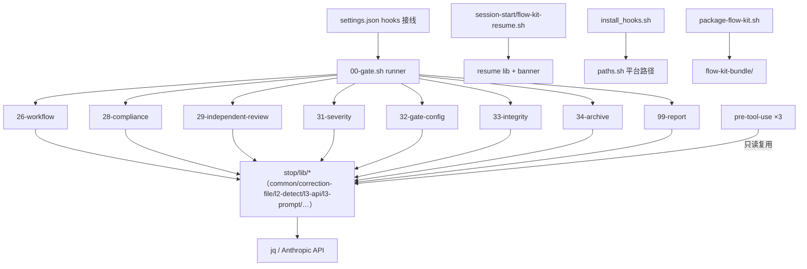

# 健康巡检 · 2026-09-01（Full Sweep · 全量检查）

> **触发**：用户 `/flow-health 全量检查`
> **模式**：完整审计（brooks-sweep 扫描维度 · **报告模式**，自动修复按 flow-health R3.3 纄束跳过——用户指令为「检查」）
> **上次**：99/100（2026-08-04 POST-FIX）· 基线 98（2026-07-25）· 历史 89（2026-08-03）

---

## 综合分

- **当前：97/100** 🟢（与基线同口径评分）
- 上次：99/100（2026-08-04）
- 趋势：**↓ 2**（非回归——2 项新增 🟢：M10 结转 + 工作区卫生；bash 重复率反而 0.47%→0.35% 改善）
- **扩展口径参考：94/100**——本次首度纳入 shellcheck warning 级扫描（TD-023 首见项 -3）。与基线不同镜头，不纳入趋势对比。

### 评分构成

| 项 | 扣分 | 说明 |
|---|---|---|
| 🟢 jscpd bash 重复 5 clones（0.35%） | -1 | 防御性 guard idiom 残留类（基线同款 6→5） |
| 🟢 M10 结转（29 号 M0 块 ~90 行 3 职责） | -1 | correction-hygiene 盲审登记，显式延后 |
| 🟢 工作区卫生（2 孤儿 specs 目录 + 1 外来 junk 文件） | -1 | 用户决策项 |
| 🟡 TD-023 shellcheck warning 级卫生（新维度首见） | 扩展口径 -3 | 未纳入同口径趋势 |

## 语法门禁 · 步骤 2.6

```
242 个脚本 · 0 错误 ✅（find 全仓 .sh，含 .specs/ 与归档脚本——覆盖面比上次 74 个更宽）
```

## 6 维生产代码风险（热点抽样：install_hooks.sh×9 commits / l3-api.sh×5 / 34-archive×4 / flow-kit-resume.sh×4 / correction-file.sh+33+29 号——均经本周期 13 轮 L2 盲审）

| 维度 | 🔴 | 🟡 | 🟢 | 备注 |
|---|---|---|---|---|
| R1 认知过载 | 0 | 0 | 1 | M10：29 号 M0 块 ~90 行 3 职责（已登记延后） |
| R2 变更传播 | 0 | 0 | 0 | 白名单/`HOOK_MODULE_NAMES` 单一源；双源测试 make check 门禁 |
| R3 知识重复 | 0 | 0 | 1 | strip_type 本周期已单源化（F1 修复）；残余 5 clones 为 guard idiom |
| R4 偶然复杂 | 0 | 0 | 0 | JIT source 理由已文档化 |
| R5 依赖混乱 | 0 | 0 | 0 | hooks→lib 严格单向，无循环 |
| R6 领域扭曲 | 0 | 0 | 0 | 命名前缀 6 类全守约 |

## 6 维测试代码风险（抽样：test_correction_hygiene / test_flow_active_integrity / test_independent_review_model / test_stop_chain / install 系列）

| 维度 | 🔴 | 🟡 | 🟢 | 备注 |
|---|---|---|---|---|
| T1 测试晦涩 | 0 | 0 | 0 | AC-N 场景命名 |
| T2 测试脆弱 | 0 | 0 | 0 | 行为断言（jq 比对/sha256/exit code）非内部细节 |
| T3 测试重复 | 0 | 0 | 1 | 68 个 bats 文件 setup 样板（BATS_ROOT 已统一；剩余为 bats 惯例） |
| T4 Mock 滥用 | 0 | 0 | 0 | 0 mock，真子进程 fixture 驱动 |
| T5 覆盖率幻觉 | 0 | 0 | 0 | 断言真实 |
| T6 架构错配 | 0 | 0 | 0 | unit/integration 分层合理 |

**测试基线**：764/764 全绿（0 失败，本周期两次 pre-commit 实跑），68 个 bats 文件，双源 diff -r 一致。

## 架构图



**判定**：全 🟢——单一 hub（stop/lib）+ 严格单向依赖，无循环、无跨层反向。安装/打包链与运行链隔离。

## 冗余巡检 · 步骤 2.5

**工具**：jscpd（bash 格式）+ shellcheck + AI grep 函数引用图（未用导出的 bash 等价物）

| 维度 | 🔴 | 🟡 | 🟢 | 元数据 |
|---|---|---|---|---|
| 字面重复块 | 0 | 0 | 1 | bash：5 clones / 0.35%（35/9935 行）↓基线 0.47%；全格式 13.50% 为 markdown prompt 结构性重复（TD-004 已文档化） |
| 未用导出 | 0 | 0 | 0 | 11 个候选全为假阳性（文件内 def+调用；`_` 前缀=文件私有约定）；`_grep` 为已锁决策保留 |
| 未用依赖 | — | — | — | N/A（纯 bash 仓库，jq/shellcheck 为外部工具） |
| 死代码·孤立文件 | 0 | 0 | 2 | `.specs/pre-commit-user-scope/`（1 个陈旧 PROGRESS.md）+ `.specs/smoke-test/`（空目录）；TODO/FIXME ~14 处多为文件名模式串非真任务 |

## shellcheck（本周期门禁为 error 级）

- **error 级：0**（make lint 门禁绿）
- **warning 级：64**（首次纳入扫描）：
  - `SC2155`×10 — 真实卫生项（local 赋值掩蔽返回值：l2-detect.sh:163、l3-prompt.sh:69/91/126 等）→ **TD-023 登记**
  - `SC2034`×26 — sourced-lib 假阳性为主（correction-types.sh 常量被消费于 source 之后，shellcheck 看不到跨文件）
  - `SC2015`×54 + `SC1091/1090`×61 — informational/已豁免风格
  - `SC2086` warning 级 0（style 级 4 处无实际风险）

## 技术债状态

- **TD 表：21/21 全 ✅**（TD-002…TD-022 无复活）——本次新增登记 **TD-023**（🟡 Scheduled）
- **LESSONS：13 条 active**（L-078/079/080 为本周期新增，知识库活跃健康）

## 行动建议（按优先级）

- 🔴 Critical · 无
- 🟡 Scheduled · 本季度：
  1. **TD-023**：SC2155×10 机械修（declare 与 assign 分离）+ SC2034 假阳性池加注释豁免——一个 health-fix change 可完成
  2. 孤儿目录清理：`.specs/pre-commit-user-scope/`（归档或删除）+ `.specs/smoke-test/`（空目录删除）
  3. `dsh-scm-test-untracked.txt`（外来 junk，untracked）——用户确认后删除
- 🟢 Monitored · 仅记录：M10（29 号 M0 块）、M11（SUMMARY 措辞）、guard idiom 5 clones、全格式 13.5%（结构性已文档化）

## 与上次对比（2026-08-04 · 99/100）

- **修了**：README 工作区杂改（git checkout 还原）；strip_type 双实现→单源（DRY）；bash 重复 0.47%→0.35%；33/29/correction-file 三文件经 13 轮盲审加固；user-scope 部署与仓库 cmp 一致
- **退化了**：无
- **新出现**：M10 结转（盲审新登记）；TD-023（扫描维度扩展首见，非代码退化）

---

*下次巡检建议：2026-10-01（周期性 health 模式即可）*
