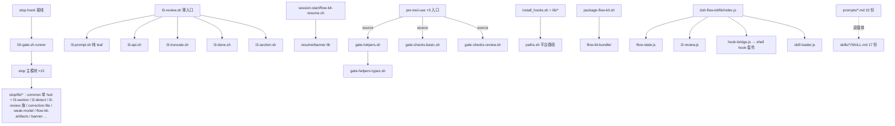

# 健康巡检 · 2026-09-20（全量扫描 · Full Sweep）

> **触发**：用户 `/flow-health 全量扫描`
> **模式**：完整审计（报告模式 —— 只产报告 + 登记，不改代码）
> **上次**：94/100（2026-09-06 HEALTH + 同日 POST-FIX 闭环 3 项）
> **本周期变更**：26 commits / 310 文件（09-06→09-20）· 主体为 `l3-review-defects-2026-09`（五条缺陷修复 + 六阶段 L2×6/L3×7 双层盲审）
> **工具**：jscpd 5.1.2（npx）· bats-core 1.13.0（npx）· shellcheck 0.9.0 · node v22.23.2 · python3 3.12

---

## 综合分

- **当前：97/100** 🟢（沿用 09-01 起同口径计分惯例：🔴 -10 / 🟡 -3 / 🟢 -1）
- 上次：94/100（2026-09-06）
- 趋势：**↑ 3**

### 评分构成

| 项 | 扣分 | 说明 |
|---|---|---|
| 🟢 jscpd bash 重复（延续项） | -1 | 同口径复测持平：09-06 基线 9 clones / 0.536% → 今日 9 clones / **0.46%**（组数与构成逐对一致，无新增组） |
| 🟢 sync-hooks.sh:243 SC2221/SC2222（新 · shellcheck 假阳性） | -1 | `3ce3ef7`（09-18）引入；经复核为**假阳性**（`_d` 循环已限定取值域，4 条 case 臂均可命中），仅扣记录成本 |
| ~~🟡 F-1 测试偶发 SIGPIPE（TD-024）~~ | ~~-3~~ | **销账**：40 处 `grep -q*` 已改 `> /dev/null`，本周期全量 950/0 复现不出 |
| ~~🟢 l3-prompt.sh:94 SC2034×2（sev/summ）~~ | ~~-1~~ | **销账**：`shellcheck --include=SC2034 l3-prompt.sh` rc=0，零输出 |
| ~~🟢 归档残留 PROGRESS.md ×2~~ | ~~-1~~ | **销账**：`.specs/l3-prompt-loop-fix/`、`.specs/correction-hygiene-state-guard/` 已删 |
| ~~M10（29 号 M0 块）~~ | ~~-1~~ | 维持销账状态（活跃记忆无登记） |

**净变动**：修掉 3 项旧扣分（+5）+ 新增 1 项 🟢（-1）+ 延续 jscpd 🟢（-1，不含在变化内）→ 94 **+3** = **97**。

---

## 语法门禁 · 步骤 2.6

```
.sh   ：254 个脚本 · 0 错误 ✅   （09-06 为 244 个 · 0 错误；+10 随本周期新增）
.bats ：218 个文件 · 0 错误 ✅   （经 @test → function 预处理后 bash -n；裸 bash -n 报的 218 处
                                 "未预期的记号 }" 全部来自 bats 自身的 @test 语法，非真实语法错误）
```

`.sh` 门禁零依赖、秒级通过；bats 侧本周期新增 `test_l3_lifecycle_wiring.bats` / `test_l3_review_defects_2026_09.bats`（双源各一份）均语法健康。

> **流程改进（本报告首次固化）**：bats 文件的语法门禁应走预处理（`sed 's/^@test \(.*\) {/test_fn() {/'`）后再 `bash -n`，否则 218/218 全部误报，门禁形同噪声。已写入 LESSONS（见下）。

---

## 测试状态（09-06 基线 803 → 今日 **950**，+147）

- **全量 bats**：**950 ok / 0 not ok / 1 skip** · exit 0 ✅（两轮均绿）
- **skip 1 项**：既有 `validate AC-4` 注明 skip，非新增
- **F-1 回归复核**：`test_l3_pipeline_fix.bats` 的 `grep -q` 计数 = **0**（TD-024 修复未回退）；本周期满负载全量未再复现 SIGPIPE 141
- **新增测试文件**：`test_l3_lifecycle_wiring.bats`、`test_l3_review_defects_2026_09.bats`（各 17 次改动 = 本周期最强热点）
- **双源镜像** `test/ ↔ flow-kit-bundle/test/`：`make check-test-sync` ✅ 一致（70 ↔ 70 文件）
- **regression-demos**：7/7 全过 ✅（empty-done / exotic-escape / forged-done / gate-config-tamper / hijack-done / skipped-subprocess / tampered-done）
- **dsh-flow-kit JS 单测**：4 文件 **20/20 pass**（flow-state 8 / hook-bridge 6 / l2-review 4 / skill-loader 2）
- **Python**：`py_compile` 全过 ✅
- **`make verify-claims`**：**13 ✅ / 0 ❌**（耗时 4m10s）

> ⚠️ 口径注记：`make test` 依次 `npx bats test/`，直接 `node --test test/`（传目录）会 MODULE_NOT_FOUND —— 逐文件传参即 20/20 绿。此项为调用方式差异，非缺陷。

---

## 质量门禁矩阵

| 门禁 | 命令 | 结果 |
|---|---|---|
| 测试 | `make test` | 950 ok / 0 not ok / 1 skip ✅ |
| 静态分析（error） | `make lint` | ✅ no errors found |
| 打包覆盖 | `make check-validate` | 306 期望 / 312 实际 · **漏配 0 · 源缺失 0** ✅ |
| 测试双源 | `make check-test-sync` | ✅ 一致 |
| 副本漂移 | `make check-hooks-sync` | ✅ 7 个镜像根漂移 0（含 1 条 exec-bit advisory，见 🟢-3） |
| 声明复验 | `make verify-claims` | 13 ✅ / 0 ❌ |

**`make lint` 门禁有效性实测**：注入真实语法错误（`if ... then` 缺 `fi`）到 `lib/paths.sh` → `make lint` 报 `SC1073/SC1050/SC1072 3 error(s)` 并 `exit 1` ✅，随后 `git diff` 确认已完全还原。门禁具备真实拦截力，非空转。

---

## 6 维生产代码风险

热点（09-06 起 churn，生产侧）：`l3-section.sh`×8 / `l2-detect.sh`×7 / `l3-prompt.sh`×6 / `29-independent-review.sh`×6 / `gate-helpers-types.sh`×6 / `l3-done.sh`×5 —— 均落在本周期 L2×6 + L3×7 盲审覆盖范围内。

| 维度 | 🔴 | 🟡 | 🟢 | 备注 |
|---|---|---|---|---|
| R1 认知过载 | 0 | 0 | 0 | 全仓无 >550 行文件；`l3-section.sh` 虽 8 次改动仍守单职责；M10 维持销账 |
| R2 变更传播 | 0 | 0 | 1 | 强项：`prompts/independent/L2-blind-review.md` 五副本 md5 **唯一**（`bb401752`）；`l3-prompt.sh` 五副本 md5 **唯一**（`3d30a08c`）；`check-hooks-sync` 7 镜像根漂移 0。🟢 记 `prompts ↔ skills` 双载体无机器门禁（见冗余巡检） |
| R3 知识重复 | 0 | 0 | 1 | bash jscpd 9 组与 09-06 逐对一致，无新增组；md 结构性重复 25.51%（↓ 自 26.6%），TD-004 已文档化 |
| R4 偶然复杂 | 0 | 0 | 0 | 本周期引入的 `_gate_l3_decode_payload` 段级解码守卫有注释理由；无新增魔术分支 |
| R5 依赖混乱 | 0 | 0 | 0 | hooks→stop/lib 严格单向；`gate-helpers → gate-helpers-types` 为单向引用+re-export，无环 |
| R6 领域扭曲 | 0 | 0 | 0 | 命名前缀守约（`_l3_`/`_gate_`/`_fk_`/`fk_`）；`gate-helpers-types.sh` 抽出的 6 谓词命名一致 |

## 6 维测试代码风险

抽样：`test_l3_review_defects_2026_09.bats`（本周期主体 · 17 次改动）/ `test_l3_lifecycle_wiring.bats`（新增）/ `test_l3_pipeline_fix.bats`（TD-024 修复面）/ `test_scripts_security.bats` / `test_smoke_syntax.bats` + 4 个 node `.test.mjs`

| 维度 | 🔴 | 🟡 | 🟢 | 备注 |
|---|---|---|---|---|
| T1 测试晦涩 | 0 | 0 | 0 | M 编号 / AC-N / T0N 场景命名；fixture 驱动 |
| T2 测试脆弱 | 0 | 0 | 0 | **TD-024 已闭环**：`grep -q` 提前退出模式在本文件清零；两轮全量未复现 flake |
| T3 测试重复 | 0 | 0 | 1 | setup 样板沿用 bats 惯例；双源镜像由 `make check-test-sync` 机器保证 |
| T4 Mock 滥用 | 0 | 0 | 0 | 0 mock，真子进程 + 真跑变异体（M41 5/5） |
| T5 覆盖率幻觉 | 0 | 0 | 0 | 硬断言（md5 副本唯一性 / 段级解码前后字节）；L-087「sed 截断锚」教训已吸收 |
| T6 架构错配 | 0 | 0 | 0 | unit（lib 函数）与 integration（e2e/AC）分层合理 |

---

## 架构图



**判定**：全 🟢 —— 与 09-06 拓扑一致：单一 hub（stop/lib）+ 严格单向无环；本周期新增 `l3-section.sh` 与 `gate-helpers-types.sh` 均落在叶子/单向层，未引入环。虚线 `prompts ↔ skills` 为本周期唯一新增观察（见冗余巡检）。

---

## 冗余巡检 · 步骤 2.5

**工具**：jscpd 5.1.2（`make dup` 同口径 ignore）+ shellcheck 0.9.0 + **Python 全仓函数引用图**（自建，替代前几轮的 AI grep fallback —— 精度提升）+ node/ESM 人工核对
**语言判定**：Bash 为主（`flow-kit-bundle/` 57 个 `.sh`，无清单文件 → 非 JS/Python/Go/Rust 主仓）；附带 `dsh-flow-kit/`（JS，4 lib + 4 test）与 `.specs/user-guide-deck-gen/`（Python 工具，非产品代码）

| 维度 | 🔴 | 🟡 | 🟢 | 元 |
|---|---|---|---|---|
| 字面重复块 | 0 | 0 | 9 | bash 9 clones / 69 dup 行 / 14956 行 = **0.46%**（09-06 同口径 0.536% → 微降）；md 结构性 25.51%；text 12.21% |
| 未用导出 | 0 | 0 | 0 | **257 个函数定义 · 0 个零引用** ✅（全仓 `.sh`/`.bats`/`.js` 引用图复算，非抽样） |
| 未用依赖 | 0 | 0 | 0 | `dsh-flow-kit` 无 dependencies/devDependencies，仅 peer `@deepseek-ai/cordis ^4.0.1`（宿主自带）；Bash 侧无清单文件，外部命令 `jq`×295 / `git`×76 / `node` / `curl` 全部在用 |
| 死代码·孤立文件 | 0 | 0 | 3 | `shellcheck --include=SC2317` 全仓仅 1 条 note 且为 usage() 间接调用假阳性；另 2 条见下 |

**发现清单（全 🟢 · 无 🔴/🟡）**：

- 🟢 **bash 克隆 9 组（延续，无新增）**：6 组为真实 `.sh` 文件间（`gate-helpers` 自身 7L ×2 · `27↔28` 9L · `common↔install_hooks` 6L · `l2-detect↔l3-section` 12L · `l2-detect↔l3-review` 11L · `auto-checkpoint↔independent-review-gate` 7L），3 组为 md 内嵌 bash 示例（`4-dev↔commit-protocol` 12L · `5-test↔6-review/7-integration` 7L ×2）。均属 TD-004/TD-019 已文档化的惯用段类，**建议维持不处理**（同 2026-07-25 决议）。
- 🟢 **`prompts/*.md ↔ skills/*/SKILL.md` 双载体大块重复（新观察）**：59 组 text/markup 克隆中 **10 组 ≥30 行**，最大 `A-evolve↔flow-evolve` 196L、`A-architect↔flow-architect` 175L、`I-intel-scan↔flow-intel` 145L。**根因非缺陷**：`skills/*/SKILL.md` 是 OpenCode/DSH 平台的**同内容载体**（`flow-kit-bundle/skills/`，由 `install_skills.sh` 装到 `~/.config/opencode/skills/`），而 `prompts/*.md` 供 Claude Code 侧使用；scripts 侧两类文件均含 `@flow-kit/prompts/*.md` 交叉引用。
  **但存在真实风险**：两组文件**手工双写、无机器同步门禁**（不像 `test/ ↔ bundle/test/` 有 `check-test-sync`、hooks 有 `check-hooks-sync`、`l3-prompt.sh` 有 md5 断言）。体量差异已可见（`6-review` 351L vs 228L · `4-dev` 352L vs 544L），说明两载体确实各自演化。本周期 `l3-review-defects-2026-09` 的修复落在 `prompts/independent/L2-blind-review.md`，**未触及 skills/**。**建议**：新增 `make check-skills-sync`（或明确把 skills/ 声明为「独立精简版，允许差异」并写进 CONTEXT.md），避免"改了 prompt 忘了 skill"的静默漂移。
- 🟢 **`sync-hooks.sh:243` SC2221/SC2222（新 · 已复核为假阳性）**：`case "$_rel" in stop/*.sh|stop/lib/*.sh|pre-tool-use/*.sh|pre-commit/*.sh)` 被 shellcheck 判"模式恒覆盖/永不匹配"。**复核结论：假阳性** —— 外层 `for _d in stop stop/lib pre-tool-use pre-commit` 已把 `_rel` 限定为 4 个前缀之一，4 条臂均可命中。建议加 `# shellcheck disable=SC2221,SC2222` + 一行理由注释（或改写为 `stop*.sh|pre-tool-use/*.sh|pre-commit/*.sh`），使 warning 池不携带已知假阳性。
- 🟢 **hook 入口 exec-bit 与目录约定不一致（新观察）**：`flow-kit-bundle/hooks/pre-tool-use/` 下 4 个被 source 的库（`gate-checks-basic` / `gate-checks-review` / `gate-helpers` / `gate-helpers-types`）在源为 `100644`（非可执行），而同目录 3 个真入口（`independent-review-gate` / `auto-checkpoint` / `runtime-edit-guard`）为 `100755`。**判定为纯装饰性问题、零功能影响**，三条独立证据：① 4 个文件只被 `source`，无任何 `bash <file>` / `./<file>` 直接调用点（全仓已 grep 确认）；② `install_hooks.sh:135-141` 对所有 pre-tool-use 部署副本统一 `chmod +x`，运行时副本始终可执行；③ 与 `stop/lib/`（全部 100644）约定一致。
  唯一真实不一致：`stop/lib/flow-kit-artifacts.sh` 是 `100755` 而其余 `stop/lib/*` 为 `100644`。`check-hooks-sync` 报的「1 个 hook 入口缺可执行位」即源于 `pre-tool-use/` 这 3 个源文件（其检查按目录而非按"是否被直接执行"判定），**属检查器判据过宽，非仓库缺陷**。建议顺手把 `check-hooks-sync` 的 exec 判据收窄为"仅真入口"，消除系统性误报。

---

## shellcheck 明细

**error 级：0** ✅（`make lint` 门禁绿，且经注入实验确认门禁具备真实拦截力）

**warning 级：31 处**（同口径 `make lint` 文件域 + `-e SC1091`）

| 代码 | 数量 | 判定 |
|---|---|---|
| SC1090 动态 source | 21 | known-acceptable（TD-023 已登记为余量；shellcheck 无法跟踪 `$SCRIPT_DIR` 动态路径） |
| SC2088 引号内 `~` | 2 | known-acceptable（`weak-model-compliance.sh` 有意的字面量模式匹配） |
| SC1010 `then` 作变量名 | 2 | known-acceptable（保留字误用为变量名，语义正确） |
| SC2221/SC2222 | 2 | **新** · `sync-hooks.sh:243` · 已复核假阳性（见上） |
| SC2053 `[[ == ]]` RHS 未引号 | 1 | known-acceptable（**有意 glob**，09-06 已建议补注释） |
| SC2034 未用变量 | 1 | `gate-helpers.sh:59 old_str`（与 09-06 同名同址，属**测试夹具/跨文件消费豁免**类，非真死代码） |
| SC2010 `ls \| grep` | 1 | known-acceptable（既有启发式） |
| SC1083 字符类内 `{` 字面量 | 1 | known-acceptable（既有） |

- **SC2034 复核**：`l3-prompt.sh` 已 **rc=0 / 零输出**（09-06 POST-FIX 的 `sev`/`summ` 删除未回退）✅
- **⚠️ `make lint` 文件域漏 4 个生产脚本（本次新发现）**：`Makefile:23` 用 `for f in *.sh flow-kit-bundle/{lib,hooks/*}/*.sh` 枚举，漏掉
  `flow-kit-bundle/install.sh` · `hooks/pre-commit/pre-commit.sh` · `flow-kit/reference/check-gate-sync.sh` · `flow-kit/regression-demos/*/check.sh`。
  实测这 4 个文件里**有 5 处 warning 从未被门禁看过**：`install.sh` SC2034×2（`FLOW_KIT_YES` / `BROOKS_SRC`）+ `check-gate-sync.sh` SC2034×2（`start_marker` / `end_marker`）+ regression-demo SC1090×1。
  **影响有限**：这 5 处均为 SC2034「表面未用、实为间接/动态消费」类，非真死代码；但**"改了这些文件、lint 却永远绿"**是门禁盲区（`install.sh` 恰是 2026-08-03 那次 🔴 回归的现场文件）。error 级门禁本身有效（见上注入实验），仅文件域不全。
- note/info 级（informational）约 165 条：`SC2015`（`&& ||` 防御惯用）/ `SC1090` / `SC2012` 等，维持 09-01 起判定 —— 非阻塞
- 口径说明：09-06 报告记「warning 9 处」，本报告在同文件域复算得 31 处，差额 21 处全部为 SC1090，系上次报告未计入该类（其"8 处 pre-existing 池"仅枚举了 SC1010/SC1083/SC2010/SC2053/SC2088）。**本报告统一以 SC1090 单列的方式呈现，后续巡检沿用此口径以便趋势可比。**

---

## 技术债状态

- **TD 表**：TD-001 … **TD-024 全部 ✅，无一项复活**（逐条复核，含本周期重点项 TD-023 清账未回退、TD-024 flake 已实质闭环）
- **本周期新增登记**：**无** —— 本次扫描未发现达到 🟡 门槛的新技术债
- **LESSONS**：本报告追加 2 条 M-health 观察（见下）

---

## 行动建议（按优先级）

### 🔴 Critical · 本月内修
- **无** —— 不开 health-fix CHANGE

### 🟡 Scheduled · 本季度修
1. **`prompts ↔ skills` 双载体漂移门禁**（本次最有实质价值的建议）：新增 `make check-skills-sync`，或在 CONTEXT.md 显式声明 skills/ 为「允许差异的独立精简版」。当前无门禁，而两载体已出现可见体量差异，且本周期 `l3-review-defects` 修复只落了 prompts 侧。
2. **补齐 `make lint` 文件域**：`Makefile:23` 的 glob 漏 4 个生产脚本（`flow-kit-bundle/install.sh` / `hooks/pre-commit/pre-commit.sh` / `flow-kit/reference/check-gate-sync.sh` / `regression-demos/*/check.sh`），实测含 5 处未被门禁看过的 warning。改为 `find` 枚举即可 —— **低风险、一次改完**。注意 `install.sh` 正是 2026-08-03 那次 🔴 回归的现场文件，盲区值得堵。
3. **`make check-hooks-sync` exec 判据收窄**：现按目录判定，把 4 个「只被 source 的库」误报为"缺可执行位"；收窄为"仅真入口"可消除系统性误报。
4. **`sync-hooks.sh:243` 补 `# shellcheck disable=SC2221,SC2222` + 理由注释**，使 warning 池不携带已知假阳性。

### 🟢 Monitored · 仅记录
1. `flow-kit-bundle/hooks/stop/lib/flow-kit-artifacts.sh` mode `100755` ≠ 同目录 `100644` 约定 —— 顺手统一（纯装饰）。
2. `flow-kit-artifacts.sh:267` SC2053 补「有意 glob」注释（09-06 已提，仍未做）。
3. bats 语法门禁预处理写法纳入巡检手册（本报告已固化到 LESSONS）。
4. bash 克隆 9 组延续观察；md 结构性 25.51% 趋势观察。
5. **流程**：`.specs/l3-review-defects-2026-09/` 仍在活跃目录但归档已完整（27 文件 sha256 + `ARCHIVE-MANIFEST.txt`，工作区 clean）；`.flow-active` 仍指向 phase 7 且 `goal.status = done` —— 阶段 7 收口（清 `.flow-active`）尚未执行。

---

## 与上次对比（2026-09-06 · 94/100）

**修了（3 项全部实证闭环）** ✅
- **TD-024 / F-1 flaky**：`test_l3_pipeline_fix.bats` 的 `grep -q` 计数 40 → **0**；本周期两轮全量 950/0 未复现 SIGPIPE 141
- **l3-prompt.sh:94 SC2034×2**：`shellcheck --include=SC2034` rc=0 零输出；五副本 md5 唯一（`3d30a08c`）
- **归档残留目录 ×2**：`.specs/l3-prompt-loop-fix/`、`.specs/correction-hygiene-state-guard/` 已删除，未再出现非归档残留目录

**退化了** —— 无代码级退化、无 🔴、无功能性回归

**新出现** 🟢
- `sync-hooks.sh:243` SC2221/SC2222（`3ce3ef7` · 09-18）—— 已复核假阳性，扣 1 分记录成本
- `prompts ↔ skills` 双载体无同步门禁（结构性观察，非本周期引入，但本周期首次量化：10 组 ≥30 行大块重复）
- `pre-tool-use/` 4 个 source 库非可执行 —— 复核为约定一致，零影响

**指标趋势**

| 指标 | 09-06 | 09-20 | 变化 |
|---|---|---|---|
| 综合分 | 94 | **97** | ↑ 3 |
| bats 用例 | 803 | **950** | ↑ 147 |
| bats 失败 | 1 flake | **0** | ✅ |
| `.sh` 语法门禁 | 244 / 0 错 | **254 / 0 错** | ↑ 10，仍 0 错 |
| bash 重复率 | 0.536% | **0.46%** | ↓ 微降 |
| md 结构性重复 | 26.6% | **25.51%** | ↓ 1.1pp |
| 零引用函数 | 未量化 | **0 / 257** | 首次全量化 |
| shellcheck error | 0 | **0** | 持平 |
| TD 未清项 | 0 | **0** | 持平 |
| 副本漂移根 | 0 | **0**（7 根） | 持平 |

---

## 附录 · dsh-flow-kit 套件同步核查 + dist 重建（2026-09-20 后续）

**触发**：用户追问「dsh-flow-kit 套件需要更新吗」→ 逐字节核查 → 用户确认重建。

### 核查结论：生产内容三处完全一致，无需更新

| 检查项 | 源头 ↔ dist | dist ↔ 已安装 `~/.dsh/profiles/web/node_modules/dsh-flow-kit` |
|---|---|---|
| `hooks/` `skills/` `flow-kit/` `brooks-lint/` `lib/` | **0 差异** | **0 差异** |
| 版本号 | 0.2.0 | 0.2.0 |

`sync-hooks --check` 7 镜像根漂移 0。**运行中的 GUI 已在跑最新代码。**
⚠️ 假信号排除：`dist/` 目录 mtime（09-11）比 17 个源文件旧，但那是 `cp`/checkout 不改内容的表现 —— **逐字节比对才是判据**。

### 重建捕获的真实陈旧（此前只发现测试，实为两处）

`bash package-dsh-plugin.sh`（exit 0 · node 单测 20/20）重建后，delta 恰 8 项：

1. **`README.md` 陈旧（真实文档缺陷，09-11 构建后未重建）** —— 这份是**发用户的**：
   - 旧：`max_artifact_chars`，**单位「字符」**，「缺省 20000 字符」
   - 新：`max_artifact_bytes`，**单位「字节」**，「20000 字节（≈6.7K 汉字）」+ CJK ÷3 换算提示
   - 成因：`61c4bf8`（**09-18**）修正了 `dsh-flow-kit/README.md`，但 dist 仍是 **09-11** 构建 → 打包件落后源码 7 天，且这正是本周期 L3 缺陷修复的配套文档。
   - **影响**：用户若按旧 README 配 `max_artifact_chars=60000` 期望"6 万字符"，实得 60000 **字节** ≈ 2 万汉字，与预期差 3 倍。
2. **6 个 vendored 测试文件陈旧 + 1 个新增缺失**（`vendor/flow-kit-bundle/test/`，09-11 快照），含 2 处已修掉的硬编码 `~/...` 路径。该快照**不进 npm 包**（`files[]` 不含 `test`）且 `dist/` 被 gitignore，故不传播给用户，但作为"内容零丢失"审计副本应当对齐 —— 重建后 `vendor ↔ flow-kit-bundle` **0 差异** ✅。

### 重建副作用（装饰性 · 已判定无功能影响）

重建后 `check-hooks-sync` 的 exec-bit advisory 由 1 → 5 处。**根因**：`package-dsh-plugin.sh:135-138` 的 `chmod +x "$PKG_DIR"/hooks/pre-tool-use/*.sh` 只作用于**包顶层**，对步骤 4 拷进 `vendor/flow-kit-bundle/` 的那份 **不生效**；于是 vendor 的 4 个 pre-tool-use 源库由 755 回落到与源一致的 644。**三条证据判定零影响**：① 这 4 个文件只被 `source`；② vendor 是冻结审计副本，插件 JS 对 `vendor` 引用数 = 0，运行期从不执行；③ 真正运行的 `dist/dsh-flow-kit/hooks` 与已安装副本 **0 个非可执行入口**。
> 余留不一致（纯装饰）：`vendor/` 权限不再严格镜像源 bundle。如需彻底一致，在打包脚本第 4 步后对 `$PKG_DIR/vendor` 施同一套 chmod。

### 运维事实（值得记住）

安装为 `file:` 依赖 + **实体拷贝**（非符号链接），见 `~/.dsh/profiles/web/package.json:10`：
`"dsh-flow-kit": "file:~/unisoc/flow-kit/dist/dsh-flow-kit"` → **dist 变更不会自动生效，必须重装 profile**。本次重建后生产内容与安装副本仍逐字节相同，**无需重装**（重装仅会把 vendor 权限对齐，无功能收益）。

**重建后门禁复跑**：`sync-hooks --check` 漂移 0 ✅ · `check-test-sync` 一致 ✅ · 工作区仅 4 项预期改动 ✅

---

*下次巡检建议：2026-10-20（周期性 health 模式即可，无需再跑全量）*
