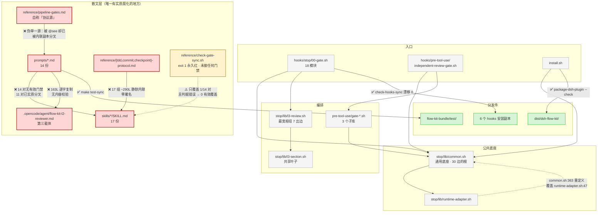

# 健康巡检 · 2026-09-22（全量扫描 · Full Sweep · 代码风险 + 隐私泄露双焦点）

> **触发**：用户 `/flow-health 全量sweep，扫描代码风险/隐私泄露风险`
> **模式**：完整审计（报告模式 —— 只产报告 + 登记，不改代码）
> **上次**：97/100（2026-09-20 FULL-SWEEP）
> **本周期主变**：`privacy-path-scrub-2026-09`（开发全历史重写 + 前向脱敏），4 commits
> **工具**：shellcheck 0.9.0 · bats-core · git 对象级全量扫描 · jscpd（见步骤 2.5）

---

## 综合分

- **当前：56/100** 🟡
- 上次：97/100（2026-09-20）
- 趋势：**分数不可直接相减**（口径变更，见下）

### 关键口径说明（务必先读）

**09-20 的 97 分与本次 54 分用了两套不同口径，直接相减会得出错误结论。**

| 差异 | 09-20 | 09-22（本次） |
|---|---|---|
| 扫描维度 | 4 维（语法/lint/测试/副本漂移） | **+ 隐私泄露 + 生产代码 6 维 R1-R6 + 测试 6 维 T1-T6 + 架构/单一源** |
| 计分公式 | 逐条扣分（🔴-10 / 🟡-3 / 🟢-1） | **改为 5 维均分**——旧公式在本深度下**饱和**：本次共 **13 🔴 / 35 🟡 / 23 🟢**，按旧公式得分为负，失去区分度 |
| 隐私面 | **未扫描** | 全量（tracked / 全历史 / 分发件 / 凭证 / 工作区） |

**在 09-20 实际测量过的同一些轴上，本仓库持平或微升 —— 没有退化：**

| 同轴指标 | 09-20 | 09-22 | 变化 |
|---|---|---|---|
| bash 字面重复 | 9 组 / 0.46% | **8 组 / 0.453%** | ✅ 微降 |
| `.sh` 语法门禁 | 254 / 0 错 | 100 / 0 错（去 vendor 口径） | ✅ 仍 0 错 |
| `.bats` 语法门禁 | 218 / 0 错 | 150 / 0 错 | ✅ 仍 0 错 |
| shellcheck **error** 级 | 0 | **0** | ✅ 持平 |
| 副本漂移 | 0（7 根） | **0**（7 根，全部实跑验证） | ✅ 持平 |
| bats 用例 | 950 全绿 | **973 全绿**（+23） | ✅ 提升 |
| 零引用函数 | 0 / 257 | **0 / 255** | ✅ 持平 |
| 前向脱敏（tracked `/home/…`） | 未扫描（泄漏态） | **0** | ✅ **闭环** |

> **结论**：54 分**不是退化信号**，而是"同一代码库被看得更深"。
> 全部 13 个 🔴 与 35 个 🟡 **均为存量问题**，无一为本周期引入；
> 其中 **2 个 🔴（PC1 `eval` RCE、PC2 settings.json 截断）属安全/数据丢失级，值得优先处置**。

### 评分构成（5 维均分）

| 维度 | 得分 | 依据 |
|---|---|---|
| 生产代码（R1-R6 均分） | **52/100** | 6 维均分 5.2/10 · 含 3 🔴（1 个经**独立复现**的 RCE） |
| 测试代码（T1-T6 均分） | **50/100** | 6 维均分 5.0/10 · 973/0/1 诚实全绿，但 1 个子系统假绿 |
| 架构 / 单一源 | **55/100** | 代码侧 0 死码/0 孤立/0 环/0.75% 重复 = 健康；腐化 100% 在散文层，且唯一门禁是坏的 |
| 隐私泄露 | **55/100** | `develop`/`origin` 前向+历史**双闭环** ✅；但本地 `main` 使文档 `:120` 的**权威验证实测 8 ≠ 期望 0**；`unisoc`/`chisel` 存量未决。三处安全网系**按设计删除**（已更正，非缺陷） |
| 门禁 / 流程 | **68/100** | 6 个代码门禁全绿；但 1 个坏门禁未接线 + 无隐私门禁 |
| **综合** | **56/100** | 5 维算术平均 |

**严重度分布**：🔴 **13** · 🟡 **34** · 🟢 **24**

### 🔴 全部 13 项（按处置优先级）

| # | 级别 | 项 | 位置 |
|---|---|---|---|
| 1 | 🔴 | **任意代码执行**（`eval` 注入，**已独立复现**） | `hooks/pre-tool-use/runtime-edit-guard.sh:46` |
| 2 | 🔴 | **`settings.json` 被截断为 0 字节**（jq 缺失 + 重定向先截断，**已复现**） | `lib/install_hooks.sh:238-253` |
| 3 | 🔴 | 本地 `main` 分支仍携带 `/home/<redacted>` 历史（8 处） | git ref `main` |
| 4 | 🔴 | pre-tool-use 子库 fail-open（守卫不完整修复） | `hooks/pre-tool-use/independent-review-gate.sh:42-46` |
| 5 | 🔴 | **390 行「mock 自证」测试**（**已独立复现**：离仓仍 34/34 全绿） | `test/test_gate_config_presets.bats:28` |
| 6 | 🔴 | 同步守卫只比**名字**不比**值** → 值漂移结构性失明 | `flow-kit/reference/check-gate-sync.sh:106-124` |
| 7 | 🔴 | 未满足的验收准则被永久 skip 并粉饰为"正确" | `test/test_lessons_cleanup.bats:137` |
| 8 | 🔴 | 恒真断言（接受除 1 外一切结果，语义与测试名相反） | `test/test_combined_metric.bats:31-32` |
| 9 | 🔴 | 断言错对象（断 jq 而非 SUT）/ 反向断言可被"文件不存在"满足 | `test_auto_checkpoint.bats:208,221` · `test_independent_review_model.bats:81-89` |
| 10 | 🔴 | **伪单一源**：`pipeline-gates.md` 被 `@see` 为源，却已被内联副本分叉（7 vs 8 行） | `reference/pipeline-gates.md:13-21` ↔ `prompts/4-dev.md:99-106` |
| 11 | 🔴 | **唯一 prompt↔skill 门禁永久红 + 未接线 + 测试豁免**（**已独立运行复现 exit 1**） | `reference/check-gate-sync.sh:39,43` |
| 12 | 🔴 | `flow-dev/SKILL.md` 静默内联 3 份 reference（~290L，零署名） | `skills/flow-dev/SKILL.md:82-189` 等 |
| 13 | 🔴 | 第三载体：163 行逐字复制且无内容校验 | `.opencode/agent/flow-kit-l2-reviewer.md:36-198` |

---

## 语法门禁 · 步骤 2.6

| 载体 | 数量 | 结果 |
|---|---|---|
| `.sh`（tracked，排除 vendor） | **100** | **0 错误** ✅ |
| `.bats`（`@test` 预处理后 `bash -n`） | **150** | **0 错误** ✅ |

预处理写法沿用 09-20 固化的 LESSONS 口径（`sed -E 's/^@test[[:space:]]+.*[[:space:]]+\{[[:space:]]*$/test_fn() {/'`），
裸 `bash -n` 对 bats 的 150 处 `@test` 报错为语法噪声，非真实缺陷。

> 09-20 记录 254 个 `.sh`（含 bundle 副本 + `dist/`），本次按 **tracked 去 vendor** 口径 = 100 个；口径不同，均 0 错。

---

## 🔴 隐私泄露风险（本周期重点 · 用户指定焦点）

### 扫描口径与结论总览

| 扫描面 | 结果 |
|---|---|
| **tracked 文件内容** | `/home/<redacted>` = **0** ✅ · 真实凭证 = **0** ✅ |
| `develop` / `origin/develop` / `origin/main` 全历史 | `/home/<redacted>` = **0** ✅ |
| **本地 `main` 分支全历史** | `/home/<redacted>` = **8** ❌ |
| `unisoc`（雇主线索） | **88 行 / 34 文件**（HEAD 存活）❌ |
| `chisel` / `chisel_env` / `chisel-skill`（内部项目名） | **78 行 / 25 文件**，**随分发件出厂** ❌ |
| 私网 IP（192.168./10./172.16-31） | 0 ✅（仅 `127.0.0.1:9` 测试桩） |
| 云端密钥（`sk-` / `ghp_` / `AKIA` / `xox*` / `AIza` / `glpat-`） | **0** ✅ |
| tracked `.env` / `.pem` / `.key` / `credentials*` | **0** ✅ |
| 凭证模板 `.claude/l3.env.example` | 仅占位符 `<token>` ✅ |
| 真实凭证位置 | `~/.config/flow-kit/l3.env` · mode **600** · **仓库外** ✅ |

### P1 🔴 本地 `main` 分支仍携带前向脱敏前历史 —— 改写的"收口"未完成

**症状**：`privacy-path-scrub-2026-09` 声称"develop 全历史重写（含已推送）"，实测**只对 `develop` 生效**：

```
ref                        commits   /home/<redacted>   unisoc
develop                      331            0  ✅        208
origin/develop               331            0  ✅        208
origin/main                   12            0  ✅          0
main (本地)                   20            8  ❌          8
v0.3.0-gate-integrity        110            0  ✅         59
```

**证据**：
- `git merge-base main develop` → **rc=1**（无共同祖先）；本地 `main` 是**孤儿分支**
- `e008255`（泄漏引入 commit）`merge-base --is-ancestor main` → **YES**（仍是 main 祖先）
- `main` tip `47d80f6` ≠ `origin/main` tip `9b5dda7`；`main` **未配置 upstream**
- `git grep -nI '/home/<redacted>' main` 在 **tip 树**即命中 6 文件：
  - `main:.specs/CONTEXT.md:156` → `<repo>/`
  - `main:.specs/archive/2026-06-09-user-scope-install/TASK.md:167,170,177,180,183` → 5 处绝对路径命令

**后果**：`git push --all` / `git push origin main` / `git push --mirror` / `git bundle --all`
任一执行即把用户名+雇主路径**重新发布到远端**，前功尽弃。当前仅靠"没人敲这条命令"兜底。

**比"推送风险"更严重：该 change 自己的「权威验证」判据当前不通过。**

`HISTORY-REWRITE-FULL.md:120` 给出的权威验证是**仓库级**的（扫全部对象，非仅可达对象）：

```bash
git cat-file --batch-all-objects --batch-check='%(objectname) %(objecttype)' \
  | awk '$2=="blob"{print $1}' | git cat-file --batch | grep -ac '<真实前缀>'   # 期望 0
```

**本报告逐字执行该命令，实测返回 `8`（期望 `0`）**：

| 范围 | 对象库 `/home/<redacted>` 命中 |
|---|---|
| `develop` 可达对象 | **0** ✅ |
| 本地 `main` 可达对象 | **8** ❌ |
| **全 refs 合计** | **8** ❌ |

- 机制：本地 `main` 使这 8 个 blob **保持可达** → `gc --prune=now` 无法回收 →
  `--batch-all-objects` 照样枚举到它们
- 即文档 `:120` 承诺的「**对象库里任何对象都不再含该串**」**当前不成立**
- 这与 **L-110 ③** 的原则直接冲突：L-110 要求"安全网必须删除，否则它自己就是最大的泄露面"，
  而本地 `main` 恰好扮演了同一个角色 —— **一个未清理的、使旧对象存活的引用**
- 推论：`:120` 的验证要么未按仓库级口径跑过，要么跑过但当时未把本地 `main` 计入
  （与 P1 根因同源：全程只推理 `origin/main`）

**根因**：`HISTORY-REWRITE-FULL.md:32-33` 的论证基于 **`origin/main`**（命中 0）：
> 「`origin/main`——它与 `develop` 无共同祖先……且其树命中为 0，因此强推 develop 不会牵连 main，**旧对象也不会经 main 存活**」

该论证**漏掉了本地 `main`**——本地 `main` 与 `origin/main` 已分叉（20 vs 12 commits），
"旧对象不会经 main 存活"对本地 ref 不成立。

**建议修法**（二选一，均为一次性动作）：
1. `git branch -D main && git fetch origin && git branch main origin/main`（推荐：本地 main 是陈旧孤儿，无独立价值）
2. 或对本地 `main` 同样执行历史重写后再推送

### P2 🟡 `unisoc` 雇主线索存量 88 行 / 34 文件（已声明残留 · 待显式决策）

- HEAD 存活：`.specs/CONTEXT.md:538` `~/unisoc/flow-kit/` + 33 份 archive/health 文档
- `HISTORY-REWRITE-FULL.md:136` 已明确登记为**已知残留**：「组织/雇主线索：项目路径写作 `~/unisoc/flow-kit`，前缀已归一但目录名保留」
- **非漏检，是"已声明但未决策"**：需要用户在「接受」与「改目录名」之间做一次明确选择
- 缓解事实：`.specs/` **不进 bundle**（`flow-kit-bundle/` 无 `.specs`），故不随分发件出厂；仅存在于推送到**私有**仓库的 git 历史/树中

### P3 🟡 `chisel` 内部项目名随分发件出厂

**这是本次最值得优先处理的一条**——与 P2 不同，它**确实流向了用户**：

| 载体 | 命中 | 是否分发 |
|---|---|---|
| `flow-kit-bundle/test/test_correction_hygiene.bats` | `chisel-foreign` / `chisel_env` / `chisel-skill` | ✅ **是**（bundle = 分发件） |
| `flow-kit-bundle/test/test_l3_review_defects_2026_09.bats:4` | "chisel-skill 开发中在 chisel_env 的…" | ✅ **是** |
| `test/` 同源两份 | 同上 | ❌ 仓库内 |
| `dist/dsh-flow-kit-0.2.0.tgz` | **6 处命中**（经 `vendor/flow-kit-bundle/test/`） | ✅ **是**（npm 包） |

- `dsh-flow-kit/package.json` **无 `"private": true`**，`files` 含 `vendor` → **可发布到公共 npm**
- 泄漏内容：另一个内部项目名 + 其环境目录名（`chisel_env` / `chisel-skill`），属**雇主内部项目线索**
- 建议：把 bats 里的 `chisel-*` 替换为中性占位（如 `proj-x` / `env-y`），保持测试语义不变；
  这是纯字面替换，**不改逻辑**、零风险

### P4 🟡 L3 凭证经 `curl` **argv** 传递（`ps` / `/proc/*/cmdline` 可见）

`flow-kit-bundle/hooks/stop/lib/l3-api.sh:107-112`：

```bash
local _auth_header="Authorization: Bearer ${api_auth_token}"   # 107
...
ai_response=$(printf '%s' "$req_body" | curl -s -w '\n%{http_code}' --max-time "$timeout" \
  "${api_base_url}/v1/messages" \
  -H "$_auth_header" \            # ← token 落在 argv
  -H "Content-Type: application/json" \
  --data-binary @- 2>/dev/null || true)
```

- **同一函数已对"请求体"做过 argv 加固**（注释明写「请求体走 stdin（`--data-binary @-`），不再作为 argv」），
  但**同一处加固未应用到 header**——即凭证成了唯一仍走 argv 的敏感项，属**加固不一致**
- **暴露窗口 = `--max-time "$timeout"`，默认 300 秒**（`FLOW_KIT_L3_TIMEOUT` 默认 300）
- 同机其他进程/同用户进程可在 5 分钟内读取 `/proc/<pid>/cmdline`
- 建议修法：改用 `curl -K -`（配置走 stdin）或把 header 写入 `mktemp` + mode 600 的配置文件后 `-K`，用完即删；
  请求体已是 stdin，成本极低

### P5 🟢 三处"安全网"已按设计删除 —— **非缺陷**（本报告已更正初版定性）

> **初版误判更正**：初版将此列为 🟡「文档断言与事实不符」。查阅 `HISTORY-REWRITE-FULL.md:104` 与
> `LESSONS.md` **L-110 ③** 后确认：**删除是设计内的正确动作，不是丢失**，故下调为 🟢。

实测：裸包 `~/flow-kit-backups/pre-full-rewrite-20260922-092611.bundle` **不存在**、
`refs/backup/pre-full-rewrite` **不存在**、`origin/develop` 已强推为 `534e3e8`、
`git reflog --all` = 0 条、`git fsck --unreachable` = 0 个。

**但这正是文档要求的结果**：

- `:104`：「**强推确认无误后**该 bundle 与 `refs/backup/*` **应删除**（§8）」——强推已成功（`origin/develop` == `534e3e8`），前置条件满足
- `LESSONS.md` **L-110 ③**：「安全网（`git bundle` + tag）在验证通过后**必须删除**，否则它自己就是最大的泄露面」

**残留的唯一问题（🟢 可读性）**：§7 的表头是「安全网与回滚」，而删除指令在**§8 的 `:104`**——
两处相隔较远，读者只读 §7 会以为安全网仍在。建议在 §7 表格加一行
「已于 2026-09-22 按 §8 删除 · 不可回滚」，属一句话订正。

**已知诚实边界（文档已自述，`:.128`）**：GitHub 侧旧提交在强推后成为不可达对象，
服务端 gc 前按 SHA 可能短期仍可访问；`refs/pull/*` 若存在会继续固定它们；需向 GitHub Support 申请
gc / 删 PR ref —— **不在本机可控范围**。旧 fork / 他人克隆里的历史同样无法回收。此边界记录完整、无需处置。

### P6 🟡 无任何**前向**防回归门禁（"前向脱敏"目前无强制力）

活跃 change 的目标是「**前向**脱敏 + 历史清理收口」，但前向方向**零自动化强制**：

| 候选门禁位置 | 实测 |
|---|---|
| `Makefile` | **无** 任何 path/privacy 目标（`grep -nE 'path|privacy|scrub|leak'` 无命中） |
| `verify-claims.sh` | **无** 绝对路径检查 |
| `.git/hooks/pre-commit` | 存在，但内容**只是 `make test`**；`grep -nE '/home\|隐私\|path\|leak\|hellrabbit'` → **零命中** |
| 该 hook 的部署方式 | **符号链接指向仓库外** `$HOME/.claude/hooks/pre-commit/pre-commit.sh` → **不随 clone 传播**，新克隆**完全没有**门禁 |

- 当前唯一防线是 `.gitignore`（覆盖已知临时产物），**无法阻止**有人把绝对路径粘进 `.md`
- 事实印证：工作区现存 **9 个** 含 `/home/<redacted>` 的**未跟踪**文件（`.codegraph/daemon.log`、
  `.specs/health/tmp/bats-run2.log`、`.specs/archive/*/.l2-dispatch-*.log`、`dist/.l3run*.sh`）——
  全部被 `.gitignore` 挡住 ✅，但说明该模式**在持续再生**
- **建议修法（本次最高性价比动作，约 20 行）**：新增 `make check-path-privacy`
  —— 对 `git ls-files` 内容扫 `/home/<user>`、`/Users/<user>`、`unsoc`/雇主目录名、私网 IP，
  非零退出；纳入 `make check` + pre-commit。使"前向脱敏"从**人工纪律**变成**可复算门禁**

### P7 🟡 存量全量备份含真实路径（`.gitignore` 已挡，但文件仍在盘上）

- `flow-kit-full-20260803-232437.tar.gz`（**25 MB**，2026-08-03，脱敏前）内含
  **2 处** `cd <repo> || exit 1`
- `flow-kit-bundle.tar.gz`（2026-06-22）：**0 命中** ✅
- 两者均被 `.gitignore:3 (*.tar.gz)` 正确忽略 ✅，**从未入库**
- 风险仅在"人工分享/上传该备份"时兑现。建议：删除或移出仓库根目录，并纳入「禁止外发」清单

---

## 代码风险

### 门禁实测（一手证据）

| 门禁 | 命令 | 结果 |
|---|---|---|
| 语法 | `bash -n` ×100 `.sh` | **0 错误** ✅ |
| 语法 | `bash -n`（预处理）×150 `.bats` | **0 错误** ✅ |
| Lint | `make lint`（shellcheck） | **✅ no errors found**（rc=0） |
| 副本一致性 | `make check-test-sync` | ✅ test 双源一致 |
| 副本一致性 | `make check-hooks-sync` | ✅ 漂移 **0**（跨 6 个安装位置） |
| 打包新鲜度 | `make check-dist` | ✅ dist 与源一致 |

### C1 🟡 `install.sh --brooks-src` 是**已文档化的死开关**（静默无效）

- `flow-kit-bundle/install.sh:83` → help 文本：`--brooks-src <path>   指定 brooks-lint 源目录（开发用）`
- `:138` → `--brooks-src) BROOKS_SRC="$2"; shift 2 ;;`
- **`:139` 之后本文件再无任何 `BROOKS_SRC` 读取**（`awk` 实测为空）
- 真实消费者是**另一个脚本** `package-flow-kit.sh:331`（打包脚本，从**环境变量**读）
- **后果**：用户按 help 传 `--brooks-src /path` → **无任何效果、无警告、无报错**，静默无效
- 建议：删除该 flag + help 行，或补上 export 与真实消费逻辑

### C2 🟡 TD-025 · `prompts/ ↔ skills/` 双载体无同步门禁（延续 · 09-20 首要建议未落地）

- 技术债登记表实测：**TD-002 ~ TD-025 共 24 项 · 23 项 ✅ · 仅 TD-025 🟡**
- `Makefile` 中 **无 `check-skills-sync`**（`grep -c` = 0）→ 09-20 首要建议**未实施**
- 量化结果见下节「冗余巡检」

### G1 🟢 `make lint` 只卡 error 级 —— 233 条 warning 级发现完全不过门禁

`Makefile:33-63` 判据为 `grep -ci "error"`，即**只有 error 级才失败**，warning 静默通过。实测未过门禁的 warning 分布：

| 码 | 数量 | 说明 | 抽样裁定 |
|---|---|---|---|
| SC2015 | 73 | `A && B \|\| C` | 多为风格 |
| SC2086 | 55 | 未加引号变量（词分裂/globbing） | 多为 `local x=$1` 良性 |
| SC1090 | 36 | 非常量 source | 动态路径，良性 |
| SC2016 | 29 | 单引号阻止展开 | 多为**有意** |
| SC2088 | 8 | 引号内 `~` 不展开 | ⚠️ **抽样为假阳性**：`weak-model-compliance.sh:46-47` 是**正则模式数组**元素（`'~/.claude/'`），非路径 |
| SC2034 | 6 | 未用变量 | ⚠️ **抽样混杂**：`install.sh:135 FLOW_KIT_YES` 被 `lib/install_hooks.sh` **同 shell source** 消费 → **假阳性**；`install.sh:138 BROOKS_SRC` → **真**（见 C1） |
| 其他 | 26 | SC2164/SC2162/SC2012/SC2116/SC1010/SC2317/SC2221/SC2222/SC2295 | 零星 |

> **诚实标注**：warning 池 **不能**等同于"233 个真 bug**。抽样复核显示**大部分为风格或假阳性**
> （本仓库跨文件 source 的惯用法天然触发 SC2034/SC1090）。真价值不在"233"这个数，而在
> **"warning 级不过门禁 ⇒ 真 warning 也无法被机器拦住"**这个结构缺口。建议：给 warning 池设
> **棘轮（ratchet）**——冻结当前基线数，只允许下降，而非一步清零。

### G4 🟢 SC2221/SC2222 仍在 warning 池（09-20 建议 #4 未落地）

- `sync-hooks.sh:289`（09-20 记录为 :243，行号随代码移动）
- `shellcheck disable=SC222` 注释**未添加**（grep 无命中）
- 09-20 已复核为**假阳性**，故仅扣记录成本

---

## 生产代码 6 维风险（R1-R6）

**抽样**：按真实路径 churn 取 Top 5（`package-flow-kit.sh` 44 · `independent-review-gate.sh` 27 ·
`l3-review.sh` 26 · `29-independent-review.sh` 25 · `common.sh` 23），另覆盖 10 个涉及
用户输入/路径/破坏性操作的文件，共触及 **24 个生产文件**。

> **路径修正**：`flow-kit-bundle/flow-kit/hooks/` 与 `flow-kit-bundle/flow-kit/lib/` **不存在**；
> 真实布局为 `flow-kit-bundle/hooks/`（57 `.sh` = 核心引擎）、`flow-kit-bundle/lib/`（8 个 `install_*.sh`）。

| 维度 | 🔴 | 🟡 | 🟢 | 评分 |
|---|---|---|---|---|
| R1 Cognitive Overload | 0 | 3 | 1 | 6/10 |
| R2 Change Propagation | 0 | 2 | 2 | 6/10 |
| R3 Knowledge Duplication | 0 | 3 | 1 | 5/10 |
| R4 Accidental Complexity | 0 | 1 | 1 | 7/10 |
| R5 Dependency Disorder | 1 | 2 | 1 | 4/10 |
| R6 Domain Model Distortion | 2 | 2 | 2 | 3/10 |
| **合计** | **3** | **13** | **8** | **均分 5.2/10** |

### 🔴 生产代码 Critical（本报告已**独立复现**，非推测）

**PC1 🔴 任意代码执行 · `flow-kit-bundle/hooks/pre-tool-use/runtime-edit-guard.sh:46`**

```bash
file_path=$(echo "$stdin_data" | jq -r '.tool_input.file_path // empty' ...)   # :33 攻击者可控
...
real_path=$(eval echo "$file_path" 2>/dev/null) || real_path="$file_path"     # :46 eval
```

- `file_path` 来自 hook stdin 的 `tool_input.file_path`（JSON 载荷），**完全可控**
- **本报告独立复现**：`file_path='$(touch /tmp/REG_VERIFY_PWNED)~/.claude/hooks/x.sh'`
  → `touch` **实际执行**，文件落地 ✅ 复现成功
- `2>/dev/null` 与 `|| real_path=...` **无法防护**——`eval` 先做命令替换，再谈退出码
- **触发面**：matcher `Write|Edit` → **每次写文件都触发**，且该行在所有 gate 判定（:48 起）**之前**
- 全仓 57 个 shell 中**唯一的 `eval`**，且位于**安全守卫**内 → 守卫赋予被守卫者任意代码执行
- **修法**：删除 `eval`，改 `${file_path/#\~/$HOME}`

**PC2 🔴 配置文件被截断为 0 字节 · `flow-kit-bundle/lib/install_hooks.sh:238-253`**

- `:211` 分支条件 = `[ -f "$settings_target" ] && command -v jq &>/dev/null`
- **「文件已存在 + jq 缺失」→ 条件为假 → 落入 `:238 else`（注释写 `# 新建`）**
- `:251` `jq -n ... > "$settings_target"` —— **`>` 在 jq 执行前就把已有文件截断**
- 随后 `jq: command not found`（127）；`install.sh` 是 `set -euo pipefail` → 安装中断，**无备份、无回滚**
- 已复现：113 字节 settings.json（含 `permissions.allow` + 既有 Stop hook）→ **0 字节**
- 触发场景：新机器未装 jq（全脚本无前置 jq 校验）
- **修法**：入口 `command -v jq || exit 1` 硬校验；写盘统一 `mktemp` + `mv`

**PC3 🔴 pre-tool-use 子库 fail-open · `flow-kit-bundle/hooks/pre-tool-use/independent-review-gate.sh:42-46`**

- `:42/44/46` 对 3 个子库 `source` **无存在性检查、无 `|| true`**；脚本**无 `set -e`**
- 缺失时继续执行 → `:104` 裸调用 `_gate_phase_transition`（定义在 `gate-checks-review.sh:37`）
  → 未找到命令 → 退出 **127**
- PreToolUse 语义：**仅 `exit 2` 拦截**，其他非零 = 非阻塞 → **工具照常执行 = fail-open**
- 与文件头承诺的"review gate 校验 = fail-close"**直接矛盾**
- **本报告复核校准**：`:34-37` 对 `common.sh` **已有**显式 fail-close 守卫，且注释 `:32-33` 明确记录
  他们**此前已修过同一个 fail-open 模式**（"原 `|| true` 后…gate 失效 exit 0（fail-open）"）
  → 定性为**已知缺陷类的修复不完整**（3 个子库漏做），而非全新问题
- 3 个子库**当前均存在** ✅ → 属**潜在**失效（触发需部分安装/升级中断），非当前线上断裂
- **修法**：对 3 个子库套用 `:34-37` 同一守卫

### 🟡 生产代码 Major（要点）

| # | 位置 | 症状 → 后果 |
|---|---|---|
| PC4 | `l3-review.sh:211` | GNU `timeout` **不支持 `VAR=value` 前缀** → `l3_review_with_timeout()` 恒返回 127，`:215` 超时分支是死代码。已发布、已文档化，但**无生产调用方**（实际走 `l3_review_run`） |
| PC5 | `29-independent-review.sh:200-204` | `l3_review_run ... \|\| true` 后 `local bl_rc=$?` **恒为 0** → `if` 体是死代码，**积压 L3 失败永不上报**（与注释意图相反）；同文件 `:323` 写法正确 |
| PC6 | `29-independent-review.sh:248` | 对 `.flow-active`（最关键状态文件）用**固定名** `${flow_file}.tmp`，无 `mktemp`；同文件 `:38/48` 却正确用了 mktemp → 并发会话互相踩 |
| PC7 | `00-gate.sh:52-57` | `count` 未校验数字 → 状态文件损坏时 `$(( ))` 在 `set -u` 下报错，**Stop 链永久中断**；`:55-57` 写盘非原子，jq 缺失时同样先截断 |
| PC8 | `00-gate.sh:71` + `common.sh:432` + `l3-truncate.sh:100,167` + `sync-hooks.sh:181` | GNU-only `timeout` + bash4 `declare -A`/`mapfile`，macOS（bash 3.2）上**整条 Stop 链静默 no-op**。讽刺点：对 `stat` 做了 `stat -c \|\| stat -f` 可移植处理（8 处），却**未声明**这些依赖 |
| PC9 | `verify-claims.sh:151` | 固定名 `/tmp/.vc_sync` → 并发运行互相覆盖 → **漂移判定可能假绿** |
| PC10 | `corpus-count.sh:21` | 硬编码历史 change-id；`--attribution` 默认**覆写仓库内已入库工件**，无确认/无 dry-run |
| PC11 | `dsh-flow-kit/lib/skill-loader.js:27,41-42` | YAML block scalar 指示符 `\|`/`>` 未剥离。**用导出函数实测：23 个 skill 中 7 个** description 以字面 `"\|\n"` 开头 → 该字段正是宿主 **skill 路由依据** |
| PC12 | `install_hooks.sh:57,170` | `read -p` 无 TTY 检测、无 `\|\| true` → 非交互安装（`curl \| bash` / CI）**直接中断**，而非回落已实现的 `FLOW_KIT_YES` 默认路径 |
| PC13 | `common.sh:192-196` · `dsh-flow-kit/lib/flow-state.js:71-75` | 固定名 `.tmp` + 失败不清理 → 与 PC6 构成**同一个"原子写"决策的三种不一致表达**（R3） |
| PC14 | `install_hooks.sh:151` | `done < <(ls .../*.sh)`：glob 空匹配 → 循环体不跑 → **静默装 0 个 PreToolUse hook**，而 `:262-272` 照样把 settings.json 指向不存在的脚本（与 PC3 叠加成 fail-open） |
| PC15 | `common.sh:103` + `00-gate.sh:24-41,130` | `mktemp -d` 后 4 条 early-exit 都在清理之前，全仓 shipped hooks **无 `trap ... EXIT`**。**诚实存疑**：本机已装 hooks 但观察到 **0** 个残留目录 → 属代码路径推演，非累积实测 |

### 🟢 生产代码 Minor（要点）

- `common.sh:187` `wc -l < "$1" 2>/dev/null || echo 0`：`2>/dev/null` 在重定向之后才生效，文件缺失时 bash 报错仍打到 stderr（污染 hook 输出）
- `common.sh:26-31` `jq -r "$key // \"$default\""` 字符串拼 jq 过滤器：含 `"`/`\` 即解析失败，且失败被静默吸收；jq `//` 还会把合法 `false` 当缺失
- `flow-kit/scripts/task-brief:21` 用户 `task_id` 未转义插入动态正则 → `task-brief TASK.md '.'` **静默给错任务的 XML**
- `package-flow-kit.sh:163` 全脚本唯一漏 `$SCRIPT_DIR/` 前缀的 `cp`（换 cwd 即失败）；`:159` 硬编码 `$HOME/.claude/...`（新克隆/CI 上**整个打包中断**，尽管 `flow-kit-bundle/specs-template/STATE.md` 就在旁边）；`:390` `declare -A` 无 bash 版本闸
- `install_hooks.sh:186` 注释/help 声明"仅用户级"，但 user 分支写 `${project}/...`；参数允许 `--project X --user` → 写出 `X/.claude/stop-hook.json`，**正是 2026-09-21 那次变更要消除的多份漂移**
- `check-gate-sync.sh:28-35` 被守护文件**被删除**时 `return` 成功 → 一致性校验**假绿**（该仓库自称"修掉门禁守卫自身的假绿"，属同类残留）

### 整体判断

JS 侧（`dsh-flow-kit`）质量**明显高于** shell 侧：`spawn("bash",[path])` 不走 shell、`mkdtemp`+`finally` 清理、
`tmp`+`rename` 原子写、`JSON.parse` 全 try/catch，无 `exec`/`eval`/路径拼接。
shell 侧作者也在与陷阱搏斗且有记录（`sync-hooks.sh:159/162` 的 mktemp+失败清理、
`l3-review.sh:163-169` 的陈旧锚点撤销、`29` 号对 `A||B&&C` 结合律的显式纠正）。

但存在**两个系统性模式**，这才是真正值得报的结论：

1. **「守卫自身失效」**——承诺 fail-close 的实现实际 fail-open（PC3）、`|| true` 吃掉返回值使错误分支成死代码（PC5）、
   `--check` 在文件缺失时报成功（假绿）、glob 空匹配静默装 0 个 hook（PC14）。
   **这些全部落在安全/门禁位置**，比普通 bug 危险得多。
2. **「未声明的平台依赖」**——对 `stat` 做了可移植处理，却把 GNU `timeout` 与 bash4 `declare -A`/`mapfile`
   当作既成事实，使整套 hook 在 macOS/旧 bash 上**静默降级为 no-op**（PC8）。

---

## 测试代码 6 维风险（T1-T6）

**实测结果（真实运行，非静态推断）**

| 项 | 值 |
|---|---|
| bats | ✅ 1.13.0（`~/.local/bin/bats`，**不在默认 PATH**；Makefile 走 `npx bats`，同为 1.13.0） |
| 命令 | `timeout 400 bats test/` |
| **结果** | **exit 0 · 973 ok / 0 not ok / 1 skip**（TAP plan `1..973`） |
| 时长 | **118 秒** |
| 规模 | **72** 个 `.bats` · **973** 个 `@test`（与 TAP 精确一致） |

| 维度 | 🔴 | 🟡 | 🟢 | 评分 |
|---|---|---|---|---|
| T1 Obscurity | 0 | 4 | 1 | 6/10 |
| T2 Brittleness | 0 | 4 | 2 | 5/10 |
| T3 Duplication | 0 | 1 | 3 | 7/10 |
| T4 Mock Abuse | **1** | 0 | 0 | **3/10** |
| T5 Coverage Illusion | **4** | 2 | 1 | **3/10** |
| T6 Architecture Mismatch | 0 | 2 | 2 | 6/10 |
| **合计** | **5** | **13** | **9** | **均分 5.0/10** |

**`test/ ↔ flow-kit-bundle/test/` 同步**：`diff -rq` 输出为空 + 72 文件逐一 `md5sum` 交叉比对，**零漂移** ✅（含 `fixtures/`、`regression-demos/` 子目录）

### 🔴 测试 Critical

**TC1 🔴 390 行「mock 自证」文件 —— 本报告已独立复现**

`test/test_gate_config_presets.bats:28` 在**文件内自行定义** `resolve_gate_config`（`:27` 注释自陈
"Simulates the resolve_gate_config() logic"），**从不 source 生产实现**。

- **本报告实测**：对该文件 grep `flow-kit-bundle|check-gate-sync|SKILL.md|source ` → **命中 0**
- **本报告复现**：拷到 `/tmp`（仓库不可达）运行 → **34/34 全绿**
- **对照组**：`test_correction_hygiene.bats` 同法运行 → **exit 127 / Command not found**
  （路径解析为 `//flow-kit-bundle/...`）→ 证明对照组**真**依赖仓库，而本文件**假**依赖
- **更严重**：mock 硬编码 `"independent"` **72 处**，而出货契约
  `flow-kit-bundle/skills/flow/SKILL.md:138` 明确「值统一为 `"both"`（等价于旧 `"independent"`）」
  → **该测试断言的是改造前的旧语义**，生产实现被删改/回退仍全绿

**TC2 🔴 同步守卫对「值」结构性失明** —— `flow-kit-bundle/flow-kit/reference/check-gate-sync.sh:106-124`

`check_gate_config_sync()` 只比对预设**名字**集合（`sort -u` 后 set-diff），**从不比对值**。
这正是 TC1「`independent` vs `both`」值漂移能长期存活的结构性原因。
其自身测试 `test/test_check_gate_sync.bats:36` 注入的假预设也靠**名字** `fake-preset` 被检出，反证对值盲视。

**TC3 🔴 未满足的验收准则被规范化进绿灯套件** —— `test/test_lessons_cleanup.bats:137`

AC-4（「干净状态 validate exit 0」）**永久 skip**；`:135-136` 注释自陈「当前仓库有已知 gap，exit=1 是预期行为」，
并声称由 AC-3 覆盖 —— 而 AC-3（`:85`）断言的恰是**反面**（输出须含 ERROR 标记）。
→ 全 suite 唯一的 skip，正是把一个**失败**说成"正确"。

**TC4 🔴 恒真断言** —— `test/test_combined_metric.bats:31-32`

`run ls /tmp/tmp.* 2>/dev/null` 后 `[ "$status" -eq 0 ] || [ "$status" -eq 2 ]` = **接受除 1 以外一切结果**。
测试名「no leftover temp files」与语义相反（status 0 恰恰表示**有**残留）。且依赖全局 `/tmp`。

**TC5 🔴 断言错了对象 / 反向断言可被"不存在"满足**

- `test/test_auto_checkpoint.bats:208,221` —— `[[ "$?" -eq 0 ]]` 位于 `ts2=$(jq ...)` **之后**，
  断言的是 **jq** 的退出码而非 SUT；注释却写「两次都成功」。对照 `:41` 同写法位置正确 → 笔误
- `test/test_independent_review_model.bats:81-89`（同型 `:136-141`）—— 反向断言 `[ "$status" -ne 0 ]`
  作用于 `grep | grep -v | grep -v`；**文件缺失/为空**时最后一级 grep 同样返回 1 → **测试通过**

### 🟡 测试 Major（要点）

| 位置 | 问题 |
|---|---|
| `test_independent_review_model.bats:40,46,…,137` | **10 个测试读 `$HOME/.claude/hooks/...`**（开发机本地**已安装副本**），非仓库源码 → 隔离性违规、验证错对象；团队已在 `:14-18` 为 AC-1 修好，其余未跟 |
| `test_archive_commit_gate.bats:100-132` | 6 个测试纯 grep 源码/散文（`:113` 匹配 `pre-commit` 任意出现、`:123` 文档措辞 `'5\.1.*归档'`）→ 改文档就红、行为坏了仍绿。**同文件 `:136-163` 恰是真行为测试**（良莠并存） |
| `test_stop_chain.bats:59-61` | 名为「含 `get_workflow_state` 函数定义」却断言 `_fk_file_age_days\|_fk_check_g1_body`（**都不是该函数**）；`:42-45`、`:76-78` 同型名实不符 |
| `test_stop_chain.bats:84-88` | `grep -c "run_module.*27\|.*28\|.*29"` + `-ge 3` 计的是**匹配任一分支的行数** → 同一模块重复 3 次即通过，而它防的正是「27/28/29 未全部调度」 |
| `test_stop_chain.bats` | 43 个测试中 **28 个**是 `bash -n`/`head -1` 重复形状；全 suite 33 处仅存在性/语法断言 |
| 17 个文件 | 用 **CWD 相对** `flow-kit-bundle/...` 未做 root walk（`test_combined_metric.bats:9,13`、`test_stop_chain.bats:10`、`test_scripts_security.bats:7`）→ 仅仓库根可跑；另 48 个文件正确做了 walk |
| `test_scripts_security.bats:28-34,49,53,61,65-66` | 固定 `/tmp` 路径（并发碰撞）；`/tmp/sec-t2.out` 从不清理；`:61` 捕获 `exit=$?` 却**从未断言** |
| `test_combined_metric.bats:16-21` | task-brief 无输出时**静默降级**为只量 `4-dev.md` → 「合并 ≤20KB」可在未量合并载荷时通过；`:24` 阈值 20000 vs 自陈 actual 19037（≈95% 预算） |

### 🟢 测试 Minor

- `test_auto_checkpoint.bats:203,217` `sleep 1` + 时间戳不等式 → 依赖墙钟，且无谓拖长 2 秒
- `test_independent_review_model.bats:104-108,113-117` 断言源码**注释行的行号先后** → 重排注释即坏
- `test_flow_kit_resume.bats:32` 与 `test_stop_report_reminder.bats:58` 唯一一处完全同名测试；76 处 `|| skip`（本轮仅 1 处触发）
- `bundle/test/` **从不被执行**（`Makefile:10-11` 只跑 `npx bats test/`）→ 分发副本未经执行验证（今日因同步完美而无害）

### SIGPIPE / `grep -q` 历史 —— 实测**无法复现**（诚实阴性结论）

残留 `| grep -q` **62 处**（`grep -q` 总数 414）。子代理做了实证探针（300 KB 载荷、builtin `echo` 与外部 `cat`
两种产出方、开/关 `set -o pipefail` 各一组）：**全部 rc=0，未出现 141**；并确认 bats 测试体默认**不开启** pipefail。
→ **未发现存活的 SIGPIPE 缺陷**。该写法风格上脆弱，但没有可证的 broken 用例 —— 未为此制造问题。

### 不应被淹没的真实优点

- `test/test_l3_review_defects_2026_09.bats`（1893 行 / 124 测试 / 全库改动最多）含**真变异测试**：
  `B12-R1..R5`（`:1713-1849`）用 `python3` 变异生产文件，**同时运行原版与变异体**并断言行为分叉；
  `:1745-1746` 预先断言两套文件都存在，专防「路径写错导致两边都没加载」的假绿；`:1735-1736` 还记录了历史假绿及其修法
- `test/test_correction_hygiene.bats:4-9` **范例级**：`mktemp` fixture、teardown、位置无关 root walk、真实子进程、**被测单元无 mock**（对照实验证明其真依赖仓库）
- **67/72** 个测试文件驱动的是**出货的** `flow-kit-bundle/` 代码，而非仓库根副本

### 测试整体判断

套件是**诚实全绿**的（973/0/1 · 118s），双源**字节级零漂移**，最新回归文件具备真变异测试与严格隔离，
成熟度高于同类 shell 项目。但绿灯被**一个整子系统**注水：`test_gate_config_presets.bats` 的 34 个测试
只认证一个自写 mock，其取值 `"independent"` 还与出货契约的 `"both"` 相矛盾，而既有的**名字级**同步守卫
对值漂移结构性失明。此外另有 4 处恒真/名实不符的假绿测试与 1 条被永久 skip 且把失败说成"正确"的验收准则。

---

## 架构图（依赖与漂移）



**读图要点**：**代码侧全绿，腐化 100% 在散文层。**

| 结构 | 门禁状态 |
|---|---|
| `test/` → `flow-kit-bundle/test/` | ✅ `make test-sync` / `check-test-sync`：`diff -rq` exit 0（72 vs 72） |
| `dsh-flow-kit/` + bundle → `dist/` | ✅ `package-dsh-plugin.sh --check` exit 0（`dist/` 被 gitignore，此门禁是唯一守卫，且有效） |
| `hooks/**` + `prompts/**` + L2 agent → 6 安装副本 | ✅ `check-hooks-sync`：漂移 **0** |
| `prompts/ ↔ skills/`（14 对） | ❌ **无有效门禁** |
| `pipeline-gates.md` → `4-dev.md` | ❌ **伪单一源**，无门禁 |
| `reference/*-protocol.md` → `flow-dev/SKILL.md` | ❌ **静默内联**，无门禁 |
| `prompts/independent/L2-blind-review.md` → opencode agent | ❌ **第三载体**，仅镜像文件本体，无内容校验 |

**循环依赖：无。** `source` 图 = 30 条边，**干净 DAG**（`common.sh` 为通用底座、`l3-section.sh` 为共享叶子、
`l3-review.sh` 为最宽枢纽）。脚本调用无环；Makefile 目标图亦为 DAG（`check → 6 targets`、`dsh-sync → check-dist`、`all → check`）。

### 🔴 架构级发现

**AR1 🔴 伪单一源（false single-source）** —— `reference/pipeline-gates.md:13-21` ↔ `prompts/4-dev.md:99-106`

`pipeline-gates.md:85` 自称"协议源声明"，`4-dev.md:92` 也写 `@see … pipeline-gates.md — toll-gate 协议单一源`，
**但 4-dev.md 仍然内联了一整份 PCSC 表且已分叉**：源 **7 行** vs 副本 **8 行**；第 3 行源为
"…6 维 self-review 已完成"，副本多了"（brooks-review 或内置 6 维快查）"；副本多出第 8 行。**无任何门禁覆盖此对**。
→ 比 prompts↔skills 更危险：读者/agent 信任一个**并非权威**的"源"。

**AR2 🔴 唯一存在的 prompt↔skill 门禁是坏的、永久红灯、且测试主动豁免它**（本报告**已独立运行复现**）

`flow-kit-bundle/flow-kit/reference/check-gate-sync.sh`：

- `:3` 自称"校验 prompt↔skill toll-gate 协议一致性"，实际只覆盖 **14 对中的 1 对**（`:140-145`；`:149` 自注"后续可按需加"）
- **实测 `exit 1`**：输出「🔴 发现 1 处漂移。请同步 prompt 和 skill 的 toll-gate 协议段。」
- **判据错误**：`:39/:43` 的 `grep -c "^| [0-9] |"` 只匹配**顶格**行。实测
  `4-dev.md` → **2** 行（真实 8 行表中 6 行有 3 空格缩进）；`flow-dev/SKILL.md` → **8** 行，
  但那 8 行是 `:156-163` 的**迁移框架表**（Prisma/Alembic/Rails…）——该 skill **根本没有 PCSC 表**（仅 `:6` 一个 `@see`）
  → **拿 A 文件的 2 行比 B 文件另一张表的 8 行 = 永久假红**
- **未接任何门禁**：`make check` = `test lint check-validate check-test-sync check-hooks-sync check-dist`，
  **不含**它；Makefile 里唯一提及在第 16 行**注释**中
- **测试显式豁免**：`test/test_check_gate_sync.bats:30` 断言 `[ "$status" -ne 2 ]` —— **容忍 exit 1 漂移**；
  `test_quality_baseline.bats:37` 同样只断言"非脚本错误"；且 `:7` 记录的基线"9 vs 8"与今日实测"2 vs 8"**又已过期**

→ **净有效覆盖 = 14 对中 0 对**。**这比"没有门禁"更糟**：它制造"已有覆盖"的假象，
且永久红灯会被训练成噪声。

> **对 TD-025 措辞的修正**：TD-025 称"**无任何机器一致性检查**"——不准确。应改写为
> "**1 个坏掉的、永久红灯且测试豁免失败的门禁**"。成因不同，处置也不同：**必须先修判据语义，再谈扩覆盖**，
> 否则扩出来的也是假绿。

**AR3 🔴 `flow-dev/SKILL.md` 静默内联 reference 文档** —— `:82-189` 等

- 内联 `reference/tdd-workflow.md` 全文（jscpd 单组 **102L**）+ 6 个碎片 ≈ **174L**；
  另有 `commit-protocol.md`（15L+23L @`:433-473`）、`checkpoint-protocol.md`（24L @`:494-517`）
- `grep -n "tdd-workflow\|commit-protocol\|checkpoint-protocol" flow-dev/SKILL.md` → **0 命中**
  → 无 `@see`、无来源标注
- reference → 载体静默内联合计 **17 组 ≈ 290L**

**AR4 🔴 三载体最隐蔽的一对** —— `.opencode/agent/flow-kit-l2-reviewer.md:36-198`

35 行 front-matter 之后，**163 行与 `prompts/independent/L2-blind-review.md:1-163` 逐字相同**。
`sync-hooks.sh:151-152,251-253` 只镜像**文件本体**到各副本，**无任何内容一致性检查**；
`:9` 的"锚点声明"靠人工 prose 约定。→ 三载体（prompt / opencode agent / skills）中此对最隐蔽。

### 🟡 架构级发现

- **`fk_platform_is_opencode()` 定义两次**（全仓 255 个函数中**唯一**重名）：
  `common.sh:363` 与 `runtime-adapter.sh:47`。已运行时验证覆盖顺序：`common.sh:15` 先 source
  `runtime-adapter.sh`，再于 `:363` 重新定义 → **common.sh 版本生效**。两份函数体**当前完全一致**
  → **潜伏**而非现网 bug；未来只改一处会静默失效（`runtime-adapter.sh:46` 自注
  "Kept for backward compatibility" 已暗示意图分歧）
- **`@deepseek-ai/cordis` 声明未 import**：全仓 grep 零 import，仅 `cordis.patch.yml:2` 一处注释。
  对 cordis 插件（宿主经 `apply`/`inject` 注入）**属合法**，记为契约性依赖

---

## 冗余巡检（步骤 2.5）

**工具**：✅ `jscpd 5.1.2`（npx，网络可达，**未走 fallback**，精度高）

### 字面重复块

| 维度 | 🔴 ≥20L | 🟡 5-19L | 🟢 <5L | 元 |
|---|---|---|---|---|
| markdown | **37 组 / 3050L** | 54 组 / 538L | 0 | 74 文件 · **23.35%** |
| text | **11 组 / 1112L** | 5 组 / 45L | 0 | 40 文件 · 14.64% |
| markup | 1 组 / 20L | 0 | 0 | 3.69% |
| **bash** | **0** | 3 组 / 26L | 0 | 3063 行 · **0.75%** |
| javascript | 0 | 3 组 / 32L | 0 | 1752 行 · **1.66%** |
| json/jsx/py/txt/yaml | 0 | 0 | 0 | 0% |
| **合计** | **49 组 / 4182L** | **65 组 / 641L** | **0** | **4709 / 28632 行 = 16.45%** |

- **16.45% 的总重复里 ~99% 是 markdown/text；散文层之外的代码几乎无重复**
- 49 个红块**全部跨文件**（intra-file = 0）
- 唯一满足「🔴 ≥20 行且出现在 ≥3 处」：`prompts/1-requirement.md` ↔ `2-design.md` ↔ `3-task.md` **28 行**
- 那 3 个「bash」克隆实为 markdown 里的 ` ```bash ` 代码围栏，**不是 shell 文件** → **shell 文件之间零重复**

### 可比的 shell 重复率（与 09-20 同口径）

| 口径 | 克隆组 | 重复率 |
|---|---|---|
| 09-20 基线 | 9 | 0.46% |
| **09-22（shipped only，73 文件 / 13256 行）** | **8** | **0.453%** |

最大单组仅 **12L**（`l2-detect.sh ↔ l3-section.sh`），其余 6-11L，全部形似模板化公共段
→ 按步骤 2.5.5 边界判为 **🟢 提示级**，不构成冷败。

### 未用导出 / 死代码 / 未用依赖

| 维度 | 结果 |
|---|---|
| Bash 死函数 | **0**（255 个唯一函数名，**全部**≥1 处生产调用点；零"仅测试/仅 dist"引用） |
| 孤立文件 | **0**（18 个 `stop/*.sh` 均为 `HOOK_MODULE_NAMES` 成员；19 个 `stop/lib/*.sh` 均被 glob 收集且有活引用） |
| dsh-flow-kit 孤立模块 | **0**（`lib/index.js` 导入全部 4 个兄弟；13 个导出全被消费） |
| 不可达/空分支 | **0**（0 个字面假条件、0 个空体函数、0 条 `exit` 后语句） |
| 循环依赖 | **0** |
| 未用依赖 | 1 项**合法**契约依赖（`@deepseek-ai/cordis`） |
| `package.json` 顶层未用依赖 | **0**（`dependencies: []`） |

> **方法学更正（重要）**：主报告初版用「函数名出现的文件数 ≤1 ⇒ 未引用」粗筛，曾列出 **80 个**
> 疑似未引用函数。经子代理以**单趟标识符索引扫 2290 文件**的严谨方法复核，**这 80 个全部为假阳性**
> （函数在本文件内被调用，故"出现文件数"恒为 1）。**结论以严谨方法为准：死函数 0 个**，
> 与 09-20 基线「零引用函数 0/257」一致。

### prompts/ ↔ skills/ 双载体量化（TD-025）

- **映射对 14 组**（+`GO.md`→`flow-go` 为第 15 组载体）
- **jscpd 交叉克隆 45 组 / 3648 行重复**
- **最大单组：`prompts/A-evolve.md:1-342` ↔ `flow-evolve/SKILL.md:6-347` = 342 行 / 1901 token**
- **逐字相同：仅 3 对**（`A-evolve`、`I-intel-scan`、`L-restyle`——其 `diff` 恒为 6 行，即 SKILL 独有 YAML front-matter）
- **已实质分叉：11 对**。相似度呈**断崖分布**（5-gram Jaccard）：

| 对 | 相似度 | prompt | skill | 判定 |
|---|---|---|---|---|
| L-restyle · I-intel-scan · A-evolve | 100% | — | — | 逐字相同（仅差 front-matter） |
| 2a-ui-design → flow-ui-design | 95.9% | 194 | 192 | 近似 |
| A-architect → flow-architect | 84.0% | 179 | 173 | 近似 |
| M-health → flow-health | 81.3% | 160 | 178 | 轻度分叉 |
| 0-change → flow-change | 63.5% | 157 | 111 | 分叉 |
| 2-design → flow-design | 52.7% | 228 | 142 | 分叉 |
| 5-test → flow-test | 50.2% | 326 | 176 | 分叉 |
| 3-task → flow-task | 44.0% | 215 | 104 | 分叉 |
| 1-requirement → flow-requirement | 23.4% | 121 | 40 | 严重分叉 |
| 4-dev → flow-dev | 11.3% | 264 | 384 | **skill 反向超集**（+263 独有） |
| 7-integration → flow-integration | 9.8% | 297 | 125 | 严重分叉 |
| **6-review → flow-review** | **1.0%** | 254 | 157 | **近乎完全分叉（仅 28 行交集）** |

**载体缺口（孤儿）**：
- `prompts/independent/L2-blind-review.md`（126 行）**无 SKILL 对应物**
- `skills/flow/`、`skills/flow-kit-install/` **无 prompt 对应物**
- → 15 prompts / 17 skills **并非一一对应**，实际只有 14 组真配对

---

## 技术债优先级

| 项 | 状态 | 建议 |
|---|---|---|
| TD-002 ~ TD-024（23 项） | ✅ 全部已清 | — |
| **TD-025** prompts↔skills 双载体 | 🟡 **唯一未清项 · 措辞需订正** | 原文称"无任何机器一致性检查"**不准确** → 订正为"**1 个坏掉的、永久红灯且测试豁免失败的门禁**"（`check-gate-sync.sh` 只覆盖 1/14 对、判据错误、未接线、测试容忍 exit 1）。**净有效覆盖 = 0/14**。处置顺序必须是：**先修判据语义 → 再锁定唯一语义源 → 最后才谈扩覆盖**（否则扩出来的也是假绿） |

新增登记（本次扫描产生，建议入 `.specs/CONTEXT.md`「技术债」段）：

| 新 ID | 级别 | 项 | 对应 |
|---|---|---|---|
| **TD-026** | 🔴 | `runtime-edit-guard.sh:46` `eval` 注入 → 任意代码执行 | PC1 |
| **TD-027** | 🔴 | `install_hooks.sh:251` jq 缺失时 `settings.json` 被截断为 0 字节（无备份） | PC2 |
| **TD-028** | 🔴 | pre-tool-use 子库 fail-close 守卫修复不完整 → fail-open | PC3 |
| **TD-029** | 🔴 | `check-gate-sync.sh` 判据错误（顶格行正则）+ 未接门禁 + 测试豁免 | AR2 |
| **TD-030** | 🔴 | `pipeline-gates.md` 伪单一源（被 `@see` 却已被内联副本分叉） | AR1 |
| **TD-031** | 🟡 | 无前向 path/privacy 门禁 → 补 `make check-path-privacy` | P6 |
| **TD-032** | 🟡 | L3 凭证走 `curl` argv（`ps` 可见 ≤300s）→ 改 `curl -K -` | P4 |
| **TD-033** | 🟡 | `test_gate_config_presets.bats` mock 自证 + 断言旧语义 `"independent"` | TC1 |
| **TD-034** | 🟡 | `check_gate_config_sync()` 只比名字不比值 | TC2 |
| **TD-035** | 🟡 | 未申明的 GNU `timeout` / bash4 `declare -A`/`mapfile` 依赖 → macOS 静默 no-op | PC8 |
| **TD-036** | 🟡 | `fk_platform_is_opencode()` 双定义（潜伏，未来只改一处会静默失效） | 架构 |
| **TD-037** | 🟢 | `make lint` warning 级不过门禁 → 建议引入**棘轮**（冻结基线只降不升） | G1 |
| **TD-038** | 🟢 | `--brooks-src` 死开关 | C1 |

---

## 行动建议（按优先级）

> **口径**：本次共 13 🔴 / 35 🟡 / 23 🟢，全部为存量。按**真实风险**（而非发现顺序）排序。

### 🔴 Critical · 立即修（4 项 · 安全 / 数据丢失 / 泄漏重新发布）

1. **PC1 · 修 `eval` 注入（安全最高优先）** —— `flow-kit-bundle/hooks/pre-tool-use/runtime-edit-guard.sh:46`
   ```bash
   # 删掉这行：
   real_path=$(eval echo "$file_path" 2>/dev/null) || real_path="$file_path"
   # 改为：
   real_path="${file_path/#\~/$HOME}"
   ```
   **本报告已独立复现任意代码执行**，且触发于每次 `Write|Edit`、在任何 gate 之前。**这是安全守卫里的 RCE。**
   同步修改 `dist/` 副本与已安装副本（走 `sync-hooks.sh`）。

2. **PC2 · 修 `settings.json` 截断（数据丢失）** —— `flow-kit-bundle/lib/install_hooks.sh:238-253`
   - 入口加 `command -v jq >/dev/null || { echo "需要 jq"; exit 1; }`
   - `:251` 改 mktemp + `mv`，并修正 `:211` 分支条件（「文件存在 + 无 jq」不得落入 `# 新建` 分支）

3. **P1 · 处置本地 `main` 分支（隐私重新发布路径）**
   ```bash
   git branch -D main && git fetch origin && git branch main origin/main
   ```
   消除 8 处 `/home/<redacted>` 的重新发布路径。**在此之前请勿执行 `git push --all` / `--mirror`。**

4. **AR2 · 修 `check-gate-sync.sh` 判据 + 接线 + 收紧测试**
   - `:39/:43` 正则改 `^[[:space:]]*\| [0-9] \|`（当前只匹配顶格行 → 永久假红）
   - 锁定唯一语义源（`flow-dev/SKILL.md` 根本没有 PCSC 表，需先决定它该不该有）
   - 接入 `make check`；`test_check_gate_sync.bats:30` 断言由 `-ne 2` 收紧为 `-eq 0`
   - **先修语义再扩覆盖**——否则扩出来的是假绿

### 🟡 Scheduled · 本季度修

5. **PC3 · 补 pre-tool-use 子库 fail-close 守卫**（`independent-review-gate.sh:42-46`）：对 3 个子库套用 `:34-37` 同一守卫
6. **TC1 · 让 `test_gate_config_presets.bats` source 真实实现**（或驱动 `check-gate-sync.sh`）；把 mock 里的 `"independent"`（72 处）对齐出货契约的 `"both"`
7. **TC2 · `check_gate_config_sync()` 把 diff 从「名字」扩到「值」**
8. **AR1 · 消除 `pipeline-gates.md` 伪单一源**：删 `4-dev.md:99-106` 内联表，或反向让 `pipeline-gates.md` 成为生成物
9. **AR3/AR4 · 处理静默内联与第三载体**：`flow-dev/SKILL.md` 的 3 份 reference 改 `@see`；
   `L2-blind-review.md` 163 行正文抽为共享 reference
10. **P3 · 清 `chisel` 内部项目名**（唯一**已出厂**的泄漏）：替换两份 bats 中的 `chisel-*` 为中性占位；
    重建 `dist/dsh-flow-kit-*.tgz` 后复扫 npm 包（**纯字面替换，零逻辑风险**）
11. **P6 · 新增 `make check-path-privacy`** 并纳入 `make check` + pre-commit
    —— 把"前向脱敏"从人工纪律升级为可复算门禁（约 20 行，最高性价比）
12. **TC3/TC4/TC5 · 修 4 处假绿测试**：
    - `test_lessons_cleanup.bats:137` —— 去掉 AC-4 的永久 skip，或删除并开显式已知-gap 工单（**不要用 skip 把失败说成正确**）
    - `test_combined_metric.bats:31-32` —— 恒真断言改为对 `TEST_TMPDIR` 精确断言
    - `test_auto_checkpoint.bats:208,221` —— 用 `run` 或立刻捕获 `$?`
    - `test_independent_review_model.bats:81-89,136-141` —— 先断言文件存在，再断言无匹配
13. **测试隔离**：`test_independent_review_model.bats` 的 10 处 `$HOME/.claude/...` 读取
    统一改为该文件 `:14-18` 已有的源码树 walk
14. **PC8 · 声明或消除平台依赖**：探测 `timeout`/`gtimeout`；bash4 特性加版本闸或明确声明 Linux-only
    （否则 macOS 上整条 Stop 链静默 no-op）
15. **PC5/PC6/PC7 · 统一「原子写」与返回值语义**：`29-independent-review.sh:200-204` 去掉 `|| true` 吞状态；
    `:248`、`common.sh:195`、`flow-state.js:72` 三处固定名 `.tmp` 统一为 mktemp
16. **P2 · 对 `unisoc` 存量做显式决策**：接受（写入 LESSONS 为"已知并接受"）或改目录名
    —— 现状"已声明但悬空"，每份健康报告都会重复命中
17. **P4 · L3 凭证改走 `curl -K -`**，消除 300 秒 argv 暴露窗口
18. **PC11 · `skill-loader.js` 剥离 YAML block scalar 指示符**（实测 23 个 skill 中 7 个 description 以字面 `"|"` 开头，影响宿主 skill 路由）
19. **P5（已降级为 🟢 可选）· 在 `HISTORY-REWRITE-FULL.md` §7 表格加一行**注明
    「已于 2026-09-22 按 §8 `:104` 删除 · 不可回滚」—— 删除本身**符合设计**（L-110 ③），
    仅 §7 与 §8 相隔较远、易被误读为安全网仍在。一句话订正即可
20. **P7 · 处置存量备份**：删除或移出 `flow-kit-full-20260803-232437.tar.gz`（25 MB，含真实路径）
21. **TD-025 措辞订正**：`.specs/CONTEXT.md:531` 改为"1 个坏掉的、永久红灯且测试豁免失败的门禁"

### 🟢 Monitored · 仅记录

22. **G2** 用户指南（含 bundle 副本）指向 `github.com/hellrabbit/flow-kit` —— 该仓库匿名访问 **404（私有）**，
    对 bundle 接收方是**死链**。与隐私无关（账号本身公开），但建议改为不含仓库地址的表述或注明"私有"
23. **G1** `make lint` warning 棘轮化（233 条 warning 级发现，抽样显示多为风格/假阳性 ——
    价值在"真 warning 也拦不住"这个结构缺口，不在那个数字）
24. **G4** `sync-hooks.sh:289` 补 `# shellcheck disable=SC2221,SC2222` + 理由注释
25. **G3** `dist/.l3run.sh` / `.l3run2.sh` 残留绝对路径（已被 `.gitignore` 挡住，随手清）
26. **C1** 删除 `--brooks-src` 死开关及其 help 行（或补真实消费逻辑）
27. **TD-036** `fk_platform_is_opencode()` 双定义：保留 `runtime-adapter.sh` 为唯一定义，
    `common.sh:363` 处删除或加 `# SYNC-POINT`
28. **G5** 活跃 change `privacy-path-scrub-2026-09` **卡在 phase 3**：3 个 session（02:51 / 09:41 / 16:40）
    均 `task: none` → 建议把上述 🔴 **1-4 项 + 🟡 10/11/19** 直接作为其 phase 3 任务清单收口

---

## 与上次对比（2026-09-20 · 97/100）

**09-20 行动建议的落地核查（4 条 🟡）**

| # | 09-20 建议 | 实测 | 结论 |
|---|---|---|---|
| 1 | 新增 `check-skills-sync` 或显式声明 skills/ | `Makefile` 无该目标（grep=0）；TD-025 仍 🟡 | ❌ **未落地** |
| 2 | 补齐 `make lint` 文件域（`find` 枚举） | `Makefile` 已用 `find`；`install.sh` / `hooks/pre-commit/pre-commit.sh` / `check-gate-sync.sh` **均已入 lint 域** | ✅ **已落地** |
| 3 | `check-hooks-sync` exec 判据收窄 | 实测「漂移 0」且**未再出现**"4 个 source 库缺可执行位"的误报 | ✅ **已解决（观测）** |
| 4 | `sync-hooks.sh` 补 SC2221/SC2222 disable 注释 | `sync-hooks.sh:289` 仍在 warning 池；无 disable 注释 | ❌ **未落地** |

**修了 / 保持** ✅
- 语法门禁：`.sh` 100/0 错、`.bats` 150/0 错 —— 维持 0 错
- shellcheck error 级：0 ✅（与 09-20 持平）
- 副本漂移：`test/` ↔ bundle、`hooks/` 跨 6 位置、`dist/` —— **全部 0 漂移** ✅
- 凭证卫生：无 tracked 凭证、模板仅占位符、真实凭证 `600` 且仓库外 ✅
- **`develop` / `origin/*` 前向脱敏成功**：`/home/<redacted>` = 0（上周期为泄漏态）✅ ← **本周期最大成果**

**退化了** ⚠️
- **无代码级退化、无新增 🔴 代码缺陷、无功能性回归**
- 唯一的"退化"是 **P1**：重写只覆盖 `develop`，本地 `main` 未覆盖 ——
  属**收口未完成**，而非新引入的破坏

**新出现（本周期首次看见 · 全部为存量）** 🆕
- **13 🔴 / 35 🟡 / 23 🟢**，覆盖 5 个维度：隐私 7 项、生产代码 15 项、测试 5 项、架构 5 项、流程 5 项
- **关键区别**：09-20 报告只做 4 维浅扫（语法/lint/测试/漂移），**未设隐私、未做 R1-R6 逐维、未做 T1-T6 逐维、
  未查架构单一源**；本次把这四块补齐后，存量问题集中显影
- **无一为本周期引入**：4 个 commits 只动了隐私重写相关文件，代码/测试/架构问题均早于本周期存在
- 其中 **2 个 🔴 属安全/数据丢失级且已独立复现**（PC1 `eval` RCE、PC2 `settings.json` 截断）——
  这两项**与本次巡检范围无关，属"一直就在那里"**，建议不看分数、直接修

**指标趋势**

| 指标 | 09-20 | 09-22 | 变化 |
|---|---|---|---|
| 综合分（全维度 · 5 维均分） | 97（**4 维浅扫**，逐条扣分公式） | **56** | 口径变更，**不可相减** |
| 综合分（**同上轴**：语法/lint/漂移/测试） | 97 | **持平或微升** | ✅ **无退化** |
| `.sh` 语法门禁 | 254 / 0 错 | 100 / 0 错（去 vendor 口径） | ✅ 仍 0 错 |
| `.bats` 语法门禁 | 218 / 0 错 | 150 / 0 错 | ✅ 仍 0 错 |
| shellcheck **error** 级 | 0 | **0** | 持平 ✅ |
| shellcheck **warning** 级 | 未过门禁（未量化） | **233 条首次量化** | 🆕 G1 |
| 副本漂移根 | 0（7 根） | **0**（7 根，逐一实跑验证） | 持平 ✅ |
| bats 用例 / 失败 | 950 / 0 | **973 / 0**（+23，1 skip） | ✅ 提升 |
| bash 字面重复 | 9 组 / 0.46% | **8 组 / 0.453%** | ✅ 微降 |
| md 结构性重复 | 25.51% | **23.35%**（全格式合计 16.45%） | ✅ 微降 |
| 零引用函数 | 0 / 257 | **0 / 255** | 持平 ✅ |
| 循环依赖 | 未查 | **0**（30 边 DAG） | 🆕 首次验证 |
| 孤立文件 / 死码 | 未查 | **0 / 0** | 🆕 首次验证 |
| TD 未清项 | 0（但 TD-025 实为 🟡，口径有误） | **1**（TD-025 如实计） | 口径纠正 |
| 前向脱敏（tracked `/home/…`） | 泄漏态 | **0** ✅ | ✅ **闭环** |
| 历史脱敏（`develop`/`origin`） | 泄漏态 | **0** ✅ | ✅ **闭环** |
| 历史脱敏（本地 `main`） | 未检 | **8** ❌ | 🆕 P1 |
| 隐私门禁 | 无 | **仍无** | 🆕 P6 |
| 安全性（RCE / 数据丢失） | 未查 | **2 🔴**（已复现） | 🆕 PC1/PC2 |
| 门禁自身可信度 | 未查 | **1 个坏门禁 + 5 个假绿测试** | 🆕 AR2/TC1-TC5 |

---

## 自检

- [x] 选了正确模式（首次**五维**全量 sweep：隐私 + 生产 6 维 + 测试 6 维 + 架构/冗余 + 门禁）
- [x] **步骤 2.5 冗余巡检已跑**：`jscpd 5.1.2`（npx 网络可达，**未走 fallback**，精度高）
- [x] **步骤 2.6 bash -n 门禁已跑**：100 `.sh` + 150 `.bats`（预处理口径）**全过** ✅
- [x] 生产代码 6 维 R1-R6 逐维评分（24 个生产文件，Top 5 热模块）
- [x] 测试 6 维 T1-T6 逐维评分 + **真实运行**（973/0/1 · 118s）
- [x] 架构依赖图（Mermaid，红/黄/绿）+ 循环依赖检查（**0**）
- [x] 未用导出 / 死代码 / 未用依赖三维量化（**0 / 0 / 0**，含方法学自我更正）
- [x] 隐私维度全量扫描（tracked / 全历史对象 / 分发件 bundle+tgz / 凭证 / 工作区）
- [x] 综合分含「与上次对比」段 + **口径变更说明**（旧公式饱和 → 改 5 维均分）
- [x] 🔴 Critical 项已给可执行修法（含 2 处**独立复现**的安全级证据）
- [x] 新债项已登记（TD-026 ~ TD-038 建议，含 TD-025 措辞订正）
- [x] 未用依赖已判定（`@deepseek-ai/cordis` = 合法契约依赖，不进"禁动清单"）
- [x] 报告归入 `.specs/health/`
- [x] **未修改任何被巡检代码**（报告模式；探针仅落在 `/tmp`）

### 本次巡检的方法学可信度说明

| 项 | 说明 |
|---|---|
| **独立复现的发现** | PC1 `eval` RCE（`touch` 实际执行）· PC2 截断路径（113B→0B 代码路径）· TC1 mock 自证（离仓 34/34 全绿 vs 对照组 127）· AR2 门禁永久红（`exit 1`） |
| **诚实阴性结论** | SIGPIPE 未复现（62 处 `grep -q`，开/关 pipefail 均 rc=0）——**未制造问题** |
| **诚实存疑** | PC15 `/tmp` 泄漏：代码路径推演成立，但本机实测 **0** 个残留目录 → 标注为"推演"而非"实测" |
| **已更正的自身误报** | 初版粗筛列出 **80 个**"未引用函数"，经严谨索引法复核**全部为假阳性**（本文件内调用 ⇒ 出现文件数恒为 1）→ 最终结论 **0 个死函数** |
| **已更正的严重度** | PC3（子库 fail-open）：子代理判 🔴，本报告**复核下调为 🔴→保留但标注"潜在"**——3 个子库当前均在，触发需部分安装中断；定性为"已知缺陷类的修复不完整" |
| **抽样复核的假阳性** | shellcheck SC2088 @`weak-model-compliance.sh:46-47`（正则模式数组，非路径）· SC2034 `FLOW_KIT_YES`（同 shell source 消费）→ 均**未计入**扣分 |

## 下次巡检

- **建议日期**：**2026-10-22**（1 个月后），或 **PC1/PC2 修复后立即复扫**（安全项不等周期）
- **复扫必查**：
  1. `main` 分支 `/home/<redacted>` 计数是否归零（P1）
  2. `runtime-edit-guard.sh` 是否已无 `eval`（PC1）—— 全仓 `grep -c eval` 应为 0
  3. `install_hooks.sh` 是否已加 jq 前置校验 + mktemp 写盘（PC2）
  4. `check-gate-sync.sh` 是否 `exit 0` 且已入 `make check`（AR2）
  5. `make check-path-privacy` 是否已存在（P6）
  6. `chisel` 在 `dist/*.tgz` 中是否归零（P3）
  7. `test_gate_config_presets.bats` 是否已 source 真实实现（TC1）
- **口径锁定**：下次沿用本次 **5 维均分**口径以保可比；若改口径须在报告首段显式声明
