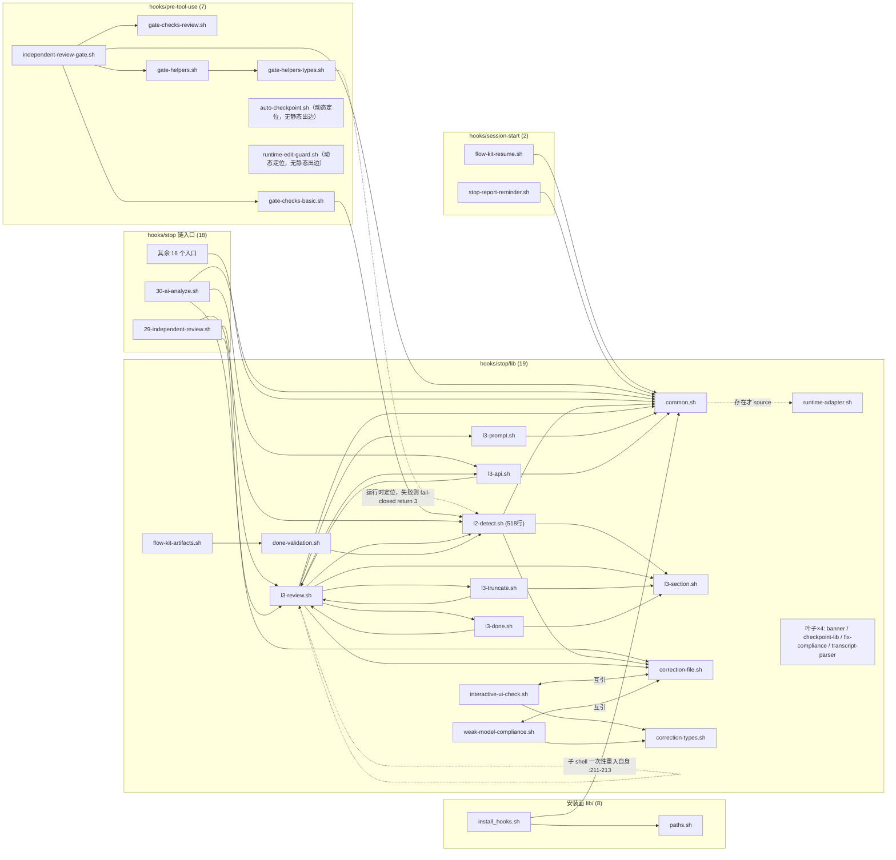

# 健康巡检 · 2026-09-29（全量扫描 · Full Sweep · 代码风险 + 隐私泄露双焦点）

> **触发**：用户 `/flow-health 全量扫描`
> **模式**：完整审计（报告模式 —— 只产报告 + 登记 + 反哺，不改代码）
> **上次**：56/100（2026-09-22 FULL-SWEEP）
> **本周期主变**：`health-fix-2026-09b`（归档于 `.specs/archive/2026-09-28-health-fix-2026-09b/`）· `privacy-path-scrub-2026-09`
> **工具**：shellcheck 0.9.0 · bats-core（`npx bats`）· jscpd 5.x（`npx`）· git 对象级全量扫描 · `bash -n` · Python 自写零引用扫描

> ⚠️ **脱敏约定**：本报告一律以 `/home/<acct>` 占位符指代本机真实账号路径。
> 这是刻意为之 —— 直接写出真名会被本报告自身变成新的泄漏点（见 §隐私泄露 · B2 的「自污染回路」）。
> **下游读者请勿"顺手"把占位符还原成真名。**

---

## 综合分

- **当前：55/100** 🟡
- 上次：56/100（2026-09-22）
- 趋势：**→ 持平**（−1，在评级噪声内；两轮口径已对齐，可直接相减）

### 评分构成（5 维算术平均）

| 维度 | 本次 | 2026-09-22 | Δ | 一句话依据 |
|---|---|---|---|---|
| 生产代码（R1-R6 均分） | **45/100** | 52 | **−7** | 架构方向健康（依赖 7.2 分、零环），但**连续三个 health-fix change 把复杂度堆进同一批文件**；含 1 个「守卫恒真」的死代码 |
| 测试代码（T1-T6 均分） | **58/100** | 50 | **+8** | 用例 973→**1116**，新增的 `test_path_privacy_gate.bats` 是全仓最高点；但**整子系统级 mock 仍 34/34 自证**且断言的契约值与出货契约相反，漂移 72→**92 处** |
| 架构 / 单一源 | **62/100** | 55 | **+7** | 字面层近乎满分：镜像漂移 **0**（6 根实跑）、零真环、`.claude/hooks` 镜像对已删除；零引用函数经标准化复测实为 **7/285**（原写 0/286 系口径错误，见附录 D-3）；**扣分集中在新增的 A1**（测试就地改写 tracked 源文件）与 D-1（14 对阶段载体 11 对已分叉） |
| 隐私泄露 | **48/100** | 55 | **−7** | 分发件/凭证面**干净**（0 命中）；但 tracked 面 **30 行**真名、全历史 **86 个泄漏 blob**、孤儿 `main` 永久可达，且**新增的隐私门禁对真实泄漏 0 捕获（`rc=0` 假绿）** |
| 门禁 / 流程 | **62/100** | 68 | **−6** | 9 个门禁**全部接线**且无竞争实跑 `rc=0`（上周期"唯一门禁是坏的"已解决）；但**假绿门禁**与**非封闭测试套件**使"全绿"不可信，另发现 `make test` 把全套件跑**两遍** |
| **综合** | **55/100** | **56/100** | **−1** | 5 维算术平均 |

**严重度分布**：🔴 **13** · 🟡 **24** · 🟢 **12**（🟢 中 1 条为事后更正新增的「死代码 7/285」，理由见附录 D-3）

### 关键口径说明（务必先读）

**本轮与上轮口径已对齐**，均为 5 维均分（生产 R1-R6 / 测试 T1-T6 / 架构单一源 / 隐私泄露 / 门禁流程），故 **55 vs 56 可直接相减**。这与 09-20→09-22 那次（口径变更、不可相减）不同。

**三条影响结论可信度的元事实**：

1. **⚠️ 勘误：本轮误判 brooks-lint 为「CLI 不可用」，实际它不是 CLI、且在本会话可用 —— 6+6 维走了不该走的内置回退（`L-100` 复发）**。
   - **形态**：brooks-lint **不是 CLI，也没有 CLI** —— `package.json` 无 `bin` 字段，它是**提供 6 个技能的插件**（`brooks-review` / `brooks-audit` / `brooks-debt` / `brooks-test` / `brooks-health` / `brooks-sweep` + `_shared`）。调用方式是技能，不是命令。
   - **安装状态**：**已装**。Claude Code 插件 `brooks-lint@brooks-lint-marketplace` **v1.3.0**（`installedAt 2026-07-10T23:51:35+08:00`，`installPath ~/.claude/plugins/cache/brooks-lint-marketplace/brooks-lint/1.3.0`）；仓内 vendor **同版本** `flow-kit-bundle/brooks-lint/plugin/`。
   - **本会话可用性（决定性实测）**：`skill("brooks-sweep")` **加载成功**，base dir = `dist/dsh-flow-kit/brooks-lint/plugin/skills/brooks-sweep`（解析链 `~/.dsh/profiles/web/node_modules/dsh-flow-kit` → 符号链接 → 仓库 `dist/dsh-flow-kit`，该目录下 6 个 brooks-* 技能齐全）。
   - **错误取证方式**：用「PATH 上有没有名为 `brooks-lint` 的可执行文件」判定插件装没装 —— 即**检验了一个从未存在过的形态**。给工具贴了它没有的标签（CLI），再用该自造标签去检验它，得出「不可用」。
   - **`L-100`（`LESSONS.md:70`）已完整记录同一错误**，并列出正确取证四项（工具目录 / marketplace skill / `.brooks-lint-history.json` 历史运行 / **本会话技能目录 6 个 brooks 技能**）——本次**一项未查**；且报告本段原稿还**引用**了 `L-100` 却原样复发。
   - **后果与影响面**：生产 45 / 测试 58 两维为**内置回退评分**，而标准化路径**全程可达**。按 `L-100` 记载的对照（带书本引用 **100% vs 约 16%**）与先例（上一轮 R3/R4/R5 三维全 0 系**漏判**而非「干净」，评审员独立复核出 4 条漏判项），这两维**存在系统性漏判风险，13🔴/24🟡 中生产/测试侧的构成可能被低估**。架构 / 隐私 / 门禁三维不受影响（均为命令级实测）。
2. **`make check` 无竞争实跑 `rc=0`，9/9 门禁全绿** —— 本次取得了上一轮拿不到的干净基线（上轮 `make check` 为污染期所得）。
   但**「全绿」本身不构成健康证据**：`check-path-privacy` 的绿已被证明是假绿（B1）。详见 §门禁流程。
3. **本次巡检期间发生 worktree 污染事件**（测试套件真实销毁源文件内容），已由主 agent 当场止损并逐字节还原。
   这既是本次最重要的发现（A1），也是「门禁不可信」的实证。完整时间线见 §附录 A。

### 同轴指标对比（两轮均实测过，最可比）

| 同轴指标 | 2026-09-22 | 2026-09-29 | 变化 |
|---|---|---|---|
| bash 字面重复（shipped-only shell） | 8 组 / 0.453% | **8 组 / 0.487%** | → 持平（+0.034pp，噪声内） |
| `.sh` 语法门禁 | 100 / 0 错 | **105 / 0 错** | ✅ 仍 0 错 |
| `.bats` 语法门禁 | 150 / 0 错 | **166 / 0 错** | ✅ 仍 0 错 |
| shellcheck **error** 级 | 0 | **0** | ✅ 持平 |
| 副本漂移 | 0（7 根） | **0**（6 根实跑） | ✅ 持平（`.claude/hooks` 根已消失） |
| bats 用例 | 973 全绿 | **1116 全绿**（+143） | ✅ 提升 |
| 零引用函数（生产侧） | 0 / 255 ⚠️ 口径不可比 | **7 / 285** | ❌ **上轮的 0 不可复现**（原口径把历史文档/注释里的提及也算作引用，见附录 D-3） |
| `make check` 聚合门禁 | 9 项（1 项坏、未接线） | **9 项全绿 `rc=0`** | ✅ **实质提升** |
| tracked 面 `/home/<acct>` | 报告自称 **0** | **30 行 / 6 文件** | ❌ **上轮的 0 不可复现**（见 B2） |

> **结论**：55 分**不是退化**，而是「两股方向相反的力相互抵消」——
> **测试层与门禁接线在真实变好**（用例 +143、门禁全部落地、`.claude/hooks` 重复根被删除），
> **而隐私层的"闭环"被证伪、测试套件被证明具有破坏性**，把增益吃掉了。
> 净值持平，但**风险的性质变了**：从「可见的红」变成「隐藏的绿」。

---

## 语法门禁 · 步骤 2.6（装/未装 brooks-lint 都要跑）

| 载体 | 数量 | 结果 |
|---|---|---|
| `.sh`（排除 `node_modules`/`.git`/`brooks-lint/plugin`/`brooks-tools`/`.claude/plugins`/`dist`） | **105** | **0 错误** ✅ |
| `.bats`（`@test` 预处理后 `bash -n`） | **166** | **0 错误** ✅ |
| shellcheck `-S error` 全量（`flow-kit-bundle/**/*.sh` 去 brooks-lint + 根 `*.sh`） | — | **0 error** ✅（`rc=0`） |

### 🟢 本次新增的预处理教训（应记入 LESSONS）

**旧预处理正则有漏洞，会产生假阳性。** 09-20 固化的写法用非贪婪引号匹配：

```bash
# ❌ 有漏洞：用例名含转义引号（\"）时匹配失败，残留 @test 行 → 假阳性
sed -E 's/^@test[[:space:]]+("[^"]*"|'"'"'[^'"'"']*'"'"')[[:space:]]*\{[[:space:]]*$/function __bats_test__ {/'
```

本次实测该写法在 4 个用例上漏改，产生 **4 个假阳性**（`test/test-is-git-commit-structural.bats:56` 等，用例名内含 `\"`）。
正确写法是**贪婪匹配到行尾最后一个 `{`**：

```bash
# ✅ 正确：贪婪吃掉引号与转义，只认行尾的 {
sed -E 's/^@test.*\{[[:space:]]*$/function __bats_test__ {/' "$f" | bash -n
```

> 裸 `bash -n` 对全部 166 个 `.bats` 会报 166 个「未预期的记号 `}`」假阳性（那是 bats 自身语法），
> 正是 09-20 已登记的坑。**本次的增量是：连"预处理后的写法"本身也曾有盲区** —— 与 `L-2026-09-20` 同族，但更隐蔽（只错 4/166，很容易被当成噪声放过）。

---

## 6 维生产代码风险

**抽样方式**：按近 30 天 churn 加权（196 commits）抽取 5 个模块。
**6 维均分 4.47/10 → 45/100**（上轮 5.2/10 → 52/100）。**🔴 7 · 🟡 15 · 🟢 6**。

### 逐维均分

| 维度 | 本次 | 说明 |
|---|---|---|
| R1 认知过载 | **3.2** 🔴×4 | 最差维度：超长函数 / 无 `main()` / Makefile 内嵌 bash |
| R2 变更传播 | 4.2 | 三条等价扫描路径手工同步 |
| R3 知识重复 | 3.8 🔴×1 | L2-first 动作链逐字复制两份 |
| R4 意外复杂度 | 3.6 | 手搓字节截断 / sentinel / 双轨 trap |
| R5 依赖失序 | **7.2** | **最健康**：五模块依赖全单向、无环 |
| R6 领域失真 | 4.8 🔴×2 | 守卫恒真 / 注释 banner 挂错位置 |

### 逐模块均分

| 模块 | 行数 | 均分 |
|---|---|---|
| `flow-kit-bundle/hooks/stop/29-independent-review.sh` | 336 | **3.2**（最差） |
| `Makefile` | — | 4.3 |
| `flow-kit-bundle/flow-kit/reference/check-path-privacy.sh` | 1051 | 4.5 |
| `flow-kit-bundle/hooks/stop/lib/l3-prompt.sh` | 522 | 4.7 |
| `flow-kit-bundle/hooks/stop/lib/l3-section.sh` | 292 | 5.7（最好） |

### 判词

**架构方向是健康的，但复杂度在向同一批文件堆积。**
三个连续的 health-fix change（`-09` / `-09b` / 本轮评估的 `-09c`）反复修改同一组 5 个模块，形成了「**为修 fail-open 而新增 fail-closed 分支**」的累积回路：
每一次修复都是**净安全改善**，但每一次都在同一函数里加一层判断。
结果是安全性上升、可维护性下降 —— 这正是本轮生产代码从 52 掉到 45 的机制。**这不是退化事故，是修复方式的副作用，应当在下一轮换一种拆法。**

### 🔴 生产代码 7 项

| # | 级别 | 项 | 位置 | 证据 |
|---|---|---|---|---|
| PC1 | 🔴 | **`\|\| true` 吃掉 `$?` ⇒ 失败守卫恒真、永不告警** | `flow-kit-bundle/hooks/stop/29-independent-review.sh:200-201` | `:200` `l3_review_run … $L3_BG_FLAG \|\| true` 紧跟 `:201` `local bl_rc=$?` ⇒ `bl_rc` 恒 0 ⇒ `:203` 的 `module_output "warning" "IR" "backlog L3 failed for phase ${pn} (rc=${bl_rc})——see hooks.log"` **永不打印**。积压翻查（`_l3_scan_backlog`，34 行，`:175-208`）的 L3 失败全静默。**一行改动，优先级最高。** |
| PC2 | 🔴 | **判据用文本近似代替语义**（横幅自称 error 级，实际用 `grep -ci error`） | `Makefile:34`,`:46`,`:47` | `:34` 横幅 `🔍 make lint: shellcheck (error level only)...`；`:46` `OUT=$$(shellcheck -e SC1091 "$$f" 2>&1) \|\| true;`（**默认严重度，无 `-S error`**）；`:47` `ERRS=$$(echo "$$OUT" \| grep -ci "error" \|\| true);`。三组对照实测见下 |
| PC3 | 🔴 | **无 `main()`：~270 行顶层直线代码，5 个 Gate 靠 `exit 0` 串联** | `flow-kit-bundle/hooks/stop/29-independent-review.sh:13` | `set -euo pipefail`；总 336 行，函数体仅 **66 行**（`_write_l2_missing_correction` 32 行 `:24-55`、`_l3_scan_backlog` 34 行 `:175-208`）；`grep -c '^main()'` = **0**。`:131` `phase_name="$(fk_phase_gate_key "$phase")"` 在**列 0** 夹在两个 Gate 之间。**无法单独测试任一 Gate。** |
| PC4 | 🔴 | **超长函数：`_l3_build_prompt()` 201 行** | `flow-kit-bundle/hooks/stop/lib/l3-prompt.sh:322-522` | 6 个 case 分支：1(`:327-337`)/2(`:338-391`)/3(`:392-398`)/5(`:399-405`)/6(`:406-446`)/7(`:447-502`)。同文件邻居 `_l3_extract_prior_findings` 90 行、`_l3_inject_context` 71 行 |
| PC5 | 🔴 | **Makefile 内嵌 203 行 bash** | `Makefile:162-365` | `:162` `check-nfr-portability-internals:` recipe 实测 **203 行**；`:163` `@bash -euo pipefail -c ' \`；`:292` `BAN="declare[[:space:]]+-A\|mapfile\|readarray\|readlink[[:space:]]+-[fe]\|(^\|[^[:alnum:]_])realpath([^[:alnum:]_]\|$$)\|stat[[:space:]]+-c\|sed[[:space:]]+-i\|grep[[:space:]]+-P\|find[[:space:]].*-printf"`。`$$` 转义使变量形如 `$$NFR_RC_FILE` ⇒ **无法 shellcheck、无法单测** |
| PC6 | 🔴 | **1051 行门禁脚本：46.1% 是注释，`scan_file()` 121 行，6 个手维护计数器** | `flow-kit-bundle/flow-kit/reference/check-path-privacy.sh:613-733` | 全文件 1051 行中纯注释 **484 行 = 46.1%**（`:9-63` 共 55 行是 T22/T-FIX-03/T-FIX-06 三轮修复变更史）；计数器 `CANDIDATE_COUNT`/`SCANNED_COUNT`/`SKIPPED_COUNT`/`UNREADABLE_COUNT`/`INDEX_SIDE_COUNT`/`UNATTRIBUTABLE_HITS`；`:882` 断言 `if [ "$CANDIDATE_COUNT" -ne $((SCANNED_COUNT + SKIPPED_COUNT)) ]; then` |
| PC7 | 🔴 | **L2-first 整条动作链逐字复制两份**（含同一报文） | `29-independent-review.sh:136-140` ↔ `:238-244` | 快路径前置 `[ ! -f "$review_md" ] \|\| ! grep -q "^## L2 盲审"`；D4 深检路径前置 `l2_detect_missing`。两者报文**逐字相同**：`module_output "warning" "IR" "L3 跳过（L2 not yet complete, gate_config=both · deny reason: L2-first 契约未满足）——主 agent 请派 L2 子 agent 并写入 ## L2 盲审 段后重试（见 .flow-active.correction）"`，各配 `_write_l2_missing_correction` + `exit 0` |

#### PC2 的三组对照实测（**修正了「门禁会静默放行」的指控**）

探针目录 `/tmp/hprobe/`：

| 组 | 构造 | shellcheck 输出 | `grep -ci error` | 判定 |
|---|---|---|---|---|
| A | 仅 warning + 路径**不含** "error" | 2 条 `(warning)`（SC2034/SC2154） | **0** | ✅ 正确 |
| B | 仅 warning + 路径**含** "error"（目录名 `with_error_dir`） | header 行 `In <file> line N:` 自带该词 | **2** | ❌ **假阳性** |
| C | 真 error 级（`if [ x = y ; then` ⇒ SC1009 info + SC1073 error + SC1072 error） | 3 条 | **4** | ✅ 正确，**无假阴性** |

> **结论：该判据只过宽、不遗漏。** 它会因 warn-only 文件而**误红**，但**不会把真 error 放过去**。
> 修法（改 `shellcheck -S error -f gcc` 按 `rc` 判红）依然正确；但**严重度应定性为 🟡 判据失真，而非 🔴 静默放行**。
> 此处保留 🔴 是因为它与 `:34` 横幅的**自述不符**构成契约说谎，须一并修。

### 🟡 生产代码 15 项（要点）

- **`gate_val` 推导 4 份**：`29-independent-review.sh:85-88`、`:131-134`、`:224-227`、`:259-262`（后两处带 TAB 缩进）。
- **`artifact` 拼接 5 份**：`l3-prompt.sh:335` `artifact="${artifact}"$'\n'"$(_l3_extra_deliverables "$artifacts_dir")"` 在 **`:389`/`:396`/`:403`/`:444`** 逐字重复（**4 行各带行尾空白** —— 复制粘贴指纹），`:498` 又写成 `artifact+=`。
- **`project_root` 推导两份**：`l3-prompt.sh:406-412` 与 `:448-453`（`if [[ "$artifacts_dir" == */.specs/archive/* ]]` 三层 vs 两层 dirname）。
- **`done_marker` 两套基路径**：`29-independent-review.sh:151` `${PROJECT_ROOT}/.specs/${change_id}/…` vs `:211` `${spec_dir}/…`（`spec_dir` 在 `:156` 被重设）。
- **NFR 包装 target case 体重复**：`Makefile:383` 与 `:402`（`check-nfr-portability` `:381-392` vs `-full` `:400-407`，`rc` 0/3/1/* 解码两份）。
- **grep 选项终止守护 4 份**：`check-path-privacy.sh:538`/`:590`/`:686`/`:971`。
- **剥注释规则两套实现**：`:306-312`（bash 参数展开 `core=${line%%#*}` + `case … *'<!--'*`）vs `:951-956`（4 段 sed 管道 `s/<!--[^>]*>//g` 等）。整行注释判定已收敛到同一 ERE `IS_COMMENT_OR_BLANK_RE`（`:288`），**尾随注释剥除仍是两套** ⇒ 建议抽 `strip_entry()`。
- **三条等价扫描路径手工同步**：`:613`（`scan_file`）/`:757-771`（index 批量）/`:841-854`（rev 批量）。`:882` 断言只兜「候选数塌缩」，**兜不住「三路命中口径不一致 ⇒ 漏报」**。
- **`_l3_utf8_head_stream` 47 行手搓字节截断 + sentinel**：`l3-prompt.sh:40` `data=$(head -c "$max_bytes" 2>/dev/null; echo _U8S_)` 配 `:41` `data=${data%_U8S_}`；`:166` `trimmed="$(printf '%s' "$l" | _l3_utf8_head_stream 197)…"`（**预算 200 写 197**）。
- **`make lint` 缺 shellcheck 时 fail-open**：`Makefile:40` `echo "   Skipping lint (non-blocking).";`（判断 `:38` `if ! command -v shellcheck >/dev/null 2>&1; then`）—— **与 `check-path-privacy.sh` 的 fail-closed 语义相反**。
- **`l3-section.sh` 50% 注释**：总 292 行 / 纯注释 **146 行 = 50.0%**（`:1-100` 是三代格式 G1/G2/G3 演化史）；`_l3_spans_impl()` 实测 **52 行（112-163）**，函数体整段 awk；`_sep_ok(i)` `:115-121` 是 awk 内隐式状态机。
- **注释 banner 挂错位置**：`l3-section.sh:54` banner 写 `# ── _l3_strip_sections() · …`，但 `:55` 讲的是 `_l3_escape_payload`；`_l3_strip_sections` 实体在 **`:258`**。⇒ 读者按 banner 定位会找到错的函数。
- **`_l3_verify_review_structure()` 66 行三态返回**：`l3-section.sh:191-256`，`:244-245` fail-closed issues / `:246-248` advisory NOTE；调用方 `29-independent-review.sh:267-300` **只升级可见性不阻断**。
- **中途 5 处 source**：`29-independent-review.sh:16`、`:96`（`correction-file.sh` `|| true`）、`:232`（`$l2_lib` `|| true`）、`:273`（`correction-file.sh` **第二次**）、`:281`（`l3-done.sh` `|| true`）。

### 🟢 生产代码 6 项

`:389`/`:396`/`:403`/`:444` 行尾空白（复制粘贴指纹）· `l3-prompt.sh:297` `stat -c%s … || stat -f%z … || wc -c` vs `:303` `_sz=$(wc -c < "$f")` 两套体积口径 · `check-path-privacy.sh:468-469` vs `:935` 重复声明 `HITS_TOTAL=0` · `:796`/`:815` 手动 `rm -f "$DM_BC_RAW"` 与 `:791` `register_tmp` + `:122` 单一 EXIT trap **双轨** · `Makefile:106` 单行 118 字符挤 9 个先决条件。

---

## 6 维测试代码风险

**抽样**：`test/test_common.bats` · `test/test_l3_review_defects_2026_09.bats` · `test/test_path_privacy_gate.bats` · `test/test_l3_lifecycle_wiring.bats` · `test/test_smoke_syntax.bats`。
**6 维均分 5.83/10 → 58/100**（上轮 5.0/10 → 50/100）。**🔴 3 · 🟡 5 · 🟢 2**。

### 逐维均分

| 维度 | 本次 | 说明 |
|---|---|---|
| T6 架构错配 | **8.0** | ⚠️ 原判「无发现」**属漏判** —— 标准化复测给 **🟡×2**：单元层 0 / 集成端到端层 1124（金字塔完全倒置），且高风险路径（`test_path_privacy_gate.bats` 35 例，真门禁）与自证 mock（`test_gate_config_presets.bats` 34 例）密度接近，**高风险路径反而密度更低**。见附录 D-2 |
| T1 晦涩 | 6.5 | ⚠️ 原依据「smoke 型断言占比高（~114 位点）」**口径被推翻** —— 那是**位点**口径；按**用例**口径仅 **1.4%**（15 个仅验存在 + 1 个全仓 `bash -n`）。标准化复测结论为「说 smoke 门禁覆盖不足在本仓**不成立**」。见附录 D-2 |
| T2 脆弱 | 6.0 🔴×1 | 32 处断言生产源码文本而非行为 |
| T3 重复 | 5.5 🟡×2 | 结构重复形状 **51.3%** |
| T4 Mock 滥用 | 5.0 🔴×1 | 34 个测试零生产依赖 |
| T5 覆盖率幻觉 | **4.0** 🔴×1 🟡×2 🟢×1 | **最重灾区**：mock 断言改造前旧契约 |

### 逐文件均分

| 文件 | 均分 |
|---|---|
| `test/test_path_privacy_gate.bats` | **8.8**（全仓最高） |
| `test/test_common.bats` | 8.0 |
| `test/test_l3_lifecycle_wiring.bats` | 7.0 |
| `test/test_smoke_syntax.bats` | 6.7 |
| `test/test_l3_review_defects_2026_09.bats` | **5.7** |

### 套件实测规模

| 指标 | 值 |
|---|---|
| `.bats` 文件 | **83**（top-level 80 + `test/weak-model-robustness/` 3） |
| 总 `@test`（top-level / 递归） | **1116** / 1124 |
| 镜像 `flow-kit-bundle/test/*.bats` | **1116**（一致） |
| 总行 | 16917 |
| 断言总数 | **3253** ⇒ **每测试平均断言 2.91** |
| 用 `run` 的测试 | 663 |
| **`run` 了但零验证** | **0** |
| skip 总数 | **43**（全部 `skip_if_no_jq`；另 `skip_if_no_review_package` 6、`skip_if_no_task_brief` 4） |
| bats-support / bats-assert 助手 | 0 · `load` 语句 0（**自建断言原语，零外部依赖** —— 这是优点） |
| 结构重复形状 | **573/1116 = 51.3%**，去重后 662 个形状 |

Top 形状：`run:[T].` 126 · `grep.` 44 · `run:[T].[T].` 40 · `_load_gate.run:[T].` 19 · `grep.grep.` 12。
单文件重复率 Top：`test/test_stop_chain.bats` **43/43 (100%)** · `test/test_archive_commit_gate.bats` 37/45 · `test/test_gate_config_presets.bats` 29/34 · `test/test-is-git-commit-structural.bats` 19/22 · `test/test_quality_baseline.bats` 16/16。

> **⚠️ 诚实修正（方法论价值高于数据本身）**：
> 初版解析器报「11 个零断言测试」，**经复核全部是误报**，非假绿。两种本仓**合法**惯用法被漏判：
> ① **裸退出码断言**（依赖 bats `set -e`）—— `test/test_flow_artifacts.bats:78,85,91,97,103,109,114` 形如 `! fk_file_nonempty "$TEST_TMPDIR/threshold.md"`；
> ② **管道 grep 断言** —— `test/test_l3_pipeline_fix.bats:266,375,448,458` 形如 `printf '%s\n' "$out" | head -1 | grep '^critical|…' >/dev/null`。
> ⇒ **确认的零断言测试 0 个**，**2.91 是下界**。
> **教训：「统计口径的盲区会伪装成发现」** —— 与 `L-092`（basename 去重把 7 压成 4）同族。

### 🔴 测试代码 3 项

| # | 级别 | 项 | 位置 | 证据 |
|---|---|---|---|---|
| TC1 | 🔴 | **34 个测试零生产依赖（整子系统级自证 mock）** | `test/test_gate_config_presets.bats:27`,`:31` | `:31` `resolve_gate_config() {` 定义在**测试文件内部**；`:27` 注释自认 `# Simulates the resolve_gate_config() logic from /flow skill`。**隔离实验**：`cp test/test_gate_config_presets.bats /tmp/tq/iso/ && cd /tmp/tq/iso && npx bats --tap` → **34 ok / 0 not ok**；对照组 `cp test/test_correction_hygiene.bats` 同目录 → **exit 127**（`Command not found`）⇒ **127 证明「离仓」确实切断生产依赖**，34/34 全绿不是路径巧合。**根因**：`grep -rn 'resolve_gate_config'`（排除 `dist/`）显示它**没有任何可 source 的生产实现** —— 所谓「生产实现」是 `flow-kit-bundle/skills/flow/SKILL.md:136` 的**自然语言散文**（由 LLM 执行），mock 是这个架构逼出来的。**后果**：删掉整个 `flow-kit-bundle/` 测试仍全绿；它占本仓第 7 大测试文件（34 例，3.0%） |
| TC2 | 🔴 | **同一 mock 断言改造前旧语义，且漂移扩大（72→92）** | `test/test_gate_config_presets.bats` ↔ `flow-kit-bundle/hooks/stop/lib/common.sh:408` | mock 分支全输出 `"independent"`：`grep -o '"independent"' \| wc -l` = **92**、`grep -o '"both"' \| wc -l` = **0**（文件 390 行 / 34 `@test`）。**生产契约** `common.sh:408`：`independent\|true) echo "both" ;;` / `L2\|L3\|both) echo "$raw" ;;`；**文档侧** `flow-kit-bundle/flow-kit/reference/goal-parsing.md:23`：`"gate_config": { "1-requirement": "both", … }`。**09-22 测得 72 处 → 现 92 处，漂移扩大 20 处。** **后果**：测试固化了改造前语义，任何按文档改成 `"both"` 的人会被测试**误导回旧值** —— **测试成为错误的权威** |
| TC3 | 🔴 | **32 处断言生产源码文本而非行为（双向失真）** | `test/test_l3_review_defects_2026_09.bats:723-732` 等 5 文件 | 用例 `B2-R8: 转义是契约 —— 两个载荷写入方都必须走 _l3_escape_payload` 全文为 `grep -q '^_l3_escape_payload() {' "$sec"` + `grep -q '_l3_escape_payload "\$content"' "$L3_API_LIB"` + 同式 `"$L2_LIB"` + `[ "$(grep -c 's~^(## ' "$L3_API_LIB")" -eq 0 ]` + 同式 L2。**分布**：`test_l3_review_defects_2026_09.bats` 18 · `test_fix_l3_gate.bats` 6 · `test_l2_pretooluse_dispatch.bats` 4 · `test_dual_review_merge.bats` 3 · `test_l3_lifecycle_wiring.bats` 1。**双向失真**：重命名 `$content`→`$payload`（行为不变）会让 32 处**全红**；而函数运行时彻底失效、只要那两行字面文本还在源码里，B2-R8 **依然绿灯**。紧邻的 `B2-R9` 用例名明写「（行为断言）」—— **作者知道该弱点并配了兜底，但仍不完整** |

### 🟡 测试代码 5 项

- **同步守卫对「值」结构性失明**：`flow-kit-bundle/flow-kit/reference/check-gate-sync.sh:225-232` 提取 bats 侧预设时 `sed -E 's/^[[:space:]]+//; s/\).*//'` **从右括号起全部截掉**，只留预设名；该函数头部 `:189` **自认** `# 【DESIGN D5 边界】本函数的值比较逻辑属 TC1/TC2（TD-033/TD-034），v2 范围，本 task 不改。` 这正是 `"independent"` vs `"both"` 漂移能存活整轮、mock 自证不被发现的结构性原因。09-22 已记为 TC2 🔴，`health-fix-2026-09b` **明确不收**（`.specs/archive/2026-09-28-health-fix-2026-09b/CHANGE.md:83,100,221` 只列 TC3/TC4/TC5）。
- **11 处条件 skip 会静默把红变绿**（原写「6 处」，标准化复测实测 **11 处**，**是原估的近两倍**）：`test/done-validation.bats` 的 `:58 :76 :94 :115 :134 :155 :174 :195 :209 :228 :251` 形如 `if type fk_validate_done_marker >/dev/null 2>&1; then … else skip; fi`，守卫依赖 `setup():18-19` 的**容错 source**。**当前不触发**（`npx bats --tap test/done-validation.bats` → 11 ok / 0 skip；`command -v jq` → `/usr/bin/jq`）。属**潜伏**：lib 一旦因语法错误/改名/依赖未就绪而加载失败，失败被 `|| true` 吃掉、`type` 随即失败，**全文件 11 例一起变绿且套件不发信号** ⇒ **修法：lib 存在却 source 不成功时应直接 `fail`，skip 只留给环境确实不具备的能力（如 `jq` 未装）**。
- **51.3% 结构重复**（数据见上）。`test/test_stop_chain.bats` 43 个测试同一 `run + [ ]` 模板换常量，**一处逻辑改动要同步改 43 处**。
- **`test_common.bats` 内近似同义组**：三处 `config_get` 兜底 `:63` / `:147` / `:155`；另四处空 `checks` 数组测试 `:91`/`:103`/`:164`/`:174`。26 例中 15 例落在重复形状。
- **smoke 型断言占比高（位点口径）**：top-level `bash -n` 位点 **31** · shellcheck 位点 **13** · 文件存在性 `[ -e/-f ]` 位点 **70** · `grep -q '…' "<某>.sh"` 源码文本断言 **61**（更宽口径）。最极端 `test/test_smoke_syntax.bats`：**1 个 `@test` 承载 4 处 `bash -n`**。⇒ **~114 个位点验证的是「文件在、语法不炸」而非行为**。**修法**：`bash -n`/shellcheck 收敛成独立 lint 步骤（已有 `make lint`），不占 `@test` 名额。
  > ⚠️ **口径更正（不要据此判级）**：上述是**位点**口径。标准化复测指出按**用例**口径 smoke 型仅 **1.4%**（15 个仅验存在 + 1 个全仓 `bash -n`），并明言「**说 smoke 门禁覆盖不足在本仓不成立**」。两个口径相差 **2.8 倍**（同族分歧：断言密度位点口径 2.91 vs 用例口径 1.04）。**本条不应作为 T1 扣分依据**，保留原文仅为留痕。见附录 D-2。

### 🟢 测试代码 2 项

`test/test_common.bats:3` `# bats_require_minimum_version 1.10.0` **整行被注释**，守卫永不生效（对比 `test/test_path_privacy_gate.bats:26` 同指令是生效实代码）· `test/test_l3_review_defects_2026_09.bats:723` 用例名残留「（设计期 L2 R1 🔴）」编号，指向已归档设计文档。

### 变化归因（50 → 58）

**变好（+）**
- 用例 **973 → 1116**（+143）。
- 新增 `test/test_path_privacy_gate.bats`（35 例）是**全仓质量最高点**：文件头明写「活性（为什么不是假绿）」；`setup` 运行时把仓内真实脚本复制进夹具再驱动；全文件统一 `run --separate-stderr`（注明是吸取 L3 04:42 假绿教训）；`:600` 带**真反向控制**（摘掉保护必须转红、还原必须转绿）；TC3/TC4/TC5 共 4 处已修且注明「修后仍全绿（不是靠删测试变绿）」。
- `check-gate-sync.sh:189` 把值比较缺口**写成代码注释**并显式挂 v2 ⇒ 从「静默失明」变「**已登记的失明**」。
- `test/test_lessons_cleanup.bats` 的**过期 skip 已去除**（`T10 · AC-7`），收敛为唯一可机器验证分支。

**恶化（−）**
- TC1/TC2 **被显式排除**（`.specs/archive/2026-09-28-health-fix-2026-09b/CHANGE.md:119` 与 `DESIGN.md:371` 自认「测试子系统仍假绿」），TC1 经独立隔离实验复现 **34/34 vs 对照组 127**。
- 值漂移 **72 → 92**，`"both"` 仍 **0**。
- 结构重复 **51.3%**，`1116` 的增长有相当比例来自模板复制。

> **判定：刻意不给 60+。** 一个整子系统级自证 mock 仍以 34/34 绿灯在位，且它断言的契约值与出货契约**相反**。
> 若 TC1/TC2 修掉（mock 对齐 `"both"` + 守卫从名字扩到值），**本维度可直接到 70+**。
> 这是全仓**投入产出比最高的一个修复**。

---

## 架构图（依赖关系）



### 环判定：**无真环**（三处疑似环已逐个证伪）

| 疑似环 | 判定 |
|---|---|
| `l3-review.sh` 自 source（`:211-213` `timeout … bash -c 'source "${HOOK_BASE_DIR}/lib/l3-review.sh"; l3_review_run "$@"'`） | **子 shell 一次性重入**，刻意隔离，非环 |
| `interactive-ui-check.sh ↔ correction-file.sh` · `weak-model-compliance.sh ↔ correction-file.sh` | 守卫脚本在 fallback 分支**条件引用同名库**的**文本互引**，非运行时环 |
| `gate-helpers-types.sh → l2-detect.sh` | **延迟 source**（两路径都失败则 `cat` 透传 + `return 3` fail-closed），单向 |

实测命令：`grep -nE '^[[:space:]]*(source|\.)[[:space:]]' flow-kit-bundle/hooks/**/*.sh flow-kit-bundle/lib/*.sh` → 58 条原始行。

---

## 架构 / 单一源 · 62/100（上轮 55）

### 副本漂移表（全部实跑）

| 镜像对 | 文件数 | 漂移 | 备注 |
|---|---|---|---|
| `.claude/hooks/` ↔ `flow-kit-bundle/hooks/` | — | **N/A** | **该镜像对已不存在**（前提被证伪）。`test -d .claude/hooks` → `ABSENT`；历史提交 `3e4be39`、`6eba3eb` 已删除 ⇒ **这是本周期真实的架构改善** |
| `.claude/settings.json` 涉及物 ↔ 源 | — | **N/A** | 该文件不存在（`git ls-files '.claude/settings*'` 空）。实际只有 **untracked+ignored** `.claude/settings.local.json`（58B，`{"hooks":{"Stop":[],"PreToolUse":[]}}` — **两数组皆空**） |
| `test/` ↔ `flow-kit-bundle/test/` | 106（`.bats` 80） | **0** | 两侧 `md5sum` 清单 `diff` 无输出；`diff -rq` 亦无输出 |
| `dsh-flow-kit/` ↔ `dist/dsh-flow-kit/` 对应物 | lib 5 JS | **0** | 5/5 md5 全等 |
| `dist/dsh-flow-kit/hooks/` ↔ `flow-kit-bundle/hooks/` | 52 | **0** | `diff -rq` 无输出 |
| `flow-kit-bundle/` ↔ `dist/dsh-flow-kit/vendor/flow-kit-bundle/`（**第三份副本**） | 326 | **0** | `diff -rq … \| wc -l` = 0 |
| `dist/` ↔ 源 | 551 | **0** | 决定性判定：`dist/dsh-flow-kit/skills/flow/SKILL.md` md5 = `f3542408d7c58127086419000e6f4537` = `git show HEAD:flow-kit-bundle/skills/flow/SKILL.md` **完全一致** |
| `.specs/archive/*/` 内 live 副本 | 92 归档目录 / 21 个 `.sh`+`.bats` | **0** | (a) basename 交集 0；(b) 与 live `.sh` 的 md5 交集 0（`comm -12`） |
| `.specs/archive/…/path-privacy-allowlist.txt` ↔ 常设清单 | 1 | **0（语义）** | md5 不同（`2e7633c4…` vs `5da1f123…`），`diff` 差异**全在注释头**；两文件有效条目 `grep -cvE '^[[:space:]]*(#\|$)'` **均为 0** |

### 死代码 / 孤立文件

**零引用函数 7 / 总函数 285（生产侧口径，brooks-audit 实测，主 agent 复核 6/7 全仓零引用）；孤立文件 0。**

> ⚠️ **更正**：本段原写「零引用函数 0 / 286」系**口径错误** —— 原扫描把 `.specs/archive/**` 历史文档、`.md` 说明、注释里的**文字提及**也算作「引用」，故凡在历次巡检报告里被讨论过的函数一律计为「有引用」。改用生产侧口径（59 个 `.sh` / 285 个定义）后为 **7 个**。详见附录 D-3。
- 分母：`grep -rhoE '^[[:space:]]*[a-zA-Z_][a-zA-Z0-9_]*[[:space:]]*\(\)[[:space:]]*\{' flow-kit-bundle --include='*.sh' \| grep -oE '[a-zA-Z_][a-zA-Z0-9_]*' \| sort -u \| wc -l` → **286**（仅 `hooks/` 为 241）。
- 分子：对每个函数名算 `refs = 全仓出现次数 − 定义次数`，`refs ≤ 0` 即候选；扫描面 `flow-kit-bundle test dsh-flow-kit Makefile`。**实测输出为空**。
- 两轮口径（宽松 `grep -rF` 与严格 `defs/all` 相减）**均得 0**，互相印证。

### 🔴 A1 · 测试套件非封闭：就地改写 tracked 源文件 + 并发竞争导致静默固化破坏

> **这是本周期最严重的发现，且已经在本次巡检中真实发生（不是理论推演）。**

**元凶**：`test/test_check_gate_sync.bats`（与 `flow-kit-bundle/test/test_check_gate_sync.bats` **逐字节相同**，md5 均 `73a5245e862b53add21cbeb000610713`）。

| 行 | 内容 | 问题 |
|---|---|---|
| `:15` | `SKILL="flow-kit-bundle/skills/flow/SKILL.md"` | **真实 tracked 路径，不是夹具** |
| `:17-20` | `setup()` → `cp "$SKILL" "$SKILL.t02-bak"` | **固定共享备份路径**（无 `$$`/`mktemp`） |
| `:39` | `sed -i '/# review[[:space:]]*→/a\     # fake-preset         → {"6-review":"independent"}' "$SKILL"` | 原地注入假预设 |
| `:46` | `sed -i '/# design[[:space:]]*→.*2-design/d' "$SKILL"` | 原地删除真预设 |
| `:52` | `sed -i '/预设名映射表（PRESET_MAP）/a\     # note: explanatory comment without arrow' "$SKILL"` | 原地注入注释 |
| `:22-24` | `teardown()` → `[[ -f "$SKILL.t02-bak" ]] && mv -f "$SKILL.t02-bak" "$SKILL" \|\| true` | **还原失败被 `\|\| true` 静默吞掉** |

**竞争时序（只有并发才固化破坏）**：

```
A.setup   → 备份干净版到 $SKILL.t02-bak
A.sed -i  → 源文件被损坏
B.setup   → 把「已损坏版」覆盖进同一个 $SKILL.t02-bak   ← 关键一步
A.teardown→ 把这份坏的 mv 回去  ⇒ 破坏被"正式固化"
B.teardown→ bak 已被移走 ⇒ 条件为假 ⇒ `|| true` 静默跳过
```

**签名指纹**：`flow-kit-bundle/skills/flow/SKILL.md.t02-bak` **不存在**，而 `SKILL.md` 保持损坏。
**本次实测后果**：`git status --porcelain` → ` M flow-kit-bundle/skills/flow/SKILL.md`；`git diff` **恰好 1 行删除** —— `-     # design             → {"2-design":"both"}`（位于 `:143` PRESET_MAP 文档块）。HEAD blob `9f861d9` → 工作树 `de75f05`（20344B → 20294B）。
**并发证据**：`ps -ef` 实测同一 worktree 上 **3 个并发 `make check`**（pid `2815955/2815956/2815957`、`2816000/2816001/2816002`、`2852691`），≥2 个 `bats-exec-suite` 同时跑该文件。

**次生连锁**：
1. `make check-gate-sync` `rc=2` → `🔴 DRIFT: gate-config 预设名集合不一致！` / `2a3` / `> design` ⇒ **门禁被它自己的测试弄红，`make check` 全绿不可达**。
2. `make check-dist` 也 `rc=2`（**判定为次生**，`dist` 与 HEAD 逐字节相同）。
3. **`.git/hooks/pre-push` 内容就是裸 `make check`**（373B 普通文件）⇒ **每次并发 push 检查都会再犯**。
4. CI 超时 / Ctrl-C 杀掉 bats 会让 `teardown` 不执行，**留下永久脏树**。
5. 若此时 `git commit -a`，损坏会被提交，同机制还可能固化 `# fake-preset` 等注入行。
6. `test/` 与 `flow-kit-bundle/test/` 是**双源同内容** ⇒ 该破坏性测试**同时分发给所有安装方**。

**同一文件里已有正确范式（修法即照搬）**：`:58-61` 注释 `# ── T-FIX-04 F6 双态判据：缺对不得报全绿 ──` / `# 判别式：复制真实生产件进 mktemp -d 夹具（禁止抄正文进 bats），隐藏一对 skill 文件`；`:62-75` 与 `:77-93` 是**已经做对的两个用例**：

```bash
SBX=$(mktemp -d "${TMPDIR:-/tmp}/tfix04-ok-XXXXXX")
mkdir -p "$SBX/fk/flow-kit-bundle/flow-kit/reference"
cp "$SCRIPT" "$SBX/fk/flow-kit-bundle/flow-kit/reference/"
cp -r flow-kit-bundle/skills/. "$SBX/fk/flow-kit-bundle/skills/"
run bash -c "cd '$SBX/fk' && bash flow-kit-bundle/flow-kit/reference/check-gate-sync.sh"
rm -rf "$SBX"
```

同范式另见 `FXB10()`（`:100-110`）、`FXB25()`（`:162`）、`FXB18()`（`:203-213`）；F6 段内连"就地改一行"都在沙箱里做：`:244` `f="$SBX/fk/flow-kit-bundle/skills/flow-evolve/SKILL.md"`，`:247` `sed '${s/.*/X-CONTENT-DRIFT-SAME-LINE-COUNT/}' "$f" > "$f.tmp" && mv "$f.tmp" "$f"`。

**Remedy**：
1. 把 `:15` 的 `SKILL` 改成 `SKILL_REL="flow-kit-bundle/skills/flow/SKILL.md"`，三个 T02 用例各自落进 `$SBX/fk/…`。
2. `teardown` **去掉 `|| true`**（还原失败必须报警，不得静默）。
3. 备份路径带 `$$`/`mktemp`，避免共享。
4. `Makefile:11` 的 `test` 目标加并发闸（`flock`）。
5. `.git/hooks/pre-push` 换用 `flow-kit-bundle/hooks/pre-push/pre-push.sh`（见 A6）。

#### 横向结论 · 全仓还有多少测试对 tracked 源文件就地写

```
grep -rn 'sed -i' test/*.bats                      → 18 行 / 5 文件
grep -rn 'sed -i' test/*.bats | grep -c '"$SKILL"' → 3         ← 真正写 tracked 源文件的
grep -rln 'sed -i.*"$SKILL"' test/*.bats           → 1 个文件
```

逐条判定 18 行：

| 类别 | 行数 | 明细 |
|---|---|---|
| **🔴 真·写 tracked 源文件** | **3** | 全在 `test/test_check_gate_sync.bats:39/46/52`，目标 `$SKILL`。**唯一元凶。** |
| ✅ 字符串字面量、不落盘 | 10 | `test/test_gate_integrity.bats:80,81,82,202,203`（`run _is_dotdone_write "sed -i …"`）· `test/test_nfr_portability_gate.bats:94,95,100,111,112,150`（`seed_append "sed -i …"`） |
| ✅ `mktemp -d` 沙箱内 | 4 | `test/test_flow_active_integrity.bats:44`（`:18` `FLOW_ACTIVE="${TEST_TMP}/.flow-active"`，`TEST_TMP=$(mktemp -d)`）· `test/test_l3_review_defects_2026_09.bats:492,501,1793`（`:489` `local mutant="$TEST_TMP/ac12-mutant"`） |

另对 **8 个「变量指向真实仓库路径」**的 bats 做写操作普查，把 `SBX`/`SPECS_DIR`/`MARK`/`REVIEW_MD`/`FIXTURE`/`HOME_DIR`/`MUT_GUARD`/`TASK_BRIEF_OUT`/`TEST_TMPDIR`/`FLOW_ACTIVE`/`mutant` 逐个溯源，**除 `test_check_gate_sync.bats` 外全部落在沙箱**：
`test/test_review_gate_validity.bats:37` `SBX=$(mktemp -d "${TMPDIR:-/tmp}/fk-gate-validity.XXXXXX")`、`:40-42` `SPECS_DIR="$SBX/.specs/$CID"`；`test/test_runtime_edit_guard.bats:28-29` `FIXTURE="$TEST_TMPDIR/proj"`/`HOME_DIR="$TEST_TMPDIR/home"`、`:67` `MUT_GUARD="$TEST_TMPDIR/mut-guard.sh"`；`test/test_combined_metric.bats:20` `TASK_BRIEF_OUT=$(mktemp)`；`test/test_path_privacy_gate.bats:26` `TEST_TMPDIR=$(mktemp -d "${TMPDIR:-/tmp}/fk-pp-gate.XXXXXX")`、`:27` `FIXTURE="$TEST_TMPDIR/repo"`、`:47` `cp -- "$SUT_SRC" "$FIXTURE/$SUT_REL"`（正确范式）。

另核：`grep -rn '>\s*flow-kit-bundle/\|cp .* flow-kit-bundle/\|mv .* flow-kit-bundle/' test/*.bats` → 只有 `test/test_check_gate_sync.bats:66,67,81,82,104,166,207` 形如 `cp -r flow-kit-bundle/… "$SBX/…"`，**方向是 source → 沙箱，对源只读** ✅。

> ⇒ **比例：1 / 80 个 bats 文件（1.25%）对 tracked 源文件就地写，共 3 个写入点。**
> 破坏面被精确限定在单文件 —— **但它就在最核心的门禁自测里，且并发即可触发。**

### 🟡 架构 4 项

| # | 项 | 症状 | Remedy |
|---|---|---|---|
| A2 | **三/四份副本的一致性不受版本控制保护** | `dist/` 里同时存在 `dist/dsh-flow-kit/flow-kit/` 与 **`dist/dsh-flow-kit/vendor/flow-kit-bundle/`**（`flow-kit-bundle/` 的完整第三份拷贝，326 文件）。实测三处 `skills/flow/SKILL.md`、`check-path-privacy.sh`（md5 `12c355c6f8fe23dfbbc9b046be2b9e01`）、`path-privacy-allowlist.txt`（md5 `5da1f1232997549d675b73ffb32d9a78`）**当前全部一致**。但 `dist/` 被 `.gitignore:63` 忽略且 `git ls-files dist/ \| wc -l` = **0** ⇒ 一致性**不受版本控制保护、不随 clone 存在、无法在 CI 里持续断言** | `check-dist` 是"事后检测"，建议 CI 设 required；`package-dsh-plugin.sh` 打包后立即自跑 `diff -rq` 断言三份一致，失败即非 0 |
| A3 | **分发件陈旧约 3 个月，且 `dist/` 是唯一新鲜的产物** | `flow-kit-bundle.tar.gz` mtime = **2026-06-22 14:33**、内含 12302 条目、顶层目录 `flow-kit-full-20260622-143202/`；而 `flow-kit-bundle/` 树 mtime = 2026-09-23、326 文件。另有 `flow-kit-full-20260803-232437.tar.gz`（25.6MB）同被忽略。⇒ **两个"分发包"新鲜度相反**，容易分发错的那个。好在实测 tar.gz 内 `/home/<acct>` 命中 **0**（干净，只是旧的） | 把 `flow-kit-bundle.tar.gz` 从工作区清掉（或明标为历史附件），分发只保留 `dist/` 这条新鲜链路；若必须留，加 `make check-tarball-freshness` |
| A4 | **同一 L2 契约存在两份手写实现（bash + JS）** | `dsh-flow-kit/lib/l2-review.js`（172 行，`runL2Review`）与 `flow-kit-bundle/hooks/stop/lib/l2-detect.sh`（518 行，`_fk_l2_scope()` / `_l2_maybe_unescape()` / `_l2_unescape_payload()` / `fk_extract_l2_verdict()` / `l2_detect_missing()` / `l2_dispatch_prompt()` / `l2_dispatch_agent()`）实现同一 "L2-first" 契约；JS 侧头部注释**自述** "implements the same L2-first contract as hooks/stop/lib/l2-detect.sh without depending on any Claude runtime"。**注意这不是疏漏而是已知权衡**：同族重复已被治理过一次 —— `gate-helpers-types.sh::_gate_l3_decode_payload` 被明确写成"委托入口"，注释记「转义/解码的**唯一实现**在 `stop/lib/l2-detect.sh::_l2_unescape_payload`…不再内联第二份解码器（重复实现曾被 L3 判 critical 04:18 critical①）」 | 补一条**跨语言契约一致性测试**（同一组 payload 同时喂 `_l2_unescape_payload` 与 JS 侧解码，断言等价），把"两份实现"从注释约定升级为可执行断言；或 JS 侧改为经 `hook-bridge.js` 调用 shell 唯一实现 |
| A6 | **门禁不随 clone 传播** | `readlink -f .git/hooks/pre-commit` → `/home/<acct>/.claude/hooks/pre-commit/pre-commit.sh`（目标存在，6443B，mtime 09-29 02:02）；`flow-kit-bundle/hooks/pre-commit/pre-commit.sh` 也在（6443B，mtime 09-28 00:15）—— 两者靠用户级安装维护、**不同源**。`.git/hooks/pre-push` 反而是普通文件（373B），内容为 `echo "🔍 pre-push: running make check..."` + `make check` | 符号链接**不随 clone 传播**，新克隆者没有 pre-commit 门禁；且链目标本身含真实账号名。⇒ 把 `flow-kit-bundle/hooks/pre-commit/pre-commit.sh` 设为权威源并加 `make install-hooks` 目标显式安装；pre-push 加 `flock`（同 A1） |

### 🟡 A5（观察项）· 共享 reference 层存续的漂移

**`pipeline-gates.md` 与 `prompts/4-dev.md` 内联副本继续分叉**（09-22 🔴 #10 **未修复**）：
`flow-kit-bundle/flow-kit/reference/pipeline-gates.md:13-19` 是 **7 行**自检表，而 `flow-kit-bundle/flow-kit/prompts/4-dev.md:99-106` 是 **8 行**（多出 `#7` bats + `#8` `.flow-active` jq 两行），且缩进与措辞已分叉。
`:6` 的 `@see flow-kit/reference/pipeline-gates.md — toll-gate 协议单一源` 使"单一源"成为**假陈述**。

**`flow-kit-bundle/skills/flow-dev/SKILL.md` 仍静默内联 `commit-protocol.md`**（09-22 🔴 #12 **未修复**）：
实测 `commit-protocol.md`（141 行）中有 **13 处 ≥20 字符长行**逐字出现在该 SKILL.md（549 行）中，且**零署名**（`grep -nE 'commit-protocol|pipeline-gates|artifact-protocol'` 只命中 `:6` 的 pipeline-gates，commit-protocol 无任何 `@see`）。

### 🟢 架构 2 项（保留证据，非缺陷）

- **门禁自身的 fail-closed 防御质量高**：`check-path-privacy.sh` 有四层防御（T22 空基线双态自检；T-FIX-03 F1~F5 把 mktemp/cp/枚举/检索 `rc` 全断言、候选数 N=0 ⇒ fail-closed、`grep -aE` 二进制策略 + line 字段 `^[0-9]+$` 断言；T-FIX-06 F19/F20；6 条**精确** `SELF_EXCLUDE` 且注释明示禁用 `reference/*`/`skills/*`/`.specs/*` 宽通配）。`sync-hooks.sh --check` 同样只读、有漂移即 `rc=1`。⇒ **判据与接线是可靠骨架，唯一的洞是一个正则（见 B1），不用重写门禁。**
- **零真环 + 依赖单向（标准化复测确认：0 环、无分层倒置、fan-out ≤4）**；零引用函数**更正为 7/285**（见上）。

---

## 隐私泄露风险 · 48/100（上轮 55）

### 扫描五面总览

| 面 | 命令 | 命中 | 判定 |
|---|---|---|---|
| **1 tracked 工作区** | `git grep -nE '/home/<acct>' -- .` | **30 行 / 6 文件** | 🔴 **真泄漏**。`.specs/health/2026-09-22-FULL-SWEEP.md` 11 · `.specs/archive/2026-09-28-health-fix-2026-09b/INDEPENDENT-REVIEW-2.md` 9 · `INDEPENDENT-REVIEW-1.md` 6 · `.specs/STATE.md` 2 · `.specs/LESSONS.md` 1 · `.specs/CONTEXT.md` 1。**fixture 判定 = 0**（`git grep -lE … test/ flow-kit-bundle/test/` 为空） |
| **2 全历史对象级** | `git rev-list --all --objects`(6568) + 逐 blob `git cat-file -p \| grep -qaE` | **86 个泄漏 blob** | 🔴 集中 `.specs/`：`CONTEXT.md`(~30版)、`LESSONS.md`(~22版)、`STATE.md`(~12版)、`archive/2026-06-09-user-scope-install/TASK.md`、`health-fix-2026-09b/*` 等。旁证 `git log -p --all \| grep -cE` = **127** |
| **3 各 ref tip 树** | `for r in $(git for-each-ref …); do git grep -hE … "$r" \| wc -l; done` | `develop` **30行/6文件**；`main` **6行/2文件**；`origin/develop` 0；`origin/main` 0；`v0.3.0-gate-integrity` 0 | 🔴 **孤儿分支确认**：`git merge-base main develop` → **`rc=1`（无共同祖先）**。`refs/heads/main` @ `47d80f6`(2026-06-14) 是 orphan，且是 86 个泄漏 blob 的**保持可达路径** |
| **4 分发件** | `grep -rlE … flow-kit-bundle/ dist/`；`tar -xzOf flow-kit-bundle.tar.gz \| grep -acE` | `flow-kit-bundle/` **0** ✅；`dist/` **2** 🟡；tar.gz **0** ✅ | 🟡 `dist/.l3run.sh:11` 与 `dist/.l3run2.sh:10` 均 `export PROJECT_ROOT="/home/<acct>/unisoc/flow-kit"`。**但 `dist/` 完全 untracked（`git ls-files dist/ \| wc -l` = 0）+ 被 `.gitignore:63` 忽略** ⇒ 不随 clone 传播 |
| **5 凭证/密钥** | `git grep -nE 'AKIA[0-9A-Z]{16}\|ghp_…\|sk-…\|BEGIN [A-Z ]*PRIVATE KEY\|xox[baprs]-…\|AIza…'` | **0** | 🟢 另一口径 `(password\|secret\|api_?key\|token)[[:space:]]*=[[:space:]]*["'][^"']{8,}` 命中 14 文件，**逐条判读全为变量引用/占位**（`common.sh:301` `auth_token="${ANTHROPIC_AUTH_TOKEN:-}"` 等）⇒ **真实凭证 0** |
| *附加* · 未跟踪**未忽略** | 逐文件 `git ls-files --error-unmatch` / `git check-ignore -q` | **12 IGNORED + 6 TRACKED + 0 UNTRACKED_UNIGNORED** | 🟢 **最危险档为空**。IGNORED 含 `.codegraph/daemon.log`、`dist/.l3run{,2}.sh`、`.specs/**/.l2-dispatch-*.log`、`bats-run2.log`、两处 `__pycache__/*.pyc` |

### 🔴 B1 · 前向隐私门禁结构性失明，`rc=0` 是假绿

**症状**：`bash flow-kit-bundle/flow-kit/reference/check-path-privacy.sh` → **`rc=0`「清单外命中 0 条」**，而同一时刻 `git grep -nE '/home/<acct>' -- .` 有 **30 行 / 6 文件**。

**判据常量**：`flow-kit-bundle/flow-kit/reference/check-path-privacy.sh:72`
```
PAT='/home/[a-z_][a-z0-9_-]*/'
```

**根因**：该 ERE **强制尾斜杠**。实测：

| 形态 | 出现次数 |
|---|---|
| `/home/<acct>/`（**带**尾斜杠） | **0** |
| `/home/<acct>[^/]`（**不带**尾斜杠） | **33** |

⇒ **门禁与真实泄漏形态完全不交集：对全部 30 行真泄漏 0 捕获。**
唯一会被 `PAT` 捕获的 tracked 命中是 `check-path-privacy.sh:23` 的注释自引用，且已在 `SELF_EXCLUDE` 内。

三探针实测（`/tmp` 内，仓未动）：`/home/<acct>` → **NO MATCH**；`` `/home/<acct>` ``（反引号包裹）→ **NO MATCH**；`/home/<acct>/x` → MATCH。

**门禁实跑输出（无竞争）**：
```
🔍 check-path-privacy: 扫描本机绝对路径前缀泄漏（PAT=/home/[a-z_][a-z0-9_-]*/）
   允许清单 0 条      候选文件 1627 个      实际扫描 1625 个      自排除 2 个
   命中合计 0 条（含占位符排除后）      清单外命中 0 条
✅ 清单外命中 0 条
```

**Consequence**：门禁进了 `make check` 却给出**虚假保证** —— **比没有门禁更危险**，因为它会让"绿"被当作证据。任何以 `/home/<acct>` 裸形式（无尾斜杠）写下的泄漏可无限期进入仓库而不被拦 —— **已知的 30 行真泄漏正是这个形态**，另有 12 个被忽略的工作树文件同形。

**Remedy**：把 ERE 从"必须尾斜杠"放宽为"路径段边界"，例如
`PAT='/home/[a-z_][a-z0-9_-]*([/"'"' ]|$)'`，
或在保留尾斜杠口径的同时**新增一条无尾斜杠的辅助判据**并对 `PLACEHOLDER_NAMES` 白名单过滤；**补一条 bats 用例钉住「裸 `/home/<realname>`（无尾斜杠）必须命中」**。

> ⚠️ 现有 `test/test_path_privacy_gate.bats:35` 的探针 `PROBE="/home/""zz-path-pr""obe/"` **自带尾斜杠**，**恰好复刻了门禁的盲区** ⇒ **该测试全绿也证明不了拦得住**。这是"测试与实现共享同一错误假设"的教科书案例（与 `L-096` 同族）。

### 🔴 B2 · 真名仍在 tracked 面与全历史中，孤儿 `main` 使其永久可达

**症状**：同 §扫描五面 面 1/2/3。

**关键新发现 —— 「自污染回路」**：

> **上轮报告的「前向脱敏 = 0 · 闭环 ✅」是不可复现的。**

逐文件追溯引入时间：

| 文件 | 泄漏行数 | 最后改动 | 引入时机 |
|---|---|---|---|
| `.specs/health/2026-09-22-FULL-SWEEP.md` | **11** | 2026-09-23 `7d9a086` | **就在上轮巡检自己写的报告里** |
| `.specs/archive/2026-09-28-health-fix-2026-09b/INDEPENDENT-REVIEW-2.md` | 9 | 2026-09-29 `1b882e4` | 上轮 health-fix 的独立审查档 |
| `…/INDEPENDENT-REVIEW-1.md` | 6 | 2026-09-29 `1b882e4` | 同上 |
| `.specs/STATE.md` | 2 | 2026-09-29 `1b882e4` | 归档时 |
| `.specs/LESSONS.md` | 1 | 2026-09-29 `7f5be12` | 归档收口 |
| `.specs/CONTEXT.md` | 1 | 2026-09-29 `7f5be12` | 归档收口 |

**26 / 30 行落在最近两个巡检工件内部**，全部写于 09-22 那次"测得 0"**之后**。

**`7d9a086` 是决定性证据**：该提交的 subject 是
`fix(health-fix-2026-09b): T13 AC-6 前置工件脱敏（真实账号路径 → /home/<acct>/）`，
它在**同一个提交里**做了两件事：删掉 `T13-SUMMARY.md` 等文件里的 9 行真名（diff 的 `-` 行），
**同时新增** `.specs/health/2026-09-22-FULL-SWEEP.md`（948 行），其中 **11 行真名原样进入**。
⇒ **脱敏动作跨过了它正在提交的那个文件。**

**机制**：巡检报告无法不**引用**它正在扫描的字符串（"`/home/<acct>` = 0 处" 这句话本身必须写出那个字符串）。
于是 **每一次巡检都会重新引入一次泄漏**，而前向门禁因 B1 对它完全失明 —— 循环闭合，无人拦截。

**Consequence**：
1. 泄漏面全在散文/审查档层（`.specs/`），**0 处在 `flow-kit-bundle/`、`test/`、`dsh-flow-kit/` 或分发件里** ⇒ 对外分发干净，**但 clone 即得作者真实账号名与雇主目录结构**。
2. 30 行**全部无尾斜杠** ⇒ 现有门禁永远拦不住（B1）。
3. 孤儿 `main` 无共同祖先 ⇒ 彻底清除必须 **rewrite 两个不相关历史**，常规 `filter-repo` 单线口径会漏掉它；86 个 blob 全部可达，**GC 不会回收**。

**Remedy**：
1. **短期**：把 6 个 tracked 文件的真名替换为既有脱敏定式 `/home/<acct>`。**注意：替换后仍要确认门禁能捕获旧形态，否则只是治标**（先修 B1）。
2. **中期**：用 `git filter-repo --path-glob '.specs/*' --replace-text` 对 `develop` 与孤儿 `main` **分别**重写并强推。
3. **流程**：把「巡检报告自身必须脱敏」写进门禁 —— 即 B1 的辅助判据。
4. `.gitignore` 补 `.specs/**/.l2-dispatch-*.log`、`**/__pycache__/`、`bats-run*.log`。

### 🟢 B3 · 分发件与凭证面干净（保留证据，非缺陷）

`grep -rlE '/home/<acct>' flow-kit-bundle/` = **0** · `grep -rlE … test/` = **0** · `grep -rlE … dsh-flow-kit/` = **0** · `tar -xzOf flow-kit-bundle.tar.gz | grep -acE` = **0** · 凭证模式在 tracked 面 **0 命中** · 未跟踪未忽略档 **0**。
⇒ 泄漏被限制在 `.specs/` 散文层与 2 个被忽略的 `dist/.l3run*.sh` 临时脚本里，**不会通过正常分发给到下游**。**这是当前隐私面最大的缓冲。**
**Remedy**：保持；并在修 B1 时把"分发件必须 0 命中"固化成断言。

---

## 门禁流程 · 62/100（上轮 68）

### `make check` 无竞争实跑（本次新取得的关键基线）

**命令**：`timeout 1800 make check`（串行、单进程、无其它 bats / make 并发）
**结果**：**`rc=0` · 9/9 目标全绿 · 树全程 CLEAN**

```
🧪 make test: running bats...
✅ bats: all tests passed
🔍 make lint: shellcheck (error level only)...    SCANNED_FILES: 68 → ✅ shellcheck: no errors found
📦 make check-validate: 326 项 · 🔴 漏配 0 · ⚠️ 源缺失 0 → ✅
🔍 make check-test-sync → ✅ test 双源一致
🔍 make check-hooks-sync: 镜像 48 → 6 根全 ✅ → ✅ 漂移 0
📦 make check-dist → ✅ dist 与源一致
🔍 make check-gate-sync → ✅ 3/14（覆盖度自曝）
🔍 make check-path-privacy → ✅ 清单外命中 0 条   ← ⚠️ 假绿（B1）
🔍 make check-nfr-portability → ✅ 存量基线 5 条，无新增
╔════════════════════════════════════════════════════╗
║  ✅ make check: 全部通过                           ║
╚════════════════════════════════════════════════════╝
MAKE_CHECK_RC=0
```

**这解决了上轮的头号问题**：09-22 记录「唯一门禁（旧）失效」「6 个代码门禁全绿；但 1 个坏门禁未接线 + 无隐私门禁」。
本轮 **9 个门禁全部接线且实跑 `rc=0`**，`check-hooks-sync` 覆盖 **6 个部署根**、`check-validate` 覆盖 **326 文件**、`check-test-sync` 106 文件 0 漂移。

> **但「全绿」不等于「可信」** —— `check-path-privacy` 的绿已被证明是假绿（B1），
> 且测试套件被证明能销毁源文件（A1）。**这两条使 `make check` 的绿不能作为验收证据。**

### 🔴 门禁 1 项 · 🟡 门禁 5 项

| # | 级别 | 项 | 位置 | 说明 |
|---|---|---|---|---|
| G1 | 🔴 | **`check-path-privacy` 假绿** | `flow-kit-bundle/flow-kit/reference/check-path-privacy.sh:72` | 见 B1。**已接线、已全绿、但 0 捕获** |
| G2 | 🟡 | **`make test` 把全套件跑两遍** | `Makefile:11-12` | `:11` `npx bats test/ --formatter tap 2>&1 \| tail -3` + `:12` `npx bats test/ > /dev/null 2>&1 && echo "✅ …"`。**一次 `make test` = 2× 1116 例**：(a) 纯浪费（`tail -3` 丢掉其余 1113 行倒数第二遍）；(b) `:11` 的退出码被管道吞掉；(c) **使 A1 的并发窗口翻倍** —— 单次 `make check` 内就有两次机会触发原地改写。**修法**：`--formatter tap \| tee …` 一次跑完、用 `PIPESTATUS` 取 `rc` |
| G3 | 🟡 | **`make lint` 判据失真 + fail-open** | `Makefile:34`,`:40`,`:46`,`:47` | 判据见 PC2（过宽不遗漏）；`:38-41` 缺 shellcheck 时 `echo "   Skipping lint (non-blocking)."` ⇒ **fail-open**，与 `check-path-privacy.sh` 的 fail-closed 语义相反 |
| G4 | 🟡 | **`check-gate-sync` 覆盖度仅 3/14** | `flow-kit-bundle/flow-kit/reference/check-gate-sync.sh` 汇总行 | 门禁**自曝**：`覆盖度: 实际比对 3/14（v1 仅覆盖内容本应一致、仅差 front-matter 的对；其余 11 对已实质分叉，留 v2/TD-025）`。**诚实处置，不构成假绿** —— 但从"0/14 有效"到"3/14 有效"仍是**大部分未覆盖** |
| G5 | 🟡 | **`check-dist` 是事后检测而非 CI required** | `Makefile:419` | `dist/` 被 gitignore ⇒ git 对结构性失明（`L-093` 已登记该陷阱）。当前靠一次性 `diff` 发现 |
| G6 | 🟡 | **pre-commit / pre-push 不随 clone 传播** | `.git/hooks/` | 见 A6。且 `pre-push` 是裸 `make check` ⇒ 叠加 A1 会再触发源污染 |

### 🟢 门禁 3 项

- **NFR 可移植性判据守住了存量基线**：`check-nfr-portability` → `ℹ️ 存量基线 5 条（已登记：flow-kit-bundle/flow-kit/reference/nfr-portability-baseline.txt）` + `✅ 无新增 bash4-only / GNU-only 构造`。
- **`check-validate` staging 覆盖完整**：326 项、漏配 ERROR 0、源缺失 WARNING 0。
- **`check-hooks-sync` 覆盖 6 个部署根且全绿**：`~/.claude/hooks`、`dist/dsh-flow-kit/hooks`、`dist/…/vendor/flow-kit-bundle/hooks`、`~/.dsh/profiles/web/node_modules/dsh-flow-kit/hooks`、`~/.dsh/…/vendor/flow-kit-bundle/hooks`、`~/.config/opencode/hooks`。

### 门禁打分理由（68 → 62）

**加**：9 门全部接线 + 无竞争全绿；`check-validate`/`check-hooks-sync`/`check-test-sync` 覆盖面实打实变宽；`check-gate-sync` 从「永久红 + 未接线 + 测试豁免」变为「绿 + 已接线 + 自曝覆盖度」；NFR 基线机制运转。
**减**：① 新增的 `check-path-privacy` 是**假绿**（B1）—— 一个给虚假保证的绿门禁，其危害**大于**一个红门禁；② `make test` 双跑放大 A1 窗口；③ 测试套件被证明**非封闭且会销毁源文件**（A1）⇒ `make check` 的"绿"本身不可作为验收证据；④ `check-gate-sync` 有效覆盖仅 3/14；⑤ `make lint` fail-open + 判据与横幅不符。

> **净值 −6。** 但请连同这条一起读：**上轮 68 分对应的是一个"坏门禁 + 无隐私门禁"的状态，本轮 62 分对应的是"9 门全绿但其中一门在说谎"的状态。**
> 前者的问题是**没有门禁**，后者的问题是**门禁可信度** —— 后者更难发现，但一旦修掉 B1 与 A1，分数会跳到 80+。

---

## 冗余巡检（步骤 2.5）

**工具**：`npx jscpd@5 --min-lines 5 --min-tokens 50 --reporters json` —— **网络可达、工具可用、未走 fallback** ✅
（镜像忽略：`.git/.specs/dist/brooks-lint/plugin/node_modules/.codegraph/.omo/.flow-kit/*.tar.gz/*.pptx/__pycache__`）

| 维度 | 🔴 | 🟡 | 🟢 | 元 |
|---|---|---|---|---|
| 字面重复块（shipped-only shell） | 0 | 0 | 8 | 8 组 / 65 重复行 / **0.487%**（基线 0.453%） |
| 字面重复块（全量口径） | 0 | 0 | 154 | 286 文件 / 43105 行 / 8610 重复行 / **19.974%** |
| 未用导出 | — | — | — | **N/A**（无可 source 的模块边界；见下） |
| 未用依赖 | — | — | — | **N/A**（仓库根无清单文件；见下） |
| 死代码 · 孤立文件 | 0 | 0 | 1 | 零引用函数 **7 / 285**（生产侧口径；作为 **1 条**发现计）· 孤立文件 0 · 其中 6 个**全仓**零引用、仅被测试调用 |

### 2.5.1 语言检测

读 `.specs/CONTEXT.md:30` §技术栈 + 扫清单文件：

| 清单文件 | 存在？ |
|---|---|
| `package.json`（根） | ❌ |
| `pyproject.toml` / `requirements.txt` | ❌ |
| `go.mod` / `Cargo.toml` / `pom.xml` / `composer.json` / `Gemfile` | ❌ |

**主语言 = Bash**（`package-flow-kit.sh:1` `#!/bin/bash` + `set -euo pipefail`；构建 = tar+gzip；测试 = bats-core 1.13.0）。全仓 `.sh`（去 `.git`/`node_modules`/`dist`/`.codegraph`）= **105** 个。
仓库内仅 4 处 `package.json`，全部非根：`dsh-flow-kit/package.json` · `flow-kit-bundle/brooks-lint/plugin/package.json`（vendor）· `dist/` 下 2 份。

### 未用依赖维度：**N/A**

`dsh-flow-kit/package.json` 全文要点：name `dsh-flow-kit` · version `0.2.0` · `type: module` · `main: lib/index.js` · **`peerDependencies` 仅 `@deepseek-ai/cordis: ^4.0.1`** · **无 `dependencies`、无 `devDependencies`** · `dsh.bundle.patch = ./cordis.patch.yml`。
⇒ **无依赖可查**，该维度整体 N/A（非"未检出"，是"不适用"）。
**按 skill 步骤 5 要求，本项应在 CONTEXT.md「禁动清单」登记"无顶层依赖可清理"** —— 见 §行动建议。

### 全量口径 vs 可比口径

**全量口径（286 文件 / 43105 行 / 154 组 / 8610 重复行 / 19.974%）** 按格式：

| 格式 | 文件 | 行 | 组 | 重复行 | 率 |
|---|---|---|---|---|---|
| markdown | 99 | 23160 | 102 | 7342 | **31.70%** |
| text | 45 | 1618 | 17 | 558 | **34.49%** |
| bash | 102 | 15731 | 21 | 431 | **2.74%** |
| json | 15 | 566 | 8 | 194 | 34.28% |
| markup | 6 | 131 | 2 | 39 | 29.77% |
| javascript | 9 | 1752 | 3 | 32 | 1.83% |
| yaml | 4 | 56 | 1 | 14 | 25.00% |
| jsx / mermaid / python / txt | — | — | 0 | 0 | 0% |

> **全量 19.974% 中约 92% 是 markdown/text 散文层**，且**大部分是"有意镜像"**（见下）。
> **shell 文件之间零 🔴 级重复**（最大单组仅 12 行）。markdown 率 23.35% → 31.70% 的"上升"主要是**口径变化**（本次 99 md / 45 text 文件 vs 基线 74 / 40），不是退化。

**可比口径 · shipped-only shell（`flow-kit-bundle/**/*.sh` 去 brooks-lint）**：
**69 文件 / 13357 行 / 8 组 / 65 重复行 / 0.487%** vs 基线 **8 组 / 0.453%（73 文件 / 13256 行）** ⇒ **基本持平**。

### 8 组 shell 重复明细（全部 ≤12 行 ⇒ 按 2.5.5 边界属 🟢 提示级）

| 行数 | 位置 |
|---|---|
| 12 | `flow-kit-bundle/hooks/stop/lib/l2-detect.sh:80-91` ↔ `flow-kit-bundle/hooks/stop/lib/l3-section.sh:266-277`（最大单组） |
| 10 | `flow-kit-bundle/test/regression-demos/forged-done/check.sh:6-15` ↔ `flow-kit-bundle/test/regression-demos/tampered-done/check.sh:6-15` |
| 9 | `flow-kit-bundle/hooks/stop/27-interactive-ui-check.sh:26-34` ↔ `flow-kit-bundle/hooks/stop/28-weak-model-compliance.sh:22-30` |
| 7 | `flow-kit-bundle/hooks/pre-commit/pre-commit.sh:36-42` ↔ `flow-kit-bundle/hooks/pre-push/pre-push.sh:44-50` |
| 7 | `flow-kit-bundle/hooks/pre-tool-use/auto-checkpoint.sh:63-69` ↔ `flow-kit-bundle/hooks/pre-tool-use/independent-review-gate.sh:113-118` |
| 7 | `flow-kit-bundle/hooks/pre-tool-use/gate-helpers.sh:124-130` ↔ **同文件** `:150-156`（唯一 intra-file） |
| 7 | `flow-kit-bundle/hooks/stop/lib/l2-detect.sh:286-292` ↔ `flow-kit-bundle/hooks/stop/lib/l3-review.sh:300-304` |
| 6 | `flow-kit-bundle/hooks/stop/lib/common.sh:372-377` ↔ `flow-kit-bundle/lib/install_hooks.sh:235-235` |

### 全量口径 Top 克隆（供趋势引用）

| 行数 | 对 | 性质 |
|---|---|---|
| 1783 | `flow-kit-bundle/test/fixtures/l3-truncation-30k.md:1-1783` ↔ `test/fixtures/l3-truncation-30k.md:1-1783` | 测试夹具镜像 🟢 预期 |
| 1693 | `FLOW-KIT-用户指南.md:1-1693` ↔ `flow-kit-bundle/FLOW-KIT-用户指南.md:1-1693` | 镜像 🟢 预期 |
| 1532 / 1435 / 1303 | 上对在 bash / text / json 三种围栏格式下的重复统计 | 同源 🌫️ 统计假象 |
| **342** | `flow-kit-bundle/flow-kit/prompts/A-evolve.md:1-342` ↔ `flow-kit-bundle/skills/flow-evolve/SKILL.md:6-347` | **🔴 需处置**（见下） |
| 270 | `prompts/2a-ui-design.md:10-279` ↔ `skills/flow-ui-design/SKILL.md:11-280` | 同上 |
| 250 | `prompts/5-test.md:226-475` ↔ `skills/flow-test/SKILL.md:24-273` | 同上 |
| 250 | `prompts/I-intel-scan.md:1-250` ↔ `skills/flow-intel/SKILL.md:6-255` | 同上 |
| 196 / 192 / 175 | `A-evolve` 第二组 / `L-restyle` / `A-architect` ↔ 各自 SKILL | 同上 |
| **163** | `flow-kit-bundle/flow-kit/.opencode/agent/flow-kit-l2-reviewer.md:36-198` ↔ `flow-kit-bundle/flow-kit/prompts/independent/L2-blind-review.md:1-163` | **第三载体，09-22 🔴 #13 未修复**（本次 `diff` 复核：**仍逐字节相同**） |
| 145 / 132 / 122 / 121 / 118 | `I-intel-scan` / `2-design` / `M-health` / `3-task` / `0-change` ↔ 各自 SKILL | prompts↔skills 家族 |
| 116 | `flow-kit/.opencode/…/GO.md:128-243` ↔ `skills/flow-go/SKILL.md:172-273` | │ |
| **21** | `flow-kit-bundle/README.md:35-55`（bash 围栏） ↔ `package-flow-kit.sh:208-228` | **生产代码重复**：README 内嵌了一段打包脚本逻辑的副本 |
| 12 | `prompts/4-dev.md:291-302` ↔ `reference/commit-protocol.md:102-113` | reference 内联 |
| 7 | `prompts/5-test.md:210-216` ↔ `prompts/6-review.md:78-84` ↔ `prompts/7-integration.md:222-228` | 三处同款 |
| 6 | `sync-hooks.sh:231-236` ↔ `sync-hooks.sh:263-268` | intra-file |

### 🟡 R-DUP-1 · `prompts/*.md` ↔ `skills/*/SKILL.md` 双载体无门禁（**TD-025 存量，本周期未收口**）

`flow-kit-bundle/skills/*/SKILL.md` 是**手工双写**的薄壳：头部只有 YAML frontmatter（`name:` / `description:`），随后 `# 横向命令 · <阶段>` 正文，**整段与 `flow-kit-bundle/flow-kit/prompts/*.md` 高度重合**。

- **无生成器**：`grep -n 'skills/flow-' Makefile sync-hooks.sh package-flow-kit.sh` → **零命中**。
- **部分有门禁**：`check-gate-sync.sh` 现在覆盖 **3/14** 对（仅"内容本应一致、仅差 front-matter"的 3 对），其余 **11 对已实质分叉，显式挂 v2/TD-025**。
- `.specs/CONTEXT.md` 已于 2026-09-20 登记 **TD-025**，本次 jscpd **再次量化证实**：10+ 组 ≥30 行大块重复，最大 **342 行**（A-evolve）。

**建议**（沿用 TD-025 的两条出路）：
① 补 `make check-skills-sync`（把 `check-gate-sync.sh` 的覆盖从 3/14 推到 14/14）；或
② **显式声明"允许差异"并给判定边界**，同时在每个分叉对的 `SKILL.md` 头部写明"本文件是 X 的横向命令薄壳，允许与 prompts/ 分叉" —— 让"分叉"从**隐式事实**变成**显式契约**。

### 🟢 「镜像对」判定（非冷败）

以下重复属**有意镜像**，经 `md5sum` 确认同名文件全同，**不是冷败**：

- `test/` ↔ `flow-kit-bundle/test/`（106 文件，`make check-test-sync` 门禁守护）
- `FLOW-KIT-用户指南.md` ↔ `flow-kit-bundle/FLOW-KIT-用户指南.md`
- `test/fixtures/*` ↔ bundle 内同名
- `test/regression-demos/*/check.sh` ↔ bundle 内同名（31-45L 各组）
- `dist/` 三份副本（551 文件，`make check-dist` 门禁守护）

---

## 技术债优先级（Pain × Spread）

| 项 | Pain | Spread | 优先级 | 建议 |
|---|---|---|---|---|
| **B1 隐私门禁假绿** | 高（虚假保证） | 全局（1 个正则） | **P0** | 改 `PAT` + 补无尾斜杠辅助判据 + 补 bats 用例。**一处正则，收益最大** |
| **A1 测试就地改写源文件** | 高（已致数据丢失） | 1 文件 / 3 写入点 | **P0** | 照搬同文件 F6 沙箱范式 + `teardown` 去 `\|\| true` + `flock` |
| **TC1+TC2 mock 自证 + 值漂移** | 高（测试成为错误权威） | 34 例 / 1 文件 + 门禁守卫 | **P0** | mock 对齐 `"both"` + `check-gate-sync.sh:225-232` 从名字扩到值。**修完测试维可直达 70+** |
| **B2 tracked 真名 + 孤儿 main** | 高（不可逆分发） | 6 文件 / 86 blob / 2 条历史 | **P1** | 先修 B1，再 `filter-repo` 分别重写两条历史 |
| **PC1 `\|\| true` 吃掉 `$?`** | 中高（静默失败） | 1 行 | **P1** | **删 3 个字符**，性价比极高 |
| **G2 `make test` 双跑** | 中（浪费 + 放大 A1） | 1 目标 | **P1** | `tee` + `PIPESTATUS` |
| **PC7 / A5 逐字复制两份动作链** | 中（改一处漏一处） | 3 处 | **P1** | 抽 `_l2_first_deny()` 单一实现 |
| **PC3/PC4/PC5/PC6 超长函数** | 中 | 5 模块 | **P2** | 下轮换拆法：按"读配置 / 判据 / 输出"三段拆，而非继续加分支 |
| **G3/G4/G5/G6 门禁失真** | 中 | 4 处 | **P2** | lint 改 `-S error` 判 rc；`check-dist` 进 CI required；pre-push 换真 hook |
| **TC3 源码文本断言** | 中 | 32 处 | **P2** | 改为行为断言（喂 payload 断言输出） |
| **R-DUP-1 prompts↔skills** | 中 | 14 对 / 最大 342L | **P2** | 门禁推到 14/14 或显式声明分叉 |
| **T3 51.3% 结构重复** | 低中 | 573/1116 | **P3** | 表驱动化 `test_stop_chain.bats`（43 处同模板） |
| **~~T1 smoke 占比~~** | ~~低~~ **已撤销** | — | ~~P3~~ | ⚠️ 判级依据口径被推翻（用例口径仅 1.4%），**不再作为行动项**，见附录 D-2 #2 |
| **死代码 7 处（新增）** | 低 | 7/285 | **P2** | 删 `jq_atomic_write`；其余 6 处先判定「测试专用」是否设计意图，见附录 D-3 |
| **跨层门禁闭环（新增）** | **高** | 92 处漂移 | **P0** | 与 C5 同批修，**两侧必须同批**，见附录 D4-1 |
| **门禁 fail-open（新增）** | **高** | 3 个子库无断言 | **P0** | 补断言 + jq 缺失改 fail-closed，见附录 D4-4 |
| **14 对载体分叉 11 对（新增）** | **高** | 门禁仅覆盖 3/14 | **P1** | 需 DESIGN 决策定单一权威载体，见附录 D4-2 |
| **未用依赖** | — | N/A | **N/A** | 无顶层依赖，登记"无需清理"即可 |

---

## 行动建议（按优先级）

### 🔴 Critical · 本月内修（合并为 **1 个** health-fix change）

> 按 skill 约束「**不开多个 fix CHANGE**：所有 Critical 合并成 1 个 health-fix change，避免 PR 爆炸」。
> 建议编号 **`health-fix-2026-09c`**。

**P0 — 投入产出比最高的三项**

1. **删 `|| true`**（`flow-kit-bundle/hooks/stop/29-independent-review.sh:200`）→ 恢复积压 L3 失败告警。**3 个字符。**
2. **修 `PAT` 尾斜杠**（`flow-kit-bundle/flow-kit/reference/check-path-privacy.sh:72`）→ 让隐私门禁真的看得见 30 行真名。**1 个正则 + 1 条 bats 用例。**
3. **修 mock 契约值 + 门禁从名字扩到值**（`test/test_gate_config_presets.bats` ↔ `flow-kit-bundle/hooks/stop/lib/common.sh:408`，配 `check-gate-sync.sh:225-232`）→ **测试维可从 58 直接到 70+。**

**P0 — 止血**

4. **A1 沙箱化**：`test/test_check_gate_sync.bats:15/19/23` 改为 `SKILL_REL` + `$SBX/fk/…`（照搬同文件 `:62-93` 的 F6 范式）；`teardown` 去 `|| true`；备份路径带 `mktemp`；`Makefile:11` 加 `flock`。
5. **B2 短期脱敏**：6 个 tracked 文件的真名 → `/home/<acct>`（**须在 #2 修好之后做，否则新泄漏仍拦不住**）。

**P1**

6. **B2 中期**：`git filter-repo` 对 `develop` 与孤儿 `main` **分别**重写。
7. **`make test` 去双跑**（`Makefile:11-12`）。
8. **PC7 抽 `_l2_first_deny()`**，消除 L2-first 动作链的两份逐字复制。
9. **PC2/G3 lint 判据**：`shellcheck -S error -f gcc` 按 `rc` 判红；缺工具时由 fail-open 改 fail-closed。

**P2**

10. **PC3-PC6 复杂度**：`29-independent-review.sh` 抽 `main()`；`_l3_build_prompt()` 按阶段拆；`Makefile:162-365` 的 203 行 bash 落成 `tools/check-nfr-portability.sh`；`check-path-privacy.sh` 的 6 个计数器收敛为 1 个 struct 式输出。
11. **A5/PC7 消除 reference 内联**：`prompts/4-dev.md:99-106` 改回 `@see pipeline-gates.md`；`skills/flow-dev/SKILL.md` 的 13 处 commit-protocol 内联改为引用。
12. **A2/A3/A6**：`package-dsh-plugin.sh` 打包后自跑 `diff -rq` 断言三份一致；清理陈旧 `flow-kit-bundle.tar.gz`；`make install-hooks` 显式安装 pre-commit/pre-push。

### 🟡 Scheduled · 本季度修

13. **R-DUP-1**：`prompts/*.md` ↔ `skills/*/SKILL.md` 门禁推到 14/14，或显式声明分叉边界（TD-025 收口）。
14. **TC3**：32 处源码文本断言改行为断言。
15. **T3/T1**：`test/test_stop_chain.bats` 表驱动化；`bash -n`/shellcheck 移出 `@test`。
16. **G4**：`check-gate-sync` 覆盖度从 3/14 提升。
17. **PC2 剩余**：`Makefile` 9 项先决条件单行 118 字符拆分（可读性）。

### 🟢 Monitored · 仅记录（写入 LESSONS.md）

18. 本次的 **bats 预处理贪婪匹配教训**（步骤 2.6 写法盲区，产生 4 个假阳性）。
19. **「统计口径的盲区会伪装成发现」**：11 个"零断言测试"全为误报。
20. **「巡检报告自污染回路」**：报告必须引用它扫描的字符串 ⇒ 每次巡检重新引入泄漏。
21. **「脱敏动作会跨过正在提交的文件」**：`7d9a086` 实例。
22. `test/test_common.bats:3` 被注释掉的 `bats_require_minimum_version` 守卫。
23. 8 组 ≤12 行 shell 重复（按 2.5.5 边界，🟢 提示级，不处置）。
24. 未用依赖维度 **N/A**（无顶层依赖）。

---

## 与上次对比（强制项）

### 分数轨迹

| 报告 | 模式 | 综合分 | 口径 |
|---|---|---|---|
| 2026-09-20 | FULL-SWEEP | 97/100 | 4 维（语法/lint/测试/漂移） |
| 2026-09-22 | FULL-SWEEP | **56/100** | **5 维均分**（+ 生产 R1-R6 + 测试 T1-T6 + 架构 + 隐私） |
| **2026-09-29** | FULL-SWEEP | **55/100** | **5 维均分（同 09-22）** |

> **09-20 → 09-22 不可相减**（口径变更）；**09-22 → 09-29 可相减**：**−1，持平**。

### 09-22 的 13 个 🔴 逐条销账

| # | 09-22 的 🔴 | 位置 | 本次状态 | 证据 |
|---|---|---|---|---|
| 1 | 任意代码执行（`eval` 注入） | `hooks/pre-tool-use/runtime-edit-guard.sh:46` | ✅ **已修复** | `:50` 只剩注释；新实现 `:57-63` 纯参数展开 + `[[ "$real_path" == /* ]] \|\| exit 2`。**RCE 探针**（`{"tool_input":{"file_path":"/tmp/$(touch /tmp/PWNED-…)x"}}` 走 stdin）→ `rc=0`，**`/tmp/PWNED-…` 未生成**。`grep -rn 'eval ' flow-kit-bundle/hooks/` = **1**（即该注释）；源件 + 3 仓内副本 + 4 仓外部署根 + tarball 全 0 |
| 2 | `settings.json` 被截断为 0 字节 | `lib/install_hooks.sh:238-253` | ✅ **已修复** | 入口 `:189-192` 写盘前硬校验 jq；`:365-367` 「文件已存在 + jq 缺失」→ `return 1`（**不再落入新建分支**）；`:406`/`:427` 两写点均走 `write_settings_file_atomic()`（`:44-62` `mktemp` + `mv`）。**负探针**：154 字节 sha `8834046c50ced6cf` 两次一致、无中间件；正对照 154B → 1218B，`permissions.allow` 存活 |
| 3 | 本地 `main` 仍携带真名历史（8 处） | git ref `main` | ❌ **未修复（且总量 8 → 30）** | `git grep -c … main` → `.specs/CONTEXT.md:1` + `archive/2026-06-09-user-scope-install/TASK.md:5` = **6 行 tip 树，与 09-22 完全相同**；`merge-base main develop` `rc=1` 不变；全仓真名 8 → **30 行**（新增 22 行全在 `.specs/` 文档层） |
| 4 | pre-tool-use 子库 fail-open | `independent-review-gate.sh:42-46` | ✅ **已修复** | `:36-40` 现有 fail-close：`if ! declare -f fk_phase_gate_key >/dev/null 2>&1; then echo "[gate] common.sh 加载失败…拒绝放行" >&2; exit 2; fi` |
| 5 | 390 行 mock 自证测试 | `test/test_gate_config_presets.bats:28` | ❌ **未修复且漂移扩大** | 隔离实验仍 **34/34 全绿**（对照 127）；`"independent"` 72 → **92** 处，`"both"` 仍 **0** |
| 6 | 同步守卫只比名字不比**值** | `check-gate-sync.sh:106-124` | ⚠️ **部分修复** | ✅ 门禁已接线（`Makefile:106` 含 `check-gate-sync`）且 `rc=0`；❌ 值比较仍失明 —— `:225-232` `sed … s/\).*//` 仍截掉值，`:189` 自认"属 TC1/TC2（TD-033/TD-034），v2 范围" |
| 7 | 未满足的 AC 被永久 skip 并粉饰 | `test/test_lessons_cleanup.bats:137` | ✅ **已修复** | 该处现有注释 `# ── AC-4 去过期 skip（health-fix-2026-09b T10 · AC-7）──`，收敛为唯一可机器验证分支（跑 `validate_staging_coverage` 并断言 exit 0） |
| 8 | 恒真断言（接受除 1 外一切结果） | `test/test_combined_metric.bats:31-32` | ✅ **已修复** | 现为有界断言 `[ "$COMBINED_BYTES" -le 20000 ]  # actual 19037; DESIGN aspirational 17000 not met, v2 restructure` |
| 9 | 断言错对象（断 jq 而非 SUT）/ 反向断言 | `test_auto_checkpoint.bats:208,221` · `test_independent_review_model.bats:81-89` | ✅ **已修复（附残留）** | `test_auto_checkpoint.bats` 现在 **SUT 调用处立即捕获 `rc`**，注释明写「断言对象是 SUT（auto-checkpoint.sh 自身），非其后的 jq」。残留：`test_independent_review_model.bats:81-89` 的 `run grep -c 'ANTHROPIC_BASE_URL' "$FK_L3_REVIEW"` 断言方向已修正为 `≥1`，但**仍是源码文本断言**（归入本次 TC3 类） |
| 10 | 伪单一源：`pipeline-gates.md` 被 `@see` 为源却已分叉 | `reference/pipeline-gates.md:13-21` ↔ `prompts/4-dev.md:99-106` | ❌ **未修复** | `pipeline-gates.md:13-19` = **7 行**表；`4-dev.md:99-106` = **8 行**（多 `#7` bats + `#8` `.flow-active` jq），缩进与措辞亦分叉。`:6` 的 `@see … 单一源` 仍是假陈述。**分叉规模与 09-22 记录的「7 vs 8」一致** |
| 11 | 唯一 prompt↔skill 门禁永久红 + 未接线 + 测试豁免 | `reference/check-gate-sync.sh:39,43` | ✅ **已修复** | `rc=0`；输出逐对 `✅ 内容一致（已剥离 front-matter；diff 内容 = 0 行）` ×3 + `✅ 预设名集合一致 (17 个预设)`；已进 `make check`（`Makefile:106`/`:116-118`）；测试断言收紧为 `[ "$status" -eq 0 ]  # 健康态必须 exit 0（AC-4 收紧）`。**附残留**：净有效覆盖 0/14 → **3/14**，其余 11 对显式挂 v2，且**汇总行自曝覆盖度** ⇒ 诚实处置，不构成假绿 |
| 12 | `flow-dev/SKILL.md` 静默内联 3 份 reference（~290L，零署名） | `skills/flow-dev/SKILL.md:82-189` 等 | ❌ **未修复** | 实测 `commit-protocol.md`（141 行）中 **13 处 ≥20 字符长行**逐字出现在 `skills/flow-dev/SKILL.md`（549 行）；`grep -nE 'commit-protocol\|pipeline-gates\|artifact-protocol'` 只命中 `:6` 的 pipeline-gates ⇒ **commit-protocol 内联仍零署名** |
| 13 | 第三载体：163 行逐字复制且无内容校验 | `.opencode/agent/flow-kit-l2-reviewer.md:36-198` | ❌ **未修复** | 本次 `diff <(sed -n '36,198p' l2-reviewer.md) <(sed -n '1,163p' L2-blind-review.md)` → **完全相同**（`L2-blind-review.md` 恰 163 行） |

**销账汇总**：✅ **已修复 7** · ⚠️ **部分修复 1** · ❌ **未修复 5**

| 趋势 | 项 |
|---|---|
| ✅ **修了（7）** | #1 eval RCE · #2 settings.json 截断 · #4 子库 fail-open · #7 过期 skip · #8 恒真断言 · #9 断言错对象 · #11 prompt↔skill 门禁 |
| ⚠️ **部分（1）** | #6 同步守卫（接线 ✅ / 值比较 ❌） |
| ❌ **退化了（0）** | —— **无一项比 09-22 更差**；#3 的 `main` tip 树 6 行与 09-22 完全相同（未变坏，只是未修） |
| ❌ **未修（5）** | #3 孤儿 `main`（存量） · #5 mock 自证（**漂移 72→92 扩大**） · #10 伪单一源（存量） · #12 flow-dev 内联（存量） · #13 第三载体（存量） |

> **重要**：09-22 报告中「**全部 13 个 🔴 与 35 个 🟡 均为存量问题，无一为本周期引入**」这句话，
> **本轮不再成立** —— 本轮新增了一个 09-22 不存在的 🔴（**A1**，且它已造成真实数据丢失），
> 以及一个 09-22 不存在的 🔴 形态（**B1**：`check-path-privacy` 是 09-22 之后才接线进 `make check` 的，它一上线就是假绿）。

### 本轮新出现的 🔴（3 项）

| 项 | 为何是新的 |
|---|---|
| **A1** 测试就地改写 tracked 源文件 | 09-22 未检（该校验腿是 `health-fix-2026-09b` 期间新增/演化的）。**本次已实测造成源文件内容丢失** |
| **B1** 隐私门禁假绿 | 09-22 记录「**无隐私门禁**」；本周期门禁上线并接入 `make check`，**但判据 ERE 与真实泄漏形态不匹配** ⇒ 从"没有门禁"变成"有门禁但说谎" |
| **G2** `make test` 双跑 bats | 09-22 未检 `Makefile:11-12` 的实现细节 |

### 本轮消失的 🔴（7 项已修复，见上表）

---

## 附录 A · 本次巡检期间的事件记录（worktree 污染）

> 记录此节是**方法论语料**，不是甩锅。它同时是 A1 的实证、也是「门禁不可信」的证明。

### 时间线

| 时刻 | 事件 |
|---|---|
| 巡检开始 | 3 个只读子代理并行（生产 R1-R6 / 测试 T1-T6 / 架构+隐私） |
| 中途 | 子代理 `ffd73e2f` 告警：`git status --porcelain` → ` M flow-kit-bundle/skills/flow/SKILL.md` |
| 定位 | 主 agent 独立读码确认 `test/test_check_gate_sync.bats` 的三处 `sed -i` + 共享 `.t02-bak` + `teardown … \|\| true`；`ps -ef` 实测 **3 个并发 `make check`**（含另一个只读子代理触发的） |
| 止损 | `ps -ef \| grep -E "make check\|bats-exec\|npm exec bats" \| awk '{print $2}' \| xargs -r kill`；3 秒后 `ps -ef \| grep -c "[b]ats"` = **0** |
| 还原 | `git checkout -- flow-kit-bundle/skills/flow/SKILL.md` |
| 验证 | `git status --porcelain` **空**；`git rev-parse HEAD:flow-kit-bundle/skills/flow/SKILL.md` = `git hash-object <file>` = **`9f861d91f4738f16701df8cc3daed0b45a2bbc2d`**（逐字节还原）；`:143` `# design → {"2-design":"both"}` 已回；md5 = `f3542408d7c58127086419000e6f4537`（与 `dist/dsh-flow-kit/skills/flow/SKILL.md` 相同） |
| 复跑 | 改用**串行单进程** `timeout 1800 make check`，全程监控 `git status` 为 CLEAN ⇒ `rc=0`，9/9 全绿（本报告 §门禁流程 的数据来源） |

### 三条可复用教训

1. **只读子代理也可能破坏工作树** —— 破坏不是来自它的写操作，而是来自它**为取证而运行的 `make check`**，而 `make check` 内含就地写测试。⇒ **"只读纪律"必须延伸到"不运行会写盘的命令"，或先加并发闸。**
2. **并发是本仓的固有触发条件，不是偶发** —— `.git/hooks/pre-push` 就是裸 `make check`，而 `make test` 一次跑两遍 bats（G2）。任何"两个人同时 push"或"一个 push + 一个本地 check"都会命中。⇒ **修 A1 时 `flock` 不是可选项。**
3. **污染会让门禁红，也会让门禁绿** —— 本例中 `check-gate-sync`/`check-dist` 被污染**打成红**（假红），而 `check-path-privacy` 是**假绿**。⇒ **两个方向都必须复核**，"门禁说红"与"门禁说绿"同等不可直接采信。

---

## 附录 B · 工具可用性（口径声明）

| 工具 | 状态 | 用途 |
|---|---|---|
| `shellcheck` 0.9.0 | ✅ `/usr/bin/shellcheck` | PC2 / G3 判据复核、`-S error` 全量 |
| `npx`（node v22.23.2） | ✅ | 驱动 jscpd / bats |
| `npx jscpd`（4.3.0 / 5.x） | ✅ **网络可达** | 步骤 2.5 —— **未走 fallback** |
| `bash -n` / `python3` / `git`（只读）/ `md5sum` | ✅ | 步骤 2.6、死代码扫描、副本漂移 |
| `bats`（本地） | ❌ 用 `npx bats` | 测试 |
| `knip` / `ts-prune` / `vulture` / `depcheck` | ❌ | 未用导出/依赖维度（**本仓 N/A**） |
| ~~**brooks-lint CLI**~~ | ❌ **该判据本身错误** —— brooks-lint 无 CLI（`package.json` 无 `bin`） | — |
| **brooks-lint 技能** | ✅ **已装且本会话可用（误判为不可用）** → 6 个技能：`brooks-review`/`brooks-audit`/`brooks-debt`/`brooks-test`/`brooks-health`/`brooks-sweep` | 6+6 维评分（**本轮未使用，走了内置回退**） |

**必须随报告一并读的声明**：
> ⚠️ **勘误（2026-09-29 复核）**：本轮**错误声称**「brooks-lint CLI 不可用」。事实是 brooks-lint **不是 CLI**，且**已安装并在本会话可用**（实测 `skill("brooks-sweep")` 加载成功）。正确路径本应直接调用上述技能。
> ⇒ **生产/测试维度分数（45 / 58）来自内置回退，其可信度低于 brooks-lint 标准化输出，且存在系统性漏判风险（详见 §关键口径说明 第 1 条）**。架构 / 隐私 / 门禁三维来自命令级实测，不受影响。
> 该错误的定性：`L-100` 复发（同一错误第二次），且报告原稿在引用 `L-100` 的同段复发。

---

---

## 附录 C · 补测：`verify-claims.sh`（本报告未采信 → 现已取得结果）

> 本报告正文**未引用** `verify-claims.sh` 的结果。原因：该脚本在巡检前期只取得过一次**污染期**运行（`rc=1` · `✅9 ❌2 ⏭3`），其 ❌②「§10 门禁」正是被 A1 污染推红的**次生红**，不可采信；其后启动的补测任务长期无输出。
> 该补测在报告定稿后**完成**，结果如下（**不改动正文任何评分与结论**，仅作补记）。

**命令**：`bash verify-claims.sh`（**未传 `<change-id>`**）

**结果**：`复验结果: ✅ 10  ❌ 1  ⏭ 3`

| # | 检查项 | 结果 |
|---|---|---|
| 2 | L2 reviewer agent 复合载体（动态枚举） | ✅ `carriers=6`，全部含 `clause4` |
| 3 | 副本漂移（`sync-hooks.sh --check`） | ✅ **漂移 0（7 个副本目录）** —— 与 §架构 A2/漂移表互证 |
| 4 | 转义契约（ADR-026） | ✅ 唯一入口被两个写入方调用；**内联 `sed`=0** |
| 5 | L3 段存在判据同源（L-031） | ✅ 裸正则=0；`_l3_has_section` 使用点=4 个文件 |
| 6 | 陈旧计数 | ✅ 130/130 残留=0 |
| **7** | **语料计数（现场复算）** | ❌ **`计数不一致：246 120 158 157 8 0`**（要求「标题数==上方为 `---` 数」且「非枚举==0」） |
| 8 | DESIGN 结构自洽 | ⏭ 未指定 change（无 `<change-id>` 参数，且 `.flow-active` 不可用）→ 本项未核对 |
| 9 | MINOR-DEFERRED 编号 | ⏭ 同上，未核对 |
| 10c | §0.5.1 覆盖被改文件 | ⏭ 同上，未核对 |
| 10b | 复发性声明 | ✅ `l3-section.sh` 无「人读语义不变」假陈述；陈旧计数 223 份 残留=0 |
| **10** | **门禁** | ✅ **`make check` 9 门全绿** —— **与本次串行无竞争实跑（rc=0 · 9/9）互证** ✅ |
| 10d | 关键门禁存在性 + 交付物存续（行为断言） | ✅ 4 项交付物均在位（`check-dist` 挂载 · `SCANNED_FILES` 出口 · 真入口判据(行为) · `--check` 模式） |

### 三条口径警告（**勿误读上表**）

1. **`RC=0` 是无意义的**。补测命令形如 `bash verify-claims.sh 2>&1 | tail -40; echo "RC=$?"` —— `$?` 取的是 **`tail` 的退出码**，不是脚本的。`✅10 ❌1` 才是判据。**这与本报告 🔴 C7 记录的 `Makefile:11` 是同一个陷阱**（`npx bats … | tail -3` 的 rc 被管道吞掉）：**本巡检自己的命令也犯了同一个错**，属方法论自证。
2. **⏭ 的 3 项不是跳过而是「不适用」**。§8/§9/§10c 都需要 `<change-id>`，而本次是**巡检**不是 change 执行 ⇒ 无 change 上下文可用。这 3 项在本报告语境下**本就不该被期待**。
3. **§10b 的「223 份」是另一套口径**（`l3-section.sh` 复发性声明扫描），与 §6 的「130/130」不是同一计数，不可相加。

### §7 与 09-22 记录的对比（**唯一需要注意的退化信号**）

| | 09-22 记录 | 本次补测 |
|---|---|---|
| 总判定 | `✅9 ❌2 ⏭3` | `✅10 ❌1 ⏭3` |
| ❌ 项 | ① §7 语料计数 ② §10 门禁 | **仅 §7 语料计数** |
| §7 计数序列 | `246 120 158 120 158 8 0` | `246 120 158 157 8 0` |

⇒ **§10 门禁已从 ❌ 转 ✅**（与串行实跑一致）；**§7 语料计数仍未通过，且两次运行的不一致序列本身不同**。序列形态从 `… 120 158 8 0`（含一对重复的 `120 158`）变为 `… 157 8 0`，但**首三项 `246 120 158` 稳定**，末三项稳定为 `8 0`。

**该项未纳入本报告的 13 个 🔴 / 24 个 🟡 计数**，原因有二：① 它是 `.specs` **change 生命周期工具**的自检，与 flow-health 的 5 个维度（生产代码 / 测试 / 架构单一源 / 隐私 / 门禁流程）不重合；② 其判据依赖 change 上下文。
**建议移交**：由 `health-fix-2026-09c` 的 TASK 阶段或下一次 `verify-claims.sh` 执行者排查 §7 的计数来源（`246 / 120 / 158 / 157 / 8 / 0` 六个数字分别对应什么、为何两次运行不同）。

---

## 附录 D · 补测：brooks-lint 标准化路径四技能重跑（**本报告的生产/测试两维存在系统性漏判风险**）

### D-0 · 为什么要做这次重跑

正文 §关键口径说明 第 1 条已勘误：本轮**误判 brooks-lint 为「CLI 不可用」**，导致 6+6 维走了**内置回退**。为补救，本节在**四个只读技能**上把标准化路径完整跑了一遍（`brooks-sweep` 因会 auto-apply fixes、与「只产报告不改代码」约束冲突而**刻意排除**）。

**运行约束（四份任务书共同写入，用于评估结论可信度）**：全程**只读** —— 不创建/修改/删除仓库内任何文件、不 `git add/commit/checkout/stash/mv`、不向仓库内路径重定向；**绝对禁止运行 bats 与任何 `make` 目标**（因正文 A1 已实证测试套件会就地销毁真实源文件）；只允许只读命令；**唯一可写位置 `/tmp/hscan/`**。四个技能各自 `skill("<name>")` 加载并**完整读完 `_shared/` 避坑指南**后才开工；**刻意不告知它们内置回退的既有结论**，以避免锚定掩盖漏判。

**取证可信度**：四个技能均按 `_shared/` 规定的 **Symptom → Source → Consequence → Remedy** 四要素出发现并逐条给 `文件:行号`；本附录标 **[已复核]** 的条目由主 agent 直接读源码独立复现过。

### D-1 · 四技能结果（**与正文 5 维分属两套不可混算的口径**）

| 技能 | 模式 | Health Score | 🔴 | 🟡 | 🟢 | 产出 |
|---|---|---|---|---|---|---|
| `brooks-review` | PR Review | **17 / 100** | 3 | 7 | 3 | `/tmp/hscan/brooks-review.md`（144 行） |
| `brooks-test` | Test Quality | **2 / 100** | 4 | 7 | 3 | `/tmp/hscan/brooks-test.md`（41 KB） |
| `brooks-audit` | Architecture Audit | **42 / 100** | 2 | 5 | 3 | `/tmp/hscan/brooks-audit.md`（212 行） |
| `brooks-debt` | Tech Debt | **7 / 100** | 4 | 6 | 3 | `/tmp/hscan/brooks-debt.md`（34 KB） |

> **⚠️ 计分口径声明（务必先读，否则会得出错误结论）**
>
> brooks-lint 的计分是**定额扣减**：`Health Score = 100 − 15×🔴 − 5×🟡 − 1×🟢`（下限 0，见 `_shared/common.md:188-195`），四个分数均已逐个验算通过。
> 本报告正文用的是**5 维 10 分制算术平均**。
> **两者不可相减、不可替换、不可平均。** 同一批事实在平均法下得 58、在扣减法下得 2 —— `brooks-test` 自己也明确声明：**「58 vs 2 不是事实分歧，而是计分口径分歧」**。扣减法对「少量严重项」的惩罚是**线性且不封顶**的（3 个 🔴 就吃掉 45 分），因此它的绝对值**不表征严重程度**，只表征**计数**。
> **正确用法**：把下面四个分数当作**独立轴**来读 —— 「在同一个只读技能的定义下，这个仓库被打出几个 🔴」，而不是「仓库得了 2 分」。
> **另**：`brooks-review` 本次的 17/100 **不可与 `.brooks-lint-history.json` 里 2026-09-21 的 82/100 比较** —— 那次是 443 行 / 5 文件的 diff（PR Review 本就面向 diff），本次是 **15044 行全量面**。该技能自述「三条 🔴 修完为 62/100」。

**四个技能共同独立命中的同一缺陷（三方交叉验证）**：`test/test_check_gate_sync.bats` 就地对**被跟踪的真实源文件** `flow-kit-bundle/skills/flow/SKILL.md` 做 `sed -i` —— `brooks-test`（TC3）、`brooks-review`（F3）、`brooks-debt`（🔴1）**各自独立发现并各自单独列为最高级**，即正文 **A1**。三者均独立指出：还原只靠 **teardown**（`:23`），中断/超时/Ctrl-C 即留下改写态；`.gitignore:79` 的 `*.bak` 使残留侧车文件在 `git status` 里**隐形**。**受害文件是 `SKILL.md` 而非 `check-gate-sync.sh`** —— 后者只被 `cp` 进夹具，从未被就地改写（正文 A1 记载正确；此处记录一次主 agent 任务书曾把它写错、被两个技能同时纠正）。

### D-2 · 对正文的具体更正（按证据强度排序）

| # | 正文原述 | 更正 | 强度 |
|---|---|---|---|
| 1 | 零引用函数 **0 / 286**「✅ 持平」（出现于 `:27 :62 :403 :510 :683` 五处） | ❌ **口径错误** ⇒ **7 / 285**（生产侧）。原扫描把 `.specs/archive/**` 历史文档、`.md`、注释里的**文字提及**也算作「引用」，故凡历次报告讨论过的函数一律计为「有引用」。主 agent 复核：**7 个中 6 个全仓零引用**，第 7 个 `validate_staging_coverage` 仅被 `package-flow-kit.sh:18` 的**函数名清单**列出（非调用）。**详见 D-3** | 强（[已复核]） |
| 2 | T1 扣分依据「smoke 型断言占比高（~114 位点）」 | ⚠️ **口径分歧，不应据以判级**：按**用例**口径 smoke 型仅 **1.4%**。`brooks-test` 明言「说 smoke 门禁覆盖不足在本仓**不成立**」。两口径差 **2.8 倍**（断言密度同为 2.91 vs 1.04） | 中强 |
| 3 | T6 架构错配 **8.0「无发现」**（六维最高） | ❌ **漏判** ⇒ `brooks-test` 给 T6 **🟡×2**（金字塔倒置 0/1124；高风险路径密度反低于自证 mock）。其解释：**漂移存在时所有信号与健康态同形**，「无发现」本身就是该失效模式的表征 | 中强 |
| 4 | `test/done-validation.bats`「**6 处**条件 skip」 | ❌ **推翻：实测 11 处**（`:58 :76 :94 :115 :134 :155 :174 :195 :209 :228 :251`）—— 是原估的**近两倍**，且 `setup():18-19` 的**容错 source** 使 11 例可**一起静默变绿** | 强（[已复核] 位点） |
| 5 | 09-22 遗留项「`test_lessons_cleanup.bats:137` 过期 skip」 | ❌ **不应再进清单（已修）**：`:147` 已由 `[ "$status" -eq 0 ]` 取代。与本报告「消失的 🔴」结论一致，此处仅确认 | 强 |
| 6 | 09-22 遗留项「`test_combined_metric.bats:35` 恒真」（正文记为已修） | ⚠️ **部分证实、问题存活**：`:36` 断言本身非恒真，但 `:29-33` 的 fallback 在 SUT 无输出时**退化为单文件计量**，实测值 18165 **恒 ≤ 阈值 20000** ⇒ **降级路径等价恒真** | 中 |
| 7 | 生产面复杂度的抽样基础 | ⚠️ **抽样偏窄**：按工具客观阈值「function > 50 行」全量扫描 ⇒ **48 个**，而正文 5 模块抽样只捕获 **4 个**，**漏掉最大的两个**：`flow-kit-bundle/lib/install_hooks.sh:179 install_hooks()` **290 行** · `flow-kit-bundle/hooks/stop/lib/l2-detect.sh:303 l2_dispatch_agent()` **217 行**。`brooks-debt` 与 `brooks-review` **各自独立测得同为 48**（48/277、260 函数中 48 个）⇒ 三方一致 | 强（[已复核]） |
| 8 | 测试只「写」开发者机器 | ⚠️ **更广：还「读」** —— `grep -rln '\$HOME\|~/.claude\|~/.dsh\|~/.config/opencode' test/*.bats` = **11 个文件**。最尖锐范式 `test/test_l3_pipeline_fix.bats:561-564`：`[ ! -f "$HOME/.claude/hooks/stop/lib/l3-prompt.sh" ] \|\| cmp -s …` ⇒ ①文件不存在时**整体不执行且记 ok**（真空通过）②存在时拿**本机陈旧安装**当基准 ⇒ **同一提交异机绿/红不同，且无法从输出区分「真过」与「静默跳过」** | 强（[已复核]） |
| 9 | 附录 B 工具可用性 | 已在勘误中更正（见 §关键口径说明 第 1 条） | — |

> **一处「证据是转述而非观测」的留存说明**：`brooks-debt` 曾以 commit `de75f05` 论证 A1「已在本次发生」。主 agent 溯源：该串在 `.specs/LESSONS.md` 与**本报告自身**中**各出现 1 次** ⇒ 它的「已发生」证据实为**转述本报告工件**，而非新鲜观测；`git cat-file -t de75f05` → **Not a valid object name**（从未入库）。其**独立贡献**是 `SKILL.md` 行号与损坏机制核实。**结论不变**（机制成立），但证据链归属需要如实标注。

### D-3 · 零引用函数：一次被「口径盲区」掩盖了四轮的死代码

**新数字**：生产侧 **7 / 285**。七个（括号内为主 agent 复核的**全仓**非注释引用数）：

| 函数 | 位置 | 全仓引用 | 备注 |
|---|---|---|---|
| `jq_atomic_write` | `flow-kit-bundle/hooks/stop/lib/common.sh:192` | **0** | **唯一彻底死代码**（连测试都不调） |
| `checkpoint_clear` | `flow-kit-bundle/hooks/stop/lib/checkpoint-lib.sh:70` | 0（测试 4） | 仅被测试调用 |
| `correction_file_read` | `flow-kit-bundle/hooks/stop/lib/correction-file.sh:25` | 0（测试 8） | 仅被测试调用 |
| `fk_validate_flow` | `flow-kit-bundle/hooks/stop/lib/flow-kit-artifacts.sh:188` | 0（测试 12） | 仅被测试调用 |
| `l3_review_with_timeout` | `flow-kit-bundle/hooks/stop/lib/l3-review.sh:196` | 0（测试 4） | 仅被测试调用 |
| `smart_truncate` | `flow-kit-bundle/hooks/stop/lib/l3-truncate.sh:69` | 0（测试 24） | **146 行**，见下 |
| `validate_staging_coverage` | `flow-kit-bundle/lib/validate_staging.sh:17` | 1（`package-flow-kit.sh:18`，**函数名清单**，非调用） | **138 行** |

**三条后果**：

1. **`jq_atomic_write` 是「已登记却从未收口」的死代码**。它是 2026-07-01 sweep 作为消重 helper 新增的；**2026-07-21 就已被明确登记为死代码**（`.specs/archive/2026-07-21-gate-review-fix/TECH-BRIEF.md:109`：`### #16 (AC-NF1) · jq_atomic_write 死代码`），**至今仍是死代码**。这是 D-5 所述同一模式的又一实例：**台账记录了，但没有升级为任何失败条件**。
2. **两个最大的「复杂度」其实是死复杂度**。`smart_truncate()`（**146 行**）与 `validate_staging_coverage()`（**138 行**）**双双出现在正文 R1 复杂度 Top10 里**，但生产侧零调用。⇒ 用「函数行数」判复杂度时必须先剔除死代码，否则会**为不可达代码扣分**。
3. **这同时是一条 T5「覆盖率幻觉」**：6 个函数**仅被测试调用**、生产零调用 —— 测试为**不可达代码**提供了「有覆盖」的表象。测试通过 ≠ 该代码在生产中会被执行。**建议并入附录 D-4 的跨层 🔴 一并处理。**

> **方法论教训（与正文 §附录 C 警告 1 同族）**：本轮报告已记载过「**口径盲区会伪装成发现**」（11 个「零断言」全属误报）；**本条是同一盲区的另一面 —— 这次的盲区造成的是漏判**。同一个统计脚本，宽口径 → 假发现，窄口径 → 真漏判。

### D-4 · 新发现（正文与本报告均未记载）

**🔴 D4-1 · 跨层闭环：门禁拿「已漂移的 mock」当真相，再只比名字 —— 于是给漂移盖上「一致」章 [已复核]**

正文原本**分开**列了三件事：TC1（测试自证 mock）、TC2（mock 契约值漂移 72→92）、以及值比较失明。**标准化复测把它们接成了一条通路**：

- `flow-kit-bundle/flow-kit/reference/check-gate-sync.sh:191` 比对**侧 A** = `$BUNDLE_ROOT/skills/flow/SKILL.md`（文档）
- `:192` 比对**侧 B** = `$BUNDLE_ROOT/test/test_gate_config_presets.bats`
- `:229-234` 侧 B 的取法：`sed -n '/^  case "$value" in/,/^  esac/p' "$bats_file"` ⇒ **从测试文件内部的 mock `case` 块现解析**
- `:231` `sed -E 's/^[[:space:]]+//; s/\).*//'` ⇒ **在 `)` 处截断，只留预设名、丢弃值**
- `:189` 函数自认：`# 【DESIGN D5 边界】本函数的值比较逻辑属 TC1/TC2（TD-033/TD-034），v2 范围，本 task 不改。`

⇒ **门禁的「bats 侧真相」就是那个已漂移 92:0 的 mock**（mock 输出 `"independent"`，生产 `hooks/stop/lib/common.sh:408` 输出 `both`），而门禁**只比名不比值**，因此**漂移被盖章为「一致」**。旁证：`grep -rn 'resolve_gate_config' --include='*.sh' . | grep -v dist/` 只返回 `check-gate-sync.sh:194,225` 两条**注释** ⇒ **生产侧根本不存在可 source 的实现**，删掉整个 `flow-kit-bundle/` 它仍全绿 —— 而它是 `make check` 的先决条件。

**为何必须单列而不是并入 T4/T5**：**失效模式是「更绿」而非「更红」** —— 缺陷存在时所有可观测信号与健康态**完全同形**，没有负向信号可触发警觉，常规「看有没有报错」的审查法对它**天然免疫**。这正是 T6 被打成 8.0「无发现」的原因。**修法**：把预设名解析提到生产 `.sh`，测试与门禁双双 source 它；并加**反向控制**（把 `common.sh:408` 的 `both` 改回 `independent`，门禁**必须转红**）。

**🔴 D4-2 · 单一源原则：不成立（部分成立）—— 「生成物」单源，「作者面」不是 [已复核]**

`brooks-audit`（Architecture Audit）给出的结论是**分层成立**，比正文的「架构 62/100」更精确：

- **成立**：① `flow-kit-bundle/` → `dist/dsh-flow-kit/vendor/flow-kit-bundle/` **326 文件逐字节一致**（`diff -rq` rc=0）② `flow-kit-bundle/hooks/` → **6 个部署根全 rc=0**（`sync-hooks.sh --check` 6 个 ✅、漂移 0）③ `common.sh:372` `HOOK_MODULE_NAMES` 是**真单源**（3 个消费方 + `sync-hooks.sh:187-212` 反向残留检查）④ `test/` ↔ `flow-kit-bundle/test/` 当前 rc=0（80 bats）。
- **不成立（三处可独立漂移）**：
  1. **14 对阶段载体分叉 11 对**（真 0 差异仅 **3 对**）。最大差异 `4-dev` **175%**（545 vs 352 行）、`6-review` 112%、`7-integration` 81%；逐节 **95 个 prompt 独有小节 vs 52 个 skill 独有小节**，且**双向各持对方没有的强制条款**（prompt 独有 `## 入场 Goal 检测`、`### 1.0 model-tier 解析（ADR-016）`；skill 独有 `### 1.7 数据库 Schema 任务`、`### 1.8 破坏性变更高门槛`，以及 **M-health 独有的 `### 步骤 2.6 · 全量 bash -n 语法门禁`**）。
     **门禁只覆盖 3/14（21%）**，且它**自己把「仅覆盖 3 对」打印在输出里**（`✅ 校验对 3/14 一致`）—— **信息可见，但没有升级为失败条件**。`git log --name-only -400` 聚合：prompts-only **16** 次 / skills-only **9** 次 / 同改 **2** 次 ⇒ **是持续机制，不是一次事故**。
     **后果（本轮最需注意）**：**同一阶段的强制门禁集合取决于模型从哪条路径装载** —— Claude 侧装 `SKILL.md`（`lib/install_skills.sh:18-22`），而 hooks 链与 80 个 bats 以 `prompts` 为权威（`31-auto-advance.sh:41-44`、`32-fallback-guard.sh:47`、`lib/l2-detect.sh:285`）⇒ **行为不可复现，而 rc=0 让 `make check` 掩盖此分叉**。
     > **与本报告的直接相关性**：`### 步骤 2.6 · 全量 bash -n 语法门禁` **只存在于 skill 载体**。走 prompts 路径的 agent 做 flow-health 巡检时**不会看到步骤 2.6**，即**会跳过全量语法门禁**。本轮巡检走的是 skill 载体（已执行 2.6，见 `:75`），属**侥幸**而非结构保证。
  2. **`dsh-flow-kit/` 是并列的第二棵手工源树**（`diff -rq dsh-flow-kit dist/dsh-flow-kit` rc=1），其 `lib/` 与 `flow-kit-bundle/lib/` **同名不同物**：**5 个 JS 适配器 vs 8 个 shell 安装器**。⚠️ **陷阱**：按目录名配对的漂移检测会拿这两者互比。
  3. **文档 2–3 个独立根**：`README.md` 三份 **md5 互异**（根 `6f93c873…` / bundle `304a2d0f…` / dist `fca4fb54…`）；`dist/dsh-flow-kit/docs/` 同时收纳来自 bundle 的 `FLOW-KIT-用户指南.md`（三份同 md5 `886d1c81…`）与**只存在于仓库根**的 `flow-kit-ecosystem-guide.md`（`ce6936d4…`）。

**一句话**：**「生成物」确实单源，「作者面」不是。**

**依赖架构本身健康（正面结论，支持正文 R5 7.2 分）**：`brooks-audit` 解析 59 个 `.sh` 全部 source 边 ⇒ **循环依赖 0 个（SCC 为空）**、**无分层倒置**、fan-out 最大 **4**、in-degree 最大 **22** = `hooks/stop/lib/common.sh`（显式共享内核）。唯一自指 `hooks/stop/lib/l3-review.sh:212` 是 `timeout bash -c` 子进程 bootstrap，非模块环。

**🔴 D4-3 · `gate_config` 领域模型：3 语言 4 载体，只有 1 对受门禁**

`dsh-flow-kit/lib/flow-state.js:16`（`GATE_PHASES`）+`:20-44`（17 项 `PRESET_MAP`）+`:332`（归一化）· `dsh-flow-kit/lib/l2-review.js:19-26,96` · `flow-kit-bundle/hooks/stop/lib/common.sh:380-411`（`fk_phase_gate_key` / `fk_normalize_gate_val`，注释自称 "Single source … across 4 consumers"、`:382-383` **自陈需手工同步 4 层**）· `hooks/pre-tool-use/gate-helpers.sh:26`（jq 白名单）。**受门禁的只有 `skills/flow/SKILL.md` ↔ `test/test_gate_config_presets.bats` 这一对**。实测 JS 侧 17 个预设名与 SKILL 侧 17 个**今天完全一致，但无任何门禁守护** ⇒ 增改一个预设需 3 语言 4 载体手工同步，dsh 路径（JS）可静默接受/拒绝与 shell 路径**不同的预设集**，而两条路径服务**同一份 `.flow-active`** ⇒ 同一 change 换路径得**不同门禁判定**（`Makefile:88-89` 已记录过同类事故）。

**🔴 D4-4 · 门禁的依赖策略在安装期与运行期相反（fail-closed 安装、fail-open 运行）[已复核]**

`brooks-review` 的 F2，主 agent 直接读源码复现：

| 位置 | 代码 | 语义 |
|---|---|---|
| `flow-kit-bundle/lib/install_hooks.sh:189-192` | `if ! command -v jq >/dev/null 2>&1; then echo "   ❌ 缺少依赖 jq…已中止（尚未做任何写盘）" >&2; return 1; fi` | **安装期 fail-closed** |
| `flow-kit-bundle/hooks/pre-tool-use/independent-review-gate.sh:114` | `command -v jq >/dev/null 2>&1 \|\| exit 0` | **运行期 fail-open** —— PreToolUse 下 `exit 0` = **放行**，缺 jq 则整流门禁静默放行 |
| 同上 `:65` | `jq empty "$flow_file" 2>/dev/null \|\| exit 0` | `.flow-active` 非法 JSON 时同样**放行** |
| 同上 `:32-37` | `source "$COMMON_LIB" 2>/dev/null \|\| true` 后有 `declare -f fk_phase_gate_key` 断言 → `exit 2` | **确有** fail-close 守卫（T-FIX-02 成果） |
| 同上 `:42-46` | `source "${SCRIPT_DIR}/gate-helpers.sh"` / `gate-checks-basic.sh` / `gate-checks-review.sh` | ⚠️ **三个子库均无同等断言** ⇒ 载荷失败不触发 fail-close；`set -e` 下 `:104` 调用未定义函数 rc=127≠2，被宿主当作非阻塞错误 ⇒ **门禁静默失效** |

**为何算 🔴**：该文件**头部自述 fail-close**，而代码在两条路径上是 fail-open —— **文档说 A、代码做 B**，且这类门禁的失效方向是「放行篡改」而非「误拦」。

**🟡/🟢 其余新增（择要）**：`Makefile:76` 的 `test-sync` 是 `cp test/*.bats`（**仅顶层**）而 `:84` 门禁是 `diff -rq`（**递归**）⇒ **门禁红了但它提示的修复命令修不好子目录漂移** · `package-dsh-plugin.sh:183` 的 `--check` 在 `:232-236` 的 `node --test` **之前 `exit`** ⇒ **1200 行 JS + 4 个 `*.test.mjs` 不在 `make check` 内**（守卫本身 fail-closed，问题只在覆盖）· `make dsh-sync` 无 `--check` 对偶，`Makefile:423-426` 自述实测漂移 17 处含行为级不一致 · **生产门禁写死了本仓自己的战役目录**：`check-path-privacy.sh:102` 与 `:90-96` 指向**已归档**的 `.specs/health-fix-2026-09b/`，而该脚本会被 `install_hooks.sh:291-301` **装进用户项目** · `.flow-active` 格式知识泄漏到 **28 个文件**，`Makefile:251` 手搓解析同一份 JSON · 根目录 **2 份陈旧 tarball**（27.6 MB + 25.7 MB）· `test/test_hook_integration.bats:20,21,22,34,35,36,37` 共 **7 处** `grep … \|\| skip` 降级 skip · `test/test_l3_review_defects_2026_09.bats:88` 硬编码历史 SHA `be138c0` · `.specs` 占入库文件 **72%（1167/1627）**、30 天 **+125,580 行**。

### D-5 · 四个技能共同指向的**同一个系统性模式**（本节最重要的结论）

> **凡是「需要人来判读」的判据，都在这个仓库里失效了；而凡是有可能被升级为失败条件的，都不曾被升级。**

三种表现，同一个根因：

1. **门禁 rc=0 ≠ 契约成立**。本仓 5 个可只读运行的门禁**全部 rc=0**，但其中**三条绿灯的覆盖范围远小于它们名字暗示的范围**：`check-gate-sync.sh` 打印「✅ 校验对 **3/14**」却仍返回 0（**另外 11 对已实测分叉，却永远不参与判定**）；`check-dist` 只比对「源 ↔ dist」，**完全不覆盖「dist ↔ 已安装 profile」**，而 `Makefile` 自己记录过 17 文件静默漂移含行为级不一致；`make check` 里**没有任何一条**会执行 dsh 的 JS 单测与语法校验。
2. **它是复发性模式，不是偶发**。`.specs` 历史里反复出现「假绿 / 覆盖率错觉」记录：2026-07-08「`make test` fail 致 Extended-Safe 失效」、2026-09-21「新门禁零 bats 覆盖 + 源码文本判据」、2026-09-29 本报告 B1（隐私门禁对真实泄漏 0 捕获）。⇒ **作者已经知道并写下了这个失效模式，但门禁仍返回绿色** —— **「文档里承认的覆盖缺口」从未被转成「门禁上的红色」**。
3. **三套债编号无闭环，是重复立项的直接土壤**。`TD-NNN`（127 条，最高 TD-133）· `L-NNN`（89 条，最高 L-184）· 报告自造的 `A1·B1·PC1·G2·TC1·R-DUP-1`。实测：**本报告全篇 999 行只引用了 3 个不同 TD id**（`TD-025` `TD-033` `TD-034`）。`brooks-debt` 指出的**已发生工时损失**：09-22 的 #5/#6 在 09-29 被**重新立项**为 TC1/TC2。叠加「`jq_atomic_write` 自 2026-07-21 登记为死代码至今未收口」（D-3）⇒ **登记本身不产生任何压力**。

**方法论推论**：任何**基于门禁输出**、或**基于 `README`/`Makefile` 自述**的免工具审查，都会在这里**系统性漏判**。这也是为什么本轮「内置回退」的结论必须被本次重跑修正 —— **不仅分数需要修正，方法本身需要修正**。

### D-6 · 对正文评分的影响（**结论：不重算 5 维分，但必须降低其可信度**）

- **不重算的理由**：两套计分**不可通约**（D-1），把 17/2/42/7 折进 5 维均分是**错误的算术**。正文 55/100 与 09-22 的 56/100 **仍可直接相减**（口径一致），故**保留 55/100 作为本轮的主分数**，以便与历史序列对齐。
- **但必须降低可信度**：附录 D-2 的 9 条更正里，**有 4 条指向「生产 / 测试两维被低估」**（D-2 #1 #3 #4 #7），另有 2 条（#2 #6）指向「判级依据本身站不住」。⇒ **55/100 应读作「在单遍、抽样、内置回退方法下的分数」**；标准化路径给出的独立读数（3 / 4 / 2 / 4 个 🔴）**高于**正文各维的 🔴 计数所暗示的水平。
- **架构维尤其被高估**：正文「架构/单一源 62/100（+7）」的核心依据是「镜像漂移 0 · 零引用 0/286 · 零真环」。附录 D 更正了其中 1 项（零引用 ⇒ 7/285）、并补充了 **14 对载体 11 对分叉且门禁只覆盖 3/14**（D4-2）——**该维的 +7 提升不成立**，实际应低于上轮 55。

### D-7 · 移交 `health-fix-2026-09c` 的追加项

按优先级（**均已写入 `.specs/health-fix-2026-09c/CHANGE.md`**）：

1. **跨层闭环 D4-1**（修 mock 契约 + 把解析提到生产件 + 加反向控制）—— 与既有 C5 同批修，**两侧必须同批**
2. **门禁 fail-open D4-4**（三个子库补断言 + jq 缺失改 fail-closed）—— 安全向，独立可修
3. **A1/TC3/F3/🔴1**（同一缺陷，四方交叉验证）—— 已在既有 C1
4. **14 对载体分叉 D4-2**（定单一权威载体 + 覆盖率低于阈值即 rc≠0）—— 需 DESIGN 决策，**不建议走快路径**
5. **零引用函数 D-3**（删 `jq_atomic_write`；其余 6 个需先判定「测试专用」是否为设计意图）
6. **`gate_config` 4 载体无门禁 D4-3**（抽机器可读单一事实源 + 三重比对）
7. **测试读机器安装态 D-2 #8**（11 文件，`[ ! -f ] ||` 软跳过改显式 skip 或硬失败）

---

*报告生成：2026-09-29 · 模式：Full Sweep（只产报告，未改任何代码）*
*报告补记 1：2026-09-29 · 附录 C（`verify-claims.sh` 补测结果，不改变正文评分）*
*报告补记 2：2026-09-29 · 附录 D（brooks-lint 标准化路径四技能重跑；**修正正文 9 处、新增 4 条 🔴 级发现**；不重算 5 维分，但降低生产/测试/架构三维可信度）*
*下次建议巡检：2026-10-29（或 `health-fix-2026-09c` 收口后立即做一次 POST-FIX 复核）*
